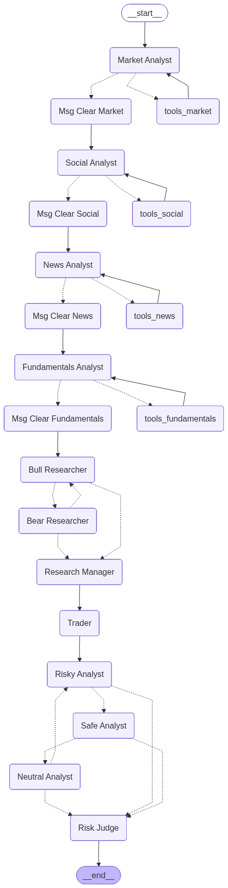
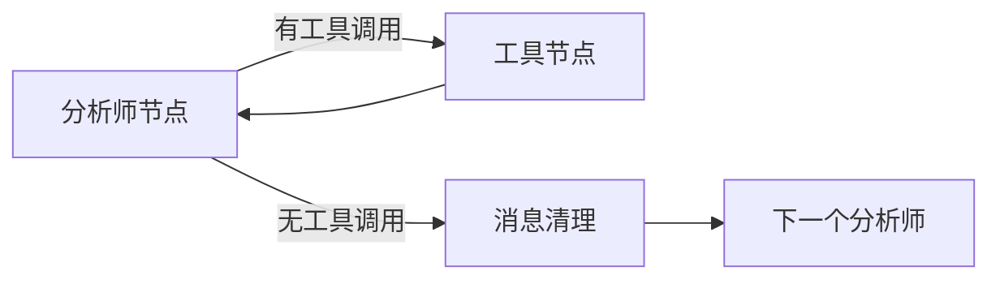
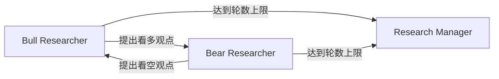
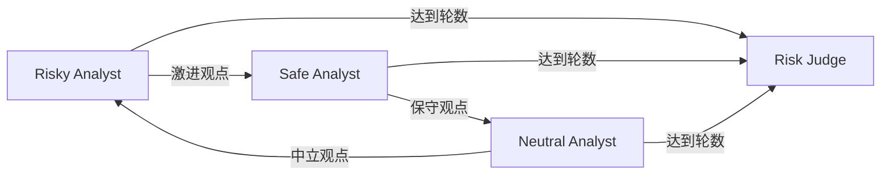

# 10.2 架构总览 - 从30,000英尺看TradingAgent

## 🎯 本节目标

在深入代码细节之前,我们需要先建立一个清晰的全局视角。本节将带你从高空俯瞰TradingAgent的整体架构,理解各个组件如何协同工作。

## 📐 核心架构图解析

让我们先看论文中的官方架构图:



这张图虽然看起来复杂,但其实遵循着清晰的逻辑。让我为你拆解:

### 第一层理解:垂直流程

从上到下,整个系统分为5个阶段:

```
START
  ↓
📊 Stage 1: 分析师团队 (Analyst Team)
  ↓
💬 Stage 2: 研究员辩论 (Investment Debate)
  ↓
💼 Stage 3: 交易员决策 (Trader Decision)
  ↓
⚖️  Stage 4: 风险管理辩论 (Risk Management Debate)
  ↓
END
```

这个流程模拟了真实交易公司的决策链路:
1. **收集数据** → 分析师团队
2. **评估机会** → 研究员辩论
3. **制定计划** → 交易员
4. **控制风险** → 风险管理
5. **执行交易** → 输出最终决策

### 第二层理解:节点分类

整个Graph包含**15个核心节点**,分为以下类型:

#### 1️⃣ 分析师节点 (4个)
```
Market Analyst      → 技术分析
Social Media Analyst → 情绪分析
News Analyst        → 新闻分析
Fundamentals Analyst → 基本面分析
```

#### 2️⃣ 工具节点 (4个)
```
tools_market       → 股票数据 + 技术指标
tools_social       → 社交媒体数据
tools_news         → 新闻 + 内部人交易
tools_fundamentals → 财务报表数据
```

#### 3️⃣ 消息清理节点 (4个)
```
Msg Clear Market
Msg Clear Social
Msg Clear News
Msg Clear Fundamentals
```
作用:清理工具调用消息,避免context过长

#### 4️⃣ 研究员节点 (2个)
```
Bull Researcher → 看多观点
Bear Researcher → 看空观点
```

#### 5️⃣ 管理节点 (2个)
```
Research Manager → 裁决牛熊辩论
Risk Judge      → 裁决风险辩论
```

#### 6️⃣ 交易员节点 (1个)
```
Trader → 综合分析,制定交易计划
```

#### 7️⃣ 风险分析师节点 (3个)
```
Risky Analyst   → 激进派
Safe Analyst    → 保守派
Neutral Analyst → 中立派
```

## 🔄 三大子图详解

### 子图1: 分析师工作流 (Analyst Workflow)

每个分析师都有相同的工作模式:



**关键点:**
- 这是一个**ReAct循环**:推理(Reason) → 行动(Act) → 观察(Observe)
- 分析师可以**多次调用工具**,直到收集到足够信息
- 消息清理确保只保留**最终报告**,不包含中间过程

**实际执行流程示例:**

```
Market Analyst:
  第1轮: 调用get_stock_data → 获取价格数据
  第2轮: 调用get_indicators('RSI') → 获取RSI指标
  第3轮: 调用get_indicators('MACD') → 获取MACD指标
  第4轮: 不再调用工具,输出最终报告
  ↓
Msg Clear Market: 清理前3轮的工具调用消息
  ↓
Social Media Analyst: 开始工作...
```

### 子图2: 投资辩论循环 (Investment Debate Loop)



**辩论规则:**
- 默认辩论**1轮**(可配置 `max_debate_rounds`)
- 1轮 = Bull发言 + Bear回应
- Research Manager作为裁判,综合双方观点

**实际辩论示例:**

```
轮次1:
  Bull: "Apple扩展智能家居市场,AI赋能新产品,增长潜力巨大..."
  Bear: "智能家居竞争激烈,Apple入场较晚,中国市场风险..."

Research Manager判断:
  "综合双方观点,虽然存在风险,但增长潜力更大,
   建议买入,但需控制仓位..."
```

**状态追踪:**
```python
class InvestDebateState:
    bull_history: str        # Bull的所有发言
    bear_history: str        # Bear的所有发言
    history: str             # 完整对话历史
    current_response: str    # 最新发言者
    judge_decision: str      # 裁判决策
    count: int               # 对话轮数
```

### 子图3: 风险管理辩论循环 (Risk Management Loop)



**三方制衡机制:**
- Risky: 强调收益,主张加大仓位
- Safe: 强调风险,主张减小仓位
- Neutral: 平衡两者,提供中间方案

**实际辩论示例:**

```
Risky: "技术面强势突破,RSI虽超买但动能强劲,建议满仓..."
Safe: "RSI超买意味回调风险,高估值需谨慎,建议仓位20%..."
Neutral: "综合考虑,建议50%仓位,设置止损保护..."

Risk Judge判断:
  "采纳Neutral建议,50%仓位,止损设在支撑位..."
```

## 📊 关键数据结构

### AgentState - 全局状态

```python
class AgentState:
    # 基本信息
    company_of_interest: str     # 目标股票
    trade_date: str              # 交易日期
    messages: List[Message]      # 消息链

    # 分析师报告
    market_report: str           # 市场分析报告
    sentiment_report: str        # 情绪分析报告
    news_report: str             # 新闻分析报告
    fundamentals_report: str     # 基本面报告

    # 辩论状态
    investment_debate_state: InvestDebateState
    risk_debate_state: RiskDebateState

    # 决策结果
    investment_plan: str         # 投资计划
    trader_investment_plan: str  # 交易员计划
    final_trade_decision: str    # 最终决策
```

这个State像一个**不断充实的档案袋**:
- 分析师阶段:填充各类报告
- 辩论阶段:记录辩论过程
- 决策阶段:生成交易指令

## 🔗 边的类型与作用

### 1. 顺序边 (Sequential Edge)

```python
workflow.add_edge("Research Manager", "Trader")
```

**含义**: 无条件执行下一个节点

### 2. 条件边 (Conditional Edge)

```python
workflow.add_conditional_edges(
    "Market Analyst",
    should_continue_market,
    ["tools_market", "Msg Clear Market"]
)
```

**含义**: 根据条件决定下一步

### 3. 循环边 (Loop Edge)

```python
workflow.add_edge("tools_market", "Market Analyst")
```

**含义**: 形成循环,支持多轮工具调用

## 🎯 完整执行流程示意

让我们跟踪一个完整的交易决策流程:

```
1. START
   ↓
2. Market Analyst 开始工作
   ├─ 调用 get_stock_data(AAPL) → 获取价格
   ├─ 调用 get_indicators('RSI') → RSI=72 (超买)
   ├─ 调用 get_indicators('MACD') → MACD向上交叉
   └─ 输出报告:"技术面强势,但需警惕超买风险..."
   ↓
3. Msg Clear Market (清理工具调用消息)
   ↓
4. Social Media Analyst 开始工作
   ├─ 调用 get_news(AAPL) → 获取社交媒体情绪
   └─ 输出报告:"整体情绪积极,讨论量激增..."
   ↓
5. Msg Clear Social
   ↓
6. News Analyst 开始工作
   ├─ 调用 get_global_news() → "Apple发布新产品..."
   ├─ 调用 get_insider_sentiment() → 内部人情绪中性
   └─ 输出报告:"新产品发布利好,但内部人未增持..."
   ↓
7. Msg Clear News
   ↓
8. Fundamentals Analyst 开始工作
   ├─ 调用 get_fundamentals(AAPL) → P/E=37.8
   ├─ 调用 get_income_statement() → 营收增长6%
   └─ 输出报告:"盈利强劲,但估值偏高..."
   ↓
9. Msg Clear Fundamentals
   ↓
10. Bull Researcher (读取4份报告)
    └─ "技术+情绪+新闻都支持上涨,估值可接受..."
    ↓
11. Bear Researcher (读取4份报告)
    └─ "超买+高估值+内部人不增持,风险大于机会..."
    ↓
12. Research Manager (综合牛熊观点)
    └─ "谨慎看多,建议小仓位试仓..."
    ↓
13. Trader (制定具体计划)
    └─ "买入30%仓位,目标价+5%,止损-3%..."
    ↓
14. Risky Analyst
    └─ "应该加大到60%仓位,错过机会成本高..."
    ↓
15. Safe Analyst
    └─ "30%太激进,建议10%,观望为主..."
    ↓
16. Neutral Analyst
    └─ "20%仓位合理,兼顾收益和风险..."
    ↓
17. Risk Judge (最终决策)
    └─ "采纳20%仓位方案,严格止损..."
    ↓
18. END

最终输出: BUY, 20%, Target: +5%, Stop: -3%
```

## 💡 设计精髓

### 1. 关注点分离
- 分析师只负责收集和分析数据
- 研究员负责评估投资机会
- 交易员负责制定具体计划
- 风险管理负责控制风险

### 2. 制衡机制
- 牛熊辩论避免单方面偏见
- 三方风险讨论避免极端决策

### 3. 可解释性
- 每个Agent输出结构化报告
- 完整记录推理过程
- 可追溯每个决策依据

### 4. 可扩展性
- 可轻松添加新的分析师
- 可调整辩论轮数
- 可替换不同的LLM模型

## 🤔 核心问题解答

### Q1: 整个Graph有多少个子图?

**答案**: 3个主要子图

1. **分析师工作流子图** (Analyst Workflow Subgraph)
   - 包含4个分析师,每个都是独立的ReAct循环

2. **投资辩论子图** (Investment Debate Subgraph)
   - Bull ↔ Bear循环辩论

3. **风险管理子图** (Risk Management Subgraph)
   - Risky → Safe → Neutral循环辩论

### Q2: 有多少个循环?如何终止?

**答案**: 5个循环

**循环1-4**: 分析师的工具调用循环
```python
# 终止条件: Agent不再调用工具
if not last_message.tool_calls:
    return "Msg Clear Market"  # 退出循环
```

**循环5**: 研究员辩论循环
```python
# 终止条件: 达到max_debate_rounds
if count >= 2 * max_debate_rounds:
    return "Research Manager"  # 退出循环
```

**循环6**: 风险分析循环
```python
# 终止条件: 达到max_risk_discuss_rounds
if count >= 3 * max_risk_discuss_rounds:
    return "Risk Judge"  # 退出循环
```

## 📝 本节小结

通过本节,你应该已经掌握:

✅ TradingAgent的5个执行阶段
✅ 15个核心节点的分类和作用
✅ 3个子图的结构和运作机制
✅ State的组成和传递方式
✅ 边的类型和条件判断
✅ 循环的形成和终止机制

现在,你已经对整个系统有了全局认识。接下来,我们将逐一深入每个组件的细节。

---

**上一节**: [10.1 项目背景与论文解读](./10.1%20项目背景与论文解读.md)

**下一节**: [10.3 State状态管理-系统的神经中枢](./10.3%20State状态管理-系统的神经中枢.md)

**返回目录**: [10.0 本章介绍](./10.0%20本章介绍.md)
