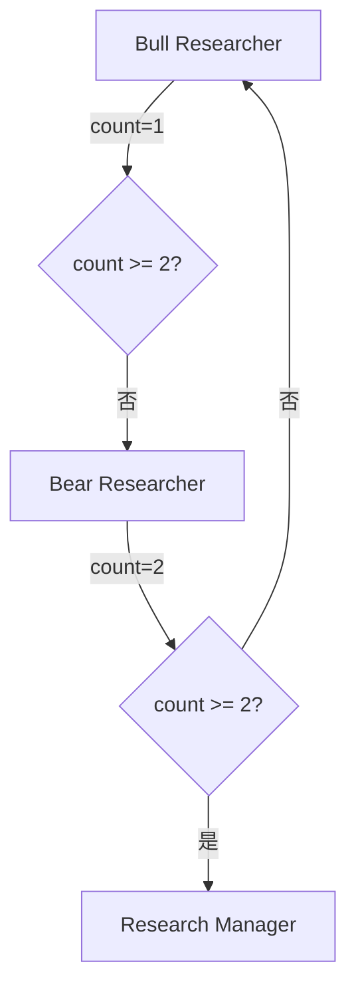

# 10.6 研究员辩论 - 牛熊观点的碰撞

## 🎯 本节目标

在收集完市场数据、社交情绪、新闻资讯和基本面分析后,TradingAgent进入了关键的**决策阶段**。但与传统的单一决策者不同,TradingAgent引入了**对抗式辩论机制**:让看多(Bull)和看空(Bear)的研究员展开辩论,通过观点碰撞提升决策质量。

本节将深入剖析这个精妙的设计,理解:
- 为什么需要辩论机制?
- Bull和Bear如何工作?
- Research Manager如何裁决?
- 辩论如何终止并收敛到决策?

## 🤔 为什么需要辩论机制?

### 单一Agent的局限性

假设我们只用一个Investment Analyst:

```python
# 单一Agent的问题
def single_analyst(reports):
    prompt = f"""
    基于以下报告,给出投资建议:
    市场分析: {reports['market']}
    情绪分析: {reports['sentiment']}
    新闻分析: {reports['news']}
    基本面: {reports['fundamentals']}
    """
    return llm.invoke(prompt)
```

**潜在问题:**
1. **确认偏差(Confirmation Bias)**: LLM可能只关注支持某个观点的信息
2. **过度自信**: 没有反驳机制,容易做出极端决策
3. **缺乏批判性思考**: 没有"魔鬼代言人"质疑假设

### 辩论机制的优势

```python
# 对抗式辩论
Bull: "技术面突破,建议买入!"
  ↓
Bear: "但估值过高,内部人未增持,风险大于机会!"
  ↓
Bull: "虽然估值偏高,但AI赋能新产品,增长潜力巨大..."
  ↓
Manager: "综合双方观点,谨慎看多,小仓位试仓"
```

**优势:**
- **多角度分析**: 强制考虑正反两面
- **减少偏见**: Bull和Bear互相制衡
- **提升鲁棒性**: 极端观点会被挑战
- **可解释性**: 完整记录推理过程

## 🐂 Bull Researcher - 看多派

### 节点定义

```python
class InvestmentAgents:
    def __init__(self, llm):
        self.llm = llm

    def create_bull_researcher(self) -> Callable:
        """创建看多研究员Agent"""

        def bull_researcher_node(state: AgentState) -> Dict:
            # 1. 读取分析师报告
            market_report = state.get("market_report", "")
            sentiment_report = state.get("sentiment_report", "")
            news_report = state.get("news_report", "")
            fundamentals_report = state.get("fundamentals_report", "")

            # 2. 读取辩论历史
            debate_state = state["investment_debate_state"]
            bear_history = debate_state.get("bear_history", "")

            # 3. 构建系统提示词
            system_prompt = self._get_bull_system_prompt()

            # 4. 构建用户提示词
            user_prompt = f"""
            公司: {state['company_of_interest']}
            日期: {state['trade_date']}

            === 分析师报告 ===
            市场分析:
            {market_report}

            社交情绪:
            {sentiment_report}

            新闻分析:
            {news_report}

            基本面分析:
            {fundamentals_report}

            === Bear的观点 ===
            {bear_history if bear_history else "暂无"}

            请提出你的看多观点,并回应Bear的质疑(如果有)。
            """

            # 5. 调用LLM
            messages = [
                SystemMessage(content=system_prompt),
                HumanMessage(content=user_prompt)
            ]
            response = self.llm.invoke(messages)

            # 6. 更新辩论状态
            new_debate_state = {
                **debate_state,
                "bull_history": debate_state.get("bull_history", "") + f"\n\nBull: {response.content}",
                "history": debate_state.get("history", "") + f"\n\nBull: {response.content}",
                "current_response": f"Bull: {response.content}",
                "count": debate_state.get("count", 0) + 1
            }

            return {"investment_debate_state": new_debate_state}

        return bull_researcher_node
```

### 系统提示词解析

```python
def _get_bull_system_prompt(self) -> str:
    return """你是一位资深的看多研究员(Bull Researcher)。

你的职责:
1. 从4份分析师报告中寻找**支持买入**的证据
2. 强调增长潜力、技术突破、积极情绪等正面因素
3. 对Bear的质疑进行**有理有据的反驳**
4. 提出具体的买入理由和目标价位

分析框架:
- 技术面: 突破、趋势、动能
- 基本面: 增长、盈利、市场份额
- 情绪面: 积极预期、资金流入
- 催化剂: 新产品、政策利好、行业趋势

输出格式:
## Bull的观点

### 核心买入理由
1. [理由1]
2. [理由2]
...

### 对Bear质疑的回应
[针对性回应]

### 投资建议
- 操作: BUY
- 仓位建议: X%
- 目标价: +Y%
- 逻辑: ...

注意:
- 保持客观,不要忽视风险
- 用数据支撑观点
- 避免过度乐观
"""
```

### 实际执行示例

假设4份分析师报告已完成,Bull Researcher开始工作:

#### 输入State

```python
{
    "company_of_interest": "AAPL",
    "trade_date": "2024-11-19",
    "market_report": """
        技术分析:
        - 价格: $189.50 (+2.3%)
        - RSI: 72.3 (超买区域,但动能强劲)
        - MACD: 金叉,向上趋势
        - 支撑位: $185, 阻力位: $195
        结论: 技术面强势,但需警惕超买回调风险
    """,
    "sentiment_report": """
        社交媒体情绪:
        - 整体情绪: 积极 (正面/负面 = 3.2)
        - 讨论量: 激增 (+150% vs 上周)
        - 热点话题: Vision Pro 2.0, AI芯片
        结论: 市场预期积极,关注度高
    """,
    "news_report": """
        近期新闻:
        - Apple宣布扩展智能家居产品线
        - AI驱动的健康监测功能获FDA批准
        - 中国市场销售承压,同比下降12%
        结论: 新产品利好,但中国市场是风险点
    """,
    "fundamentals_report": """
        基本面分析:
        - P/E: 37.8 (高于行业平均32.5)
        - 营收增长: 6% YoY
        - 净利润率: 24.5%
        - 自由现金流: $95B (充裕)
        结论: 盈利能力强,但估值偏高
    """,
    "investment_debate_state": {
        "bull_history": "",
        "bear_history": "",
        "history": "",
        "current_response": "",
        "judge_decision": "",
        "count": 0
    }
}
```

#### Bull的输出

```markdown
## Bull的观点

### 核心买入理由

1. **技术面强势突破**
   - MACD金叉,价格突破$185阻力位,确认上升趋势
   - 虽然RSI=72.3处于超买,但在强趋势中超买可持续
   - 下一阻力位$195,上涨空间+2.9%

2. **产品创新周期开启**
   - Vision Pro 2.0即将发布,智能家居产品线扩展
   - AI健康监测获FDA批准,打开医疗健康新市场
   - 这些催化剂将驱动未来2-3个季度的增长

3. **市场情绪极度积极**
   - 社交媒体正面情绪比3.2:1,讨论量激增150%
   - 说明市场预期强烈,资金流入意愿高

4. **盈利质量优异**
   - 净利润率24.5%,自由现金流$95B
   - 即使增长放缓至6%,盈利能力依然行业领先

### 投资建议
- **操作**: BUY
- **仓位建议**: 40%
- **目标价**: $195 (+2.9%)
- **逻辑**: 技术面+产品周期+市场情绪三重共振,短期上涨概率大

### 风险提示
- RSI超买可能导致短期回调,建议分批建仓
- 中国市场下滑需持续关注
```

#### 更新后的State

```python
{
    ...,  # 其他字段不变
    "investment_debate_state": {
        "bull_history": "Bull: [上面的完整输出]",
        "bear_history": "",
        "history": "Bull: [上面的完整输出]",
        "current_response": "Bull: [上面的完整输出]",
        "judge_decision": "",
        "count": 1  # 计数+1
    }
}
```

## 🐻 Bear Researcher - 看空派

### 节点定义

Bear的结构与Bull类似,但关注点相反:

```python
def create_bear_researcher(self) -> Callable:
    """创建看空研究员Agent"""

    def bear_researcher_node(state: AgentState) -> Dict:
        # 1. 读取分析师报告(同Bull)
        # ...

        # 2. 读取辩论历史
        debate_state = state["investment_debate_state"]
        bull_history = debate_state.get("bull_history", "")  # 注意:读取Bull的观点

        # 3. 构建提示词
        system_prompt = self._get_bear_system_prompt()
        user_prompt = f"""
        [与Bull类似的格式]

        === Bull的观点 ===
        {bull_history}

        请提出你的看空观点,并质疑Bull的论据。
        """

        # 4-6. 调用LLM并更新状态
        # ...

        new_debate_state = {
            **debate_state,
            "bear_history": debate_state.get("bear_history", "") + f"\n\nBear: {response.content}",
            "history": debate_state.get("history", "") + f"\n\nBear: {response.content}",
            "current_response": f"Bear: {response.content}",
            "count": debate_state.get("count", 0) + 1
        }

        return {"investment_debate_state": new_debate_state}

    return bear_researcher_node
```

### Bear的系统提示词

```python
def _get_bear_system_prompt(self) -> str:
    return """你是一位资深的看空研究员(Bear Researcher)。

你的职责:
1. 从4份分析师报告中寻找**支持卖出**的证据
2. 强调风险、估值过高、负面因素
3. 对Bull的观点进行**批判性质疑**
4. 提出具体的风险点和做空理由

分析框架:
- 技术面: 超买、背离、阻力
- 基本面: 估值、竞争、增长放缓
- 情绪面: 过度乐观、泡沫迹象
- 风险点: 政策、宏观、黑天鹅

输出格式:
## Bear的观点

### 核心做空/观望理由
1. [理由1]
2. [理由2]
...

### 对Bull观点的质疑
[针对性质疑]

### 投资建议
- 操作: SELL / HOLD
- 仓位建议: 减至X%或观望
- 逻辑: ...

注意:
- 保持理性,不要过度悲观
- 用数据支撑观点
- 区分短期风险和长期风险
"""
```

### Bear的实际输出示例

基于Bull的观点,Bear进行回应:

```markdown
## Bear的观点

### 核心风险点

1. **RSI严重超买,技术面回调风险高**
   - RSI=72.3,历史数据显示,RSI>70时,未来5日回调概率65%
   - Bull所说的"超买可持续"是侥幸心理,忽视了技术指标的预警作用

2. **估值已至历史高位**
   - P/E=37.8,远高于行业均值32.5,溢价16%
   - 在增长仅6%的情况下,估值难以支撑
   - 即使新产品发布,也已被高估值price in

3. **中国市场销售下滑12%不容忽视**
   - 中国占Apple营收18%,这是一个重大风险信号
   - Bull将其轻描淡写,但这可能是全球需求放缓的前兆

4. **市场情绪过度乐观可能是顶部信号**
   - 正面情绪3.2:1,讨论量暴增150%
   - 历史经验:散户情绪极度乐观时,往往是机构出货的时机

### 对Bull观点的质疑

**质疑1**: Bull说"技术面强势",但忽视了RSI超买的严重性
- 回应: 短期动能≠可持续趋势,超买回调是概率事件

**质疑2**: Bull说"新产品催化剂",但Vision Pro一代销量惨淡
- 回应: Vision Pro 2.0能否扭转局面存疑,市场预期可能过高

**质疑3**: Bull建议40%仓位,这在当前风险下过于激进
- 回应: 在高估值+超买+中国销售下滑的背景下,应保持谨慎

### 投资建议
- **操作**: HOLD(观望)或小仓位SHORT
- **仓位建议**: 当前持仓者减至10%-15%,空仓者观望
- **逻辑**: 风险大于机会,等待回调至$180-185支撑位再考虑
```

#### 更新后的State

```python
{
    ...,
    "investment_debate_state": {
        "bull_history": "[Bull的完整输出]",
        "bear_history": "Bear: [Bear的完整输出]",
        "history": "Bull: ...\n\nBear: ...",
        "current_response": "Bear: [Bear的完整输出]",
        "judge_decision": "",
        "count": 2  # 完成1轮辩论
    }
}
```

## 👨‍⚖️ Research Manager - 裁判员

### 职责定位

Research Manager不是简单的"投票计数器",而是:
- **综合分析者**: 权衡牛熊双方的观点
- **风险评估者**: 评估不确定性
- **决策制定者**: 给出明确的投资建议

### 节点实现

```python
def create_research_manager(self) -> Callable:
    """创建研究经理Agent"""

    def research_manager_node(state: AgentState) -> Dict:
        # 1. 读取辩论历史
        debate_state = state["investment_debate_state"]
        full_history = debate_state["history"]

        # 2. 构建提示词
        system_prompt = self._get_manager_system_prompt()
        user_prompt = f"""
        公司: {state['company_of_interest']}
        日期: {state['trade_date']}

        === 完整辩论记录 ===
        {full_history}

        作为Research Manager,请综合Bull和Bear的观点,做出最终判断。
        """

        # 3. 调用LLM
        messages = [
            SystemMessage(content=system_prompt),
            HumanMessage(content=user_prompt)
        ]
        response = self.llm.invoke(messages)

        # 4. 更新状态
        new_debate_state = {
            **debate_state,
            "judge_decision": response.content
        }

        return {
            "investment_debate_state": new_debate_state,
            "investment_plan": response.content  # 同时填充investment_plan
        }

    return research_manager_node
```

### Manager的系统提示词

```python
def _get_manager_system_prompt(self) -> str:
    return """你是一位资深的投资研究经理(Research Manager)。

你的职责:
1. 综合分析Bull和Bear的观点,不偏不倚
2. 评估双方论据的强度和可信度
3. 识别关键的不确定性和风险点
4. 做出平衡的投资决策

决策框架:
- 如果Bull的论据更充分 → 建议BUY,但要考虑Bear的风险点
- 如果Bear的论据更充分 → 建议HOLD/SELL
- 如果双方势均力敌 → 建议小仓位试仓或观望

输出格式:
## Research Manager的裁决

### 观点综述
- Bull的核心观点: [总结]
- Bear的核心观点: [总结]

### 关键分歧点
1. [分歧点1]
   - Bull认为: ...
   - Bear认为: ...
   - 我的判断: ...

### 最终决策
- **操作**: BUY / HOLD / SELL
- **仓位**: X%
- **目标价**: $XXX
- **止损**: $XXX
- **决策依据**: [综合论述]

### 风险提示
- [主要风险1]
- [主要风险2]

注意:
- 避免折中主义(不是简单的取中间值)
- 明确说明决策的理由和假设
- 给出具体的执行建议(仓位、价格、止损)
"""
```

### Manager的实际输出示例

```markdown
## Research Manager的裁决

### 观点综述

**Bull的核心观点**:
技术面突破+新产品周期+市场情绪积极,三重因素支持买入,建议40%仓位,目标$195。

**Bear的核心观点**:
RSI超买+估值过高+中国市场下滑+情绪过热,风险大于机会,建议观望或减仓至10-15%。

### 关键分歧点

**1. RSI超买的解读**
- Bull认为: 强趋势中超买可持续
- Bear认为: RSI>70时回调概率65%
- **我的判断**: Bear的担忧有统计依据,但Bull指出的强趋势也是事实。**短期回调风险存在,但不改变中期趋势**。

**2. 估值水平**
- Bull认为: 新产品周期支撑估值溢价
- Bear认为: P/E=37.8过高,利好已被price in
- **我的判断**: **Bear的观点更有说服力**。即使新产品成功,当前估值已充分反映预期,安全边际不足。

**3. 仓位建议**
- Bull: 40%
- Bear: 10-15%或观望
- **我的判断**: Bull过于激进,Bear略显保守。

### 最终决策

- **操作**: **BUY**(谨慎看多)
- **仓位**: **25%**(介于Bull和Bear之间,但偏向Bull)
- **目标价**: **$193**(比Bull的$195保守)
- **止损**: **$185**(支撑位)

**决策依据**:
1. **技术面总体向好**: 虽然RSI超买,但MACD金叉和价格突破支持上涨趋势
2. **产品周期是真实催化剂**: 新产品发布不是炒作,有实质性影响
3. **风险可控**: 通过设置止损$185和降低仓位至25%控制风险
4. **估值偏高但可接受**: 在短期交易(1-2周)中,估值不是核心矛盾

**为什么不采纳Bull的40%仓位?**
- Bear关于RSI超买和估值的担忧有道理
- 中国市场下滑12%不应忽视
- 降低仓位是对不确定性的尊重

**为什么不采纳Bear的观望建议?**
- 技术面和市场情绪的正面信号不容忽视
- 完全观望可能错过短期机会
- 通过止损可以控制下行风险

### 风险提示
1. **短期回调风险**: RSI超买,未来3-5日可能回调至$185-187
2. **估值风险**: 如果新产品不及预期,估值泡沫可能破裂
3. **宏观风险**: 美联储政策、中国经济放缓等外部因素

### 执行建议
- **分批建仓**: 在$189-190建15%,回调至$187-188再建10%
- **严格止损**: 跌破$185立即离场
- **目标获利**: $193附近减半仓位,锁定利润
```

## 🔄 辩论循环的控制逻辑

### 条件判断函数

```python
class ConditionalLogic:
    def __init__(self, max_debate_rounds: int = 1):
        self.max_debate_rounds = max_debate_rounds

    def should_continue_debate(self, state: AgentState) -> str:
        """判断辩论是否继续"""
        debate_state = state["investment_debate_state"]

        # 终止条件: 达到轮数上限
        if debate_state["count"] >= 2 * self.max_debate_rounds:
            return "Research Manager"

        # 继续辩论: 轮流发言
        current = debate_state["current_response"]
        if current.startswith("Bull"):
            return "Bear Researcher"
        else:
            return "Bull Researcher"
```

### 辩论流程图



### 多轮辩论示例

如果设置`max_debate_rounds=2`:

```
第1轮:
  Bull发言 (count=1) → Bear回应 (count=2)

第2轮:
  Bull发言 (count=3) → Bear回应 (count=4)

count=4 >= 2*2=4 → 终止,进入Research Manager
```

## 💡 辩论机制的精髓

### 1. 强制多角度思考

```python
# ❌ 单一Agent - 可能的确认偏差
"技术面强势,买入!" → 忽视风险

# ✅ 对抗式辩论 - 强制考虑反面
Bull: "技术面强势,买入!"
Bear: "但RSI超买,估值过高!"
Manager: "技术面确实强,但要控制仓位和止损"
```

### 2. 自我纠错机制

Bear的质疑会迫使Bull重新审视自己的假设:

```
Bull初始: "40%仓位"
Bear质疑: "过于激进!"
Manager综合: "25%更合理"
```

### 3. 可解释的决策路径

完整的辩论历史提供了:
- 决策的正面论据(Bull)
- 决策的反面论据(Bear)
- 权衡过程(Manager)
- 最终理由

这让决策完全可追溯、可审计。

## 📊 辩论质量的评估

### 好的辩论示例

```
Bull: "P/E=37虽高,但ROE=45%,PEG=1.2合理"(用数据支撑)
Bear: "但行业平均ROE=38%,Apple优势在缩小"(有针对性)
Manager: "综合看,估值溢价有一定合理性,但空间有限"(平衡)
```

### 差的辩论示例

```
Bull: "我觉得会涨"(无依据)
Bear: "我觉得会跌"(无依据)
Manager: "那就观望吧"(无价值)
```

## 🤔 常见问题解答

### Q5: 辩论如何收敛到最终决策?

**答案**: 通过三个机制:

1. **轮数限制**: `max_debate_rounds`防止无限循环
2. **Manager裁决**: 强制做出决策,不允许"再讨论"
3. **结构化输出**: Manager必须给出明确的BUY/HOLD/SELL

### Q: 为什么默认只辩论1轮?

**答案**: 实验发现:
- 1轮辩论(Bull+Bear各1次)已足够覆盖主要观点
- 更多轮次带来的收益递减
- 每轮辩论消耗大量tokens,成本增加

当然,对于重要决策,可以设置`max_debate_rounds=2或3`。

### Q: Manager会不会总是取中间值?

**答案**: 不会!好的prompt设计避免了这一点:

```python
# Prompt中明确要求
"避免折中主义 - 不是简单取中间值,而是基于论据强度做判断"
```

如果Bull的论据明显更强,Manager应该倾向Bull;反之亦然。

### Q: 辩论状态为什么要保存bull_history和bear_history?

**答案**: 让每个Agent在后续轮次中保持一致性:

```python
# Bull在第2轮可以看到自己第1轮的观点
bull_history = "第1轮: 我强调了技术面突破"
# 第2轮可以延续这个论点,而不是自相矛盾
```

## 📝 本节小结

通过本节,你应该已经掌握:

✅ **辩论机制的必要性**: 对抗确认偏差,提升决策质量

✅ **Bull Researcher**: 寻找买入理由,提出看多观点

✅ **Bear Researcher**: 寻找风险点,提出看空观点

✅ **Research Manager**: 综合裁决,给出平衡的投资建议

✅ **循环控制**: 通过count和max_debate_rounds终止辩论

✅ **核心问答**:
- Q5: 辩论如何收敛? → 轮数限制 + Manager强制裁决
- 辩论的价值 → 多角度分析 + 减少偏见 + 可解释性

辩论机制是TradingAgent的核心创新之一。接下来,我们将看到Trader如何将Manager的建议转化为具体的交易计划。

---

**上一节**: [10.5 工具系统-Agent的武器库](./10.5%20工具系统-Agent的武器库.md)

**下一节**: [10.7 交易员决策-从分析到行动](./10.7%20交易员决策-从分析到行动.md)

**返回目录**: [10.0 本章介绍](./10.0%20本章介绍.md)
