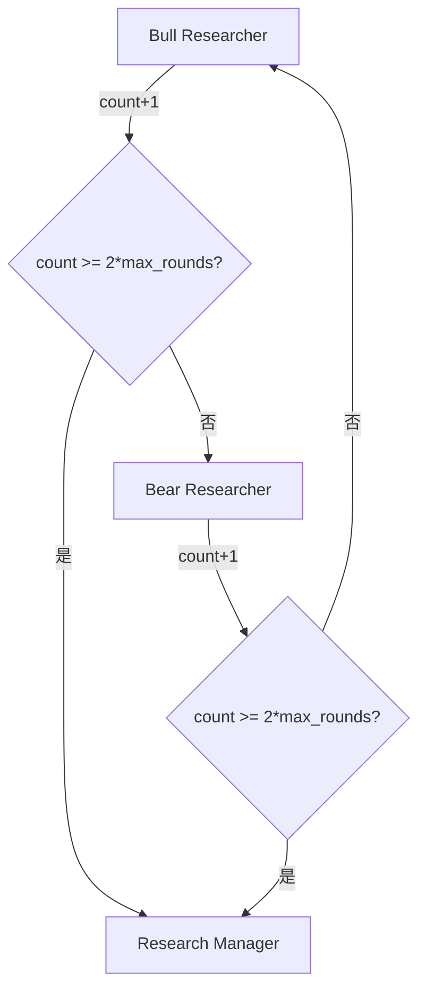
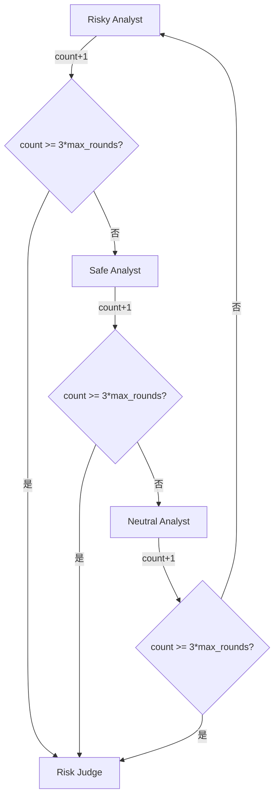

# 10.9 条件逻辑与Graph编排 - 流程控制的艺术

## 🎯 本节目标

在前面的章节中,我们分别学习了分析师、工具、辩论、交易员等各个组件。但这些组件如何有机地组织在一起?如何控制数据流向?如何决定何时继续循环、何时终止?

这一切的答案都在于**条件逻辑(Conditional Logic)**和**Graph编排(Graph Setup)**。本节将深入剖析TradingAgent的流程控制机制,理解这个包含15个节点、6个循环的复杂系统如何精准运行。

## 📐 整体架构回顾

在开始之前,让我们先回顾TradingAgent的完整流程:

```
START
  ↓
┌─────────────────────────────────────┐
│  第1阶段: 分析师团队(并行收集数据)    │
│  Market → tools_market → Market ... │
│  Social → tools_social → Social ... │
│  News → tools_news → News ...       │
│  Fundamentals → tools_fundamentals...│
└─────────────────────────────────────┘
  ↓
┌─────────────────────────────────────┐
│  第2阶段: 投资辩论(串行循环)         │
│  Bull ↔ Bear → Manager              │
└─────────────────────────────────────┘
  ↓
┌─────────────────────────────────────┐
│  第3阶段: 交易员决策                │
│  Trader                             │
└─────────────────────────────────────┘
  ↓
┌─────────────────────────────────────┐
│  第4阶段: 风险管理(三方循环)         │
│  Risky ↔ Safe ↔ Neutral → Judge     │
└─────────────────────────────────────┘
  ↓
END
```

每个阶段都有自己的循环控制逻辑,我们将逐一剖析。

## 🎛️ ConditionalLogic类 - 流程控制中枢

让我们先看完整的`ConditionalLogic`类定义:

```python
# tradingagents/graph/conditional_logic.py

class ConditionalLogic:
    """处理Graph流程控制的条件逻辑"""

    def __init__(self, max_debate_rounds=1, max_risk_discuss_rounds=1):
        """
        初始化配置参数

        Args:
            max_debate_rounds: 投资辩论的最大轮数(默认1轮)
            max_risk_discuss_rounds: 风险讨论的最大轮数(默认1轮)
        """
        self.max_debate_rounds = max_debate_rounds
        self.max_risk_discuss_rounds = max_risk_discuss_rounds
```

这个类包含**6个条件判断方法**,对应TradingAgent中的6个循环。

## 🔄 循环1-4: 分析师的ReAct循环控制

### 通用模式

4个分析师(Market, Social, News, Fundamentals)都使用相同的循环控制逻辑:

```python
def should_continue_market(self, state: AgentState) -> str:
    """判断Market Analyst是否继续调用工具"""
    messages = state["messages"]
    last_message = messages[-1]

    # 判断最后一条消息是否包含工具调用
    if last_message.tool_calls:
        return "tools_market"  # 继续循环,调用工具
    return "Msg Clear Market"  # 退出循环,清理消息
```

### 执行流程详解

让我们跟踪一个完整的ReAct循环:

```
第1轮:
  Market Analyst → 生成工具调用请求
  ↓
  messages[-1].tool_calls = [
      ToolCall(name="get_stock_data", args={"symbol": "AAPL"})
  ]
  ↓
  should_continue_market(state) → "tools_market"
  ↓
  tools_market → 执行工具,返回结果
  ↓
  回到 Market Analyst

第2轮:
  Market Analyst → 分析工具结果,生成新的工具调用
  ↓
  messages[-1].tool_calls = [
      ToolCall(name="get_indicators", args={"symbol": "AAPL", "indicator": "RSI"})
  ]
  ↓
  should_continue_market(state) → "tools_market"
  ↓
  tools_market → 执行工具
  ↓
  回到 Market Analyst

第3轮:
  Market Analyst → 分析完毕,输出最终报告
  ↓
  messages[-1].tool_calls = []  # 无工具调用
  ↓
  should_continue_market(state) → "Msg Clear Market"
  ↓
  退出循环,清理中间消息
```

### 为什么需要检查tool_calls?

这是LangGraph的ReAct模式的核心机制:

```python
# Agent的思考过程
"我需要RSI数据才能分析" → 推理(Reasoning)
  ↓
生成 ToolCall(name="get_indicators", ...) → 行动(Acting)
  ↓
tool_calls存在 → should_continue返回"tools_market"
  ↓
工具执行,获得RSI=72.3 → 观察(Observing)
  ↓
"RSI超买,需要更多数据" → 继续推理...
```

**终止条件**: 当Agent认为收集到足够信息时,直接输出文本报告,不再生成tool_calls。

### 其他3个分析师的方法

```python
def should_continue_social(self, state: AgentState) -> str:
    """Social Media Analyst的循环控制"""
    messages = state["messages"]
    last_message = messages[-1]
    if last_message.tool_calls:
        return "tools_social"
    return "Msg Clear Social"

def should_continue_news(self, state: AgentState) -> str:
    """News Analyst的循环控制"""
    messages = state["messages"]
    last_message = messages[-1]
    if last_message.tool_calls:
        return "tools_news"
    return "Msg Clear News"

def should_continue_fundamentals(self, state: AgentState) -> str:
    """Fundamentals Analyst的循环控制"""
    messages = state["messages"]
    last_message = messages[-1]
    if last_message.tool_calls:
        return "tools_fundamentals"
    return "Msg Clear Fundamentals"
```

**设计亮点**: 虽然代码重复,但保持了清晰性和可维护性。每个方法独立,便于调试和日志追踪。

## 🐂🐻 循环5: 投资辩论循环控制

### 核心逻辑

```python
def should_continue_debate(self, state: AgentState) -> str:
    """判断投资辩论是否继续"""

    # 终止条件: 达到轮数上限
    if state["investment_debate_state"]["count"] >= 2 * self.max_debate_rounds:
        return "Research Manager"  # 终止辩论,进入裁决

    # 继续条件: 轮流发言
    if state["investment_debate_state"]["current_response"].startswith("Bull"):
        return "Bear Researcher"  # Bull刚发言,轮到Bear
    return "Bull Researcher"  # Bear刚发言,轮到Bull
```

### 关键问题解析

#### Q1: 为什么是`2 * max_debate_rounds`?

**答案**: 因为1轮辩论 = Bull发言 + Bear回应 = 2次发言

```python
max_debate_rounds = 1  # 辩论1轮

第1轮:
  Bull发言 → count=1
  Bear回应 → count=2

count=2 >= 2*1=2 → 终止
```

如果`max_debate_rounds=2`:

```python
第1轮:
  Bull发言 → count=1
  Bear回应 → count=2

第2轮:
  Bull发言 → count=3
  Bear回应 → count=4

count=4 >= 2*2=4 → 终止
```

#### Q2: 如何判断轮换顺序?

**答案**: 通过`current_response`字段的前缀:

```python
# Bull刚发言
state["investment_debate_state"]["current_response"] = "Bull: 我认为应该买入..."
  ↓
current_response.startswith("Bull") == True
  ↓
返回 "Bear Researcher"  # 轮到Bear

# Bear刚发言
state["investment_debate_state"]["current_response"] = "Bear: 我认为风险太大..."
  ↓
current_response.startswith("Bull") == False
  ↓
返回 "Bull Researcher"  # 轮到Bull
```

### 流程图



### 实际执行示例

```python
# 配置
max_debate_rounds = 1

# 执行流程
Bull Researcher 执行
  → investment_debate_state["count"] = 1
  → investment_debate_state["current_response"] = "Bull: ..."
  → should_continue_debate(state)
  → count=1 < 2*1=2 → 继续
  → current_response.startswith("Bull") → 返回"Bear Researcher"

Bear Researcher 执行
  → investment_debate_state["count"] = 2
  → investment_debate_state["current_response"] = "Bear: ..."
  → should_continue_debate(state)
  → count=2 >= 2*1=2 → 终止
  → 返回"Research Manager"

Research Manager 执行
  → 综合裁决
  → 填充investment_plan
```

## ⚖️ 循环6: 风险管理循环控制

### 三方轮换逻辑

```python
def should_continue_risk_analysis(self, state: AgentState) -> str:
    """判断风险分析是否继续"""

    # 终止条件: 达到轮数上限
    if state["risk_debate_state"]["count"] >= 3 * self.max_risk_discuss_rounds:
        return "Risk Judge"  # 终止讨论,进入裁决

    # 继续条件: 三方轮流
    latest_speaker = state["risk_debate_state"]["latest_speaker"]

    if latest_speaker.startswith("Risky"):
        return "Safe Analyst"
    if latest_speaker.startswith("Safe"):
        return "Neutral Analyst"
    return "Risky Analyst"  # Neutral刚发言,回到Risky
```

### 关键问题解析

#### Q1: 为什么是`3 * max_risk_discuss_rounds`?

**答案**: 因为1轮讨论 = Risky + Safe + Neutral = 3次发言

```python
max_risk_discuss_rounds = 1  # 讨论1轮

第1轮:
  Risky发言 → count=1
  Safe发言 → count=2
  Neutral发言 → count=3

count=3 >= 3*1=3 → 终止
```

#### Q2: 轮换顺序是什么?

**答案**: Risky → Safe → Neutral → Risky → ...

```python
# Risky刚发言
latest_speaker = "Risky: ..."
  → latest_speaker.startswith("Risky") == True
  → 返回 "Safe Analyst"

# Safe刚发言
latest_speaker = "Safe: ..."
  → latest_speaker.startswith("Safe") == True
  → 返回 "Neutral Analyst"

# Neutral刚发言
latest_speaker = "Neutral: ..."
  → 不满足前两个条件
  → 返回 "Risky Analyst"  # 回到Risky
```

### 流程图



### 实际执行示例

```python
# 配置
max_risk_discuss_rounds = 1

# 执行流程
Risky Analyst 执行
  → risk_debate_state["count"] = 1
  → risk_debate_state["latest_speaker"] = "Risky: ..."
  → should_continue_risk_analysis(state)
  → count=1 < 3*1=3 → 继续
  → latest_speaker.startswith("Risky") → 返回"Safe Analyst"

Safe Analyst 执行
  → risk_debate_state["count"] = 2
  → risk_debate_state["latest_speaker"] = "Safe: ..."
  → should_continue_risk_analysis(state)
  → count=2 < 3 → 继续
  → latest_speaker.startswith("Safe") → 返回"Neutral Analyst"

Neutral Analyst 执行
  → risk_debate_state["count"] = 3
  → risk_debate_state["latest_speaker"] = "Neutral: ..."
  → should_continue_risk_analysis(state)
  → count=3 >= 3 → 终止
  → 返回"Risk Judge"

Risk Judge 执行
  → 综合裁决
  → 填充final_trade_decision
```

## 🏗️ GraphSetup类 - Graph编排大师

现在我们知道了如何控制循环,接下来看如何将15个节点组装成完整的Graph。

### 类定义

```python
# tradingagents/graph/setup.py

class GraphSetup:
    """处理Agent Graph的设置和配置"""

    def __init__(
        self,
        quick_thinking_llm: ChatOpenAI,     # 快速思考模型(用于分析师)
        deep_thinking_llm: ChatOpenAI,      # 深度思考模型(用于Manager)
        tool_nodes: Dict[str, ToolNode],    # 工具节点字典
        bull_memory,                        # Bull的记忆系统
        bear_memory,                        # Bear的记忆系统
        trader_memory,                      # Trader的记忆系统
        invest_judge_memory,                # Research Manager的记忆
        risk_manager_memory,                # Risk Judge的记忆
        conditional_logic: ConditionalLogic # 条件逻辑实例
    ):
        self.quick_thinking_llm = quick_thinking_llm
        self.deep_thinking_llm = deep_thinking_llm
        self.tool_nodes = tool_nodes
        self.bull_memory = bull_memory
        self.bear_memory = bear_memory
        self.trader_memory = trader_memory
        self.invest_judge_memory = invest_judge_memory
        self.risk_manager_memory = risk_manager_memory
        self.conditional_logic = conditional_logic
```

### setup_graph方法 - Graph构建流程

这是TradingAgent的核心方法,负责构建整个15节点的Graph:

```python
def setup_graph(self, selected_analysts=["market", "social", "news", "fundamentals"]):
    """
    设置并编译Agent工作流Graph

    Args:
        selected_analysts: 要包含的分析师列表,支持:
            - "market": 市场分析师
            - "social": 社交媒体分析师
            - "news": 新闻分析师
            - "fundamentals": 基本面分析师
    """
```

#### 第1步: 创建分析师节点

```python
# 创建分析师节点字典
analyst_nodes = {}
delete_nodes = {}
tool_nodes = {}

if "market" in selected_analysts:
    analyst_nodes["market"] = create_market_analyst(self.quick_thinking_llm)
    delete_nodes["market"] = create_msg_delete()
    tool_nodes["market"] = self.tool_nodes["market"]

if "social" in selected_analysts:
    analyst_nodes["social"] = create_social_media_analyst(self.quick_thinking_llm)
    delete_nodes["social"] = create_msg_delete()
    tool_nodes["social"] = self.tool_nodes["social"]

# ... News和Fundamentals类似
```

**设计亮点**:
- 支持动态选择分析师(可只用部分分析师)
- 每个分析师配套一个delete节点和tool节点
- 使用quick_thinking_llm(成本较低)

#### 第2步: 创建研究员和管理节点

```python
# 创建研究员和管理节点
bull_researcher_node = create_bull_researcher(
    self.quick_thinking_llm, self.bull_memory
)
bear_researcher_node = create_bear_researcher(
    self.quick_thinking_llm, self.bear_memory
)
research_manager_node = create_research_manager(
    self.deep_thinking_llm,  # 注意:使用deep_thinking_llm
    self.invest_judge_memory
)
trader_node = create_trader(
    self.quick_thinking_llm,
    self.trader_memory
)
```

**设计亮点**:
- Research Manager使用`deep_thinking_llm`(更强的模型)
- 每个Agent都有自己的记忆系统

#### 第3步: 创建风险分析节点

```python
# 创建风险分析节点
risky_analyst = create_risky_debator(self.quick_thinking_llm)
neutral_analyst = create_neutral_debator(self.quick_thinking_llm)
safe_analyst = create_safe_debator(self.quick_thinking_llm)
risk_manager_node = create_risk_manager(
    self.deep_thinking_llm,  # 同样使用deep_thinking_llm
    self.risk_manager_memory
)
```

#### 第4步: 创建StateGraph并添加节点

```python
# 创建工作流
workflow = StateGraph(AgentState)

# 添加分析师节点到Graph
for analyst_type, node in analyst_nodes.items():
    workflow.add_node(f"{analyst_type.capitalize()} Analyst", node)
    workflow.add_node(
        f"Msg Clear {analyst_type.capitalize()}",
        delete_nodes[analyst_type]
    )
    workflow.add_node(f"tools_{analyst_type}", tool_nodes[analyst_type])

# 添加其他节点
workflow.add_node("Bull Researcher", bull_researcher_node)
workflow.add_node("Bear Researcher", bear_researcher_node)
workflow.add_node("Research Manager", research_manager_node)
workflow.add_node("Trader", trader_node)
workflow.add_node("Risky Analyst", risky_analyst)
workflow.add_node("Neutral Analyst", neutral_analyst)
workflow.add_node("Safe Analyst", safe_analyst)
workflow.add_node("Risk Judge", risk_manager_node)
```

**节点命名规范**:
- 分析师: `"Market Analyst"`, `"Social Analyst"`, ...
- 工具节点: `"tools_market"`, `"tools_social"`, ...
- 清理节点: `"Msg Clear Market"`, `"Msg Clear Social"`, ...

#### 第5步: 定义边 - START连接

```python
# 从START开始,连接到第一个分析师
first_analyst = selected_analysts[0]  # 通常是"market"
workflow.add_edge(START, f"{first_analyst.capitalize()} Analyst")
```

#### 第6步: 定义边 - 分析师链

```python
# 按顺序连接分析师
for i, analyst_type in enumerate(selected_analysts):
    current_analyst = f"{analyst_type.capitalize()} Analyst"
    current_tools = f"tools_{analyst_type}"
    current_clear = f"Msg Clear {analyst_type.capitalize()}"

    # 添加当前分析师的条件边(ReAct循环)
    workflow.add_conditional_edges(
        current_analyst,
        getattr(self.conditional_logic, f"should_continue_{analyst_type}"),
        [current_tools, current_clear]
    )

    # 工具节点回到分析师(形成循环)
    workflow.add_edge(current_tools, current_analyst)

    # 连接到下一个分析师或Bull Researcher
    if i < len(selected_analysts) - 1:
        next_analyst = f"{selected_analysts[i+1].capitalize()} Analyst"
        workflow.add_edge(current_clear, next_analyst)
    else:
        # 最后一个分析师连接到Bull Researcher
        workflow.add_edge(current_clear, "Bull Researcher")
```

**关键点解析**:

1. **条件边的定义**:
```python
workflow.add_conditional_edges(
    "Market Analyst",  # 源节点
    self.conditional_logic.should_continue_market,  # 条件函数
    ["tools_market", "Msg Clear Market"]  # 可能的目标节点
)
```

2. **getattr的妙用**:
```python
# 动态获取方法
getattr(self.conditional_logic, f"should_continue_{analyst_type}")
# 等价于
self.conditional_logic.should_continue_market  # 当analyst_type="market"
```

3. **循环边**:
```python
workflow.add_edge("tools_market", "Market Analyst")
# 工具执行后,总是回到分析师
```

#### 第7步: 定义边 - 投资辩论

```python
# Bull和Bear的双向辩论循环
workflow.add_conditional_edges(
    "Bull Researcher",
    self.conditional_logic.should_continue_debate,
    {
        "Bear Researcher": "Bear Researcher",
        "Research Manager": "Research Manager"
    }
)

workflow.add_conditional_edges(
    "Bear Researcher",
    self.conditional_logic.should_continue_debate,
    {
        "Bull Researcher": "Bull Researcher",
        "Research Manager": "Research Manager"
    }
)

# Research Manager到Trader
workflow.add_edge("Research Manager", "Trader")
```

**注意**: 条件边的目标可以用字典形式:

```python
{
    "目标节点1": "目标节点1",  # 键是条件函数的返回值,值是实际节点名
    "目标节点2": "目标节点2"
}
```

#### 第8步: 定义边 - 风险管理

```python
# Trader到Risky Analyst
workflow.add_edge("Trader", "Risky Analyst")

# 三方循环辩论
workflow.add_conditional_edges(
    "Risky Analyst",
    self.conditional_logic.should_continue_risk_analysis,
    {
        "Safe Analyst": "Safe Analyst",
        "Risk Judge": "Risk Judge"
    }
)

workflow.add_conditional_edges(
    "Safe Analyst",
    self.conditional_logic.should_continue_risk_analysis,
    {
        "Neutral Analyst": "Neutral Analyst",
        "Risk Judge": "Risk Judge"
    }
)

workflow.add_conditional_edges(
    "Neutral Analyst",
    self.conditional_logic.should_continue_risk_analysis,
    {
        "Risky Analyst": "Risky Analyst",
        "Risk Judge": "Risk Judge"
    }
)

# Risk Judge到END
workflow.add_edge("Risk Judge", END)
```

#### 第9步: 编译Graph

```python
# 编译并返回
return workflow.compile()
```

**compile()做了什么?**
- 验证Graph的有效性(没有孤立节点、死循环等)
- 优化执行路径
- 返回可执行的CompiledGraph对象

## 🎨 Graph编排的设计精髓

### 1. 模块化设计

```python
# ✅ 好的设计 - 分析师可插拔
selected_analysts = ["market", "news"]  # 只用2个分析师
graph = setup_graph(selected_analysts)

# 也可以全部使用
selected_analysts = ["market", "social", "news", "fundamentals"]
graph = setup_graph(selected_analysts)
```

### 2. 条件逻辑与Graph分离

```python
# ✅ 好的设计 - 单一职责
conditional_logic = ConditionalLogic(max_debate_rounds=2)  # 控制逻辑
graph_setup = GraphSetup(..., conditional_logic)           # Graph构建

# ❌ 不好的设计 - 耦合在一起
class GraphSetup:
    def should_continue_market(self, state):  # 混在一起
        ...
```

### 3. 两种LLM的合理使用

```python
# 快速思考模型 - 用于数据收集和初步分析
quick_thinking_llm = ChatOpenAI(model="gpt-4o-mini")
analyst_nodes["market"] = create_market_analyst(quick_thinking_llm)

# 深度思考模型 - 用于关键决策
deep_thinking_llm = ChatOpenAI(model="gpt-4o")
research_manager_node = create_research_manager(deep_thinking_llm)
```

**成本优化**: 分析师用便宜的模型,Manager用贵的模型,在成本和质量间平衡。

### 4. 记忆系统的集成

```python
# 每个关键Agent都有独立的记忆
bull_memory = FinancialSituationMemory()
bear_memory = FinancialSituationMemory()

bull_researcher_node = create_bull_researcher(llm, bull_memory)
bear_researcher_node = create_bear_researcher(llm, bear_memory)
```

**好处**: Bull和Bear可以从历史经验中学习,逐步改进策略。

## 📊 完整的Graph可视化

让我们用代码表示完整的边连接:

```python
# 伪代码表示完整流程
Graph结构:
  START
    ↓ (顺序边)
  Market Analyst
    ↓ (条件边: has tool_calls?)
    ├─ Yes → tools_market → Market Analyst (循环)
    └─ No → Msg Clear Market
              ↓ (顺序边)
  Social Analyst
    ↓ (条件边: has tool_calls?)
    ├─ Yes → tools_social → Social Analyst (循环)
    └─ No → Msg Clear Social
              ↓
  News Analyst
    ↓ (条件边: has tool_calls?)
    ├─ Yes → tools_news → News Analyst (循环)
    └─ No → Msg Clear News
              ↓
  Fundamentals Analyst
    ↓ (条件边: has tool_calls?)
    ├─ Yes → tools_fundamentals → Fundamentals Analyst (循环)
    └─ No → Msg Clear Fundamentals
              ↓ (顺序边)
  Bull Researcher
    ↓ (条件边: count >= 2*max_rounds?)
    ├─ Yes → Research Manager
    └─ No → Bear Researcher
              ↓ (条件边)
              ├─ Yes → Research Manager
              └─ No → Bull Researcher (循环)
  Research Manager
    ↓ (顺序边)
  Trader
    ↓ (顺序边)
  Risky Analyst
    ↓ (条件边: count >= 3*max_rounds?)
    ├─ Yes → Risk Judge
    └─ No → Safe Analyst
              ↓ (条件边)
              ├─ Yes → Risk Judge
              └─ No → Neutral Analyst
                        ↓ (条件边)
                        ├─ Yes → Risk Judge
                        └─ No → Risky Analyst (循环)
  Risk Judge
    ↓ (顺序边)
  END
```

## 🔍 循环终止机制总结

| 循环 | 终止条件 | 检查位置 | 关键字段 |
|-----|---------|---------|---------|
| Market Analyst | `not last_message.tool_calls` | `should_continue_market` | `messages[-1].tool_calls` |
| Social Analyst | `not last_message.tool_calls` | `should_continue_social` | `messages[-1].tool_calls` |
| News Analyst | `not last_message.tool_calls` | `should_continue_news` | `messages[-1].tool_calls` |
| Fundamentals Analyst | `not last_message.tool_calls` | `should_continue_fundamentals` | `messages[-1].tool_calls` |
| 投资辩论 | `count >= 2 * max_debate_rounds` | `should_continue_debate` | `investment_debate_state["count"]` |
| 风险讨论 | `count >= 3 * max_risk_discuss_rounds` | `should_continue_risk_analysis` | `risk_debate_state["count"]` |

## 💡 实战技巧

### 1. 调整辩论轮数

```python
# 简单决策 - 1轮辩论
conditional_logic = ConditionalLogic(
    max_debate_rounds=1,
    max_risk_discuss_rounds=1
)

# 复杂决策 - 多轮辩论
conditional_logic = ConditionalLogic(
    max_debate_rounds=3,  # Bull和Bear各说3次
    max_risk_discuss_rounds=2  # 风险管理讨论2轮
)
```

### 2. 动态选择分析师

```python
# 快速分析 - 只用市场和新闻
selected_analysts = ["market", "news"]

# 全面分析 - 使用所有分析师
selected_analysts = ["market", "social", "news", "fundamentals"]
```

### 3. 添加日志跟踪

```python
def should_continue_market(self, state: AgentState) -> str:
    messages = state["messages"]
    last_message = messages[-1]

    if last_message.tool_calls:
        print(f"[DEBUG] Market Analyst继续调用工具: {last_message.tool_calls}")
        return "tools_market"

    print(f"[DEBUG] Market Analyst完成,清理消息")
    return "Msg Clear Market"
```

## 📝 本节小结

通过本节,你应该已经掌握:

✅ **ConditionalLogic类**: 6个循环控制方法的实现原理

✅ **ReAct循环**: 通过`tool_calls`判断是否继续

✅ **辩论循环**: 通过`count`和发言者前缀控制轮换

✅ **GraphSetup类**: 完整的Graph构建流程

✅ **边的类型**: 顺序边、条件边、循环边

✅ **设计精髓**: 模块化、职责分离、成本优化

✅ **核心问答**:
- 6个循环如何终止? → 分别通过tool_calls和count判断
- Graph如何组装? → setup_graph方法的9步流程
- 为什么分两种LLM? → 成本与质量的平衡

现在你已经理解了TradingAgent的"骨架"(Graph结构)和"神经系统"(条件逻辑)。接下来,我们将看到整个系统的端到端执行流程。

---

**上一节**: [10.8 风险管理团队-三方制衡机制](./10.8%20风险管理团队-三方制衡机制.md)

**下一节**: [10.10 端到端执行流程-完整交易决策链路](./10.10%20端到端执行流程-完整交易决策链路.md)

**返回目录**: [10.0 本章介绍](./10.0%20本章介绍.md)
