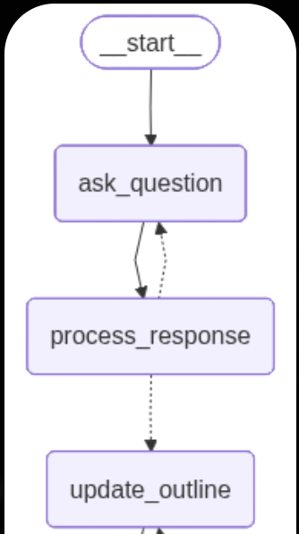
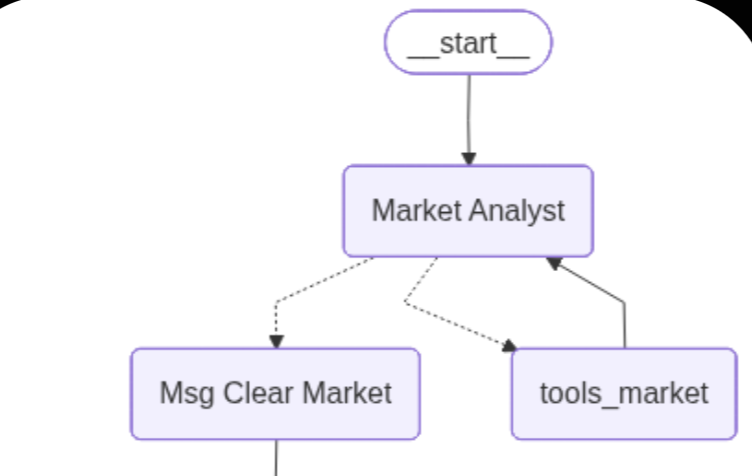

# LangGraph 两种循环模式对比：自修正 vs 工具调用

> 在构建 AI Agent 时，循环（Loop）是最常见的设计模式。但不是所有的循环都是一样的！本节将深入解析两种核心循环模式，帮助你选择正确的架构。

---

## 一、为什么理解循环模式很重要？

当你用 LangGraph 构建 Agent 时，你会发现很多场景都需要"回头"——但回头的原因可能完全不同：

| 场景 | 回头的原因 | 心态 |
|:---|:---|:---|
| 代码生成器 | 代码报错了，需要修复 | "我做错了，要重做" |
| 数据分析师 | 需要查询外部 API | "我缺东西，去拿一下" |
| 对话助手 | 用户信息不完整 | "问题不清，再问一遍" |
| 交易 Agent | 需要获取最新股价 | "我要更新数据" |

表面上看都是"循环"，但底层逻辑完全不同。理解这个区别，是写出优雅 LangGraph 代码的关键。

---

## 二、两种循环模式图解

### 模式一：自修正循环（Self-Correction Loop）



**特点**：
- 节点之间有**双向箭头**（虚线表示条件跳转）
- 流程可能**逆流回退**
- 目的是**质量控制**——"不合格就重做"

**典型场景**：
- ✍️ 代码生成：生成 → 测试 → 报错 → 重新生成
- 📝 写作助手：写稿 → 审核 → 不满意 → 重写
- 🎯 信息收集：问问题 → 处理回答 → 信息不全 → 继续追问

### 模式二：工具调用循环（Tool-Calling Loop）



**特点**：
- Agent 节点连接到工具节点，工具**返回到同一个 Agent**
- 整体流向是**向前的**
- 目的是**数据获取**——"拿东西继续干活"

**典型场景**：
- 📊 市场分析：分析师 → 调用股价工具 → 拿到数据 → 继续分析
- 🔍 RAG 检索：Agent → 向量库查询 → 获取上下文 → 生成回答
- 🤖 函数调用：LLM → 调用 API → 处理返回值 → 下一步

---

## 三、核心区别一句话总结

```
┌─────────────────────────────────────────────────────────────────┐
│  自修正循环：🔧 "刚才做错了，我要重做"  ── 纠错导向          │
│  工具调用循环：📦 "缺个材料，拿完继续"  ── 数据导向          │
└─────────────────────────────────────────────────────────────────┘
```

更形象地说：
- **自修正循环** 像是一个**工匠**：在一个环节没做好之前，绝不进入下一个环节
- **工具调用循环** 像是一条**装配线**：每个工人调用工具干完活，就把结果传给下一个人

---

## 四、代码实战：自修正循环

**场景**：写代码 → 测试 → 报错就重写 → 直到通过

```python
from langgraph.graph import StateGraph, START, END
from typing import TypedDict

# 1. 定义状态：我们需要追踪代码质量和重试次数
class AgentState(TypedDict):
    code: str
    error: bool      # 标记是否有错误
    attempts: int    # 记录重试次数

# 2. 定义节点
def generate_code(state: AgentState):
    """生成代码的节点"""
    print(f"✍️ [第 {state['attempts'] + 1} 次尝试] 正在写代码...")
    return {"code": "print('Hello World')", "attempts": state['attempts'] + 1}

def check_code(state: AgentState):
    """测试代码的节点"""
    # 模拟：前 2 次失败，第 3 次成功
    is_error = state['attempts'] < 3
    if is_error:
        print("❌ 测试失败：代码有 Bug！")
    else:
        print("✅ 测试通过：代码完美！")
    return {"error": is_error}

# 3. 定义条件判断逻辑（核心！）
def should_continue(state: AgentState):
    """决定是重试还是结束"""
    if state["error"]:
        return "retry"   # 🔙 有错误，返回上一步重做
    else:
        return "finish"  # 🚀 没错误，流程结束

# 4. 构建图
workflow = StateGraph(AgentState)

workflow.add_node("coder", generate_code)
workflow.add_node("tester", check_code)

workflow.add_edge(START, "coder")
workflow.add_edge("coder", "tester")

# 关键：条件边决定是否回退
workflow.add_conditional_edges(
    "tester",
    should_continue,
    {
        "retry": "coder",  # ← 指回上一个节点（形成闭环）
        "finish": END
    }
)

app = workflow.compile()

# 运行
print("--- 自修正循环演示 ---")
app.invoke({"attempts": 0, "error": False})
```

**预期结果**：

```text
--- 自修正循环演示 ---
✍️ [第 1 次尝试] 正在写代码...
❌ 测试失败：代码有 Bug！
✍️ [第 2 次尝试] 正在写代码...   ← 被打回重做
❌ 测试失败：代码有 Bug！
✍️ [第 3 次尝试] 正在写代码...   ← 又被打回
✅ 测试通过：代码完美！           ← 终于通过，结束
```

### 关键代码解读

```python
# 条件边的 mapping 决定了图的走向
workflow.add_conditional_edges(
    "tester",           # 从 tester 节点出发
    should_continue,    # 调用这个函数判断
    {
        "retry": "coder",  # 返回 "retry" → 回到 coder
        "finish": END      # 返回 "finish" → 结束
    }
)
```

**设计要点**：
- `should_continue` 函数检查 `state["error"]`
- 只要有错误，就返回 `"retry"`，指向前面的节点
- 这就形成了"死磕型"循环

---

## 五、代码实战：工具调用循环（基于 TradingAgents 真实案例）

下面的代码来自本书 Module 10 的 TradingAgents 项目。我们以 **Market Analyst（市场分析师）** 为例，展示真实的工具调用循环是如何工作的。

### 5.1 Market Analyst 可调用的全部工具

Market Analyst 可以调用 **2 个核心工具**：

```python
# 文件：tradingagents/agents/utils/core_stock_tools.py
from langchain_core.tools import tool
from typing import Annotated

@tool
def get_stock_data(
    symbol: Annotated[str, "ticker symbol of the company"],
    start_date: Annotated[str, "Start date in yyyy-mm-dd format"],
    end_date: Annotated[str, "End date in yyyy-mm-dd format"],
) -> str:
    """
    获取股票价格数据（OHLCV：开盘价、最高价、最低价、收盘价、成交量）

    Args:
        symbol: 股票代码，如 AAPL, TSM, NVDA
        start_date: 开始日期，格式 yyyy-mm-dd
        end_date: 结束日期，格式 yyyy-mm-dd

    Returns:
        包含股价数据的格式化字符串
    """
    return route_to_vendor("get_stock_data", symbol, start_date, end_date)
```

```python
# 文件：tradingagents/agents/utils/technical_indicators_tools.py
@tool
def get_indicators(
    symbol: Annotated[str, "ticker symbol of the company"],
    indicator: Annotated[str, "technical indicator to get"],
    curr_date: Annotated[str, "current trading date, YYYY-mm-dd"],
    look_back_days: Annotated[int, "how many days to look back"] = 30,
) -> str:
    """
    获取技术指标分析数据

    Args:
        symbol: 股票代码
        indicator: 技术指标名称（见下方完整列表）
        curr_date: 当前交易日期
        look_back_days: 回溯天数，默认 30 天

    Returns:
        包含技术指标数据的格式化字符串
    """
    return route_to_vendor("get_indicators", symbol, indicator, curr_date, look_back_days)
```

**`get_indicators` 支持的全部 12 个技术指标**：

| 类别 | 指标名称 | 说明 |
|:---|:---|:---|
| **移动平均线** | `close_50_sma` | 50 日简单移动平均线（中期趋势） |
| | `close_200_sma` | 200 日简单移动平均线（长期趋势） |
| | `close_10_ema` | 10 日指数移动平均线（短期响应） |
| **MACD 相关** | `macd` | MACD 动量指标 |
| | `macds` | MACD 信号线 |
| | `macdh` | MACD 柱状图（动量强度） |
| **动量指标** | `rsi` | 相对强弱指数（超买/超卖） |
| **波动率指标** | `boll` | 布林带中轨（20 日 SMA） |
| | `boll_ub` | 布林带上轨（+2 标准差） |
| | `boll_lb` | 布林带下轨（-2 标准差） |
| | `atr` | 平均真实波幅（波动率测量） |
| **成交量指标** | `vwma` | 成交量加权移动平均 |

### 5.2 Market Analyst 节点实现

```python
# 文件：tradingagents/agents/analysts/market_analyst.py
from langchain_core.prompts import ChatPromptTemplate, MessagesPlaceholder

def create_market_analyst(llm):
    """创建市场分析师节点的工厂函数"""

    def market_analyst_node(state):
        # 从状态中获取交易日期和股票代码
        current_date = state["trade_date"]
        ticker = state["company_of_interest"]

        # ⭐ 定义可用工具列表（2 个工具）
        tools = [
            get_stock_data,   # 获取股价数据
            get_indicators,   # 获取技术指标
        ]

        # 系统提示词：指导 LLM 如何使用这些工具
        system_message = """You are a trading assistant tasked with analyzing financial markets.
        Your role is to select the most relevant indicators for a given market condition.

        Please make sure to call get_stock_data first to retrieve the CSV that is needed
        to generate indicators. Then use get_indicators with the specific indicator names.

        Write a very detailed and nuanced report of the trends you observe."""

        # 构建 Prompt
        prompt = ChatPromptTemplate.from_messages([
            ("system", "You have access to the following tools: {tool_names}.\n{system_message}"
                       "Current date is {current_date}. The company is {ticker}"),
            MessagesPlaceholder(variable_name="messages"),
        ])

        prompt = prompt.partial(
            system_message=system_message,
            tool_names=", ".join([tool.name for tool in tools]),
            current_date=current_date,
            ticker=ticker
        )

        # ⭐ 关键：将工具绑定到 LLM
        chain = prompt | llm.bind_tools(tools)

        # 调用 LLM
        result = chain.invoke(state["messages"])

        # 如果没有工具调用，说明分析完成，提取报告
        report = ""
        if len(result.tool_calls) == 0:
            report = result.content

        return {
            "messages": [result],
            "market_report": report,  # 保存分析报告
        }

    return market_analyst_node
```

### 5.3 条件判断逻辑：是否继续调用工具？

```python
# 文件：tradingagents/graph/conditional_logic.py
from tradingagents.agents.utils.agent_states import AgentState

class ConditionalLogic:
    """处理图流转的条件逻辑"""

    def should_continue_market(self, state: AgentState):
        """判断市场分析是否应该继续"""
        messages = state["messages"]
        last_message = messages[-1]

        # ⭐ 核心判断：最后一条消息是否包含工具调用？
        if last_message.tool_calls:
            return "tools_market"      # 有工具调用 → 去执行工具
        return "Msg Clear Market"      # 没有工具调用 → 分析完成，清理后传给下一个
```

### 5.4 使用 ToolNode 统一管理工具

```python
# 文件：tradingagents/graph/trading_graph.py
from langgraph.prebuilt import ToolNode

class TradingAgentsGraph:
    def _create_tool_nodes(self):
        """创建工具节点"""
        return {
            "market": ToolNode([
                get_stock_data,   # 股价数据工具
                get_indicators,   # 技术指标工具
            ]),
            # ... 其他分析师的工具节点
        }
```

### 5.5 完整的图构建

```python
# 文件：tradingagents/graph/setup.py
from langgraph.graph import END, StateGraph, START
from langgraph.prebuilt import ToolNode

class GraphSetup:
    def setup_graph(self, selected_analysts=["market", "social", "news", "fundamentals"]):
        """构建完整的 Agent 工作流图"""

        workflow = StateGraph(AgentState)

        # ========== 添加节点 ==========
        # 1. Market Analyst 主节点
        workflow.add_node("Market Analyst", create_market_analyst(self.quick_thinking_llm))

        # 2. 工具节点（使用 LangGraph 内置的 ToolNode）
        workflow.add_node("tools_market", ToolNode([get_stock_data, get_indicators]))

        # 3. 消息清理节点（分析完成后清理中间消息）
        workflow.add_node("Msg Clear Market", create_msg_delete())

        # ========== 添加边 ==========
        # 入口：从 START 到 Market Analyst
        workflow.add_edge(START, "Market Analyst")

        # ⭐ 条件边：决定是调用工具还是结束分析
        workflow.add_conditional_edges(
            "Market Analyst",                              # 从这个节点出发
            self.conditional_logic.should_continue_market, # 用这个函数判断
            ["tools_market", "Msg Clear Market"]           # 可能的目标节点
        )

        # ⭐ 关键：工具执行完后，无条件返回 Market Analyst
        workflow.add_edge("tools_market", "Market Analyst")

        # 分析完成后，传给下一个分析师
        workflow.add_edge("Msg Clear Market", "Social Analyst")

        return workflow.compile()
```

### 5.6 工具调用循环的完整流程

```
┌─────────────────────────────────────────────────────────────────────────────┐
│                    Market Analyst 工具调用循环                               │
├─────────────────────────────────────────────────────────────────────────────┤
│                                                                              │
│   START                                                                      │
│     │                                                                        │
│     ▼                                                                        │
│   ┌──────────────────┐                                                       │
│   │  Market Analyst  │◄─────────────────────────────┐                        │
│   │                  │                              │                        │
│   │  1. 调用 LLM     │                              │                        │
│   │  2. LLM 决定是否 │                              │                        │
│   │     需要工具     │                              │                        │
│   └────────┬─────────┘                              │                        │
│            │                                        │                        │
│            ▼                                        │                        │
│   ┌──────────────────────────────┐                  │                        │
│   │  should_continue_market()    │                  │                        │
│   │                              │                  │                        │
│   │  if tool_calls:              │                  │                        │
│   │      return "tools_market"  ─┼──────────────────┼─────┐                  │
│   │  else:                       │                  │     │                  │
│   │      return "Msg Clear"     ─┼───────┐          │     │                  │
│   └──────────────────────────────┘       │          │     │                  │
│                                          │          │     ▼                  │
│                                          │          │   ┌─────────────────┐  │
│                                          │          │   │  tools_market   │  │
│                                          │          │   │                 │  │
│                                          │          │   │ • get_stock_data│  │
│                                          │          │   │ • get_indicators│  │
│                                          │          │   └────────┬────────┘  │
│                                          │          │            │           │
│                                          │          └────────────┘           │
│                                          │       无条件返回（继续分析）        │
│                                          ▼                                   │
│                                   ┌──────────────────┐                       │
│                                   │ Msg Clear Market │                       │
│                                   │ （清理中间消息）  │                       │
│                                   └────────┬─────────┘                       │
│                                            │                                 │
│                                            ▼                                 │
│                                    下一个分析师...                            │
│                                                                              │
└─────────────────────────────────────────────────────────────────────────────┘
```

### 5.7 真实运行流程示例

假设我们要分析 NVDA（英伟达）的股票：

```text
--- Market Analyst 工具调用循环演示 ---

🔄 第 1 轮：Market Analyst
   LLM 思考："我需要先获取 NVDA 的股价数据"
   → 调用工具: get_stock_data("NVDA", "2024-01-01", "2024-03-01")
   → 返回 Market Analyst

🔄 第 2 轮：Market Analyst
   LLM 思考："股价数据拿到了，我需要看看 RSI 指标"
   → 调用工具: get_indicators("NVDA", "rsi", "2024-03-01", 30)
   → 返回 Market Analyst

🔄 第 3 轮：Market Analyst
   LLM 思考："RSI 显示超买，我再看看 MACD"
   → 调用工具: get_indicators("NVDA", "macd", "2024-03-01", 30)
   → 返回 Market Analyst

🔄 第 4 轮：Market Analyst
   LLM 思考："再查一下布林带"
   → 调用工具: get_indicators("NVDA", "boll_ub", "2024-03-01", 30)
   → 返回 Market Analyst

🔄 第 5 轮：Market Analyst
   LLM 思考："数据够了，我可以写报告了"
   → 不调用工具，生成分析报告
   → 进入 Msg Clear Market
   → 传给 Social Analyst

✅ 循环结束，共调用 4 次工具
```

### 5.8 关键代码解读

```python
# ⭐ 核心机制 1：LLM 自主决定是否调用工具
chain = prompt | llm.bind_tools(tools)  # 绑定工具到 LLM
result = chain.invoke(state["messages"])  # LLM 返回的消息可能包含 tool_calls

# ⭐ 核心机制 2：条件边根据 tool_calls 判断流向
if last_message.tool_calls:
    return "tools_market"      # 有工具调用 → 执行工具
return "Msg Clear Market"      # 无工具调用 → 分析完成

# ⭐ 核心机制 3：工具执行后无条件返回
workflow.add_edge("tools_market", "Market Analyst")  # 固定边，不是条件边！
```

**设计要点**：
1. **LLM 自主决策**：不是代码判断"需不需要工具"，而是 LLM 根据上下文自己决定
2. **ToolNode 统一管理**：使用 LangGraph 内置的 `ToolNode` 自动执行工具调用
3. **无条件返回**：工具执行完后，总是返回给 Agent，由 Agent 决定下一步
4. **多轮调用**：一次分析可能调用多次工具（先查股价，再查各种指标）

---

## 六、两种模式对比总结

| 特征 | 自修正循环 | 工具调用循环 |
|:---|:---|:---|
| **循环目的** | 纠错（Fixing） | 采集（Fetching） |
| **心态** | "刚才做错了，我要重做" | "缺个材料，我去拿一下" |
| **流向** | 经常**逆流** (Backtrack) | 主要是**顺流**，偶有旁路 |
| **条件判断** | `if error: return "retry"` | `if need_tool: return "tool"` |
| **边类型** | 条件边指向**之前**的节点 | 固定边从工具**返回**调用者 |
| **典型应用** | 代码生成、写作、对话 | API 调用、RAG、数据分析 |

---

## 七、实际应用建议

### 何时使用自修正循环？

- ✅ 输出质量要求高，需要多次迭代
- ✅ 有明确的"成功/失败"判断标准
- ✅ Human-in-the-loop 场景
- ✅ 代码执行、测试驱动开发

### 何时使用工具调用循环？

- ✅ 需要调用外部 API 或工具
- ✅ RAG（检索增强生成）场景
- ✅ 多 Agent 协作流水线
- ✅ 数据采集和处理

### 可以混合使用吗？

当然可以！很多复杂 Agent 同时包含两种模式：

```
┌─────────────────────────────────────────────────────────────────┐
│                    混合模式示例                                  │
├─────────────────────────────────────────────────────────────────┤
│                                                                  │
│    ┌──────────┐     ┌──────────┐     ┌──────────┐               │
│    │  Coder   │────►│  Tester  │────►│ Reviewer │               │
│    └────┬─────┘     └────┬─────┘     └──────────┘               │
│         │                │                                       │
│         │                │ ← 自修正循环（测试失败就重写）        │
│         │                │                                       │
│         ▼                │                                       │
│    ┌──────────┐          │                                       │
│    │  Tools   │──────────┘ ← 工具调用循环（查文档、运行代码）    │
│    └──────────┘                                                  │
│                                                                  │
└─────────────────────────────────────────────────────────────────┘
```

---

## 八、本节小结

1. **自修正循环**：用于质量控制，"做错就重来"
2. **工具调用循环**：用于数据获取，"拿完东西继续"
3. 两者在代码上的区别主要体现在**条件边的判断逻辑**
4. 实际应用中，两种模式经常**组合使用**

理解这两种基础模式，你就能设计出更清晰、更高效的 LangGraph 工作流！

---

> 💡 **下一步**：尝试修改上面的代码，添加最大重试次数限制，或者让工具调用支持多个工具的串联调用。
