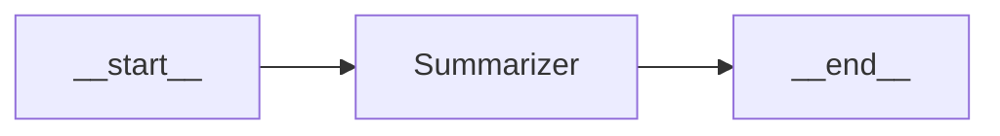
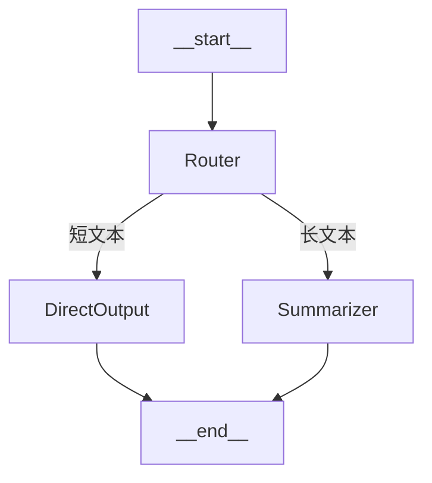
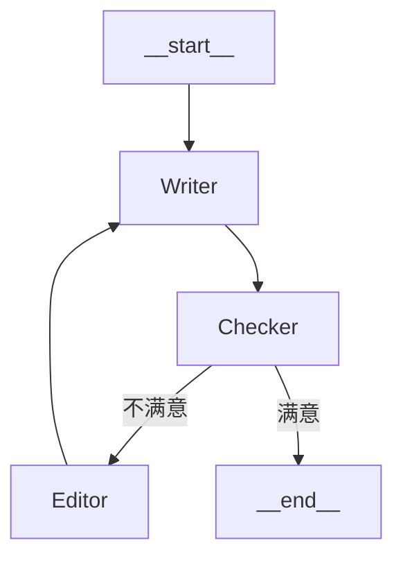
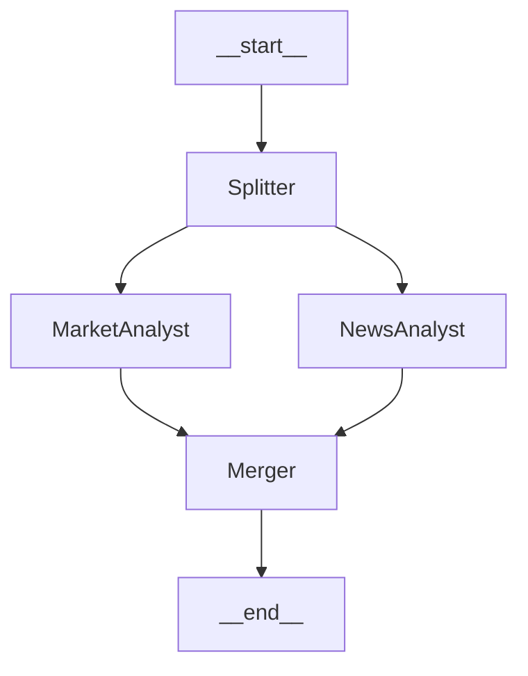
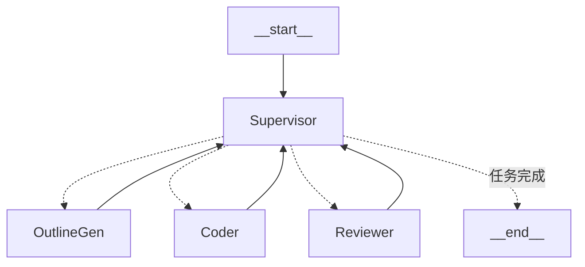
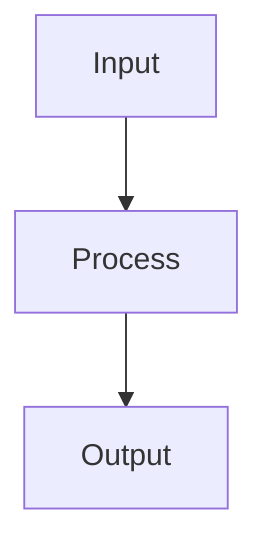
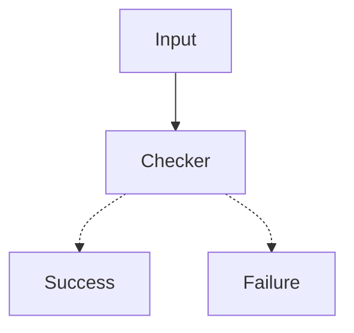
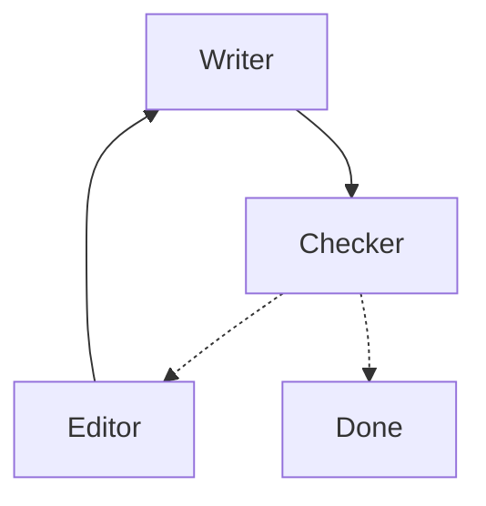

# 用 Mermaid 可视化 LangGraph 工作流

> Mermaid 是 LangGraph 的"蓝图语言"。先画图，再写代码，能让你的 Agent 架构更清晰、更易维护。本节将教你如何用 Mermaid 设计和可视化 LangGraph 工作流。

---

## 一、为什么要用 Mermaid？

在构建复杂的多 Agent 系统时，直接写代码容易迷失在细节中。Mermaid 提供了一种**先设计、后实现**的思路：

| 阶段 | 工具 | 作用 |
|:---|:---|:---|
| 设计阶段 | Mermaid 流程图 | 可视化节点、边、流程逻辑 |
| 实现阶段 | LangGraph 代码 | 执行、状态管理、错误处理 |
| 文档阶段 | Mermaid 图嵌入 Markdown | 让团队成员快速理解系统 |

**Mermaid 的优势**：
- 纯文本格式，可以直接写在 Markdown 中
- GitHub、Notion、VS Code 原生支持渲染
- 与 LangGraph 的概念**一一对应**

---

## 二、Mermaid → LangGraph 映射表

这是最重要的对照表，记住它你就能自由转换：

| Mermaid 语法 | LangGraph 代码 | 说明 |
|:---|:---|:---|
| `A --> B` | `add_edge("A", "B")` | A 执行完后，无条件执行 B |
| `A -.-> B` | `add_conditional_edges(...)` | A 根据条件决定是否执行 B |
| `A -- 标签 --> B` | 带注释的边 | 标签说明跳转条件 |
| `NodeName(显示名)` | `add_node("NodeName", func)` | 定义一个节点 |
| `__start__` | `START` | 流程入口 |
| `__end__` | `END` | 流程终点 |
| `graph TD` | StateGraph 从上到下 | TD = Top Down |
| `graph LR` | StateGraph 从左到右 | LR = Left Right |

---

## 三、从简单到复杂的 5 个案例

> **提示**：以下所有案例都可以在 Jupyter Notebook 中运行。每个案例都包含可视化代码，运行后会自动显示图结构。

### 案例 1：最简单的线性流程

**场景**：用户输入 → 总结 → 输出



**对应 LangGraph 代码**：

```python
from langgraph.graph import StateGraph, START, END
from typing import TypedDict
from IPython.display import display, Image

class State(TypedDict):
    input: str
    summary: str

def summarizer(state: State):
    # 简单截取前 50 个字符作为"总结"
    return {"summary": state["input"][:50] + "..."}

# 构建图
graph = StateGraph(State)
graph.add_node("Summarizer", summarizer)
graph.add_edge(START, "Summarizer")
graph.add_edge("Summarizer", END)

app = graph.compile()

# 🎨 可视化图结构
display(Image(app.get_graph().draw_mermaid_png()))

# 运行
result = app.invoke({"input": "这是一段很长的文本，需要被总结..."})
print(result["summary"])
```

**要点**：
- `START → Summarizer → END` 是最简单的线性流程
- 只有一个节点，执行一次就结束

---

### 案例 2：条件分支（二选一）

**场景**：根据文本长度决定是直接输出还是先总结



**对应 LangGraph 代码**：

```python
from langgraph.graph import StateGraph, START, END
from typing import TypedDict
from IPython.display import display, Image

class State(TypedDict):
    input: str
    output: str

def router(state: State):
    # 不做处理，只是用于路由判断
    return state

def should_summarize(state: State):
    """条件函数：判断文本是否需要总结"""
    if len(state["input"]) > 100:
        return "long"   # 长文本 → 需要总结
    return "short"      # 短文本 → 直接输出

def direct_output(state: State):
    return {"output": state["input"]}

def summarizer(state: State):
    return {"output": state["input"][:50] + "..."}

# 构建图
graph = StateGraph(State)
graph.add_node("Router", router)
graph.add_node("DirectOutput", direct_output)
graph.add_node("Summarizer", summarizer)

graph.add_edge(START, "Router")

# 条件边：根据 should_summarize 的返回值决定走向
graph.add_conditional_edges(
    "Router",
    should_summarize,
    {
        "short": "DirectOutput",
        "long": "Summarizer"
    }
)

graph.add_edge("DirectOutput", END)
graph.add_edge("Summarizer", END)

app = graph.compile()

# 🎨 可视化图结构
display(Image(app.get_graph().draw_mermaid_png()))
```

**要点**：
- `add_conditional_edges` 实现条件分支
- 条件函数返回字符串，映射到目标节点

---

### 案例 3：循环结构（写作 + 修改）

**场景**：写草稿 → 检查 → 如果不满意就修改 → 再检查 → 直到满意



**对应 LangGraph 代码**：

```python
from langgraph.graph import StateGraph, START, END
from typing import TypedDict
from IPython.display import display, Image

class State(TypedDict):
    draft: str
    revision_count: int
    is_good: bool

def writer(state: State):
    count = state.get("revision_count", 0)
    if count == 0:
        return {"draft": "这是初稿。", "revision_count": 1}
    else:
        return {"draft": f"这是第 {count} 次修改后的稿子。", "revision_count": count}

def checker(state: State):
    # 模拟：修改 2 次后才满意
    is_good = state["revision_count"] >= 3
    return {"is_good": is_good}

def should_continue(state: State):
    if state["is_good"]:
        return "done"
    return "revise"

def editor(state: State):
    return {"revision_count": state["revision_count"] + 1}

# 构建图
graph = StateGraph(State)
graph.add_node("Writer", writer)
graph.add_node("Checker", checker)
graph.add_node("Editor", editor)

graph.add_edge(START, "Writer")
graph.add_edge("Writer", "Checker")

# Checker 的条件边：满意则结束，不满意则编辑
graph.add_conditional_edges(
    "Checker",
    should_continue,
    {
        "done": END,
        "revise": "Editor"
    }
)

# Editor 完成后回到 Writer（形成循环）
graph.add_edge("Editor", "Writer")

app = graph.compile()

# 🎨 可视化图结构
display(Image(app.get_graph().draw_mermaid_png()))

# 运行
result = app.invoke({"revision_count": 0, "is_good": False})
print(result["draft"])
```

**运行结果**：

```text
这是第 3 次修改后的稿子。
```

**要点**：
- `Editor → Writer` 形成循环
- `Checker` 的条件边决定是继续循环还是退出

---

### 案例 4：并行执行（多路同时进行）

**场景**：同时进行市场分析和新闻分析，最后汇总



**对应 LangGraph 代码**：

```python
from langgraph.graph import StateGraph, START, END
from typing import TypedDict, Annotated
from IPython.display import display, Image
import operator

class State(TypedDict):
    topic: str
    market_report: str
    news_report: str
    final_report: Annotated[list, operator.add]  # 用于合并

def splitter(state: State):
    # 分发任务（实际不做处理）
    return state

def market_analyst(state: State):
    return {"market_report": f"市场分析报告：{state['topic']} 股价上涨 5%"}

def news_analyst(state: State):
    return {"news_report": f"新闻分析报告：{state['topic']} 发布新产品"}

def merger(state: State):
    combined = f"""
综合报告：
1. {state['market_report']}
2. {state['news_report']}
"""
    return {"final_report": [combined]}

# 构建图
graph = StateGraph(State)
graph.add_node("Splitter", splitter)
graph.add_node("MarketAnalyst", market_analyst)
graph.add_node("NewsAnalyst", news_analyst)
graph.add_node("Merger", merger)

graph.add_edge(START, "Splitter")

# Splitter 之后并行执行两个分析师
graph.add_edge("Splitter", "MarketAnalyst")
graph.add_edge("Splitter", "NewsAnalyst")

# 两个分析师都完成后进入 Merger
graph.add_edge("MarketAnalyst", "Merger")
graph.add_edge("NewsAnalyst", "Merger")

graph.add_edge("Merger", END)

app = graph.compile()

# 🎨 可视化图结构
display(Image(app.get_graph().draw_mermaid_png()))

# 运行
result = app.invoke({"topic": "NVDA"})
print(result["final_report"])
```

**要点**：
- 从 `Splitter` 出发的两条边会**并行执行**
- `Merger` 会等待所有上游节点完成后才执行

---

### 案例 5：中央调度器模式（Supervisor）

**场景**：Supervisor 根据任务队列动态调度多个 Agent



**对应 LangGraph 代码**：

```python
from langgraph.graph import StateGraph, START, END
from typing import TypedDict
from IPython.display import display, Image

class State(TypedDict):
    task_queue: list       # 任务队列
    current_task: str      # 当前任务
    results: dict          # 存储结果

def supervisor(state: State):
    queue = state.get("task_queue", [])
    if not queue:
        return {"current_task": "DONE"}

    next_task = queue[0]
    remaining = queue[1:]
    return {"current_task": next_task, "task_queue": remaining}

def route_task(state: State):
    """根据 current_task 路由到对应的 Agent"""
    task = state["current_task"]
    if task == "DONE":
        return "end"
    return task  # 直接返回任务名作为节点名

def outline_gen(state: State):
    results = state.get("results", {})
    results["outline"] = "大纲已生成"
    return {"results": results}

def coder(state: State):
    results = state.get("results", {})
    results["code"] = "代码已编写"
    return {"results": results}

def reviewer(state: State):
    results = state.get("results", {})
    results["review"] = "审核已完成"
    return {"results": results}

# 构建图
graph = StateGraph(State)

graph.add_node("Supervisor", supervisor)
graph.add_node("OutlineGen", outline_gen)
graph.add_node("Coder", coder)
graph.add_node("Reviewer", reviewer)

graph.add_edge(START, "Supervisor")

# Supervisor 根据任务动态路由
graph.add_conditional_edges(
    "Supervisor",
    route_task,
    {
        "OutlineGen": "OutlineGen",
        "Coder": "Coder",
        "Reviewer": "Reviewer",
        "end": END
    }
)

# 所有 Agent 完成后回到 Supervisor
graph.add_edge("OutlineGen", "Supervisor")
graph.add_edge("Coder", "Supervisor")
graph.add_edge("Reviewer", "Supervisor")

app = graph.compile()

# 🎨 可视化图结构
display(Image(app.get_graph().draw_mermaid_png()))

# 运行：按顺序执行三个任务
result = app.invoke({
    "task_queue": ["OutlineGen", "Coder", "Reviewer"],
    "results": {}
})
print(result["results"])
```

**运行结果**：

```python
{'outline': '大纲已生成', 'code': '代码已编写', 'review': '审核已完成'}
```

**要点**：
- Supervisor 是中央调度器，通过 `task_queue` 管理任务顺序
- 所有 Agent 执行完后都**返回 Supervisor**
- Supervisor 的条件边实现动态路由

---

## 四、Mermaid 语法速查

### 4.1 基本语法

```mermaid
graph TD
    %% 这是注释

    %% 节点定义
    A[方形节点]
    B(圆角节点)
    C((圆形节点))
    D{菱形节点}

    %% 边定义
    A --> B          %% 实线箭头
    B -.-> C         %% 虚线箭头
    C -- 标签 --> D  %% 带标签的边
```

### 4.2 方向控制

```mermaid
graph TD   %% 从上到下（Top Down）
graph LR   %% 从左到右（Left Right）
graph BT   %% 从下到上（Bottom Top）
graph RL   %% 从右到左（Right Left）
```

### 4.3 样式定义

```mermaid
graph TD
    A[开始]:::start
    B[处理]
    C[结束]:::end

    A --> B --> C

    classDef start fill:#90EE90
    classDef end fill:#FFB6C1
```

---

## 五、设计流程建议

### 步骤 1：画出粗略流程

先用 Mermaid 画出主要节点和流向，不用考虑细节：



### 步骤 2：标注条件分支

哪些地方需要判断？用虚线箭头标出：



### 步骤 3：标注循环

哪些地方需要重试或迭代？画出回边：



### 步骤 4：转换为代码

按照映射表，将 Mermaid 图转换为 LangGraph 代码。

---

## 六、常见模式速查

| 模式名称 | Mermaid 特征 | 典型应用 |
|:---|:---|:---|
| **线性流水线** | `A --> B --> C` | 数据处理、ETL |
| **条件分支** | `A -.-> B` / `A -.-> C` | 路由、分类 |
| **循环重试** | `B --> A`（回边） | 自修正、质量控制 |
| **并行执行** | 多条边从同一节点出发 | 并行分析、分布式任务 |
| **中央调度** | Supervisor ↔ 多个 Agent | 多智能体协作 |
| **人机协作** | `-.-> WAIT` | 需要用户确认的流程 |

---

## 七、本节小结

1. **Mermaid 是 LangGraph 的可视化前端**：先画图，再写代码
2. **核心映射**：`-->` 对应 `add_edge`，`-.->` 对应 `add_conditional_edges`
3. **五种常见模式**：线性、分支、循环、并行、中央调度
4. **设计流程**：粗略流程 → 标注条件 → 标注循环 → 转换代码

掌握 Mermaid，你就能在纸上（或 Markdown 中）先设计好 Agent 架构，再动手写代码！

---

> 💡 **练习**：尝试用 Mermaid 画出你正在开发的 Agent 系统，然后对照本节的映射表转换为 LangGraph 代码。
