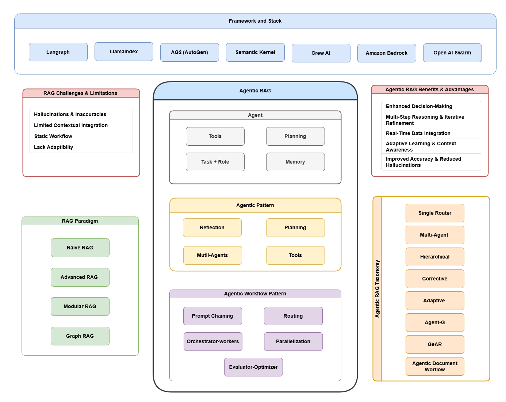

# Agentic RAG 概述

> 本章节基于论文 [Agentic Retrieval-Augmented Generation: A Survey on Agentic RAG](https://arxiv.org/abs/2501.09136) 整理

---

## 什么是 Agentic RAG？

**Agentic RAG** 是检索增强生成（RAG）技术的最新演进形态。它将**自主智能体（Autonomous Agents）** 引入传统 RAG 系统，使系统具备了**动态决策**、**迭代推理**和**自适应检索**的能力。


*图 1：Agentic RAG 技术全景图*

---

## 为什么需要 Agentic RAG？

### 传统 RAG 的局限性

传统 RAG 系统虽然解决了 LLM 知识时效性的问题，但仍存在以下核心挑战：

| 挑战 | 具体问题 |
|------|----------|
| **上下文整合困难** | 静态检索流程难以将检索到的信息无缝整合到生成过程中 |
| **多步推理受限** | 无法基于中间结果迭代优化检索，难以处理需要多轮信息整合的复杂查询 |
| **可扩展性不足** | 查询大规模数据集时计算密集，导致延迟增加，影响实时应用 |

### Agentic RAG 的解决方案

Agentic RAG 通过引入**自主智能体**克服了这些限制：

```
传统 RAG：用户查询 → 检索 → 生成 → 响应（单次、静态）

Agentic RAG：用户查询 → 智能体分析 → 动态检索 → 评估反馈 → 迭代优化 → 响应
                              ↑_______________|（循环改进）
```

---

## Agentic RAG 的核心特征

### 1. 动态决策能力

智能体能够**实时评估**查询复杂度，选择最合适的处理策略：

- 简单查询：直接使用 LLM 内置知识
- 中等查询：单次检索即可解决
- 复杂查询：启动多步迭代推理

### 2. 迭代优化机制

系统能够**自我评估和纠错**：

- 检索结果不满意时，自动重写查询
- 生成内容存在问题时，触发自我反思
- 多轮优化直到达到质量阈值

### 3. 多智能体协作

复杂任务可以**分解并行处理**：

- 专门的检索智能体负责不同数据源
- 评估智能体验证检索质量
- 合成智能体整合多源信息

### 4. 工具集成能力

智能体可以**灵活调用外部工具**：

- 向量数据库（语义检索）
- 知识图谱（关系推理）
- Web 搜索（实时信息）
- API 接口（专业数据）

---

## Agentic RAG 与传统 RAG 对比

| 维度 | 传统 RAG | Agentic RAG |
|------|----------|-------------|
| **工作流程** | 固定、线性 | 动态、自适应 |
| **决策方式** | 预设规则 | 智能体自主判断 |
| **错误处理** | 无纠错机制 | 自我反思与迭代 |
| **扩展性** | 受限于预设管道 | 模块化、可扩展 |
| **复杂查询** | 处理困难 | 多步推理支持 |
| **资源效率** | 统一处理 | 按需分配 |

---

## 典型应用场景

Agentic RAG 在以下领域展现出显著优势：

### 企业知识管理
- 跨多个知识库的智能问答
- 自动整合内部文档与外部资源

### 客户服务
- Twitch 广告销售：动态检索广告主数据、历史表现、受众分析，生成定制提案

### 医疗健康
- 整合电子病历与最新医学文献
- 辅助诊断和个性化治疗建议

### 法律合规
- 合同条款自动审查
- 多文档比对与风险识别

### 金融分析
- 保险理赔自动处理
- 实时市场分析与风险预测

---

## 本章学习路径

本模块将系统介绍 Agentic RAG 的完整知识体系：

| 章节 | 内容 | 你将学到 |
|------|------|----------|
| **13.2** | RAG 演进历程 | 从 Naive RAG 到 Agentic RAG 的技术演进 |
| **13.3** | Agentic 设计模式 | 反思、规划、工具使用、多智能体协作 |
| **13.4** | 工作流模式 | 五种核心工作流模式的设计与应用 |
| **13.5** | 架构分类 | 单智能体、多智能体、层级架构等 |
| **13.6** | 实战应用 | 真实场景案例与实现指南 |

---

## 参考资源

- 论文原文：[Agentic Retrieval-Augmented Generation: A Survey on Agentic RAG](https://arxiv.org/abs/2501.09136)
- 作者：Aditi Singh (Cleveland State University), Abul Ehtesham, Saket Kumar, Tala Talaei Khoei

---

## 思考题

1. 为什么说 Agentic RAG 是 RAG 技术的"必然演进"？
2. 在什么场景下，传统 RAG 仍然是更好的选择？
3. Agentic RAG 的"自主决策"能力可能带来哪些风险？如何缓解？
