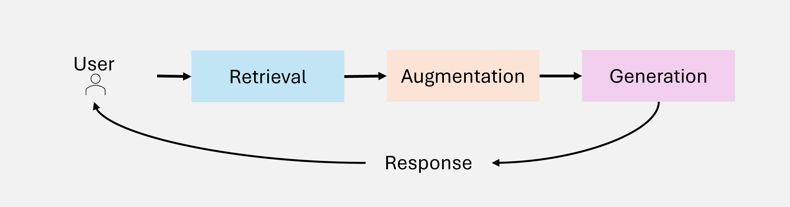
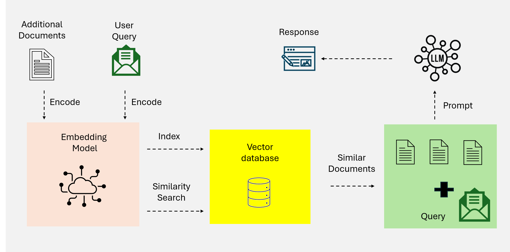

# RAG 演进历程

> 从 Naive RAG 到 Agentic RAG：一部检索增强生成的进化史

---

## RAG 的核心组件

在深入了解 RAG 的演进之前，让我们先理解其核心架构。任何 RAG 系统都由三个基本组件构成：


*图 1：RAG 系统的三大核心组件*

### 1. 检索（Retrieval）

从外部数据源（知识库、向量数据库、API 等）查询相关信息。

- **早期方法**：基于关键词的稀疏检索（TF-IDF、BM25）
- **现代方法**：基于语义的稠密检索（Dense Retrieval）

### 2. 增强（Augmentation）

对检索到的数据进行处理，提取并整理与查询上下文相关的信息。

- 信息摘要与过滤
- 相关性排序
- 上下文对齐

### 3. 生成（Generation）

将检索到的信息与 LLM 的预训练知识融合，生成连贯、准确的响应。

- 上下文整合
- 响应合成
- 引用标注

---

## 第一代：Naive RAG

**Naive RAG** 是最基础的检索增强生成范式，采用简单直接的"检索-生成"流程。


*图 2：Naive RAG 工作流程*

### 工作原理

```
用户查询 → 关键词匹配检索 → 拼接上下文 → LLM 生成 → 返回响应
```

### 技术特点

| 特性 | 实现方式 |
|------|----------|
| 检索方法 | TF-IDF、BM25（稀疏检索） |
| 索引结构 | 倒排索引 |
| 上下文处理 | 简单拼接 |
| 生成策略 | 单次调用 LLM |

### 主要局限

1. **缺乏上下文感知**：关键词匹配无法理解语义
2. **输出碎片化**：检索结果间缺乏连贯性
3. **扩展性差**：大数据集检索效率低下
4. **无法处理复杂查询**：不支持多步推理

---

## 第二代：Advanced RAG

**Advanced RAG** 引入了语义理解和神经网络排序，显著提升了检索精度。


*图 3：Advanced RAG 工作流程*

### 核心改进

```
用户查询 → 查询编码 → 稠密向量检索 → 重排序 → 上下文构建 → LLM 生成
                ↓
           语义理解层
```

### 技术特点

| 特性 | 实现方式 |
|------|----------|
| 检索方法 | Dense Passage Retrieval (DPR) |
| 向量表示 | Transformer 编码器（BERT 等） |
| 排序策略 | 神经网络重排序（Cross-encoder） |
| 多跳检索 | 迭代检索机制 |

### 关键技术

1. **稠密向量搜索**：将文本编码为语义向量，支持相似度匹配
2. **上下文重排序**：使用 Cross-encoder 对候选结果精细排序
3. **迭代多跳检索**：支持基于中间结果的二次检索

### 仍存在的问题

- 检索流程仍然相对固定
- 无法根据查询复杂度动态调整策略
- 缺乏自我纠错机制

---

## 第三代：Modular RAG

**Modular RAG** 将 RAG 系统分解为可独立替换的模块化组件，实现了高度的灵活性和可扩展性。


*图 4：Modular RAG 模块化架构*

### 设计理念

```
┌─────────────────────────────────────────────────────────┐
│                    Modular RAG                          │
├─────────┬─────────┬─────────┬─────────┬────────────────┤
│ 检索模块 │ 排序模块 │ 增强模块 │ 生成模块 │ 工具集成模块    │
├─────────┼─────────┼─────────┼─────────┼────────────────┤
│  可替换  │  可替换  │  可替换  │  可替换  │    可扩展      │
└─────────┴─────────┴─────────┴─────────┴────────────────┘
```

### 核心创新

1. **混合检索策略**
   - 稀疏检索 + 稠密检索结合
   - 根据查询类型动态选择

2. **工具集成**
   - 外部 API 调用
   - 数据库查询
   - 计算工具

3. **可组合流水线**
   - 组件可独立开发、测试、替换
   - 支持 A/B 测试不同组件组合

### 技术实现

```python
# Modular RAG 伪代码示例
class ModularRAG:
    def __init__(self):
        self.retriever = HybridRetriever()  # 可替换
        self.ranker = NeuralRanker()        # 可替换
        self.augmenter = ContextAugmenter() # 可替换
        self.generator = LLMGenerator()     # 可替换
        self.tools = ToolRegistry()         # 可扩展

    def process(self, query):
        # 每个步骤都是独立模块
        docs = self.retriever.retrieve(query)
        ranked = self.ranker.rank(docs, query)
        context = self.augmenter.augment(ranked)
        return self.generator.generate(query, context)
```

---

## 第四代：Graph RAG

**Graph RAG** 将知识图谱引入 RAG 系统，增强了实体关系推理和多跳问答能力。


*图 5：Graph RAG 知识图谱增强架构*

### 核心思想

将非结构化文本转化为结构化的知识图谱，利用图结构进行关系推理：

```
文档 → 实体抽取 → 关系构建 → 知识图谱 → 图检索 → 路径推理 → 生成
```

### 关键能力

| 能力 | 说明 |
|------|------|
| **实体关系捕获** | 建模实体间的语义关系 |
| **层级知识管理** | 支持概念层次结构 |
| **路径推理** | 通过图路径进行多跳推理 |
| **上下文丰富** | 利用图邻域扩展上下文 |

### 局限性

- **可扩展性受限**：大规模图谱维护困难
- **数据依赖**：图谱质量直接影响效果
- **集成复杂**：与现有系统整合难度大

---

## 第五代：Agentic RAG

**Agentic RAG** 引入自主智能体，实现了动态决策、迭代优化和多智能体协作。


*图 6：AI 智能体的核心组件*

### 范式转变

从**静态流水线**到**动态智能体系统**：

```
传统 RAG：预定义流程，被动响应

Agentic RAG：
┌─────────────────────────────────────────┐
│              智能体核心                   │
├─────────┬─────────┬─────────┬──────────┤
│   大脑   │   记忆   │   规划   │   工具   │
│  (LLM)  │ (Memory) │(Planning)│ (Tools) │
└────┬────┴────┬────┴────┬────┴────┬─────┘
     │         │         │         │
     ↓         ↓         ↓         ↓
   推理     上下文     任务分解    外部能力
   对话     管理       路径规划    API/DB
```

### 核心组件详解

| 组件 | 功能 | 实现 |
|------|------|------|
| **LLM（大脑）** | 推理引擎和对话接口 | GPT-4, Claude, Llama |
| **记忆** | 短期（对话状态）+ 长期（知识积累） | 向量存储、图数据库 |
| **规划** | 任务分解、路径规划、自我反思 | ReAct, CoT, ToT |
| **工具** | 扩展 LLM 能力边界 | 向量搜索、Web 搜索、API |

### Agentic RAG 的独特优势

1. **自主决策**：根据查询复杂度选择策略
2. **迭代优化**：检索-评估-改进的闭环
3. **多智能体协作**：专业分工、并行处理
4. **自适应学习**：从交互中积累经验

---

## RAG 演进总结

| 代际 | 核心特征 | 检索方式 | 智能程度 | 典型应用 |
|------|----------|----------|----------|----------|
| **Naive** | 简单直接 | 关键词匹配 | 无 | 基础问答 |
| **Advanced** | 语义理解 | 稠密向量 | 低 | 文档问答 |
| **Modular** | 模块化 | 混合策略 | 中 | 复杂检索 |
| **Graph** | 知识图谱 | 图检索 | 中 | 关系推理 |
| **Agentic** | 智能体 | 动态自适应 | 高 | 复杂任务 |

---

## 思考题

1. 为什么说从 Modular RAG 到 Agentic RAG 是一次"质变"而非"量变"？
2. Graph RAG 和 Agentic RAG 可以结合吗？如何结合？
3. 在实际项目中，如何选择合适的 RAG 范式？
