# 工作流与智能体模式

> 本节介绍 LangGraph 中的工作流（Workflow）和智能体（Agent）模式，帮助你理解如何构建可靠的 AI 应用。

## 概述

在构建 AI 应用时，有两种主要的架构模式：

### 工作流 vs 智能体

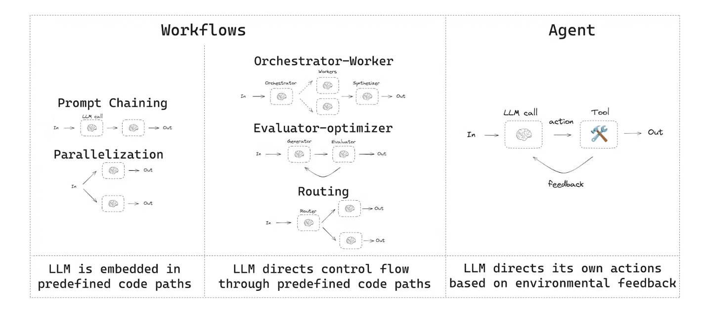

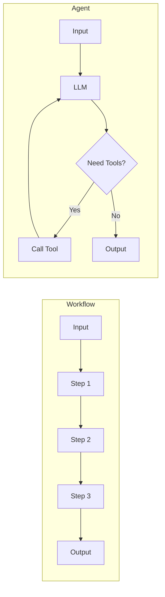

| 特性 | 工作流 | 智能体 |
|------|--------|--------|
| **执行路径** | 预定义的代码路径 | 动态决定执行路径 |
| **控制方式** | 开发者编排 | LLM 自主决策 |
| **可预测性** | 高 | 低 |
| **灵活性** | 低 | 高 |
| **适用场景** | 结构化任务 | 开放性任务 |

### 为什么使用 LangGraph

LangGraph 提供以下核心优势：

- **持久化**：自动保存状态，支持暂停和恢复
- **流式输出**：实时返回中间结果
- **调试部署**：与 LangSmith 集成，便于调试和生产部署

---

## 环境配置

### 安装依赖

```bash
pip install langchain_core langchain-anthropic langgraph
```

### 初始化 LLM

```python
import os
from langchain_anthropic import ChatAnthropic

# 设置 API Key
os.environ["ANTHROPIC_API_KEY"] = "your-api-key"

# 初始化模型
llm = ChatAnthropic(model="claude-sonnet-4-5-20250929")
```

---

## LLM 增强技术

在构建工作流之前，了解如何增强 LLM 的能力非常重要。

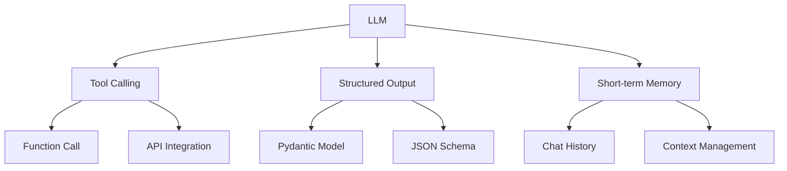

### 1. 工具调用 (Tool Calling)

让 LLM 能够调用外部函数：

```python
from langchain_core.tools import tool

@tool
def multiply(a: int, b: int) -> int:
    """Multiply two numbers"""
    return a * b

# 绑定工具到 LLM
llm_with_tools = llm.bind_tools([multiply])
```

### 2. 结构化输出 (Structured Output)

使用 Pydantic 定义输出格式：

```python
from pydantic import BaseModel, Field

class JokeOutput(BaseModel):
    """Joke output format"""
    setup: str = Field(description="The setup of the joke")
    punchline: str = Field(description="The punchline of the joke")

# 绑定结构化输出
structured_llm = llm.with_structured_output(JokeOutput)
```

### 3. 短期记忆 (Short-term Memory)

维护对话上下文：

```python
from langchain_core.messages import HumanMessage, AIMessage

messages = [
    HumanMessage(content="My name is Alice"),
    AIMessage(content="Hello, Alice!"),
    HumanMessage(content="What is my name?")
]

response = llm.invoke(messages)
# LLM will remember and answer "Alice"
```

---

## 工作流模式

### 1. 提示链 (Prompt Chaining)

将多个 LLM 调用串联起来，每一步的输出作为下一步的输入。

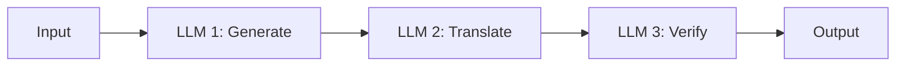

**适用场景：**
- 多语言翻译和校对
- 内容生成后审核
- 分步骤的复杂推理

**代码示例：**

```python
from langgraph.graph import StateGraph, START, END
from typing import TypedDict

class State(TypedDict):
    topic: str
    joke: str
    improved_joke: str

def generate_joke(state: State) -> State:
    """Generate a joke"""
    msg = llm.invoke(f"Tell a joke about {state['topic']}")
    return {"joke": msg.content}

def improve_joke(state: State) -> State:
    """Improve the joke"""
    msg = llm.invoke(f"Make this joke funnier: {state['joke']}")
    return {"improved_joke": msg.content}

# Build the graph
graph = StateGraph(State)
graph.add_node("generate", generate_joke)
graph.add_node("improve", improve_joke)

graph.add_edge(START, "generate")
graph.add_edge("generate", "improve")
graph.add_edge("improve", END)

chain = graph.compile()
result = chain.invoke({"topic": "programmers"})
```

---

### 2. 并行化 (Parallelization)

同时执行多个独立任务，提高效率。

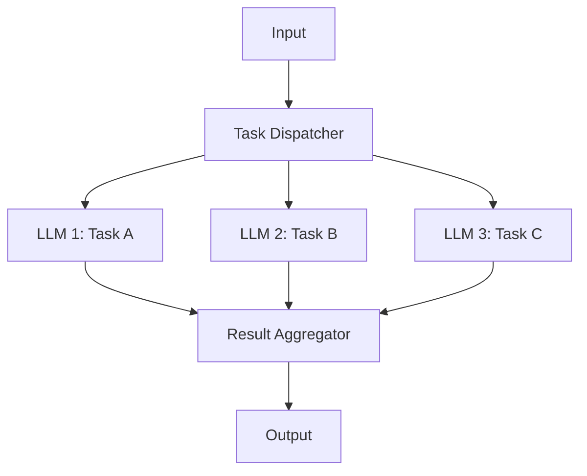

**适用场景：**
- 多维度内容生成
- 并行评估和审核
- 批量数据处理

**代码示例：**

```python
from typing import Annotated
import operator

class ParallelState(TypedDict):
    topic: str
    jokes: Annotated[list, operator.add]

def generate_joke_1(state: ParallelState) -> ParallelState:
    """Generate joke 1"""
    msg = llm.invoke(f"Tell a joke about {state['topic']}")
    return {"jokes": [msg.content]}

def generate_joke_2(state: ParallelState) -> ParallelState:
    """Generate joke 2 with irony"""
    msg = llm.invoke(f"Tell an ironic joke about {state['topic']}")
    return {"jokes": [msg.content]}

def generate_joke_3(state: ParallelState) -> ParallelState:
    """Generate a cold joke"""
    msg = llm.invoke(f"Tell a cold joke about {state['topic']}")
    return {"jokes": [msg.content]}

# Build parallel graph
graph = StateGraph(ParallelState)
graph.add_node("joke_1", generate_joke_1)
graph.add_node("joke_2", generate_joke_2)
graph.add_node("joke_3", generate_joke_3)

# Parallel execution
graph.add_edge(START, "joke_1")
graph.add_edge(START, "joke_2")
graph.add_edge(START, "joke_3")

graph.add_edge("joke_1", END)
graph.add_edge("joke_2", END)
graph.add_edge("joke_3", END)

parallel_chain = graph.compile()
```

---

### 3. 路由 (Routing)

根据输入内容动态选择执行路径。

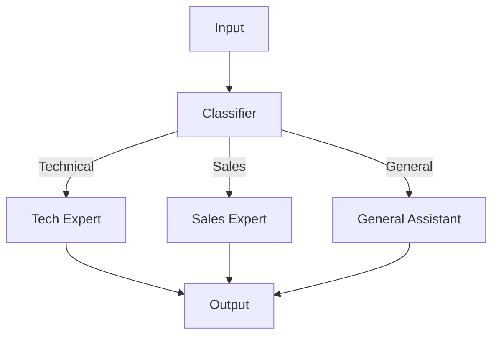

**适用场景：**
- 客服系统分流
- 专家系统路由
- 多模型协作

**代码示例：**

```python
from typing import Literal

class RouteState(TypedDict):
    question: str
    route: str
    answer: str

class RouteDecision(BaseModel):
    """Route decision"""
    route: Literal["technical", "sales", "general"] = Field(
        description="Question type: technical, sales, or general"
    )

def classify_question(state: RouteState) -> RouteState:
    """Classify the question"""
    classifier = llm.with_structured_output(RouteDecision)
    decision = classifier.invoke(f"Classify this question: {state['question']}")
    return {"route": decision.route}

def technical_expert(state: RouteState) -> RouteState:
    """Technical expert answer"""
    msg = llm.invoke(f"As a technical expert, answer: {state['question']}")
    return {"answer": msg.content}

def sales_expert(state: RouteState) -> RouteState:
    """Sales expert answer"""
    msg = llm.invoke(f"As a sales expert, answer: {state['question']}")
    return {"answer": msg.content}

def general_assistant(state: RouteState) -> RouteState:
    """General assistant answer"""
    msg = llm.invoke(f"Answer this question: {state['question']}")
    return {"answer": msg.content}

def route_question(state: RouteState) -> str:
    """Route function"""
    return state["route"]

# Build routing graph
graph = StateGraph(RouteState)
graph.add_node("classify", classify_question)
graph.add_node("technical", technical_expert)
graph.add_node("sales", sales_expert)
graph.add_node("general", general_assistant)

graph.add_edge(START, "classify")
graph.add_conditional_edges(
    "classify",
    route_question,
    {
        "technical": "technical",
        "sales": "sales",
        "general": "general"
    }
)
graph.add_edge("technical", END)
graph.add_edge("sales", END)
graph.add_edge("general", END)

router = graph.compile()
```

---

### 4. 协调器-工作者 (Orchestrator-Worker)

主智能体分解任务，分配给多个工作者执行。

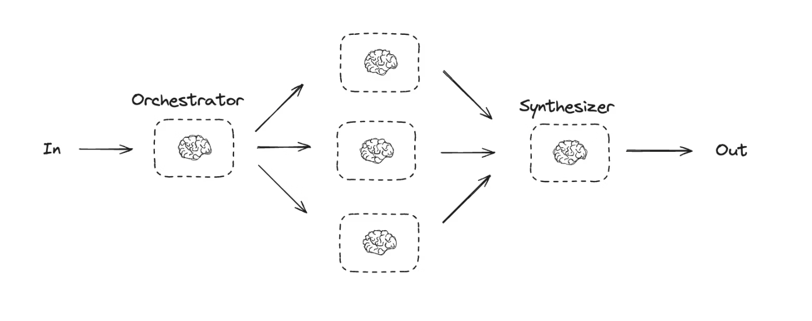

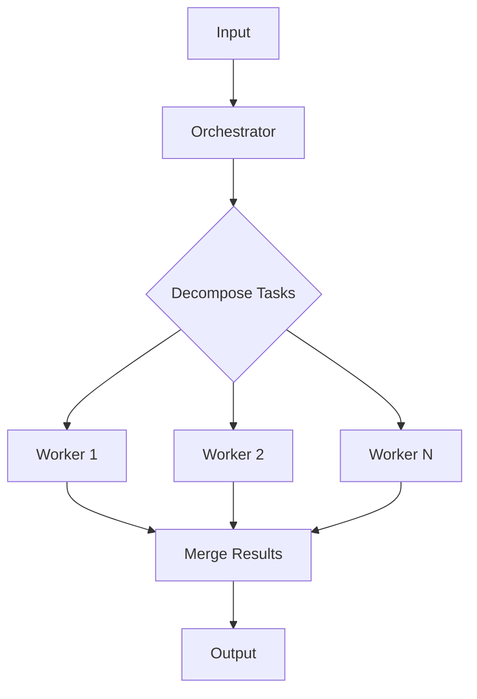

**适用场景：**
- 长文档生成
- 多文件代码编写
- 复杂报告生成

**代码示例（使用 Send API）：**

```python
from langgraph.types import Send

class OrchestratorState(TypedDict):
    topic: str
    sections: list[str]
    completed_sections: Annotated[list, operator.add]

class WorkerState(TypedDict):
    section: str
    content: str

def orchestrator(state: OrchestratorState) -> list[Send]:
    """Orchestrator: decompose and dispatch tasks"""
    # Use LLM to plan sections
    sections = ["Introduction", "Core Concepts", "Examples", "Summary"]

    # Dynamically create worker tasks
    return [
        Send("worker", {"section": section})
        for section in sections
    ]

def worker(state: WorkerState) -> dict:
    """Worker: complete assigned task"""
    msg = llm.invoke(f"Write content about '{state['section']}'")
    return {"completed_sections": [{"section": state["section"], "content": msg.content}]}

# Build graph
graph = StateGraph(OrchestratorState)
graph.add_node("orchestrator", orchestrator)
graph.add_node("worker", worker)

graph.add_edge(START, "orchestrator")
graph.add_edge("worker", END)

orchestrator_chain = graph.compile()
```

---

### 5. 评估器-优化器 (Evaluator-Optimizer)

循环迭代，直到满足质量标准。


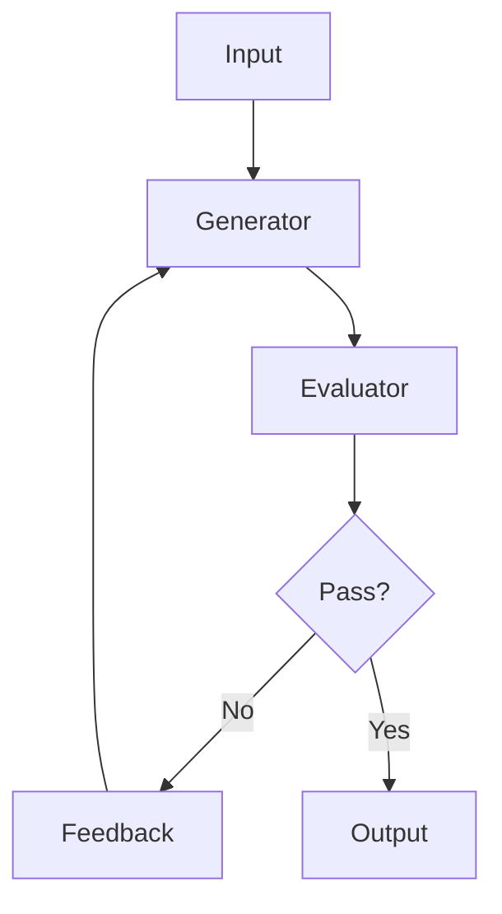

**适用场景：**
- 内容质量优化
- 翻译校对
- 代码审查和修复

**代码示例：**

```python
class OptimizeState(TypedDict):
    topic: str
    current_joke: str
    feedback: str
    accepted: bool

class Evaluation(BaseModel):
    """Evaluation result"""
    score: int = Field(description="Score from 1-10")
    feedback: str = Field(description="Improvement suggestions")
    accepted: bool = Field(description="Pass if score >= 8")

def generate_joke(state: OptimizeState) -> OptimizeState:
    """Generate or improve joke"""
    if state.get("feedback"):
        prompt = f"Improve the joke based on feedback:\nOriginal: {state['current_joke']}\nFeedback: {state['feedback']}"
    else:
        prompt = f"Tell a joke about {state['topic']}"

    msg = llm.invoke(prompt)
    return {"current_joke": msg.content}

def evaluate_joke(state: OptimizeState) -> OptimizeState:
    """Evaluate the joke"""
    evaluator = llm.with_structured_output(Evaluation)
    result = evaluator.invoke(f"Evaluate this joke: {state['current_joke']}")
    return {
        "feedback": result.feedback,
        "accepted": result.accepted
    }

def should_continue(state: OptimizeState) -> str:
    """Decide whether to continue optimization"""
    return END if state["accepted"] else "generate"

# Build graph
graph = StateGraph(OptimizeState)
graph.add_node("generate", generate_joke)
graph.add_node("evaluate", evaluate_joke)

graph.add_edge(START, "generate")
graph.add_edge("generate", "evaluate")
graph.add_conditional_edges("evaluate", should_continue)

optimizer = graph.compile()
```

---

## 智能体模式

智能体是能够自主决策和使用工具的系统。

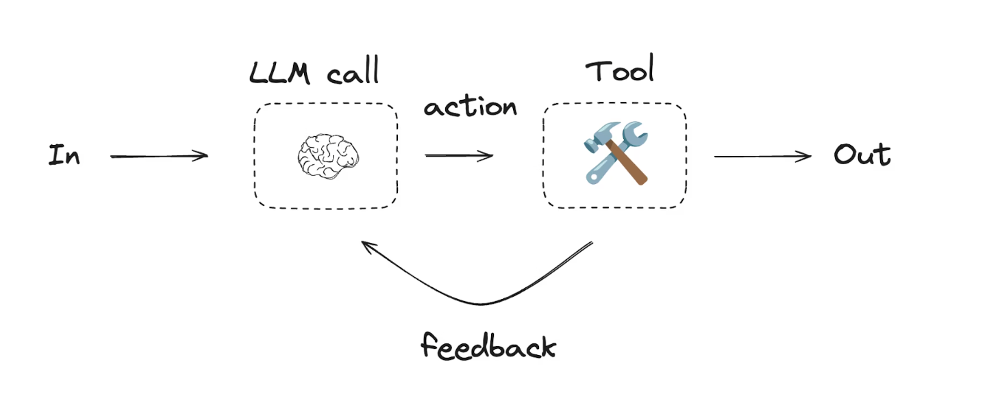

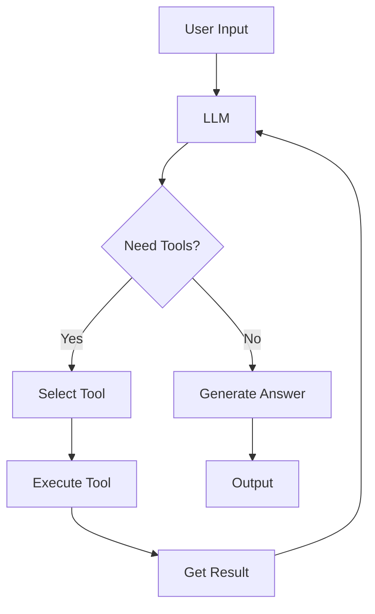

### 构建智能体

```python
from langchain_core.tools import tool
from langchain_core.messages import HumanMessage, SystemMessage
from langgraph.graph import StateGraph, START, END
from langgraph.prebuilt import ToolNode

# Define tools
@tool
def add(a: int, b: int) -> int:
    """Addition"""
    return a + b

@tool
def multiply(a: int, b: int) -> int:
    """Multiplication"""
    return a * b

@tool
def divide(a: int, b: int) -> float:
    """Division"""
    if b == 0:
        return "Error: Cannot divide by zero"
    return a / b

tools = [add, multiply, divide]

# Bind tools
llm_with_tools = llm.bind_tools(tools)

# Define state
class AgentState(TypedDict):
    messages: list

def call_model(state: AgentState) -> AgentState:
    """Call the model"""
    messages = state["messages"]
    response = llm_with_tools.invoke(messages)
    return {"messages": messages + [response]}

def should_continue(state: AgentState) -> str:
    """Check if should continue"""
    last_message = state["messages"][-1]
    if hasattr(last_message, "tool_calls") and last_message.tool_calls:
        return "tools"
    return END

# Build agent graph
graph = StateGraph(AgentState)
graph.add_node("agent", call_model)
graph.add_node("tools", ToolNode(tools))

graph.add_edge(START, "agent")
graph.add_conditional_edges("agent", should_continue, {"tools": "tools", END: END})
graph.add_edge("tools", "agent")

agent = graph.compile()

# Use the agent
result = agent.invoke({
    "messages": [
        SystemMessage(content="You are a math assistant"),
        HumanMessage(content="Calculate (3 + 5) * 2")
    ]
})
```

---

## 完整案例代码

以下是一个完整的可运行示例，展示了多种工作流模式：

```python
"""
LangGraph Workflow and Agent Patterns - Complete Example
Demonstrates: Prompt Chaining, Parallelization, Routing, Evaluator-Optimizer, Agent
"""

import os
import operator
from typing import TypedDict, Literal, Annotated
from pydantic import BaseModel, Field

# ========== 1. Environment Setup ==========

from langchain_openai import ChatOpenAI

# Set API Key
# os.environ["OPENAI_API_KEY"] = "your-api-key"

# Initialize LLM
llm = ChatOpenAI(model="gpt-4o-mini", temperature=0.7)

# ========== 2. Import LangGraph ==========

from langgraph.graph import StateGraph, START, END
from langchain_core.tools import tool
from langchain_core.messages import HumanMessage, SystemMessage, AIMessage

# ========== 3. Pattern 1: Prompt Chaining ==========

print("=" * 60)
print("Pattern 1: Prompt Chaining")
print("=" * 60)

class ChainState(TypedDict):
    topic: str
    draft: str
    translation: str
    final: str

def generate_draft(state: ChainState) -> ChainState:
    """Step 1: Generate draft"""
    msg = llm.invoke(f"Write a short introduction about '{state['topic']}' in about 50 words")
    print(f"[Generate Draft] {msg.content[:50]}...")
    return {"draft": msg.content}

def translate_content(state: ChainState) -> ChainState:
    """Step 2: Translate to Chinese"""
    msg = llm.invoke(f"Translate to Chinese:\n{state['draft']}")
    print(f"[Translate] {msg.content[:50]}...")
    return {"translation": msg.content}

def polish_content(state: ChainState) -> ChainState:
    """Step 3: Polish content"""
    msg = llm.invoke(f"Polish this Chinese text to be more professional:\n{state['translation']}")
    print(f"[Polish] {msg.content[:50]}...")
    return {"final": msg.content}

# Build prompt chain
chain_graph = StateGraph(ChainState)
chain_graph.add_node("generate", generate_draft)
chain_graph.add_node("translate", translate_content)
chain_graph.add_node("polish", polish_content)

chain_graph.add_edge(START, "generate")
chain_graph.add_edge("generate", "translate")
chain_graph.add_edge("translate", "polish")
chain_graph.add_edge("polish", END)

prompt_chain = chain_graph.compile()

# Run prompt chain
chain_result = prompt_chain.invoke({"topic": "Artificial Intelligence"})
print(f"\nFinal Result:\n{chain_result['final']}\n")

# ========== 4. Pattern 2: Parallelization ==========

print("=" * 60)
print("Pattern 2: Parallelization")
print("=" * 60)

class ParallelState(TypedDict):
    topic: str
    perspectives: Annotated[list, operator.add]

def perspective_optimist(state: ParallelState) -> ParallelState:
    """Optimistic perspective"""
    msg = llm.invoke(f"From an optimistic view, comment on '{state['topic']}' in one sentence")
    print(f"[Optimist] {msg.content}")
    return {"perspectives": [{"view": "Optimist", "content": msg.content}]}

def perspective_pessimist(state: ParallelState) -> ParallelState:
    """Pessimistic perspective"""
    msg = llm.invoke(f"From a pessimistic view, comment on '{state['topic']}' in one sentence")
    print(f"[Pessimist] {msg.content}")
    return {"perspectives": [{"view": "Pessimist", "content": msg.content}]}

def perspective_neutral(state: ParallelState) -> ParallelState:
    """Neutral perspective"""
    msg = llm.invoke(f"From a neutral view, comment on '{state['topic']}' in one sentence")
    print(f"[Neutral] {msg.content}")
    return {"perspectives": [{"view": "Neutral", "content": msg.content}]}

# Build parallel graph
parallel_graph = StateGraph(ParallelState)
parallel_graph.add_node("optimist", perspective_optimist)
parallel_graph.add_node("pessimist", perspective_pessimist)
parallel_graph.add_node("neutral", perspective_neutral)

# Parallel branches
parallel_graph.add_edge(START, "optimist")
parallel_graph.add_edge(START, "pessimist")
parallel_graph.add_edge(START, "neutral")

parallel_graph.add_edge("optimist", END)
parallel_graph.add_edge("pessimist", END)
parallel_graph.add_edge("neutral", END)

parallel_chain = parallel_graph.compile()

# Run parallelization
parallel_result = parallel_chain.invoke({"topic": "Remote Work"})
print(f"\nCollected {len(parallel_result['perspectives'])} perspectives\n")

# ========== 5. Pattern 3: Routing ==========

print("=" * 60)
print("Pattern 3: Routing")
print("=" * 60)

class RouteState(TypedDict):
    question: str
    category: str
    answer: str

class CategoryDecision(BaseModel):
    """Category decision"""
    category: Literal["code", "math", "general"] = Field(
        description="Question type: code, math, or general"
    )

def classify(state: RouteState) -> RouteState:
    """Classify question"""
    classifier = llm.with_structured_output(CategoryDecision)
    result = classifier.invoke(f"Classify this question: {state['question']}")
    print(f"[Classify] Category: {result.category}")
    return {"category": result.category}

def code_expert(state: RouteState) -> RouteState:
    """Code expert"""
    msg = llm.invoke(f"As a coding expert, answer: {state['question']}")
    return {"answer": f"[Code Expert] {msg.content}"}

def math_expert(state: RouteState) -> RouteState:
    """Math expert"""
    msg = llm.invoke(f"As a math expert, answer: {state['question']}")
    return {"answer": f"[Math Expert] {msg.content}"}

def general_assistant(state: RouteState) -> RouteState:
    """General assistant"""
    msg = llm.invoke(f"Answer: {state['question']}")
    return {"answer": f"[General] {msg.content}"}

def route_by_category(state: RouteState) -> str:
    """Route function"""
    return state["category"]

# Build routing graph
route_graph = StateGraph(RouteState)
route_graph.add_node("classify", classify)
route_graph.add_node("code", code_expert)
route_graph.add_node("math", math_expert)
route_graph.add_node("general", general_assistant)

route_graph.add_edge(START, "classify")
route_graph.add_conditional_edges(
    "classify",
    route_by_category,
    {"code": "code", "math": "math", "general": "general"}
)
route_graph.add_edge("code", END)
route_graph.add_edge("math", END)
route_graph.add_edge("general", END)

router = route_graph.compile()

# Test routing
test_questions = [
    "How to read a file in Python?",
    "Solve equation 2x + 5 = 15",
    "What's the weather like today?"
]

for q in test_questions:
    result = router.invoke({"question": q})
    print(f"\nQuestion: {q}")
    print(f"Answer: {result['answer'][:100]}...")

# ========== 6. Pattern 4: Evaluator-Optimizer ==========

print("\n" + "=" * 60)
print("Pattern 4: Evaluator-Optimizer")
print("=" * 60)

class OptState(TypedDict):
    topic: str
    current_content: str
    feedback: str
    score: int
    iteration: int

class EvalResult(BaseModel):
    """Evaluation result"""
    score: int = Field(description="Score from 1-10")
    feedback: str = Field(description="Improvement suggestions")

def generate_content(state: OptState) -> OptState:
    """Generate content"""
    iteration = state.get("iteration", 0) + 1

    if state.get("feedback"):
        prompt = f"Improve based on feedback:\nOriginal: {state['current_content']}\nFeedback: {state['feedback']}"
    else:
        prompt = f"Write a catchy slogan about '{state['topic']}'"

    msg = llm.invoke(prompt)
    print(f"[Iteration {iteration}] Generated: {msg.content}")
    return {"current_content": msg.content, "iteration": iteration}

def evaluate_content(state: OptState) -> OptState:
    """Evaluate content"""
    evaluator = llm.with_structured_output(EvalResult)
    result = evaluator.invoke(f"Evaluate this slogan (creativity, brevity, impact): {state['current_content']}")
    print(f"[Evaluate] Score: {result.score}/10, Feedback: {result.feedback}")
    return {"score": result.score, "feedback": result.feedback}

def should_optimize(state: OptState) -> str:
    """Decide whether to continue"""
    if state["score"] >= 8 or state.get("iteration", 0) >= 3:
        return END
    return "generate"

# Build evaluator-optimizer graph
opt_graph = StateGraph(OptState)
opt_graph.add_node("generate", generate_content)
opt_graph.add_node("evaluate", evaluate_content)

opt_graph.add_edge(START, "generate")
opt_graph.add_edge("generate", "evaluate")
opt_graph.add_conditional_edges("evaluate", should_optimize)

optimizer = opt_graph.compile()

# Run evaluator-optimizer
opt_result = optimizer.invoke({"topic": "Environmental Protection"})
print(f"\nFinal Slogan: {opt_result['current_content']}")
print(f"Final Score: {opt_result['score']}/10")

# ========== 7. Pattern 5: Agent ==========

print("\n" + "=" * 60)
print("Pattern 5: Agent")
print("=" * 60)

from langgraph.prebuilt import ToolNode

# Define tools
@tool
def calculator_add(a: float, b: float) -> float:
    """Calculator: compute a + b"""
    return a + b

@tool
def calculator_multiply(a: float, b: float) -> float:
    """Calculator: compute a * b"""
    return a * b

@tool
def calculator_divide(a: float, b: float) -> str:
    """Calculator: compute a / b"""
    if b == 0:
        return "Error: Cannot divide by zero"
    return str(a / b)

@tool
def get_current_time() -> str:
    """Get current time"""
    from datetime import datetime
    return datetime.now().strftime("%Y-%m-%d %H:%M:%S")

tools = [calculator_add, calculator_multiply, calculator_divide, get_current_time]

# Bind tools to LLM
agent_llm = llm.bind_tools(tools)

# Define agent state
class AgentState(TypedDict):
    messages: list

def call_agent(state: AgentState) -> AgentState:
    """Call agent"""
    response = agent_llm.invoke(state["messages"])
    return {"messages": state["messages"] + [response]}

def should_use_tools(state: AgentState) -> str:
    """Check if need to use tools"""
    last_message = state["messages"][-1]
    if hasattr(last_message, "tool_calls") and last_message.tool_calls:
        print(f"[Tool Call] {[tc['name'] for tc in last_message.tool_calls]}")
        return "tools"
    return END

# Build agent graph
agent_graph = StateGraph(AgentState)
agent_graph.add_node("agent", call_agent)
agent_graph.add_node("tools", ToolNode(tools))

agent_graph.add_edge(START, "agent")
agent_graph.add_conditional_edges("agent", should_use_tools, {"tools": "tools", END: END})
agent_graph.add_edge("tools", "agent")

agent = agent_graph.compile()

# Test agent
print("\nTest 1: Math calculation")
result1 = agent.invoke({
    "messages": [
        SystemMessage(content="You are a helpful assistant with calculator tools"),
        HumanMessage(content="Calculate (15 + 25) * 3")
    ]
})
print(f"Answer: {result1['messages'][-1].content}\n")

print("Test 2: Get time")
result2 = agent.invoke({
    "messages": [
        SystemMessage(content="You are a helpful assistant"),
        HumanMessage(content="What time is it now?")
    ]
})
print(f"Answer: {result2['messages'][-1].content}\n")

# ========== 8. Summary ==========

print("=" * 60)
print("Summary")
print("=" * 60)

print("""
LangGraph Workflow Patterns Summary:

| Pattern | Use Case | Characteristics |
|---------|----------|-----------------|
| Prompt Chain | Multi-step processing | Sequential, context passing |
| Parallelization | Independent subtasks | Concurrent, result aggregation |
| Routing | Classification | Conditional branching, expert system |
| Evaluator-Optimizer | Quality iteration | Loop until criteria met |
| Agent | Autonomous decisions | Dynamic tool calling |

Recommendations:
- Deterministic tasks -> Workflows (Chain, Parallel, Route)
- Open-ended tasks -> Agent
- High quality requirements -> Evaluator-Optimizer loop
""")
```

### 运行结果示例

```
============================================================
Pattern 1: Prompt Chaining
============================================================
[Generate Draft] Artificial Intelligence is a branch...
[Translate] 人工智能是计算机科学的一个分支...
[Polish] 人工智能作为计算机科学的核心领域...

============================================================
Pattern 2: Parallelization
============================================================
[Optimist] Remote work offers unprecedented flexibility...
[Pessimist] Remote work may lead to collaboration challenges...
[Neutral] Remote work is a transformation in how we work...

============================================================
Pattern 3: Routing
============================================================
[Classify] Category: code
Question: How to read a file in Python?
Answer: [Code Expert] Use the open() function...

============================================================
Pattern 4: Evaluator-Optimizer
============================================================
[Iteration 1] Generated: Protect Earth, Start Today
[Evaluate] Score: 6/10, Feedback: Could be more impactful
[Iteration 2] Generated: Green Action, Blue Sky Tomorrow
[Evaluate] Score: 8/10, Feedback: Catchy and memorable

============================================================
Pattern 5: Agent
============================================================
[Tool Call] ['calculator_add', 'calculator_multiply']
Answer: (15 + 25) * 3 = 120
```

---

## 参考资源

- [LangGraph Official Documentation](https://langchain-ai.github.io/langgraph/)
- [Workflows and Agents Guide](https://docs.langchain.com/oss/python/langgraph/workflows-agents)
- [LangChain Documentation](https://python.langchain.com/)

---

**总结：** 工作流适合结构化、可预测的任务，智能体适合开放性、需要自主决策的任务。根据实际需求选择合适的模式，或将多种模式组合使用。
