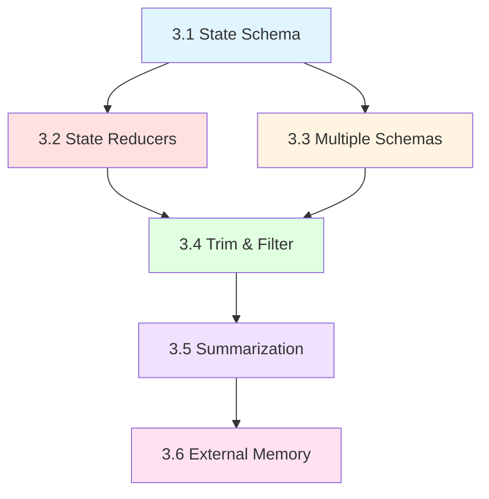

# Module-3 本章介绍：精通 LangGraph 状态管理

> **来自图灵奖获得者的寄语**
>
> 在计算机科学的漫长历史中,状态管理一直是构建复杂系统的核心挑战。从图灵机的纸带状态,到现代分布式系统的全局状态,如何优雅地管理状态决定了系统的可维护性和扩展性。LangGraph 的状态管理机制,继承了函数式编程的纯函数思想和类型系统的安全性保障,同时又针对 AI 应用的特殊需求做了创新性设计。
>
> 本章将带你深入理解 LangGraph 状态管理的六大核心技术:从基础的 State Schema 设计,到高级的 Reducer 函数;从单一状态到多状态模式;从简单的消息过滤到智能的对话摘要;最后到外部数据库的持久化存储。这些技术不是孤立的,而是一个完整的知识体系,它们相互支撑,共同构建起 LangGraph 强大的状态管理能力。
>
> 记住:优秀的 AI 应用不仅需要强大的模型,更需要精巧的状态设计。掌握本章的知识,你将能够构建真正具有"记忆"的智能系统。
>
> *— 向所有追求卓越的开发者致敬*

---

## 📚 本章概览

### 学习目标

完成本章学习后,你将能够:

1. **设计优雅的状态架构**
   - 掌握 TypedDict、Dataclass、Pydantic 三种状态定义方式
   - 理解 Channel 概念和节点通信机制
   - 设计最小化、单一职责的状态结构

2. **运用 Reducer 解决并发冲突**
   - 理解并行节点的状态冲突问题
   - 使用 operator.add 和自定义 Reducer
   - 掌握 add_messages 的高级功能(追加、修改、删除)

3. **构建灵活的多状态系统**
   - 实现私有状态(Private State)隐藏内部数据
   - 使用 Input/Output Schema 定义清晰的接口
   - 理解状态过滤和映射机制

4. **优化长对话的内存管理**
   - 掌握消息过滤(Filtering)和裁剪(Trimming)技术
   - 使用 RemoveMessage 删除旧消息
   - 基于 Token 数量智能控制成本

5. **实现智能对话摘要**
   - 使用 LLM 生成对话摘要压缩历史
   - 实现增量摘要机制
   - 平衡记忆完整性与 Token 成本

6. **集成外部数据库持久化**
   - 使用 SqliteSaver 实现跨会话记忆
   - 理解 Checkpointer 和 Thread 机制
   - 设计生产级的状态存储方案

### 本章架构图

```
Module-3: 状态管理深度解析
│
├─ 3.1 State Schema (状态模式) ⭐⭐⭐
│   ├─ TypedDict: 简洁高效
│   ├─ Dataclass: 功能丰富
│   ├─ Pydantic: 运行时验证
│   └─ 最佳实践: 最小化、类型明确、分组
│
├─ 3.2 State Reducers (状态归约器) ⭐⭐⭐⭐
│   ├─ 问题: 并行节点冲突
│   ├─ 解决: operator.add / 自定义 Reducer
│   ├─ add_messages: 追加、修改、删除
│   └─ 应用: 并行任务结果聚合
│
├─ 3.3 Multiple Schemas (多状态模式) ⭐⭐⭐
│   ├─ Private State: 隐藏内部数据
│   ├─ Input Schema: 限定输入接口
│   ├─ Output Schema: 过滤输出字段
│   └─ 应用: API 服务、安全系统
│
├─ 3.4 Trim & Filter Messages (消息管理) ⭐⭐⭐
│   ├─ RemoveMessage: 删除旧消息
│   ├─ 消息过滤: 保留最近 N 条
│   ├─ Token 裁剪: 精确控制成本
│   └─ 应用: 长期对话优化
│
├─ 3.5 Chatbot Summarization (对话摘要) ⭐⭐⭐⭐
│   ├─ 摘要生成: 使用 LLM 压缩历史
│   ├─ 增量摘要: 持续更新机制
│   ├─ 消息修剪: 保留摘要+最新消息
│   └─ 应用: 支持超长对话
│
└─ 3.6 External Memory (外部存储) ⭐⭐⭐⭐⭐
    ├─ Checkpointer: 状态持久化
    ├─ SqliteSaver: 轻量级数据库
    ├─ Thread: 多用户隔离
    └─ 应用: 生产级聊天机器人
```

### 知识依赖关系



**学习路径说明:**
- 3.1 是基础,必须先掌握
- 3.2 和 3.3 可以并行学习
- 3.4、3.5、3.6 建议按顺序学习,层层递进

---

## 🎯 核心概念预览

### 1. State Schema: 数据的"契约"

在 LangGraph 中,State Schema 定义了图中数据的结构和类型,就像建筑的蓝图一样。

**核心问题:** 如何定义既灵活又安全的状态结构?

**三种方式对比:**

| 方式 | 语法 | 运行时验证 | 适用场景 |
|------|------|-----------|---------|
| **TypedDict** | `class State(TypedDict): name: str` | ❌ | 简单快速开发 |
| **Dataclass** | `@dataclass class State: name: str` | ❌ | 需要默认值/方法 |
| **Pydantic** | `class State(BaseModel): name: str` | ✅ | 需要严格验证 |

**实战示例:**

```python
# TypedDict - 最常用
from typing_extensions import TypedDict

class State(TypedDict):
    name: str
    mood: Literal["happy", "sad"]

# Pydantic - 最安全
from pydantic import BaseModel, field_validator

class State(BaseModel):
    name: str
    mood: str

    @field_validator('mood')
    @classmethod
    def validate_mood(cls, v):
        if v not in ["happy", "sad"]:
            raise ValueError("Invalid mood")
        return v
```

**关键洞察:**
- TypedDict 性能最优(无运行时开销)
- Pydantic 安全性最高(自动验证)
- 选择取决于项目规模和安全需求

---

### 2. State Reducers: 并发的"和平使者"

当多个并行节点同时更新同一个状态字段时,如何避免冲突?这就是 Reducer 要解决的问题。

**核心问题:** 并行节点返回不同的值,应该保留哪个?

**问题演示:**

```python
# ❌ 冲突场景
class State(TypedDict):
    foo: int

def node_1(state):
    return {"foo": state['foo'] + 1}

def node_2(state):
    return {"foo": state['foo'] + 1}

# 并行执行:
# node_1 返回 {"foo": 3}
# node_2 也返回 {"foo": 3}
# 哪个是正确的? → InvalidUpdateError!
```

**解决方案: Reducer**

```python
from operator import add
from typing import Annotated

class State(TypedDict):
    foo: Annotated[list[int], add]  # ⭐ 使用 Reducer

def node_1(state):
    return {"foo": [state['foo'][-1] + 1]}

def node_2(state):
    return {"foo": [state['foo'][-1] + 1]}

# 并行执行:
# node_1 返回 [3]
# node_2 返回 [3]
# operator.add 合并: [3, 3] ✅ 成功!
```

**Reducer 机制详解:**

```python
Annotated[类型, Reducer函数]
#         ^^^^   ^^^^^^^^^^^^
#         基础类型  合并策略

# 内置 Reducer:
operator.add        # 列表拼接: [1,2] + [3] = [1,2,3]
add_messages        # 消息管理: 追加/修改/删除
max, min            # 数值聚合: 取最大/最小值

# 自定义 Reducer:
def unique_add(left: list, right: list) -> list:
    """去重后追加"""
    return list(set(left + right))
```

**关键洞察:**
- Reducer 定义了状态"合并"的逻辑
- 解决并行节点的状态冲突
- `add_messages` 是最强大的内置 Reducer

---

### 3. Multiple Schemas: 状态的"可见性控制"

并非所有状态都应该对外可见。Multiple Schemas 允许我们定义私有状态、限定输入输出。

**核心问题:** 如何隐藏内部计算细节,只暴露必要的接口?

**三层架构:**

```python
# 第一层: 输入模式 - 用户必须提供
class InputState(TypedDict):
    question: str

# 第二层: 内部模式 - 完整的内部状态
class InternalState(TypedDict):
    question: str
    answer: str
    notes: str          # 私有: 内部思考过程
    api_calls: int      # 私有: 统计信息

# 第三层: 输出模式 - 返回给用户
class OutputState(TypedDict):
    answer: str
```

**实现方式:**

```python
# 构建图时指定
graph = StateGraph(
    InternalState,              # 内部使用完整状态
    input_schema=InputState,    # 限定输入
    output_schema=OutputState   # 过滤输出
)

# 节点使用类型注解控制可见性
def thinking_node(state: InputState):
    # 只能访问 question
    return {"answer": "...", "notes": "..."}  # 返回内部字段

def answer_node(state: InternalState) -> OutputState:
    # 输入: 可以访问所有字段
    # 输出: 只返回 OutputState 定义的字段
    return {"answer": state["answer"]}
```

**执行流程:**

```
用户输入: {"question": "hi"}
    ↓
内部状态: {"question": "hi", "answer": "bye", "notes": "..."}
    ↓
用户输出: {"answer": "bye"}  ← notes 被过滤
```

**关键洞察:**
- 保护内部实现细节
- 提供清晰的 API 接口
- 增强系统安全性

---

### 4. Trim & Filter: 内存的"断舍离"

长对话会导致消息历史无限增长,我们需要智能地管理这些消息。

**核心问题:** 如何在保持上下文连贯性的同时,控制 Token 成本?

**三种技术对比:**

| 技术 | 原理 | 修改状态 | Token 控制 | 适用场景 |
|------|------|---------|-----------|---------|
| **RemoveMessage** | 永久删除 | ✅ | 间接 | 确定不需要的历史 |
| **消息过滤** | 传递子集 | ❌ | 按数量 | 简单的"最近 N 条" |
| **Token 裁剪** | 智能截断 | ❌ | 按 Token | 需要精确成本控制 |

**实战对比:**

```python
# 方案 1: RemoveMessage - 永久删除
from langchain_core.messages import RemoveMessage

def filter_node(state):
    # 删除除最后 2 条外的所有消息
    delete = [RemoveMessage(id=m.id) for m in state["messages"][:-2]]
    return {"messages": delete}

# 方案 2: 消息过滤 - 不修改状态
def chat_node(state):
    # 只传递最后 5 条给 LLM
    recent = state["messages"][-5:]
    return {"messages": [llm.invoke(recent)]}

# 方案 3: Token 裁剪 - 精确控制
from langchain_core.messages import trim_messages

def chat_node(state):
    # 裁剪到最多 1000 tokens
    trimmed = trim_messages(
        state["messages"],
        max_tokens=1000,
        token_counter=llm
    )
    return {"messages": [llm.invoke(trimmed)]}
```

**Token 成本对比:**

假设 10 轮对话,每轮 100 tokens:

| 方案 | Token 使用 | 成本节省 |
|------|-----------|---------|
| 无裁剪 | 1000 tokens | - |
| 过滤(5条) | ~500 tokens | 50% |
| 裁剪(200) | 200 tokens | 80% |

**关键洞察:**
- 过滤简单但粗糙
- 裁剪精确但复杂
- 生产环境推荐 Token 裁剪

---

### 5. Summarization: 记忆的"压缩算法"

将长对话历史压缩成简洁的摘要,是支持超长对话的关键技术。

**核心问题:** 如何在压缩历史的同时,保留关键信息?

**工作机制:**

```
第 1-6 轮: 完整保留所有消息
    ↓
第 7 轮: 触发摘要
    ├─ 生成摘要: "用户叫 Lance,喜欢 49ers..."
    ├─ 删除旧消息: 只保留最后 2 条
    └─ 状态更新: summary + 最新 2 条消息
    ↓
第 8 轮: LLM 看到的上下文
    ├─ SystemMessage("摘要: 用户叫 Lance...")
    └─ 最新的 2 条消息
```

**实现核心代码:**

```python
from langchain_core.messages import RemoveMessage

def summarize_conversation(state: State):
    # 1. 获取现有摘要
    summary = state.get("summary", "")

    # 2. 创建摘要提示
    if summary:
        # 增量摘要: 扩展现有摘要
        prompt = f"Current summary: {summary}\n\nExtend with new messages:"
    else:
        # 首次摘要: 创建新摘要
        prompt = "Create a summary of the conversation:"

    # 3. 调用 LLM 生成摘要
    messages = state["messages"] + [HumanMessage(prompt)]
    response = model.invoke(messages)

    # 4. 删除旧消息,只保留最后 2 条
    delete = [RemoveMessage(id=m.id) for m in state["messages"][:-2]]

    return {
        "summary": response.content,
        "messages": delete
    }
```

**增量摘要策略:**

```python
# 第 1 次摘要 (7 条消息)
summary_1 = "Lance 介绍自己,喜欢 49ers..."

# 第 2 次摘要 (又积累了 5 条新消息)
# 提示词: "Current summary: {summary_1}\n\nExtend with new messages..."
summary_2 = "Lance 介绍自己,喜欢 49ers 和 Nick Bosa,询问了防守球员薪资..."
```

**Token 压缩效果:**

```
原始: 100 条消息 × 平均 50 tokens = 5000 tokens
    ↓ 摘要
压缩: 摘要 150 tokens + 最新 2 条 100 tokens = 250 tokens
节省: 95% 的 Token 成本!
```

**关键洞察:**
- 使用 LLM 生成摘要(质量高)
- 增量更新避免重复摘要
- 极大降低长对话的 Token 成本

---

### 6. External Memory: 持久化的"记忆银行"

将对话状态保存到外部数据库,实现跨会话、跨重启的持久化记忆。

**核心问题:** 如何让聊天机器人"记住"所有对话,即使程序重启?

**Checkpointer 机制:**

```
用户消息 → 图执行 → 状态更新 → Checkpointer 保存到数据库
                                      ↓
重启后 ← 状态加载 ← Checkpointer 从数据库读取
```

**存储方案对比:**

| Checkpointer | 存储位置 | 持久化 | 适用场景 |
|--------------|---------|--------|---------|
| `MemorySaver` | 进程内存 | ❌ | 开发测试 |
| `SqliteSaver` | SQLite 文件 | ✅ | 中小应用 |
| `PostgresSaver` | PostgreSQL | ✅ | 企业应用 |

**实战代码:**

```python
from langgraph.checkpoint.sqlite import SqliteSaver
import sqlite3

# 1. 创建 SQLite 连接
conn = sqlite3.connect("chatbot.db", check_same_thread=False)

# 2. 创建 Checkpointer
memory = SqliteSaver(conn)

# 3. 编译图时指定
graph = workflow.compile(checkpointer=memory)

# 4. 使用 Thread ID 隔离不同对话
config = {"configurable": {"thread_id": "user_123"}}

# 5. 执行对话 - 自动保存
output = graph.invoke({"messages": [HumanMessage("hi")]}, config)

# 6. 重启后恢复 - 对话历史仍然存在!
output = graph.invoke({"messages": [HumanMessage("继续")]}, config)
```

**Thread 多用户隔离:**

```python
# 用户 A 的对话
config_a = {"configurable": {"thread_id": "alice"}}
graph.invoke({"messages": [HumanMessage("我是 Alice")]}, config_a)

# 用户 B 的对话
config_b = {"configurable": {"thread_id": "bob"}}
graph.invoke({"messages": [HumanMessage("我是 Bob")]}, config_b)

# 两个对话完全独立,互不干扰
```

**数据库结构(简化):**

```sql
CREATE TABLE checkpoints (
    thread_id TEXT,      -- 对话线程 ID
    checkpoint_id TEXT,  -- 检查点 ID (唯一)
    state BLOB,          -- 序列化的状态
    timestamp DATETIME   -- 时间戳
);
```

**关键洞察:**
- Checkpointer 自动管理状态持久化
- Thread ID 实现多用户隔离
- 支持状态查询和时间旅行(回溯历史)

---

## 🗺️ 学习路线图

### 初学者路径 (建议用时: 2-3 天)

**Day 1: 状态基础**
- ✅ 学习 3.1 State Schema
  - 掌握 TypedDict 的基本用法
  - 理解 Channel 概念
  - 完成简单状态定义练习

**Day 2: 并发与隔离**
- ✅ 学习 3.2 State Reducers
  - 理解并行节点冲突问题
  - 掌握 operator.add 的使用
- ✅ 学习 3.3 Multiple Schemas
  - 理解私有状态的作用
  - 掌握 Input/Output Schema

**Day 3: 内存管理**
- ✅ 学习 3.4 Trim & Filter
  - 掌握三种消息管理技术
  - 了解 Token 成本控制
- ✅ 快速浏览 3.5 和 3.6
  - 了解摘要和持久化的概念

### 进阶者路径 (建议用时: 3-5 天)

**阶段 1: 深入理解 (1-2 天)**
- 深入学习 3.1-3.3
- 掌握 Pydantic 的高级验证
- 理解 add_messages 的三大功能
- 设计复杂的多状态系统

**阶段 2: 内存优化 (1-2 天)**
- 精通 3.4 消息管理
  - 实现自定义 Reducer
  - 优化 Token 使用
- 精通 3.5 对话摘要
  - 实现增量摘要
  - 平衡记忆与成本

**阶段 3: 生产部署 (1 天)**
- 精通 3.6 外部存储
  - 掌握 SqliteSaver 的使用
  - 理解 Thread 和 Checkpointer
  - 设计多用户系统

### 专家路径 (建议用时: 5-7 天)

**深度实践项目:**

1. **项目 1: 智能客服机器人** (2-3 天)
   - 使用多状态模式设计清晰接口
   - 实现智能消息摘要
   - 集成 PostgreSQL 持久化
   - 支持多租户隔离

2. **项目 2: 长期记忆助手** (2-3 天)
   - 设计分层摘要系统
   - 实现主题驱动的记忆组织
   - 优化 Token 成本到最低
   - 支持跨设备同步

3. **项目 3: 企业级对话平台** (1-2 天)
   - 设计可扩展的状态架构
   - 实现自定义 Checkpointer
   - 集成监控和分析
   - 优化高并发性能

---

## 💡 学习建议

### 1. 动手实践为主

**推荐学习方法:**

```python
# ❌ 错误: 只看不练
read_tutorial()  # 理解 50%

# ✅ 正确: 边学边做
read_tutorial()
practice_code()   # 理解 80%
build_project()   # 理解 95%
teach_others()    # 理解 100%
```

**实践建议:**
- 每学完一节,立即编写代码验证
- 修改示例代码,观察结果变化
- 遇到错误,先自己调试,再查文档
- 每个概念至少用 3 种不同方式实现

### 2. 建立知识连接

**概念关系图:**

```
State Schema (数据结构)
    ↓ 用于定义
Reducer (合并策略)
    ↓ 支持
并行节点 (并发执行)
    ↓ 产生
状态更新 (数据变化)
    ↓ 需要
消息管理 (内存优化)
    ↓ 通过
摘要/裁剪 (压缩历史)
    ↓ 保存到
外部存储 (持久化)
```

**学习技巧:**
- 每学一个新概念,思考与之前知识的关系
- 绘制思维导图连接知识点
- 用类比帮助理解(如 Reducer = 购物车合并策略)
- 定期回顾,巩固记忆

### 3. 循序渐进

**学习阶段:**

**阶段 1: 理解概念 (What)**
- 这个技术是什么?
- 它解决什么问题?
- 基本语法是什么?

**阶段 2: 掌握原理 (Why)**
- 为什么需要这个技术?
- 它的工作原理是什么?
- 有哪些替代方案?

**阶段 3: 应用实践 (How)**
- 如何在项目中使用?
- 常见陷阱是什么?
- 最佳实践是什么?

**阶段 4: 融会贯通 (When)**
- 什么场景使用这个技术?
- 如何与其他技术组合?
- 如何优化性能?

### 4. 错误是最好的老师

**常见错误及解决:**

```python
# 错误 1: 忘记使用 Reducer
class State(TypedDict):
    results: list  # ❌ 并行节点会冲突

# 解决:
class State(TypedDict):
    results: Annotated[list, operator.add]  # ✅

# 错误 2: 过度设计状态
class State(TypedDict):
    data: str
    data_length: int  # ❌ 冗余
    data_upper: str   # ❌ 冗余

# 解决:
class State(TypedDict):
    data: str  # ✅ 最小化

# 错误 3: 忘记状态持久化
graph = workflow.compile()  # ❌ 无记忆

# 解决:
graph = workflow.compile(checkpointer=memory)  # ✅
```

### 5. 构建知识体系

**学习笔记模板:**

```markdown
## [技术名称]

### 核心问题
- 解决什么问题?
- 为什么重要?

### 基本用法
```python
# 最小可用示例
```

### 工作原理
- 底层机制
- 执行流程

### 最佳实践
- 适用场景
- 注意事项
- 常见陷阱

### 实战案例
- 实际项目示例
- 性能优化技巧

### 相关知识
- 依赖的前置知识
- 相关的其他技术
```

---

## 🎯 本章亮点

### 1. 系统性

本章不是孤立的知识点堆砌,而是构建了完整的状态管理知识体系:

```
基础层: State Schema
    ↓
并发层: Reducer
    ↓
安全层: Multiple Schemas
    ↓
优化层: Trim & Filter
    ↓
智能层: Summarization
    ↓
持久层: External Memory
```

### 2. 实战性

每个技术都配有:
- ✅ 真实的问题场景
- ✅ 完整的代码示例
- ✅ 详细的执行流程
- ✅ 生产级的最佳实践

### 3. 渐进性

从简单到复杂,从理论到实践:
- 3.1: 基础概念
- 3.2-3.3: 进阶技术
- 3.4-3.5: 高级优化
- 3.6: 生产部署

### 4. 对比性

每个技术都提供多种方案对比:
- TypedDict vs Dataclass vs Pydantic
- RemoveMessage vs Filter vs Trim
- MemorySaver vs SqliteSaver vs PostgresSaver

---

## 📊 知识点速查表

### State Schema 速查

| 特性 | TypedDict | Dataclass | Pydantic |
|------|-----------|-----------|----------|
| 语法复杂度 | ⭐ 简单 | ⭐⭐ 中等 | ⭐⭐ 中等 |
| 访问方式 | `state["key"]` | `state.key` | `state.key` |
| 运行时验证 | ❌ | ❌ | ✅ |
| 性能 | 最快 | 快 | 稍慢 |
| 推荐场景 | 简单项目 | 需要默认值 | 需要验证 |

### Reducer 速查

| Reducer | 作用 | 示例 |
|---------|------|------|
| `operator.add` | 列表拼接 | `[1,2] + [3] = [1,2,3]` |
| `add_messages` | 消息管理 | 追加/修改/删除 |
| `max` / `min` | 数值聚合 | 取最大/最小值 |
| 自定义 | 任意逻辑 | 去重、限制大小等 |

### 消息管理速查

| 技术 | 修改状态 | Token 控制 | 复杂度 | 推荐场景 |
|------|---------|-----------|--------|---------|
| RemoveMessage | ✅ | 间接 | 低 | 确定不需要历史 |
| 消息过滤 | ❌ | 按数量 | 低 | 简单规则 |
| Token 裁剪 | ❌ | 按 Token | 中 | 精确成本控制 |
| 对话摘要 | ✅ | 极高 | 高 | 超长对话 |

### Checkpointer 速查

| 类型 | 持久化 | 性能 | 适用场景 |
|------|--------|------|---------|
| MemorySaver | ❌ | 最快 | 开发测试 |
| SqliteSaver | ✅ | 快 | 中小应用 |
| PostgresSaver | ✅ | 中 | 企业应用 |

---

## 🚀 开始学习吧!

现在你已经了解了本章的全貌,是时候开始真正的学习之旅了!

**推荐学习顺序:**

1. **从 3.1 开始**
   - 理解 State Schema 的三种定义方式
   - 完成基础练习

2. **深入 3.2**
   - 理解并发冲突问题
   - 掌握 Reducer 机制

3. **探索 3.3-3.6**
   - 根据你的项目需求选择重点
   - 每个技术都值得深入学习

**学习检查清单:**

- [ ] 能独立设计 State Schema
- [ ] 理解 Reducer 的工作原理
- [ ] 能实现私有状态和多状态模式
- [ ] 掌握消息管理的三种技术
- [ ] 能实现对话摘要系统
- [ ] 能配置外部数据库持久化
- [ ] 能构建完整的聊天机器人

**记住:**
> 状态管理不是 LangGraph 的一个功能,而是 LangGraph 的核心。掌握本章内容,你将真正理解 LangGraph 的设计哲学,构建出优雅、高效、可维护的 AI 应用。

**祝你学习愉快! 让我们开始吧! 🎉**

---

## 附录: 术语表

| 术语 | 英文 | 含义 |
|------|------|------|
| 状态模式 | State Schema | 定义状态结构和类型的规范 |
| 通道 | Channel | 状态中的每个字段 |
| 归约器 | Reducer | 定义状态合并策略的函数 |
| 私有状态 | Private State | 内部使用但不对外暴露的状态 |
| 检查点 | Checkpoint | 状态的快照 |
| 线程 | Thread | 独立的对话会话 |
| 消息裁剪 | Message Trimming | 基于 Token 数量智能截断 |
| 对话摘要 | Summarization | 使用 LLM 压缩历史 |

---

**版权声明:** 本教程由 LangGraph 中文学院精心编写,旨在帮助开发者深入理解 LangGraph 状态管理机制。

**反馈渠道:** 如有任何问题或建议,欢迎访问 [问题反馈](http://localhost:5173/feedback.html) 页面。
