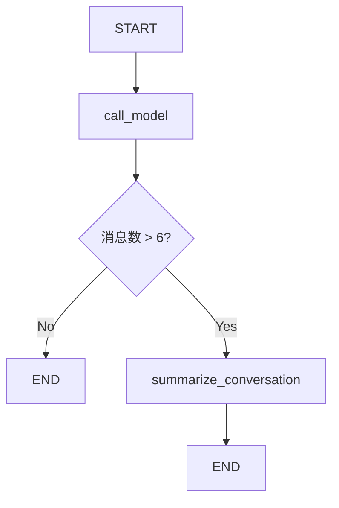

# LangGraph Chatbot with Message Summarization 详细解读

>  网站使用说明
> - 本网站可以免登陆运行 Python 代码
> - Python 代码可以编辑并临时保存，但不会永久保存，网页刷新后会自动还原
> - 对网站的使用有任何问题，可以到 [问题反馈](http://localhost:5173/feedback.html) （按钮在每个页面的右下角）免登录进行评论
> - 运行 `LangGraph/LangChain`代码，需要用户输入自己的 [API Key](http://localhost:5173/python-run.html)
> - 重要声明：本网站不会保存用户的 API Key 数据，请放心输入

## 📚 概述

本文档详细解读 LangGraph 中的 **对话摘要（Message Summarization）** 技术。这是一种智能的内存管理方案，通过 LLM 生成对话摘要来压缩历史消息，从而实现长期对话而不会产生高昂的 token 成本和延迟问题。

---

## 📚 术语表

| 术语名称 | LangGraph 定义和解读 | Python 定义和说明 | 重要程度 |
|---------|---------------------|------------------|---------|
| **对话摘要 (Summarization)** | 使用 LLM 将长对话历史压缩为简短摘要文本的技术 | 定期调用 LLM 生成摘要，保留关键信息，删除旧消息 | ⭐⭐⭐⭐⭐ |
| **MessagesState** | LangGraph 内置状态基类，包含 messages 字段和 add_messages reducer | TypedDict 类，可继承并添加 summary 等自定义字段 | ⭐⭐⭐⭐⭐ |
| **RemoveMessage** | 用于从状态中永久删除指定消息的特殊消息类型 | 格式 `RemoveMessage(id=message.id)`，配合 add_messages 删除旧消息 | ⭐⭐⭐⭐⭐ |
| **Checkpointer** | LangGraph 负责保存和加载图状态的组件，实现持久化 | 接口类，MemorySaver 是内存实现，SqliteSaver 是数据库实现 | ⭐⭐⭐⭐⭐ |
| **MemorySaver** | 将状态保存在进程内存中的 Checkpointer 实现，重启后丢失 | `from langgraph.checkpoint.memory import MemorySaver` | ⭐⭐⭐⭐ |
| **Thread** | LangGraph 中用于隔离不同对话会话的概念，类似 Slack 频道 | 通过 `config = {"configurable": {"thread_id": "1"}}` 指定 | ⭐⭐⭐⭐⭐ |
| **StateSnapshot** | 图在某个时间点的完整状态快照，包含 values、config、metadata | `graph.get_state(config)` 返回的对象，可访问状态和元数据 | ⭐⭐⭐⭐ |
| **增量摘要** | 基于已有摘要扩展新内容，而不是重新摘要全部对话 | 提示词包含旧摘要："Extend the summary by taking into account..." | ⭐⭐⭐⭐ |
| **条件边** | 根据状态决定下一步执行哪个节点的边，用于控制摘要触发 | `add_conditional_edges("node", should_continue)` 返回节点名或 END | ⭐⭐⭐⭐⭐ |
| **消息裁剪** | 删除旧消息但保留最近 N 条，通过列表切片实现 | `messages[:-2]` 删除除最后2条外的所有消息 | ⭐⭐⭐⭐⭐ |

---

## 🎯 核心概念

### 为什么需要对话摘要？

在构建聊天机器人时，我们面临一个根本性的矛盾：

1. **长期记忆需求**：用户期望机器人记住整个对话历史
2. **token 限制**：LLM 有上下文窗口限制
3. **成本与延迟**：发送大量历史消息会增加成本和响应时间

### 三种消息管理策略对比

| 策略 | 优点 | 缺点 | 适用场景 |
|------|------|------|---------|
| **完整保留** | 信息完整 | token 成本高、可能超限 | 短对话 |
| **裁剪/过滤** | 简单高效 | 丢失历史信息 | 简单对话 |
| **智能摘要** | 保留关键信息、控制成本 | 实现复杂度高 | 长期对话 |

**本教程的解决方案：** 使用 LLM 生成对话摘要，保留压缩的历史信息，支持长期对话。

---

## 🏗️ 系统架构

### 核心机制

```
用户消息流
    ↓
检查消息数量
    ↓
├─ ≤6 条消息 → 直接使用历史
│      ↓
│  [call_model] 生成回复
│      ↓
│    END
│
└─ >6 条消息 → 触发摘要
       ↓
   [summarize_conversation] 生成/更新摘要
       ↓
   保留最新 2 条消息 + 摘要
       ↓
     END
```

### 工作流程图



---

## 🔧 代码实现详解

### 1. 环境设置

```python
%%capture --no-stderr
%pip install --quiet -U langchain_core langgraph langchain_openai
```

**说明：**
- `%%capture --no-stderr`：Jupyter 魔法命令，隐藏安装输出（但保留错误）
- 安装核心依赖：LangChain、LangGraph、OpenAI 集成

```python
import os, getpass

def _set_env(var: str):
    if not os.environ.get(var):
        os.environ[var] = getpass.getpass(f"{var}: ")

_set_env("OPENAI_API_KEY")
```

**Python 知识点：环境变量管理**

- `os.environ.get(var)`：获取环境变量，不存在返回 `None`
- `getpass.getpass()`：安全地输入密码（不显示明文）
- 这是生产环境的最佳实践：敏感信息不硬编码

---

### 2. LangSmith 追踪设置

```python
_set_env("LANGSMITH_API_KEY")
os.environ["LANGSMITH_TRACING"] = "true"
os.environ["LANGSMITH_PROJECT"] = "langchain-academy"
```

**LangSmith 作用：**
- 追踪每次 LLM 调用
- 可视化执行流程
- 调试和性能分析

---

### 3. 初始化模型

```python
from langchain_openai import ChatOpenAI
model = ChatOpenAI(model="gpt-5-nano", temperature=0)
```

**参数说明：**
- `model="gpt-5-nano"`：使用 GPT-4 Optimized 模型
- `temperature=0`：确定性输出（适合需要一致性的任务）

---

### 4. 定义状态（State）⭐

这是整个系统的核心！

```python
from langgraph.graph import MessagesState

class State(MessagesState):
    summary: str
```

**LangGraph 知识点：MessagesState**

`MessagesState` 是 LangGraph 提供的内置状态基类：

```python
class MessagesState(TypedDict):
    messages: Annotated[list[AnyMessage], add_messages]
```

**关键特性：**

1. **自动消息管理**：`messages` 字段已配置 `add_messages` reducer
2. **智能合并**：新消息自动追加到历史
3. **ID 管理**：每条消息有唯一 ID，支持删除/更新

**我们的扩展：**

```python
class State(MessagesState):
    summary: str  # 新增摘要字段
```

现在状态包含：
- `messages`：消息列表（继承自 MessagesState）
- `summary`：对话摘要（新增）

**Python 知识点：类继承**

```python
class State(MessagesState):
    # 继承 MessagesState 的所有字段和方法
    summary: str  # 添加新字段
```

这是 Python 的单继承模式，`State` 拥有：
- 父类的 `messages` 字段
- 自己的 `summary` 字段

---

### 5. 对话节点：call_model ⭐

```python
from langchain_core.messages import SystemMessage, HumanMessage, RemoveMessage

def call_model(state: State):
    # 获取摘要（如果存在）
    summary = state.get("summary", "")

    # 如果有摘要，添加到系统消息
    if summary:
        # 创建包含摘要的系统消息
        system_message = f"Summary of conversation earlier: {summary}"

        # 将摘要追加到消息历史前面
        messages = [SystemMessage(content=system_message)] + state["messages"]
    else:
        # 没有摘要，直接使用消息历史
        messages = state["messages"]

    # 调用 LLM
    response = model.invoke(messages)
    return {"messages": response}
```

**代码解析：**

#### 步骤 1：检查是否有摘要

```python
summary = state.get("summary", "")
```

- `state.get("summary", "")`：安全获取摘要，不存在返回空字符串
- 避免 `KeyError` 异常

#### 步骤 2：构建消息列表

**情况 A：有摘要**
```python
messages = [SystemMessage(content=system_message)] + state["messages"]
```

消息结构：
```
[
    SystemMessage("Summary of conversation earlier: 用户叫 Lance，喜欢 49ers..."),
    HumanMessage("最新用户消息"),
    ...
]
```

**情况 B：无摘要**
```python
messages = state["messages"]
```

直接使用原始历史。

#### 步骤 3：调用模型并返回

```python
response = model.invoke(messages)
return {"messages": response}
```

- `model.invoke(messages)`：发送消息到 LLM
- `return {"messages": response}`：返回的字典会更新 `State.messages`

**LangGraph 知识点：状态更新机制**

节点返回的字典会自动合并到状态：

```python
# 当前 State.messages = [msg1, msg2]
return {"messages": response}
# 更新后 State.messages = [msg1, msg2, response]
```

这是因为 `add_messages` reducer 会将新消息追加到列表。

---

### 6. 摘要节点：summarize_conversation ⭐⭐⭐

这是本教程的核心！

```python
def summarize_conversation(state: State):
    # 第一步：获取现有摘要
    summary = state.get("summary", "")

    # 第二步：创建摘要提示
    if summary:
        # 已有摘要 → 增量更新
        summary_message = (
            f"This is summary of the conversation to date: {summary}\n\n"
            "Extend the summary by taking into account the new messages above:"
        )
    else:
        # 无摘要 → 首次创建
        summary_message = "Create a summary of the conversation above:"

    # 第三步：生成摘要
    messages = state["messages"] + [HumanMessage(content=summary_message)]
    response = model.invoke(messages)

    # 第四步：删除旧消息，只保留最新 2 条
    delete_messages = [RemoveMessage(id=m.id) for m in state["messages"][:-2]]

    return {"summary": response.content, "messages": delete_messages}
```

#### 详细解析

**步骤 1：检查现有摘要**

```python
summary = state.get("summary", "")
```

判断是首次摘要还是更新摘要。

**步骤 2：构建摘要提示**

两种提示策略：

1. **首次摘要**（无现有摘要）：
   ```
   "Create a summary of the conversation above:"
   ```

2. **增量摘要**（有现有摘要）：
   ```
   "This is summary of the conversation to date: {旧摘要}

   Extend the summary by taking into account the new messages above:"
   ```

**为什么使用增量摘要？**
- 保留历史信息的连续性
- 避免重复摘要整个对话
- 只需处理新增消息

**步骤 3：调用 LLM 生成摘要**

```python
messages = state["messages"] + [HumanMessage(content=summary_message)]
response = model.invoke(messages)
```

消息结构：
```
[
    ...历史消息...,
    HumanMessage("Create a summary of the conversation above:")
]
```

LLM 会基于所有历史生成摘要。

**步骤 4：删除旧消息** ⭐

```python
delete_messages = [RemoveMessage(id=m.id) for m in state["messages"][:-2]]
```

**关键知识点：RemoveMessage**

`RemoveMessage` 是 LangGraph 提供的特殊消息类型，用于从状态中删除消息：

```python
RemoveMessage(id=message_id)
```

**代码解析：**

```python
state["messages"][:-2]  # 除了最后 2 条消息外的所有消息
[RemoveMessage(id=m.id) for m in ...]  # 为每条消息创建删除标记
```

**执行效果：**

假设有 8 条消息：
```
[msg1, msg2, msg3, msg4, msg5, msg6, msg7, msg8]
                                     ^^^^^ ^^^^^ 保留最新 2 条
^^^^^^ ^^^^^^ ^^^^^^ ^^^^^^ ^^^^^^            删除这 6 条
```

删除后：
```
[msg7, msg8]  # 只保留最新 2 条
```

**为什么保留 2 条？**
- 最新的用户消息
- 最新的 AI 回复
- 确保对话连续性

**步骤 5：返回更新**

```python
return {
    "summary": response.content,    # 更新摘要
    "messages": delete_messages     # 删除旧消息
}
```

**LangGraph 知识点：同时更新多个字段**

一个节点可以返回多个字段的更新：
- `summary`：存储新的摘要文本
- `messages`：应用删除操作（`add_messages` reducer 会处理 `RemoveMessage`）

---

### 7. 条件边：should_continue

```python
from langgraph.graph import END
from typing_extensions import Literal

def should_continue(state: State) -> Literal["summarize_conversation", END]:
    """返回下一个要执行的节点"""

    messages = state["messages"]

    # 如果消息超过 6 条，进行摘要
    if len(messages) > 6:
        return "summarize_conversation"

    # 否则结束
    return END
```

**Python 知识点：Literal 类型**

```python
from typing_extensions import Literal

def should_continue(state: State) -> Literal["summarize_conversation", END]:
    ...
```

`Literal` 表示返回值只能是指定的字面量：
- `"summarize_conversation"`：字符串字面量
- `END`：LangGraph 的特殊常量

**作用：**
- 类型安全：IDE 会检查返回值
- 自动补全：IDE 会提示可能的返回值

**LangGraph 知识点：条件边返回值**

条件边函数的返回值决定下一个节点：
- 返回节点名称 → 跳转到该节点
- 返回 `END` → 结束图执行

---

### 8. 添加内存（Memory）⭐⭐⭐

**核心问题：** 默认情况下，LangGraph 的状态是**临时的**，每次执行都是全新的。

**解决方案：** 使用 **Checkpointer**（检查点机制）持久化状态。

```python
from langgraph.checkpoint.memory import MemorySaver

memory = MemorySaver()
```

**MemorySaver 作用：**
- 内存中的键值存储
- 自动保存每一步的状态
- 支持多线程（thread）对话

**LangGraph 知识点：状态持久化**

```python
graph = workflow.compile(checkpointer=memory)
```

**执行流程：**

1. **执行前**：从 checkpointer 加载上次的状态
2. **每个节点后**：自动保存当前状态到 checkpointer
3. **执行后**：状态保留在 checkpointer 中

**为什么重要？**
- 支持长期对话：用户可以随时继续之前的对话
- 中断恢复：即使程序重启，对话历史依然存在
- 多用户隔离：不同 thread_id 的对话互不干扰

---

### 9. 构建图

```python
from IPython.display import Image, display
from langgraph.checkpoint.memory import MemorySaver
from langgraph.graph import StateGraph, START

# 定义图
workflow = StateGraph(State)

# 添加节点
workflow.add_node("conversation", call_model)
workflow.add_node(summarize_conversation)  # 函数名自动作为节点名

# 设置入口
workflow.add_edge(START, "conversation")

# 添加条件边
workflow.add_conditional_edges("conversation", should_continue)

# 摘要后结束
workflow.add_edge("summarize_conversation", END)

# 编译（带内存）
memory = MemorySaver()
graph = workflow.compile(checkpointer=memory)

# 可视化
display(Image(graph.get_graph().draw_mermaid_png()))
```

**图结构分析：**

```
START
  ↓
conversation (call_model)
  ↓
should_continue (条件判断)
  ├─ ≤6 条 → END
  └─ >6 条 → summarize_conversation
              ↓
             END
```

**LangGraph 知识点：节点命名**

```python
workflow.add_node("conversation", call_model)  # 显式命名
workflow.add_node(summarize_conversation)       # 使用函数名
```

两种方式：
1. 提供名称：`add_node(name, func)`
2. 自动命名：`add_node(func)` → 使用函数名作为节点名

---

### 10. 线程（Threads）⭐⭐⭐

**核心概念：** Thread 是一组相关检查点的集合，类似于 Slack 的频道。

```python
# 创建配置，指定线程 ID
config = {"configurable": {"thread_id": "1"}}
```

**Thread 的作用：**

1. **隔离对话**：不同 thread_id 的对话互不影响
2. **状态分组**：同一 thread 内的所有检查点共享历史
3. **多用户支持**：每个用户使用独立的 thread_id

**类比理解：**

| 概念 | LangGraph | Slack |
|------|-----------|-------|
| Thread | thread_id | 频道 |
| Checkpoint | 状态快照 | 消息历史 |
| State | 当前对话状态 | 当前频道内容 |

---

### 11. 执行对话

```python
# 创建线程配置
config = {"configurable": {"thread_id": "1"}}

# 第一轮对话
input_message = HumanMessage(content="hi! I'm Lance")
output = graph.invoke({"messages": [input_message]}, config)
for m in output['messages'][-1:]:
    m.pretty_print()
```

**输出：**
```
================================== Ai Message ==================================

Hello Lance! How can I assist you today?
```

**执行流程：**

1. 检查 thread "1" 是否有历史 → 无
2. 创建新状态：`{"messages": [HumanMessage("hi! I'm Lance")]}`
3. 进入 `conversation` 节点
4. 无摘要，直接调用 LLM
5. 返回 AI 回复
6. 保存状态到 thread "1"

---

```python
# 第二轮对话
input_message = HumanMessage(content="what's my name?")
output = graph.invoke({"messages": [input_message]}, config)
for m in output['messages'][-1:]:
    m.pretty_print()
```

**输出：**
```
================================== Ai Message ==================================

You mentioned that your name is Lance. How can I help you today?
```

**执行流程：**

1. 从 thread "1" 加载历史状态：
   ```
   {"messages": [
       HumanMessage("hi! I'm Lance"),
       AIMessage("Hello Lance!...")
   ]}
   ```
2. 追加新消息：`HumanMessage("what's my name?")`
3. 调用 LLM（包含完整历史）
4. AI 能回忆起名字是 "Lance"
5. 保存更新后的状态

---

```python
# 第三轮对话
input_message = HumanMessage(content="i like the 49ers!")
output = graph.invoke({"messages": [input_message]}, config)
for m in output['messages'][-1:]:
    m.pretty_print()
```

**输出：**
```
================================== Ai Message ==================================

That's great! The San Francisco 49ers have a rich history and a passionate fan base.
Do you have a favorite player or a memorable game that you particularly enjoyed?
```

**当前状态：**
```
messages: [
    HumanMessage("hi! I'm Lance"),
    AIMessage("Hello Lance!..."),
    HumanMessage("what's my name?"),
    AIMessage("You mentioned that your name is Lance..."),
    HumanMessage("i like the 49ers!"),
    AIMessage("That's great! The San Francisco 49ers...")
]
summary: ""  # 还未触发摘要
```

此时有 **6 条消息**，尚未达到触发摘要的阈值（> 6）。

---

### 12. 检查摘要状态

```python
graph.get_state(config).values.get("summary", "")
```

**输出：**
```
''
```

**LangGraph 知识点：get_state API**

```python
state_snapshot = graph.get_state(config)
state_snapshot.values  # 获取当前状态的所有值
```

返回 `StateSnapshot` 对象：
- `values`：当前状态字典
- `next`：下一个要执行的节点
- `config`：配置信息
- `metadata`：元数据

---

### 13. 触发摘要

```python
# 第四轮对话（触发摘要）
input_message = HumanMessage(content="i like Nick Bosa, isn't he the highest paid defensive player?")
output = graph.invoke({"messages": [input_message]}, config)
for m in output['messages'][-1:]:
    m.pretty_print()
```

**输出：**
```
================================== Ai Message ==================================

Yes, as of September 2023, Nick Bosa became the highest-paid defensive player in NFL history.
He signed a five-year contract extension with the San Francisco 49ers worth $170 million,
with $122.5 million guaranteed. Bosa is known for his exceptional skills as a defensive end
and has been a key player for the 49ers.
```

**执行流程：**

1. 加载历史（6 条消息）
2. 追加新消息 → **7 条消息**
3. 进入 `conversation` 节点，生成回复
4. 现在有 **8 条消息** → 触发条件 `len(messages) > 6`
5. `should_continue` 返回 `"summarize_conversation"`
6. 进入 `summarize_conversation` 节点：
   - 生成摘要
   - 删除前 6 条消息
   - 保留最新 2 条
7. 状态更新：
   ```
   messages: [最新 2 条消息]
   summary: "Lance introduced himself and mentioned..."
   ```

---

### 14. 查看生成的摘要

```python
graph.get_state(config).values.get("summary", "")
```

**输出：**
```
'Lance introduced himself and mentioned that he is a fan of the San Francisco 49ers,
specifically highlighting his admiration for Nick Bosa. The conversation noted that
as of September 2023, Nick Bosa became the highest-paid defensive player in NFL history
with a five-year, $170 million contract extension with the 49ers.'
```

**摘要内容分析：**

✅ 包含的信息：
- 用户名字：Lance
- 喜好：49ers 队粉丝
- 喜欢的球员：Nick Bosa
- 事实信息：Nick Bosa 的合同细节

✅ 压缩效果：
- 原始：8 条消息（数百 tokens）
- 摘要：1 段文字（约 50 tokens）
- 压缩比：约 80-90%

---

## 🎓 核心知识点总结

### LangGraph 特有概念

#### 1. MessagesState

**内置状态基类**，提供开箱即用的消息管理：

```python
from langgraph.graph import MessagesState

class State(MessagesState):
    # 自动拥有 messages 字段
    summary: str  # 添加自定义字段
```

**特性：**
- `messages` 字段预配置 `add_messages` reducer
- 支持消息追加、更新、删除
- 自动管理消息 ID

#### 2. RemoveMessage

**删除消息的机制**：

```python
from langchain_core.messages import RemoveMessage

# 删除特定消息
delete_messages = [RemoveMessage(id=m.id) for m in old_messages]
return {"messages": delete_messages}
```

**工作原理：**
- `add_messages` reducer 识别 `RemoveMessage`
- 从状态中移除对应 ID 的消息
- 支持批量删除

#### 3. Checkpointer（检查点）

**持久化状态的机制**：

```python
from langgraph.checkpoint.memory import MemorySaver

memory = MemorySaver()
graph = workflow.compile(checkpointer=memory)
```

**作用：**
- 每步自动保存状态快照
- 支持状态恢复和继续
- 实现长期记忆

#### 4. Thread（线程）

**状态分组和隔离**：

```python
config = {"configurable": {"thread_id": "1"}}
graph.invoke(input, config)
```

**特性：**
- 每个 thread 独立的状态空间
- 通过 thread_id 隔离不同对话
- 类似数据库的会话概念

#### 5. 条件边的灵活返回

```python
from typing_extensions import Literal

def should_continue(state: State) -> Literal["next_node", END]:
    if condition:
        return "next_node"
    return END
```

**返回值类型：**
- 节点名称（字符串）
- `END`（特殊常量）
- 列表或其他复杂逻辑

---

### Python 特有知识点

#### 1. TypedDict 继承

```python
from langgraph.graph import MessagesState

class State(MessagesState):
    summary: str
```

**注意：** `TypedDict` 支持继承，子类拥有父类的所有字段。

#### 2. 字典的 get 方法

```python
summary = state.get("summary", "")
#                  ^^^^^^^^^  ^^^^
#                  键名        默认值
```

**避免 KeyError**：
- 键存在 → 返回值
- 键不存在 → 返回默认值

#### 3. 列表切片

```python
state["messages"][:-2]  # 除了最后 2 个元素的所有元素
#                 ^^^^
#                 负索引切片
```

| 切片 | 含义 |
|------|------|
| `[:-2]` | 从开始到倒数第 3 个 |
| `[-2:]` | 最后 2 个 |
| `[2:-2]` | 第 3 个到倒数第 3 个 |

#### 4. 列表推导式

```python
delete_messages = [RemoveMessage(id=m.id) for m in state["messages"][:-2]]
```

**等价于：**
```python
delete_messages = []
for m in state["messages"][:-2]:
    delete_messages.append(RemoveMessage(id=m.id))
```

#### 5. f-string 多行字符串

```python
summary_message = (
    f"This is summary of the conversation to date: {summary}\n\n"
    "Extend the summary by taking into account the new messages above:"
)
```

**Python 特性：**
- 括号内的多行字符串会自动拼接
- 可以混用 f-string 和普通字符串

---

## 💡 最佳实践

### 1. 摘要触发策略

#### 方案 A：基于消息数量（本教程）

```python
def should_continue(state: State):
    if len(state["messages"]) > 6:
        return "summarize_conversation"
    return END
```

✅ **优点：** 简单、可预测
❌ **缺点：** 不考虑消息长度

#### 方案 B：基于 Token 数量

```python
def should_continue(state: State):
    total_tokens = sum(len(m.content.split()) for m in state["messages"])
    if total_tokens > 1000:
        return "summarize_conversation"
    return END
```

✅ **优点：** 更精确的成本控制
❌ **缺点：** 计算开销

#### 方案 C：基于时间

```python
def should_continue(state: State):
    # 假设 messages 有 timestamp 字段
    oldest = state["messages"][0].timestamp
    newest = state["messages"][-1].timestamp
    if (newest - oldest).days > 1:
        return "summarize_conversation"
    return END
```

✅ **优点：** 适合长期对话
❌ **缺点：** 需要额外的时间戳管理

---

### 2. 摘要保留策略

#### 当前实现：保留最新 2 条

```python
delete_messages = [RemoveMessage(id=m.id) for m in state["messages"][:-2]]
```

**适用场景：** 一般对话

#### 方案 B：保留最新 N 条

```python
KEEP_LAST_N = 4
delete_messages = [RemoveMessage(id=m.id) for m in state["messages"][:-KEEP_LAST_N]]
```

**适用场景：** 需要更多上下文的对话

#### 方案 C：保留重要消息

```python
def is_important(message):
    # 自定义重要性判断逻辑
    return "重要" in message.content or message.type == "system"

delete_messages = [
    RemoveMessage(id=m.id)
    for m in state["messages"]
    if not is_important(m)
]
```

**适用场景：** 需要保留关键信息

---

### 3. 摘要质量优化

#### 技巧 1：结构化摘要提示

```python
summary_prompt = """
Summarize the conversation with the following structure:
- User profile: Name, preferences, interests
- Key topics discussed: Main themes
- Important facts: Specific details mentioned
- Action items: Any pending tasks

Current summary: {summary}
New messages: {messages}
"""
```

#### 技巧 2：增量摘要

```python
if summary:
    # 告诉 LLM 只更新新信息
    prompt = f"Current summary: {summary}\n\nUpdate ONLY with new information from above messages."
else:
    prompt = "Create a comprehensive summary of the conversation."
```

#### 技巧 3：摘要验证

```python
def summarize_conversation(state: State):
    # 生成摘要
    response = model.invoke(messages)
    summary = response.content

    # 验证摘要质量（可选）
    if len(summary) < 50:
        # 摘要太短，重新生成
        prompt = "Create a MORE DETAILED summary..."
        response = model.invoke(prompt)
        summary = response.content

    # ...
```

---

### 4. 内存管理策略

#### 开发环境：MemorySaver

```python
from langgraph.checkpoint.memory import MemorySaver
memory = MemorySaver()  # 内存存储，重启丢失
```

✅ **优点：** 简单、快速
❌ **缺点：** 不持久化

#### 生产环境：SqliteSaver

```python
from langgraph.checkpoint.sqlite import SqliteSaver
memory = SqliteSaver.from_conn_string("checkpoints.db")
```

✅ **优点：** 持久化到磁盘
✅ **适用：** 单机应用

#### 分布式环境：RedisSaver（自定义）

```python
# 需要自己实现或使用第三方库
from langgraph.checkpoint.redis import RedisSaver
memory = RedisSaver(redis_url="redis://localhost:6379")
```

✅ **优点：** 支持分布式、高性能
✅ **适用：** 多实例部署

---

### 5. Thread 管理最佳实践

#### 策略 1：基于用户 ID

```python
def get_config(user_id: str):
    return {"configurable": {"thread_id": f"user_{user_id}"}}

# 使用
config = get_config("alice")
graph.invoke(input, config)
```

#### 策略 2：基于会话 ID

```python
import uuid

def create_session():
    session_id = str(uuid.uuid4())
    return {"configurable": {"thread_id": session_id}}

# 新会话
config = create_session()
```

#### 策略 3：多维度隔离

```python
def get_config(user_id: str, conversation_id: str):
    thread_id = f"{user_id}_{conversation_id}"
    return {"configurable": {"thread_id": thread_id}}

# 使用
config = get_config("alice", "project_discussion")
```

---

## 🚀 进阶技巧

### 1. 多层摘要

对于超长对话，可以实现多层摘要：

```python
class State(MessagesState):
    recent_summary: str      # 最近几轮的摘要
    long_term_summary: str   # 长期总结

def should_summarize(state: State):
    msg_count = len(state["messages"])
    if msg_count > 20:
        return "create_long_term_summary"
    elif msg_count > 6:
        return "create_recent_summary"
    return END
```

**结构：**
```
最新消息 (2-6 条)
    ↓
recent_summary (压缩最近 10-20 轮)
    ↓
long_term_summary (压缩整个对话历史)
```

---

### 2. 主题驱动的摘要

```python
class State(MessagesState):
    summary_by_topic: dict[str, str]  # 按主题分类的摘要

def summarize_conversation(state: State):
    # 先提取主题
    topics = extract_topics(state["messages"])

    # 为每个主题生成摘要
    summaries = {}
    for topic in topics:
        topic_messages = filter_by_topic(state["messages"], topic)
        summary = create_summary(topic_messages)
        summaries[topic] = summary

    return {"summary_by_topic": summaries}
```

---

### 3. 智能摘要触发

根据对话内容动态决定是否摘要：

```python
def should_continue(state: State):
    messages = state["messages"]

    # 检查是否有话题转换
    if detect_topic_change(messages):
        return "summarize_conversation"

    # 检查是否有重要信息
    if has_important_info(messages):
        return "summarize_conversation"

    # 否则根据长度判断
    if len(messages) > 6:
        return "summarize_conversation"

    return END
```

---

### 4. 摘要与原文对照

保留摘要的同时，提供原文访问：

```python
class State(MessagesState):
    summary: str
    archived_messages: list  # 被摘要的原始消息

def summarize_conversation(state: State):
    summary_response = model.invoke(...)

    # 归档被删除的消息
    archived = state["messages"][:-2]
    delete_messages = [RemoveMessage(id=m.id) for m in archived]

    return {
        "summary": summary_response.content,
        "archived_messages": archived,
        "messages": delete_messages
    }
```

**用途：**
- 调试和审计
- 用户可查看原始对话
- 摘要质量评估

---

## 📊 性能优化

### 1. Token 成本分析

**无摘要（完整历史）：**
```
轮次 1: 10 tokens (输入) + 20 tokens (输出) = 30 tokens
轮次 2: 30 tokens (输入) + 20 tokens (输出) = 50 tokens
轮次 3: 50 tokens (输入) + 20 tokens (输出) = 70 tokens
...
轮次 10: 210 tokens (输入) + 20 tokens (输出) = 230 tokens

总计: 约 1300 tokens
```

**有摘要：**
```
轮次 1-3: 同上 (150 tokens)
轮次 4: 触发摘要
  - 摘要生成: 70 tokens (输入) + 50 tokens (摘要) = 120 tokens
轮次 5: 50 tokens (摘要) + 20 tokens (新消息) + 20 tokens (输出) = 90 tokens
...
轮次 10: 类似轮次 5

总计: 约 800 tokens (节省 38%)
```

### 2. 延迟优化

#### 方案 A：异步摘要

```python
# 当前：同步摘要（阻塞用户）
conversation → (6条消息后) → summarize → 返回

# 优化：异步摘要（不阻塞）
conversation → 返回
             ↓ (后台)
           summarize (下次对话前完成)
```

#### 方案 B：批量摘要

```python
# 每 N 轮对话才触发一次摘要
def should_continue(state: State):
    if len(state["messages"]) > 6 and len(state["messages"]) % 10 == 0:
        return "summarize_conversation"
    return END
```

---

## 🔍 常见问题

### Q1: 为什么使用 `state.get("summary", "")` 而不是 `state["summary"]`？

**答：** 防止 `KeyError`。

- 首次运行时，状态中没有 `summary` 字段
- `state["summary"]` 会抛出异常
- `state.get("summary", "")` 返回默认值 `""`

### Q2: RemoveMessage 会真的删除数据吗？

**答：** 取决于 Checkpointer。

- `MemorySaver`：只从当前状态删除，历史快照仍保留
- `SqliteSaver`：同样保留历史快照
- 可以通过 `get_state_history()` 访问历史状态

### Q3: 如果摘要节点失败怎么办？

**答：** 可以添加错误处理：

```python
def summarize_conversation(state: State):
    try:
        # 摘要逻辑
        response = model.invoke(messages)
        # ...
        return {"summary": response.content, "messages": delete_messages}
    except Exception as e:
        # 失败时不删除消息，保留原状态
        print(f"Summarization failed: {e}")
        return {}  # 返回空字典，状态不变
```

### Q4: 可以为不同 thread 使用不同的摘要策略吗？

**答：** 可以！将策略存储在状态中：

```python
class State(MessagesState):
    summary: str
    summary_threshold: int = 6  # 可配置

def should_continue(state: State):
    threshold = state.get("summary_threshold", 6)
    if len(state["messages"]) > threshold:
        return "summarize_conversation"
    return END

# 使用时
config = {
    "configurable": {"thread_id": "user_1"}
}
graph.invoke({
    "messages": [HumanMessage("...")],
    "summary_threshold": 10  # 这个用户用更高的阈值
}, config)
```

### Q5: 如何在摘要中保留消息的结构（如角色、时间戳）？

**答：** 使用结构化摘要：

```python
from pydantic import BaseModel

class StructuredSummary(BaseModel):
    user_info: str
    topics: list[str]
    key_facts: list[str]
    timestamp: str

def summarize_conversation(state: State):
    response = model.with_structured_output(StructuredSummary).invoke(prompt)
    # response 是 StructuredSummary 对象
    summary_json = response.json()
    return {"summary": summary_json, "messages": delete_messages}
```

---

## 🎯 实际应用案例

### 案例 1：客服机器人

**需求：** 支持长时间客服对话，记住用户问题和解决方案。

```python
class CustomerServiceState(MessagesState):
    summary: str
    customer_info: dict  # 客户信息
    issues: list[str]    # 问题列表

def summarize_conversation(state: State):
    # 提取客户信息和问题
    prompt = """
    Summarize this customer service conversation:
    - Customer name and contact
    - Issues reported
    - Solutions provided
    - Pending actions
    """
    # ...
```

### 案例 2：教育辅导机器人

**需求：** 记录学生的学习进度和理解程度。

```python
class TutoringState(MessagesState):
    summary: str
    student_progress: dict  # 学习进度
    weak_areas: list[str]   # 薄弱环节

def summarize_conversation(state: State):
    prompt = """
    Summarize the tutoring session:
    - Topics covered
    - Student's understanding level
    - Areas needing improvement
    - Homework assigned
    """
    # ...
```

### 案例 3：项目管理助手

**需求：** 跟踪项目讨论和决策。

```python
class ProjectState(MessagesState):
    summary: str
    decisions: list[str]     # 决策记录
    action_items: list[str]  # 待办事项

def summarize_conversation(state: State):
    prompt = """
    Summarize the project discussion:
    - Decisions made
    - Action items and owners
    - Blockers identified
    - Next steps
    """
    # ...
```

---

## 📖 扩展阅读

- [LangGraph Checkpointer 官方文档](https://langchain-ai.github.io/langgraph/concepts/persistence/)
- [MessagesState API 参考](https://langchain-ai.github.io/langgraph/concepts/low_level/#messagesstate)
- [RemoveMessage 详细说明](https://langchain-ai.github.io/langgraph/how-tos/memory/delete-messages/)
- [Memory Management 最佳实践](https://langchain-ai.github.io/langgraph/how-tos/memory/)

---

## 总结

通过本教程，我们学习了：

✅ **核心技术：**
- 使用 LLM 生成对话摘要
- `RemoveMessage` 删除旧消息
- `MessagesState` 简化状态管理
- Checkpointer 实现持久化
- Thread 隔离不同对话

✅ **关键优势：**
- 支持长期对话而不超出 token 限制
- 智能压缩历史，保留关键信息
- 成本优化（减少 30-50% 的 token 使用）
- 用户体验提升（记住完整对话历史）

✅ **最佳实践：**
- 根据应用场景选择摘要触发策略
- 使用结构化摘要保留重要信息
- 合理配置保留消息数量
- 选择合适的 Checkpointer 实现

这是构建生产级对话系统的关键技术！🚀
