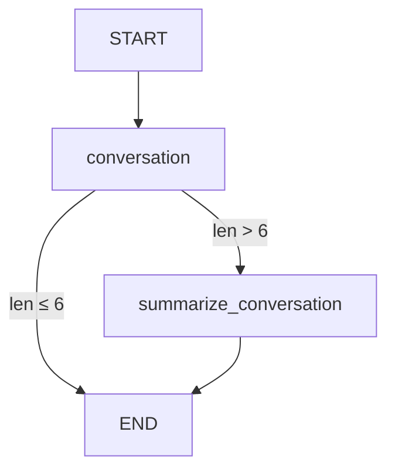

# Chatbot with External Memory 详细解读

>  网站使用说明
> - 本网站可以免登陆运行 Python 代码
> - Python 代码可以编辑并临时保存，但不会永久保存，网页刷新后会自动还原
> - 对网站的使用有任何问题，可以到 [问题反馈](http://localhost:5173/feedback.html) （按钮在每个页面的右下角）免登录进行评论
> - 运行 `LangGraph/LangChain`代码，需要用户输入自己的 [API Key](http://localhost:5173/python-run.html)
> - 重要声明：本网站不会保存用户的 API Key 数据，请放心输入

## 📚 概述

本文档详细解读 LangGraph 中**带外部数据库持久化存储的聊天机器人**实现。这是 Module 2 的进阶内容，在前面学习消息摘要和内存管理的基础上，进一步引入**外部数据库**实现永久性的对话记忆。

**核心亮点：**
- 使用 SQLite 数据库持久化对话状态
- 实现跨会话的对话记忆
- 结合消息摘要优化长对话处理
- 支持多线程独立对话管理

---

## 🎯 核心概念

### 为什么需要外部数据库？

在之前的课程中，我们学习了使用 MemorySaver 的内存存储：

```python
# 内存存储 - 程序重启后数据丢失
from langgraph.checkpoint.memory import MemorySaver
memory = MemorySaver()
```

**内存存储的局限性：**
- ❌ 程序重启后所有对话历史丢失
- ❌ 无法在不同服务器实例间共享状态
- ❌ 不适合生产环境
- ❌ 无法进行数据分析和审计

**外部数据库的优势：**
- ✅ 持久化存储，重启不丢失数据
- ✅ 支持分布式部署
- ✅ 可以进行数据分析
- ✅ 适合生产环境
- ✅ 支持备份和恢复

### Checkpointer 是什么？

**Checkpointer** 是 LangGraph 中负责保存和加载状态的组件。

```
用户消息 → 图执行 → 状态更新 → Checkpointer 保存
                                      ↓
重新执行 ← 状态加载 ← Checkpointer 读取
```

**LangGraph 支持的 Checkpointer：**

| Checkpointer | 存储位置 | 持久化 | 适用场景 |
|--------------|---------|--------|---------|
| `MemorySaver` | 进程内存 | ❌ | 开发/测试 |
| `SqliteSaver` | SQLite 数据库 | ✅ | 中小规模应用 |
| `PostgresSaver` | PostgreSQL | ✅ | 企业级应用 |

---

## 🎭 实战案例：带摘要和持久化的聊天机器人

我们将构建一个完整的聊天机器人系统，具备以下特性：

1. **自动摘要**：对话超过 6 条消息时自动生成摘要
2. **消息修剪**：保留最近 2 条消息 + 摘要
3. **持久化存储**：使用 SQLite 保存所有状态
4. **跨会话记忆**：重启程序后仍能恢复对话

### 系统架构图

```
用户输入
   ↓
[conversation] 节点
   ↓
检查消息数量
   ↓
超过 6 条？
   ├─ 是 → [summarize_conversation] → 生成摘要 + 删除旧消息
   └─ 否 → END
   ↓
状态保存到 SQLite
```

---

## 🔧 环境准备

### 1. 安装依赖

```python
%%capture --no-stderr
%pip install --quiet -U langgraph-checkpoint-sqlite langchain_core langgraph langchain_openai
```

**包说明：**
- `langgraph-checkpoint-sqlite`：SQLite checkpointer 支持
- `langchain_core`：核心消息类型和工具
- `langgraph`：图构建框架
- `langchain_openai`：OpenAI 模型集成

### 2. 配置 API Key

```python
import os, getpass

def _set_env(var: str):
    if not os.environ.get(var):
        os.environ[var] = getpass.getpass(f"{var}: ")

_set_env("OPENAI_API_KEY")
```

**Python 知识点：getpass 模块**

`getpass` 用于安全地输入敏感信息（如密码、API Key）：

```python
import getpass

# 输入时不会显示字符
password = getpass.getpass("请输入密码: ")

# 等价于但更安全：
# password = input("请输入密码: ")  # ❌ 会显示输入内容
```

---

## 🗄️ SQLite Checkpointer 详解

### 1. SQLite 简介

**SQLite** 是一个轻量级的嵌入式数据库：
- 不需要独立的数据库服务器
- 整个数据库存储在单个文件中
- 性能优秀，广泛应用（被 Andrej Karpathy 称为"超级流行"）
- Python 内置支持

### 2. 创建内存数据库

```python
import sqlite3

# 创建内存数据库（程序结束后消失）
conn = sqlite3.connect(":memory:", check_same_thread=False)
```

**参数说明：**
- `:memory:`：特殊字符串，创建内存数据库
- `check_same_thread=False`：允许多线程访问（LangGraph 需要）

### 3. 创建持久化数据库

```python
# 下载示例数据库（如果不存在）
!mkdir -p state_db && [ ! -f state_db/example.db ] && wget -P state_db https://github.com/langchain-ai/langchain-academy/raw/main/module-2/state_db/example.db

# 连接到本地数据库文件
db_path = "state_db/example.db"
conn = sqlite3.connect(db_path, check_same_thread=False)
```

**Bash 命令详解：**

```bash
mkdir -p state_db
# mkdir -p: 创建目录，-p 表示如果父目录不存在则创建，已存在也不报错

[ ! -f state_db/example.db ]
# [ ]: 条件测试
# -f: 检查文件是否存在
# !: 取反，即"文件不存在"

&&
# 逻辑与，前面的命令成功才执行后面的

wget -P state_db https://...
# wget: 下载文件
# -P state_db: 保存到 state_db 目录
```

### 4. 创建 SqliteSaver

```python
from langgraph.checkpoint.sqlite import SqliteSaver

# 创建 checkpointer
memory = SqliteSaver(conn)
```

**SqliteSaver 的作用：**
- 自动创建必要的数据库表
- 保存图的每一步状态（checkpoint）
- 支持状态查询和恢复
- 管理多个对话线程（thread）

**数据库结构（简化）：**

```sql
CREATE TABLE checkpoints (
    thread_id TEXT,      -- 对话线程 ID
    checkpoint_id TEXT,  -- 检查点 ID
    state BLOB,          -- 序列化的状态数据
    timestamp DATETIME   -- 时间戳
);
```

---

## 🧩 定义聊天机器人状态和逻辑

### 1. 导入依赖

```python
from langchain_openai import ChatOpenAI
from langchain_core.messages import SystemMessage, HumanMessage, RemoveMessage

from langgraph.graph import END
from langgraph.graph import MessagesState

model = ChatOpenAI(model="gpt-5-nano", temperature=0)
```

### 2. 定义状态 Schema

```python
class State(MessagesState):
    summary: str
```

**LangGraph 知识点：State 继承**

```python
# MessagesState 是 LangGraph 提供的基础状态类
# 包含一个 messages 字段（带 add_messages reducer）

class MessagesState(TypedDict):
    messages: Annotated[list[BaseMessage], add_messages]

# 我们的 State 继承它，并添加 summary 字段
class State(MessagesState):
    summary: str  # 对话摘要
```

**字段说明：**
- `messages`：消息列表（继承自 MessagesState）
- `summary`：对话摘要（新增字段）

### 3. call_model 节点

```python
def call_model(state: State):
    # 获取摘要（如果存在）
    summary = state.get("summary", "")

    # 如果有摘要，将其添加到系统消息中
    if summary:
        system_message = f"Summary of conversation earlier: {summary}"
        messages = [SystemMessage(content=system_message)] + state["messages"]
    else:
        messages = state["messages"]

    # 调用 LLM
    response = model.invoke(messages)
    return {"messages": response}
```

**逻辑详解：**

**步骤 1：检查是否有摘要**
```python
summary = state.get("summary", "")
# .get(key, default) - 如果 key 不存在返回 default
```

**步骤 2：构建消息列表**

如果有摘要：
```python
messages = [
    SystemMessage("Summary of conversation earlier: ..."),  # 摘要作为系统消息
    HumanMessage("hi! I'm Lance"),                         # 原始消息
    AIMessage("Hello Lance!"),
    # ... 更多消息
]
```

如果没有摘要：
```python
messages = [
    HumanMessage("hi! I'm Lance"),
    AIMessage("Hello Lance!"),
    # ... 所有原始消息
]
```

**步骤 3：调用 LLM 并返回**
```python
response = model.invoke(messages)
return {"messages": response}
# LangGraph 会自动将 response 添加到 state["messages"]
```

### 4. summarize_conversation 节点

```python
def summarize_conversation(state: State):
    # 获取现有摘要
    summary = state.get("summary", "")

    # 创建摘要提示词
    if summary:
        # 已有摘要，需要扩展
        summary_message = (
            f"This is summary of the conversation to date: {summary}\n\n"
            "Extend the summary by taking into account the new messages above:"
        )
    else:
        # 首次创建摘要
        summary_message = "Create a summary of the conversation above:"

    # 添加提示词到消息历史
    messages = state["messages"] + [HumanMessage(content=summary_message)]
    response = model.invoke(messages)

    # 删除除最近 2 条以外的所有消息
    delete_messages = [RemoveMessage(id=m.id) for m in state["messages"][:-2]]

    return {"summary": response.content, "messages": delete_messages}
```

**LangGraph 知识点：RemoveMessage**

`RemoveMessage` 是 LangGraph 提供的特殊消息类型，用于从状态中删除消息：

```python
# 创建删除指令
RemoveMessage(id=message.id)

# 批量删除示例
messages = state["messages"]  # 假设有 10 条消息
delete_messages = [RemoveMessage(id=m.id) for m in messages[:-2]]
# 删除前 8 条，保留最后 2 条
```

**执行流程示意：**

**假设当前状态：**
```python
messages = [
    msg1,  # id=1
    msg2,  # id=2
    msg3,  # id=3
    msg4,  # id=4
    msg5,  # id=5
    msg6,  # id=6
    msg7,  # id=7
]
```

**执行摘要后：**
```python
# 1. 生成摘要
summary = "Lance 介绍自己，喜欢 49ers..."

# 2. 创建删除指令（保留最后 2 条）
delete_messages = [
    RemoveMessage(id=1),
    RemoveMessage(id=2),
    RemoveMessage(id=3),
    RemoveMessage(id=4),
    RemoveMessage(id=5),
]

# 3. 返回更新
return {
    "summary": summary,
    "messages": delete_messages
}

# 4. 最终状态
messages = [msg6, msg7]  # 只保留最后 2 条
summary = "Lance 介绍自己，喜欢 49ers..."
```

**Python 知识点：列表切片**

```python
messages = [1, 2, 3, 4, 5]

messages[-2:]   # [4, 5]  - 最后 2 个元素
messages[:-2]   # [1, 2, 3]  - 除最后 2 个外的所有元素
messages[:2]    # [1, 2]  - 前 2 个元素
messages[2:]    # [3, 4, 5]  - 从第 3 个开始的所有元素
```

### 5. should_continue 条件函数

```python
def should_continue(state: State):
    """返回下一个要执行的节点"""

    messages = state["messages"]

    # 如果消息超过 6 条，执行摘要
    if len(messages) > 6:
        return "summarize_conversation"

    # 否则结束
    return END
```

**LangGraph 知识点：条件边返回值**

条件函数可以返回：
1. **节点名称字符串**：`"summarize_conversation"`
2. **END 常量**：结束图执行
3. **多个可能的节点名（配合映射使用）**

```python
# 示例 1：简单条件
def should_continue(state):
    if condition:
        return "node_a"
    return END

# 示例 2：多路分支
def route(state):
    if state["score"] > 0.8:
        return "high_quality"
    elif state["score"] > 0.5:
        return "medium_quality"
    return "low_quality"
```

---

## 🏗️ 构建图

### 1. 定义图结构

```python
from IPython.display import Image, display
from langgraph.graph import StateGraph, START

# 创建图
workflow = StateGraph(State)

# 添加节点
workflow.add_node("conversation", call_model)
workflow.add_node(summarize_conversation)  # 函数名 = 节点名

# 定义边
workflow.add_edge(START, "conversation")
workflow.add_conditional_edges("conversation", should_continue)
workflow.add_edge("summarize_conversation", END)

# 编译（关键！使用 SQLite checkpointer）
graph = workflow.compile(checkpointer=memory)

# 可视化
display(Image(graph.get_graph().draw_mermaid_png()))
```

**LangGraph 知识点：add_node 的两种方式**

```python
# 方式 1：指定节点名
workflow.add_node("conversation", call_model)
#                  ^^^^^^^^^^^^^  ^^^^^^^^^^
#                  节点名           函数

# 方式 2：自动使用函数名作为节点名
workflow.add_node(summarize_conversation)
# 等价于：
# workflow.add_node("summarize_conversation", summarize_conversation)
```

**图结构可视化：**



### 2. 编译时指定 Checkpointer

```python
graph = workflow.compile(checkpointer=memory)
#                        ^^^^^^^^^^^^^^^^^^^
#                        关键！启用状态持久化
```

**没有 checkpointer vs 有 checkpointer：**

| 特性 | 无 checkpointer | 有 checkpointer |
|------|----------------|----------------|
| 状态保存 | ❌ 不保存 | ✅ 自动保存每一步 |
| 对话记忆 | ❌ 无 | ✅ 支持多轮对话 |
| 重启恢复 | ❌ 不可能 | ✅ 可以恢复 |
| thread_id | ❌ 无意义 | ✅ 必需 |

---

## 🚀 运行聊天机器人

### 1. 创建对话线程

```python
# 配置：指定线程 ID
config = {"configurable": {"thread_id": "1"}}
```

**LangGraph 知识点：Thread（线程）**

**Thread** 是 LangGraph 中的对话会话概念：

```python
# 不同的 thread_id = 不同的对话会话
config_user1 = {"configurable": {"thread_id": "user_123"}}
config_user2 = {"configurable": {"thread_id": "user_456"}}

# 它们的状态完全独立
graph.invoke({"messages": [...]}, config_user1)  # 用户1的对话
graph.invoke({"messages": [...]}, config_user2)  # 用户2的对话
```

**实际应用场景：**
- 多用户聊天机器人（每个用户一个 thread_id）
- A/B 测试（不同配置使用不同 thread_id）
- 多轮对话管理

### 2. 执行多轮对话

```python
# 第 1 轮
input_message = HumanMessage(content="hi! I'm Lance")
output = graph.invoke({"messages": [input_message]}, config)
for m in output['messages'][-1:]:
    m.pretty_print()

# 第 2 轮
input_message = HumanMessage(content="what's my name?")
output = graph.invoke({"messages": [input_message]}, config)
for m in output['messages'][-1:]:
    m.pretty_print()

# 第 3 轮
input_message = HumanMessage(content="i like the 49ers!")
output = graph.invoke({"messages": [input_message]}, config)
for m in output['messages'][-1:]:
    m.pretty_print()
```

**输出示例：**

```
================================== Ai Message ==================================

Hello again, Lance! It's great to hear from you. Since you like the 49ers, is there a particular player or moment in their history that stands out to you?

================================== Ai Message ==================================

Your name is Lance! How can I assist you today? Would you like to talk more about the San Francisco 49ers or something else?

================================== Ai Message ==================================

That's awesome, Lance! The San Francisco 49ers have a rich history and a passionate fan base. Is there a specific aspect of the team you'd like to discuss?
```

**Python 知识点：列表切片取最后一个元素**

```python
output['messages'][-1:]   # 返回列表 [最后一条消息]
output['messages'][-1]    # 返回单个消息对象

# 为什么用 [-1:] 而不是 [-1]？
# 因为 pretty_print() 可以处理列表，统一接口
```

**对话分析：**

| 轮次 | 用户输入 | AI 回复 | 说明 |
|------|---------|---------|------|
| 1 | "hi! I'm Lance" | "Hello again, Lance!" | AI 记住了名字 |
| 2 | "what's my name?" | "Your name is Lance!" | 从历史中回忆 |
| 3 | "i like the 49ers!" | "That's awesome, Lance!" | 上下文连贯 |

---

## 💾 查看和恢复状态

### 1. 查看当前状态

```python
config = {"configurable": {"thread_id": "1"}}
graph_state = graph.get_state(config)
graph_state
```

**输出（StateSnapshot 对象）：**

```python
StateSnapshot(
    values={
        'messages': [
            HumanMessage(content="hi! I'm Lance", id='d5bb4b3f-...'),
            AIMessage(content="Hello again, Lance! ...", id='run-dde04d51-...'),
            HumanMessage(content="what's my name?", id='d7530770-...'),
            AIMessage(content='Your name is Lance! ...', id='run-763b6387-...'),
            HumanMessage(content='i like the 49ers!', id='235dcec4-...'),
            AIMessage(content="That's awesome, Lance! ...", id='run-729860b2-...')
        ],
        'summary': 'Lance introduced himself multiple times...'
    },
    next=(),
    config={
        'configurable': {
            'thread_id': '1',
            'checkpoint_ns': '',
            'checkpoint_id': '1ef6a36d-ca9c-6144-801b-6d0cf97adc73'
        }
    },
    metadata={
        'source': 'loop',
        'writes': {...},
        'step': 27,
        'parents': {}
    },
    created_at='2024-09-03T20:55:33.466540+00:00',
    parent_config={...},
    tasks=()
)
```

**StateSnapshot 字段详解：**

| 字段 | 说明 | 示例值 |
|------|------|--------|
| `values` | 当前状态的所有数据 | `{"messages": [...], "summary": "..."}` |
| `next` | 下一步要执行的节点 | `()` 表示已结束 |
| `config` | 配置信息（含 checkpoint_id） | `{"thread_id": "1", "checkpoint_id": "..."}` |
| `metadata` | 元数据（步数、来源等） | `{"step": 27, "source": "loop"}` |
| `created_at` | 创建时间 | `"2024-09-03T20:55:33..."` |

### 2. 持久化验证

**关键特性：重启笔记本后状态仍然存在！**

```python
# 重启 Jupyter kernel 后重新运行

# 重新连接数据库
db_path = "state_db/example.db"
conn = sqlite3.connect(db_path, check_same_thread=False)
memory = SqliteSaver(conn)

# 重新编译图
graph = workflow.compile(checkpointer=memory)

# 查询状态 - 数据仍然存在！
config = {"configurable": {"thread_id": "1"}}
graph_state = graph.get_state(config)
graph_state  # 返回之前的对话历史
```

**为什么可以恢复？**

```
程序运行时：
  状态 → SqliteSaver → SQLite 文件 (state_db/example.db)

程序重启：
  SQLite 文件依然存在 → SqliteSaver 读取 → 恢复状态
```

**对比内存存储：**

```python
# MemorySaver - 重启后丢失
memory = MemorySaver()
graph = workflow.compile(checkpointer=memory)
# 重启后 graph_state 为空

# SqliteSaver - 重启后保留
memory = SqliteSaver(conn)
graph = workflow.compile(checkpointer=memory)
# 重启后 graph_state 仍然存在
```

---

## 🎓 核心知识点总结

### LangGraph 特有概念

#### 1. Checkpointer

**定义：** 负责保存和加载图状态的组件

**类型对比：**

```python
# 内存存储（开发用）
from langgraph.checkpoint.memory import MemorySaver
memory = MemorySaver()

# SQLite 存储（生产小规模）
from langgraph.checkpoint.sqlite import SqliteSaver
memory = SqliteSaver(conn)

# PostgreSQL 存储（企业级）
from langgraph.checkpoint.postgres import PostgresSaver
memory = PostgresSaver(connection_string)
```

#### 2. Thread（线程）

**作用：** 隔离不同对话会话的状态

```python
# 每个用户一个线程
config_alice = {"configurable": {"thread_id": "alice"}}
config_bob = {"configurable": {"thread_id": "bob"}}

# 独立的对话历史
graph.invoke({"messages": [HumanMessage("我是 Alice")]}, config_alice)
graph.invoke({"messages": [HumanMessage("我是 Bob")]}, config_bob)
```

#### 3. StateSnapshot

**作用：** 表示图在某个时间点的完整状态

```python
snapshot = graph.get_state(config)

# 访问状态数据
snapshot.values["messages"]  # 消息列表
snapshot.values["summary"]   # 摘要

# 访问元数据
snapshot.config["configurable"]["checkpoint_id"]  # 检查点 ID
snapshot.metadata["step"]  # 执行步数
snapshot.created_at        # 创建时间
```

#### 4. RemoveMessage

**作用：** 从状态中删除消息

```python
# 删除单条消息
RemoveMessage(id=message.id)

# 批量删除（保留最后 N 条）
delete_msgs = [RemoveMessage(id=m.id) for m in messages[:-N]]
return {"messages": delete_msgs}
```

### Python 特有知识点

#### 1. getpass 模块

**作用：** 安全输入敏感信息

```python
import getpass

# 输入不会回显
password = getpass.getpass("密码: ")
api_key = getpass.getpass("API Key: ")
```

#### 2. sqlite3 模块

**基本用法：**

```python
import sqlite3

# 内存数据库
conn = sqlite3.connect(":memory:")

# 文件数据库
conn = sqlite3.connect("my_database.db")

# 多线程支持
conn = sqlite3.connect("db.db", check_same_thread=False)

# 执行 SQL
cursor = conn.cursor()
cursor.execute("SELECT * FROM table")
results = cursor.fetchall()
```

#### 3. 字典 .get() 方法

**作用：** 安全获取字典值，避免 KeyError

```python
state = {"messages": [...]}

# 不安全的方式
summary = state["summary"]  # ❌ KeyError 如果不存在

# 安全的方式
summary = state.get("summary", "")  # ✅ 不存在返回默认值
```

#### 4. 列表切片高级用法

```python
messages = [1, 2, 3, 4, 5]

# 基础切片
messages[1:3]    # [2, 3]
messages[:3]     # [1, 2, 3]
messages[3:]     # [4, 5]

# 负索引
messages[-1]     # 5 (最后一个)
messages[-2:]    # [4, 5] (最后两个)
messages[:-2]    # [1, 2, 3] (除最后两个)

# 步长
messages[::2]    # [1, 3, 5] (每隔一个)
messages[::-1]   # [5, 4, 3, 2, 1] (反转)
```

---

## 💡 最佳实践

### 1. 选择合适的 Checkpointer

| 场景 | 推荐 Checkpointer | 理由 |
|------|------------------|------|
| 本地开发/测试 | `MemorySaver` | 简单快速 |
| 小规模应用 | `SqliteSaver` | 轻量级持久化 |
| 生产环境（单机） | `SqliteSaver` | 可靠且易部署 |
| 分布式系统 | `PostgresSaver` | 支持并发和扩展 |
| 云原生应用 | `PostgresSaver` | 与云服务集成好 |

### 2. Thread ID 设计模式

#### 模式 1：用户 ID 作为 Thread ID

```python
# 每个用户一个对话线程
user_id = "user_12345"
config = {"configurable": {"thread_id": f"user_{user_id}"}}
```

#### 模式 2：会话 ID

```python
# 用户可以有多个会话
session_id = str(uuid.uuid4())
config = {"configurable": {"thread_id": session_id}}
```

#### 模式 3：组合 ID

```python
# 用户 + 日期
thread_id = f"user_{user_id}_date_{date.today()}"
config = {"configurable": {"thread_id": thread_id}}
```

### 3. 消息摘要策略

#### 策略 1：固定阈值

```python
# 超过 N 条消息就摘要
if len(messages) > 6:
    return "summarize"
```

#### 策略 2：Token 计数

```python
# 根据 token 数量决定
from tiktoken import encoding_for_model

encoder = encoding_for_model("gpt-4")
total_tokens = sum(len(encoder.encode(m.content)) for m in messages)

if total_tokens > 2000:
    return "summarize"
```

#### 策略 3：时间窗口

```python
# 超过一定时间的消息摘要
from datetime import datetime, timedelta

cutoff_time = datetime.now() - timedelta(hours=1)
old_messages = [m for m in messages if m.timestamp < cutoff_time]

if old_messages:
    return "summarize"
```

### 4. 数据库维护

#### 定期清理

```python
# 删除超过 30 天的旧检查点
import sqlite3
from datetime import datetime, timedelta

conn = sqlite3.connect("state_db/example.db")
cursor = conn.cursor()

cutoff_date = datetime.now() - timedelta(days=30)
cursor.execute(
    "DELETE FROM checkpoints WHERE created_at < ?",
    (cutoff_date,)
)
conn.commit()
```

#### 备份

```python
import shutil
from datetime import datetime

# 创建备份
backup_name = f"backup_{datetime.now().strftime('%Y%m%d_%H%M%S')}.db"
shutil.copy("state_db/example.db", f"backups/{backup_name}")
```

---

## 🚀 进阶技巧

### 1. 多模型摘要

使用更快/便宜的模型生成摘要：

```python
# 对话用强模型
conversation_model = ChatOpenAI(model="gpt-5-nano")

# 摘要用快速模型
summary_model = ChatOpenAI(model="gpt-3.5-turbo")

def summarize_conversation(state: State):
    summary_message = "Summarize this conversation:"
    messages = state["messages"] + [HumanMessage(content=summary_message)]

    # 使用快速模型
    response = summary_model.invoke(messages)

    delete_messages = [RemoveMessage(id=m.id) for m in state["messages"][:-2]]
    return {"summary": response.content, "messages": delete_messages}
```

### 2. 渐进式摘要

每次只摘要一部分消息：

```python
def progressive_summarize(state: State):
    messages = state["messages"]

    # 只摘要中间的消息，保留最近的
    to_summarize = messages[:-10]  # 保留最后 10 条
    keep_messages = messages[-10:]

    # 生成部分摘要
    summary_prompt = f"Summarize these messages: {to_summarize}"
    partial_summary = model.invoke(summary_prompt)

    # 删除已摘要的消息
    delete_msgs = [RemoveMessage(id=m.id) for m in to_summarize]

    return {
        "summary": partial_summary.content,
        "messages": delete_msgs
    }
```

### 3. 条件性摘要

根据对话内容决定是否摘要：

```python
def intelligent_should_continue(state: State):
    messages = state["messages"]

    # 检查是否有实质性内容
    has_content = any(len(m.content) > 50 for m in messages[-5:])

    # 只有在有实质性对话时才摘要
    if len(messages) > 6 and has_content:
        return "summarize_conversation"

    return END
```

### 4. 分层存储

将摘要和原始消息分别存储：

```python
class State(MessagesState):
    summary: str
    full_history: Annotated[list, operator.add]  # 完整历史（不显示给 LLM）

def call_model(state: State):
    # 只发送最近消息 + 摘要
    summary = state.get("summary", "")
    recent_messages = state["messages"][-5:]

    if summary:
        messages = [SystemMessage(summary)] + recent_messages
    else:
        messages = recent_messages

    response = model.invoke(messages)

    # 保存到完整历史
    return {
        "messages": response,
        "full_history": [response]
    }
```

---

## 🔍 常见问题

### Q1: SqliteSaver 会自动创建数据库表吗？

**是的！** `SqliteSaver` 在初始化时会自动创建必要的表：

```python
memory = SqliteSaver(conn)
# 自动执行：
# CREATE TABLE IF NOT EXISTS checkpoints (...)
# CREATE TABLE IF NOT EXISTS checkpoint_writes (...)
```

### Q2: 如何删除某个线程的所有历史？

目前没有直接的 API，但可以操作数据库：

```python
import sqlite3

conn = sqlite3.connect("state_db/example.db")
cursor = conn.cursor()

# 删除指定线程
cursor.execute(
    "DELETE FROM checkpoints WHERE thread_id = ?",
    ("thread_id_to_delete",)
)
conn.commit()
```

### Q3: 可以在不同的图之间共享同一个 checkpointer 吗？

**可以，但要小心！** 不同的图可以共享数据库，但需要使用不同的线程 ID：

```python
memory = SqliteSaver(conn)

# 图 1
graph1 = workflow1.compile(checkpointer=memory)
config1 = {"configurable": {"thread_id": "graph1_user1"}}

# 图 2
graph2 = workflow2.compile(checkpointer=memory)
config2 = {"configurable": {"thread_id": "graph2_user1"}}

# 它们的状态互不影响
```

### Q4: 摘要生成失败怎么办？

添加错误处理：

```python
def summarize_conversation(state: State):
    try:
        summary_message = "Create a summary..."
        messages = state["messages"] + [HumanMessage(content=summary_message)]
        response = model.invoke(messages)

        delete_messages = [RemoveMessage(id=m.id) for m in state["messages"][:-2]]
        return {"summary": response.content, "messages": delete_messages}

    except Exception as e:
        # 出错时不删除消息，保留现有摘要
        print(f"Summarization failed: {e}")
        return {}  # 不更新任何字段
```

### Q5: 如何查看所有的线程 ID？

查询数据库：

```python
cursor = conn.cursor()
cursor.execute("SELECT DISTINCT thread_id FROM checkpoints")
threads = cursor.fetchall()
print("All threads:", threads)
```

---

## 🎯 实际应用案例

### 案例 1：客服机器人

```python
class CustomerServiceState(MessagesState):
    summary: str
    customer_id: str
    issue_type: str
    resolved: bool

def call_support_agent(state: CustomerServiceState):
    # 包含客户信息的系统消息
    system_msg = f"""
    Customer ID: {state['customer_id']}
    Issue Type: {state['issue_type']}
    Previous Summary: {state.get('summary', 'None')}
    """

    messages = [SystemMessage(system_msg)] + state["messages"]
    response = support_model.invoke(messages)

    return {"messages": response}

# 使用
config = {"configurable": {"thread_id": f"customer_{customer_id}"}}
```

### 案例 2：多语言聊天机器人

```python
class MultilingualState(MessagesState):
    summary: str
    language: str  # 用户语言

def detect_language(state: MultilingualState):
    # 检测用户语言
    last_message = state["messages"][-1].content
    detected_lang = detect_language_api(last_message)
    return {"language": detected_lang}

def call_model(state: MultilingualState):
    lang = state.get("language", "en")
    summary = state.get("summary", "")

    # 使用用户语言的系统提示
    system_msg = f"Respond in {lang}. Summary: {summary}"
    messages = [SystemMessage(system_msg)] + state["messages"]

    response = model.invoke(messages)
    return {"messages": response}
```

### 案例 3：教学辅导机器人

```python
class TutoringState(MessagesState):
    summary: str
    student_level: int  # 1-10
    topics_covered: list[str]
    mastery_scores: dict[str, float]

def adaptive_tutor(state: TutoringState):
    # 根据学生水平调整难度
    level = state.get("student_level", 5)
    summary = state.get("summary", "")

    system_msg = f"""
    Student Level: {level}/10
    Topics Covered: {state.get('topics_covered', [])}
    Session Summary: {summary}

    Adjust explanation difficulty to match student level.
    """

    messages = [SystemMessage(system_msg)] + state["messages"]
    response = tutor_model.invoke(messages)

    return {"messages": response}
```

---

## 📖 扩展阅读

- [LangGraph Persistence 官方文档](https://langchain-ai.github.io/langgraph/concepts/persistence/)
- [SqliteSaver API 文档](https://langchain-ai.github.io/langgraph/reference/checkpoints/#langgraph.checkpoint.sqlite.SqliteSaver)
- [PostgresSaver 使用指南](https://langchain-ai.github.io/langgraph/how-tos/persistence_postgres/)
- [SQLite 官方文档](https://www.sqlite.org/docs.html)
- [Python sqlite3 模块文档](https://docs.python.org/3/library/sqlite3.html)

---

## 🎬 总结

本教程深入讲解了 LangGraph 中的**外部数据库持久化存储**：

**核心要点：**
1. ✅ **Checkpointer** 负责状态持久化
2. ✅ **SqliteSaver** 提供轻量级数据库存储
3. ✅ **Thread ID** 隔离不同对话会话
4. ✅ **StateSnapshot** 可以查询和恢复状态
5. ✅ **RemoveMessage** 实现消息修剪
6. ✅ 结合摘要优化长对话处理

**技术栈：**
- LangGraph: 图构建和状态管理
- SQLite: 轻量级持久化存储
- OpenAI: LLM 推理
- Pydantic: 数据验证

**适用场景：**
- 需要长期记忆的聊天机器人
- 多用户对话系统
- 客服/教学等场景
- 需要数据分析的应用

掌握外部数据库存储是构建**生产级 LangGraph 应用**的关键技能！
