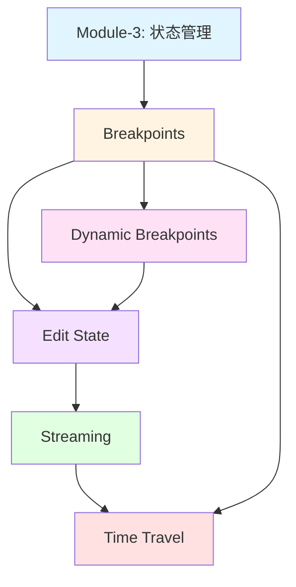
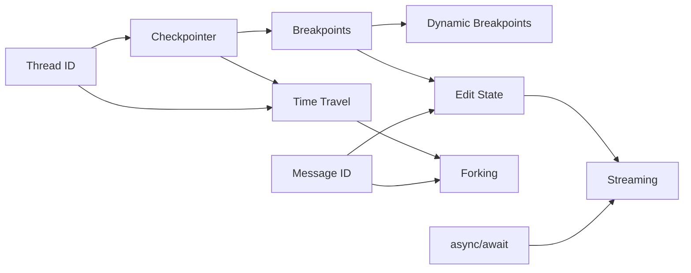

# Module-4 本章介绍：精通 Human-in-the-Loop（人机协同）

> **来自图灵奖获得者的寄语**
>
> "真正智能的系统不是完全自主的，而是能在关键时刻优雅地等待人类判断的系统。Human-in-the-Loop 不是 AI 的缺陷，而是其智慧的体现——知道何时需要人类专家的介入。就像最伟大的国际象棋程序并非独自作战，而是与人类大师形成最强搭档。在 LangGraph 中，你将学会如何构建这样的协作系统：AI 负责高效执行，人类负责关键决策，二者共同创造超越单方能力的价值。"
>
> — *启发自 Judea Pearl 对因果推理中人类判断的强调*

---

## 📚 本章概览

Human-in-the-Loop（人机协同）是构建**可控、可信、可靠** AI 系统的核心技术。本章将深入探讨如何在 LangGraph 中实现五种强大的人机交互模式，让 AI Agent 在关键节点暂停、等待人类确认、接收反馈，甚至回溯历史状态。这不仅是技术实现，更是一套完整的可控 AI 设计哲学。

### 学习目标

通过本章学习，你将掌握：

1. **Breakpoints（断点机制）** - 在图执行前后主动暂停，实现工具调用审批和敏感操作确认
2. **Dynamic Breakpoints（动态断点）** - 根据运行时条件智能中断，传递详细中断原因
3. **Edit State（状态编辑）** - 在暂停时修改状态，纠正 AI 误解或注入人类反馈
4. **Streaming（流式输出）** - 实时展示 AI 执行过程，实现类 ChatGPT 的打字机效果
5. **Time Travel（时间旅行）** - 浏览历史状态、回放执行、从历史分叉创建新路径

### 本章架构图

```
Module-4: Human-in-the-Loop 完整体系
├─ 4.1 Breakpoints (难度: ⭐⭐⭐)
│   ├─ interrupt_before/after
│   ├─ 工具调用审批
│   └─ Checkpointer 机制
│
├─ 4.2 Dynamic Breakpoints (难度: ⭐⭐⭐⭐)
│   ├─ NodeInterrupt 异常
│   ├─ 条件性中断
│   └─ 信息传递机制
│
├─ 4.3 Edit State & Human Feedback (难度: ⭐⭐⭐⭐)
│   ├─ update_state API
│   ├─ as_node 参数
│   ├─ Reducer 覆盖机制
│   └─ 人工反馈节点设计
│
├─ 4.4 Streaming (难度: ⭐⭐⭐⭐⭐)
│   ├─ stream_mode: updates/values
│   ├─ astream_events (Token Streaming)
│   ├─ API messages 模式
│   └─ async/await 异步编程
│
└─ 4.5 Time Travel (难度: ⭐⭐⭐⭐⭐)
    ├─ 浏览历史 (get_state_history)
    ├─ 回放 (Replaying)
    ├─ 分叉 (Forking)
    └─ Message ID 覆盖机制
```

### 知识依赖关系



---

## 🎯 核心概念预览

### 1. Breakpoints: 执行的"暂停按钮"

**核心思想：** 在图的执行过程中设置断点，主动暂停等待人工干预。

**典型应用场景：**
```python
# 场景：支付 API 调用前需要人工确认
graph = builder.compile(
    interrupt_before=["payment_tool"],  # 在支付前暂停
    checkpointer=memory
)

# 执行到断点
for event in graph.stream(user_input, thread):
    print(event)  # 显示即将执行的支付操作

# 获取用户批准
approval = input("Approve payment? (yes/no): ")

if approval == "yes":
    # 继续执行
    for event in graph.stream(None, thread):
        print(event)
```

**三大使用场景：**

| 场景 | 说明 | 断点位置 |
|------|------|---------|
| **Approval（审批）** | 敏感操作前确认 | `interrupt_before` |
| **Debugging（调试）** | 查看中间状态 | `interrupt_after` |
| **Editing（编辑）** | 修改状态后继续 | 结合 `update_state` |

**关键机制：**
- **Checkpointer 必需**：断点依赖状态持久化
- **Thread 隔离**：不同用户/会话独立管理
- **stream(None, thread)**：从断点继续执行

---

### 2. Dynamic Breakpoints: 智能条件中断

**核心思想：** 不预设固定断点，而是在运行时根据业务逻辑动态决定是否中断。

**对比静态断点：**

| 特性 | 静态断点 | 动态断点 |
|------|---------|---------|
| 设置时机 | 编译时固定 | 运行时决定 |
| 触发方式 | 总是触发 | 条件性触发 |
| 信息传递 | 无 | 可传递中断原因 |
| 灵活性 | 低 | 高 |

**实现示例：**
```python
from langgraph.errors import NodeInterrupt

def content_filter(state):
    risk_score = calculate_risk(state['content'])

    if risk_score > 0.8:
        # 抛出 NodeInterrupt，传递详细信息
        raise NodeInterrupt(
            f"高风险内容检测 (评分: {risk_score})，需要人工审核。"
            f"检测到的问题: {', '.join(detected_issues)}"
        )

    return state  # 低风险，继续执行
```

**核心 API：`NodeInterrupt`**
```python
raise NodeInterrupt(message: str)
```

**信息获取：**
```python
state = graph.get_state(thread)
interrupt_info = state.tasks[0].interrupts[0].value
# 输出: "高风险内容检测 (评分: 0.85)，需要人工审核。..."
```

---

### 3. Edit State: 状态的"时光修改器"

**核心思想：** 在断点处不仅能暂停，还能修改状态，纠正 AI 的理解或注入人类反馈。

**三种编辑模式：**

#### 模式 1：追加反馈（不提供 Message ID）
```python
# 场景：用户补充信息
graph.update_state(
    thread,
    {"messages": [HumanMessage("补充信息：优先考虑性能")]},
    as_node="human_feedback"
)
# 结果：新消息追加到历史末尾
```

#### 模式 2：覆盖消息（保留 Message ID）
```python
# 场景：纠正用户输入
state = graph.get_state(thread)
last_msg = state.values['messages'][-1]
last_msg['content'] = "修正后的问题"

graph.update_state(
    thread,
    {"messages": [last_msg]},  # 保留 ID
    as_node="correction"
)
# 结果：原消息被覆盖
```

#### 模式 3：注入专家知识
```python
# 场景：AI 缺乏领域知识
graph.update_state(
    thread,
    {
        "domain_context": "该数据异常是季节性因素",
        "expert_suggestion": "使用移动平均平滑处理"
    },
    as_node="expert_review"
)
```

**关键参数：`as_node`**
```python
graph.update_state(thread, data, as_node="human_feedback")
#                                  ^^^^^^^^^^^^^^^^^^^^
#                                  模拟该节点的输出
```

**作用：** 告诉图从哪个节点继续执行，确保正确的控制流。

**Reducer 机制：**
```python
# MessagesState 使用 add_messages reducer
# - 有 ID → 覆盖
# - 无 ID → 追加
# - RemoveMessage → 删除
```

---

### 4. Streaming: 实时的"进度条"

**核心思想：** 不等待完整结果，而是逐步输出 AI 的执行过程，提升用户体验。

**四种 Streaming 模式：**

| 模式 | 粒度 | 输出内容 | 典型用途 |
|------|------|---------|---------|
| `updates` | 节点级 | 状态更新 | 追踪变化 |
| `values` | 节点级 | 完整状态 | 调试检查 |
| `astream_events` | 事件级 | 所有事件 | Token streaming |
| `messages` (API) | Token 级 | 消息流 | 聊天应用 |

**Token Streaming 实现（类 ChatGPT 效果）：**

```python
# 本地版本
async for event in graph.astream_events(input_data, config, version="v2"):
    if event["event"] == "on_chat_model_stream":
        token = event["data"]["chunk"].content
        print(token, end="", flush=True)

# API 版本（推荐）
async for event in client.runs.stream(
    thread_id,
    assistant_id="agent",
    input=input_data,
    stream_mode="messages"
):
    if event.event == "messages/partial":
        for item in event.data:
            if "content" in item:
                print(item["content"], end="", flush=True)
```

**异步编程要点：**
```python
# 定义异步函数
async def stream_response():
    async for event in graph.astream_events(...):
        yield event

# 在 Jupyter 中直接使用
result = await some_async_function()

# 在普通 Python 脚本中
import asyncio
asyncio.run(main())
```

---

### 5. Time Travel: 历史的"版本控制系统"

**核心思想：** 像 Git 一样管理图的执行历史，支持查看、回放、分叉。

**三大核心能力：**

#### 能力 1：浏览历史（Browsing）
```python
# 获取完整历史
all_states = list(graph.get_state_history(thread))

# 查看每一步
for i, state in enumerate(all_states):
    print(f"Step {i}: {state.metadata.get('step')}")
    print(f"  Messages: {len(state.values['messages'])}")
    print(f"  Next: {state.next}")
```

#### 能力 2：回放（Replaying）
```python
# 选择要回放的历史状态
to_replay = all_states[-3]  # 回到第 3 步

# 从该状态重新执行
for event in graph.stream(None, to_replay.config):
    print(event)
```

#### 能力 3：分叉（Forking）
```python
# 选择分叉点
base_state = all_states[-2]

# 修改状态创建分叉
fork_config = graph.update_state(
    base_state.config,
    {"messages": [HumanMessage(
        content="修改后的输入",
        id=base_state.values['messages'][0].id  # ⭐ 保留 ID 以覆盖
    )]}
)

# 从分叉继续执行（创建新的历史分支）
for event in graph.stream(None, fork_config):
    print(event)
```

**分叉的"Git 类比"：**
```
原始历史（main 分支）：
  A → B → C → D

分叉（feature 分支）：
  A → B' → C' → D'
       ↑
      修改点

两条分支独立存在，互不影响
```

**Message ID 覆盖机制：**
```python
# 关键：保留原消息的 ID
original_msg = state.values['messages'][0]

# ✅ 正确：覆盖消息
HumanMessage(content="新内容", id=original_msg.id)

# ❌ 错误：追加消息（不提供 ID 或使用新 ID）
HumanMessage(content="新内容")  # 会追加，不会覆盖
```

---

## 🗺️ 学习路线图

### 初学者路径（3-4 天）

**目标：** 掌握基础的人机交互模式

**Day 1: Breakpoints 基础**
- ✅ 理解 `interrupt_before/after` 机制
- ✅ 实现简单的工具调用审批
- ✅ 掌握 `stream(None, thread)` 恢复执行
- 🎯 实战：构建需要人工确认的计算器 Agent

**Day 2: 状态编辑**
- ✅ 学习 `update_state` API
- ✅ 理解 `as_node` 参数的作用
- ✅ 掌握消息追加 vs 覆盖的区别
- 🎯 实战：实现可纠正用户输入的聊天机器人

**Day 3: Streaming 基础**
- ✅ 掌握 `stream_mode="values"` 调试
- ✅ 学习基本的 `async/await` 语法
- ✅ 实现简单的进度显示
- 🎯 实战：为 Agent 添加实时状态输出

**Day 4: 综合练习**
- 🎯 项目：构建一个支持断点、状态编辑和流式输出的问答系统
- 📝 复习：巩固 Checkpointer、Thread、Reducer 等核心概念

---

### 进阶者路径（4-6 天）

**目标：** 掌握高级人机交互技术

**Day 1-2: Dynamic Breakpoints**
- ✅ 理解 `NodeInterrupt` 异常机制
- ✅ 实现条件性中断逻辑
- ✅ 学习结构化信息传递
- 🎯 实战：构建内容审核系统（根据风险评分动态中断）

**Day 3-4: Token Streaming**
- ✅ 掌握 `astream_events` API
- ✅ 实现 Token 级别的流式输出
- ✅ 学习事件过滤和优化
- ✅ 理解 `messages` 模式（API）
- 🎯 实战：实现类 ChatGPT 的打字机效果

**Day 5: Time Travel 基础**
- ✅ 学习 `get_state_history` 浏览历史
- ✅ 掌握回放（Replaying）机制
- ✅ 理解 Checkpoint 结构
- 🎯 实战：为 Agent 添加"撤销"功能

**Day 6: Time Travel 分叉**
- ✅ 掌握分叉（Forking）技术
- ✅ 理解 Message ID 覆盖机制
- ✅ 学习多分支管理
- 🎯 实战：A/B 测试不同的 Agent 配置

---

### 专家路径（6-10 天）

**目标：** 构建生产级的人机协同系统

**Day 1-2: 高级断点模式**
- ✅ 组合静态和动态断点
- ✅ 实现多级审批流程
- ✅ 设计条件断点系统
- ✅ 学习审批历史记录
- 🎯 实战：企业级审批工作流系统

**Day 3-4: 生产级 Streaming**
- ✅ 学习 LangGraph API 部署
- ✅ 实现 WebSocket/SSE 流式传输
- ✅ 掌握多用户并发 Streaming
- ✅ 优化 Token Streaming 性能
- 🎯 实战：构建支持千级并发的聊天服务

**Day 5-6: 高级状态管理**
- ✅ 设计复杂的状态编辑策略
- ✅ 实现状态版本控制
- ✅ 掌握审计日志系统
- ✅ 学习状态回滚机制
- 🎯 实战：可追溯的客服系统

**Day 7-8: Time Travel 高级应用**
- ✅ 实现时间线可视化
- ✅ 设计自动保存关键 Checkpoint
- ✅ 掌握多分支探索技术
- ✅ 学习条件回放策略
- 🎯 实战：AI 决策调试平台

**Day 9-10: 综合项目**
- 🎯 大型项目：构建完整的 Human-in-the-Loop AI 应用
  - 支持多种中断模式（静态、动态、条件）
  - 实现完整的状态编辑和审计
  - 提供流式输出和实时反馈
  - 支持历史浏览、回放和分叉
  - 具备生产级的性能和可靠性

---

## 💡 学习建议

### 1. 实践驱动学习

**❌ 不推荐：** 只看理论，不动手实践

**✅ 推荐：** 每学一个概念立即编写代码验证

```python
# 示例：学习 Breakpoints 后立即尝试
graph = builder.compile(
    interrupt_before=["assistant"],
    checkpointer=MemorySaver()
)

# 测试 1：观察断点行为
for event in graph.stream(input, thread):
    print(event)

# 测试 2：尝试恢复执行
for event in graph.stream(None, thread):
    print(event)

# 测试 3：修改状态后继续
graph.update_state(thread, new_state)
for event in graph.stream(None, thread):
    print(event)
```

---

### 2. 对比学习法

**策略：** 通过对比理解概念的边界和适用场景

| 维度 | 静态断点 | 动态断点 |
|------|---------|---------|
| 何时设置 | 编译时 | 运行时 |
| 触发条件 | 固定节点 | 业务逻辑 |
| 信息传递 | 无 | 有 |
| 适用场景 | 固定审批点 | 智能审核 |

| 维度 | 回放 | 分叉 |
|------|-----|-----|
| 状态修改 | 无 | 有 |
| 历史影响 | 无 | 创建新分支 |
| 适用场景 | 重现问题 | 探索假设 |

---

### 3. 渐进式复杂度

**阶段 1：单一功能**
```python
# 只使用 Breakpoints
graph = builder.compile(interrupt_before=["tools"], checkpointer=memory)
```

**阶段 2：组合功能**
```python
# Breakpoints + 状态编辑
for event in graph.stream(input, thread):
    print(event)

graph.update_state(thread, corrected_state)

for event in graph.stream(None, thread):
    print(event)
```

**阶段 3：完整系统**
```python
# Breakpoints + 状态编辑 + Streaming + Time Travel
async for event in graph.astream_events(input, thread, version="v2"):
    # 实时显示 Token
    if event["event"] == "on_chat_model_stream":
        print(event["data"]["chunk"].content, end="")

# 遇到错误？回到历史重新执行
history = list(graph.get_state_history(thread))
safe_point = history[-3]
for event in graph.stream(None, safe_point.config):
    print(event)
```

---

### 4. 调试思维训练

**学习如何调试 Human-in-the-Loop 系统：**

```python
# 调试清单
def debug_hitl_system():
    # 1. 检查 Checkpointer
    state = graph.get_state(thread)
    print(f"Current checkpoint: {state.config}")

    # 2. 检查断点状态
    print(f"Next node: {state.next}")
    print(f"Tasks: {state.tasks}")

    # 3. 检查历史
    history = list(graph.get_state_history(thread))
    print(f"History length: {len(history)}")

    # 4. 验证消息 ID
    for msg in state.values['messages']:
        print(f"Message ID: {msg.id}, Content: {msg.content[:50]}")

    # 5. 检查中断信息（动态断点）
    if state.tasks:
        for task in state.tasks:
            if task.interrupts:
                print(f"Interrupt: {task.interrupts[0].value}")
```

---

### 5. 构建知识地图

**推荐方式：** 创建自己的概念关系图



**建议：** 每学完一个概念，更新你的知识地图，标注：
- ✅ 已掌握
- 🤔 需要深化
- ❓ 存在疑问

---

## 🎯 本章亮点

### 1. 完整的人机协同体系

本章不仅教你技术实现，更传授一套**可控 AI 的设计哲学**：

- **不盲目自主**：知道何时需要人类判断
- **可追溯可回滚**：所有决策都有历史可查
- **优雅的交互**：流式输出提升用户体验
- **灵活的控制**：静态断点、动态断点、条件中断自由组合

---

### 2. 生产级最佳实践

每个概念都配有实际应用场景和最佳实践：

**Breakpoints 最佳实践：**
```python
# ✅ 场景 1：敏感操作审批
interrupt_before=["payment", "delete", "send_email"]

# ✅ 场景 2：调试模式
if DEBUG_MODE:
    interrupt_after=["every", "node"]

# ✅ 场景 3：用户体验优化
def get_user_approval(tool_call):
    print(f"AI 想要执行: {tool_call}")
    print("选项: (1) 批准 (2) 拒绝 (3) 修改参数")
    return input("选择: ")
```

---

### 3. 性能优化技巧

**Streaming 性能优化：**
```python
# 批量处理 Tokens
buffer = []
async for event in graph.astream_events(...):
    if event["event"] == "on_chat_model_stream":
        buffer.append(event["data"]["chunk"].content)

        if len(buffer) >= 5:  # 每 5 个 token 输出一次
            print("".join(buffer), end="", flush=True)
            buffer.clear()
```

**Time Travel 存储优化：**
```python
# 只保存关键 Checkpoint
def save_important_checkpoints(thread):
    for state in graph.get_state_history(thread):
        # 只保存用户输入的状态
        if any(isinstance(m, HumanMessage) for m in state.values['messages']):
            save_to_database(state)
```

---

### 4. 错误处理和边界情况

**完善的错误处理示例：**
```python
async def safe_stream(graph, input_data, config):
    """带错误处理的 Streaming"""
    try:
        async for event in graph.astream_events(input_data, config, version="v2"):
            if event["event"] == "on_chat_model_stream":
                yield event["data"]["chunk"].content
    except KeyboardInterrupt:
        print("\n用户中断")
    except asyncio.TimeoutError:
        print("\n超时，请稍后重试")
    except Exception as e:
        print(f"\n错误: {e}")
        # 可选：回滚到安全状态
        history = list(graph.get_state_history(config))
        if history:
            safe_state = history[-1]
            for event in graph.stream(None, safe_state.config):
                print(event)
```

---

## 📊 知识点速查表

### Breakpoints

| API | 说明 | 示例 |
|-----|------|------|
| `interrupt_before` | 节点前中断 | `interrupt_before=["tools"]` |
| `interrupt_after` | 节点后中断 | `interrupt_after=["assistant"]` |
| `stream(None, thread)` | 从断点继续 | `graph.stream(None, thread)` |
| `get_state(thread)` | 查看当前状态 | `state = graph.get_state(thread)` |

### Dynamic Breakpoints

| API | 说明 | 示例 |
|-----|------|------|
| `NodeInterrupt` | 触发动态中断 | `raise NodeInterrupt("原因")` |
| `state.tasks` | 查看中断信息 | `state.tasks[0].interrupts` |

### Edit State

| API | 说明 | 示例 |
|-----|------|------|
| `update_state` | 修改状态 | `graph.update_state(thread, data)` |
| `as_node` | 指定节点 | `as_node="human_feedback"` |
| Message ID | 覆盖消息 | `id=original_msg.id` |

### Streaming

| 模式 | 粒度 | 用途 |
|------|------|------|
| `updates` | 节点级 | 追踪变化 |
| `values` | 节点级 | 调试 |
| `astream_events` | 事件级 | Token streaming |
| `messages` (API) | Token 级 | 聊天应用 |

### Time Travel

| API | 说明 | 示例 |
|-----|------|------|
| `get_state_history` | 获取历史 | `list(graph.get_state_history(thread))` |
| 回放 | 重新执行 | `stream(None, historical_config)` |
| 分叉 | 修改历史 | `update_state(historical_config, new_data)` |

---

## 附录: 术语表

### Human-in-the-Loop 相关

- **Human-in-the-Loop (HITL)**: 人机协同模式，AI 在关键节点暂停等待人类决策
- **Approval Mode**: 审批模式，在敏感操作前获得人工批准
- **Debugging Mode**: 调试模式，回放历史状态定位问题
- **Editing Mode**: 编辑模式，修改状态注入人类反馈

### Breakpoints 相关

- **Breakpoint**: 断点，图执行中的暂停点
- **Interrupt**: 中断，图暂停执行的状态
- **Static Breakpoint**: 静态断点，编译时固定设置
- **Dynamic Breakpoint**: 动态断点，运行时条件触发
- **NodeInterrupt**: 动态断点异常类

### 状态管理相关

- **Checkpointer**: 检查点管理器，自动保存图的执行状态
- **StateSnapshot**: 状态快照，某个时刻的完整状态
- **Thread**: 线程，用于标识和隔离会话
- **Checkpoint ID**: 检查点标识符，唯一标识一个状态快照

### Streaming 相关

- **Streaming**: 流式输出，逐步返回结果而非等待完成
- **Token Streaming**: Token 级流式输出，逐个 Token 显示
- **astream_events**: 异步事件流 API
- **stream_mode**: 流式模式选择器（updates/values/messages）
- **SSE**: Server-Sent Events，服务器推送事件协议

### Time Travel 相关

- **Time Travel**: 时间旅行，浏览、回放、分叉历史状态
- **Browsing**: 浏览历史，查看所有历史状态
- **Replaying**: 回放，从历史状态重新执行
- **Forking**: 分叉，从历史状态创建新的执行分支
- **Message ID**: 消息标识符，用于消息覆盖和去重

### 异步编程相关

- **async/await**: Python 异步编程语法
- **async for**: 异步迭代器语法
- **AsyncGenerator**: 异步生成器
- **Event Loop**: 事件循环，异步程序的运行基础

---

## 🎓 学习检查清单

完成本章学习后，请确认你能够：

**Breakpoints：**
- [ ] 解释 `interrupt_before` 和 `interrupt_after` 的区别
- [ ] 使用 `stream(None, thread)` 从断点恢复执行
- [ ] 理解为什么 Checkpointer 是必需的
- [ ] 实现简单的工具调用审批流程

**Dynamic Breakpoints：**
- [ ] 使用 `NodeInterrupt` 触发条件性中断
- [ ] 传递结构化的中断信息
- [ ] 从 `state.tasks` 获取中断详情
- [ ] 区分静态断点和动态断点的使用场景

**Edit State：**
- [ ] 使用 `update_state` 修改状态
- [ ] 理解 `as_node` 参数的作用
- [ ] 掌握消息追加和覆盖的区别
- [ ] 设计专门的人工反馈节点

**Streaming：**
- [ ] 使用 `stream_mode="values"` 进行调试
- [ ] 实现 Token 级别的流式输出
- [ ] 理解 `async/await` 基本语法
- [ ] 区分本地 Streaming 和 API Streaming

**Time Travel：**
- [ ] 使用 `get_state_history` 浏览历史
- [ ] 从历史状态回放执行
- [ ] 修改历史状态创建分叉
- [ ] 理解 Message ID 的覆盖机制

---

## 🚀 下一步

完成本章学习后，你将具备构建**生产级 Human-in-the-Loop AI 系统**的能力。建议继续学习：

- **Module-5**: 高级图模式（并行、子图、条件路由）
- **Module-6**: 生产部署（监控、性能优化、错误处理）
- **Module-7**: 实战项目（综合应用所有技术）

**推荐实践项目：**
1. **智能客服系统**：结合 Breakpoints、状态编辑、Streaming
2. **内容审核平台**：使用动态断点根据风险评分中断
3. **AI 决策调试工具**：利用 Time Travel 回放和分叉

**进阶阅读：**
- [LangGraph Human-in-the-Loop 官方指南](https://langchain-ai.github.io/langgraph/how-tos/#human-in-the-loop)
- [LangGraph Streaming 完整文档](https://langchain-ai.github.io/langgraph/concepts/low_level/#streaming)
- [Python Async/Await 深入教程](https://realpython.com/async-io-python/)

---

**本章核心价值：** 将 AI 从"黑盒自主系统"转变为"透明可控的协作伙伴"，在自动化效率和人类监督之间找到完美平衡。掌握 Human-in-the-Loop，你的 AI 系统将不仅智能，更加可信、可靠、可控！

🎯 **准备好了吗？** 让我们开始第一节课：**4.1 Breakpoints（断点机制）** — 学习如何让 AI 在关键时刻优雅地暂停，等待你的决策！
