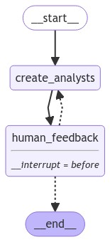
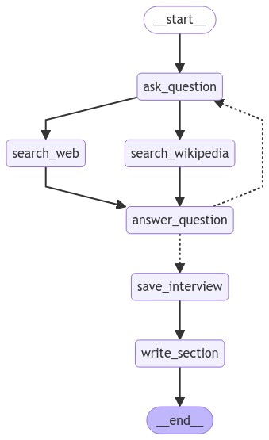

# LangGraph 研究助手案例详细解读

## 📋 案例概览

这个案例展示了如何使用 LangGraph 构建一个**智能研究助手系统**，它能够：

1. 根据研究主题自动生成多个专业分析师
2. 每个分析师对特定子主题进行深度访谈
3. 并行执行多个访谈以提高效率
4. 最终将所有访谈整合成一份完整的研究报告

---

## 📚 术语表

| 术语名称 | LangGraph 定义和解读 | Python 定义和说明 | 重要程度 |
|---------|---------------------|------------------|---------|
| **Human-in-the-Loop** | 在关键决策点人工介入审核和修改的机制 | 通过 `interrupt_before` 参数实现执行暂停，`update_state()` 修改状态 | ⭐⭐⭐⭐⭐ |
| **Send API** | 动态创建并行任务的核心工具，`Send(节点名, 状态)` | 根据运行时数据为每个分析师创建独立的访谈子图实例 | ⭐⭐⭐⭐⭐ |
| **Checkpointer（检查点）** | 保存每个节点执行后状态的机制 | `from langgraph.checkpoint.memory import MemorySaver`，支持中断恢复 | ⭐⭐⭐⭐⭐ |
| **interrupt_before** | 在指定节点前暂停执行的编译参数 | `graph.compile(interrupt_before=['节点名'])`，实现人工审核点 | ⭐⭐⭐⭐⭐ |
| **Pydantic BaseModel** | 定义结构化数据模型并支持验证的类 | 确保 LLM 输出格式一致，`with_structured_output(Model)` 使用 | ⭐⭐⭐⭐⭐ |
| **Sub-graph 嵌套** | 将编译后的子图作为节点添加到主图 | `builder.add_node("名称", sub_graph.compile())`，实现模块化 | ⭐⭐⭐⭐⭐ |
| **Map-Reduce 模式** | Map 阶段并行执行访谈，Reduce 阶段汇总报告的架构 | Send 创建多个访谈实例，operator.add 聚合 sections | ⭐⭐⭐⭐⭐ |
| **RAG（检索增强生成）** | 结合搜索结果（context）生成答案的模式 | search_web + search_wikipedia 提供事实依据，LLM 基于 context 回答 | ⭐⭐⭐⭐⭐ |
| **MessagesState** | LangGraph 内置状态类，包含 messages 字段管理对话历史 | `from langgraph.graph import MessagesState`，自动处理消息列表 | ⭐⭐⭐⭐ |
| **route_messages** | 控制对话循环的路由函数 | 检查轮数和结束信号，决定继续提问或结束访谈 | ⭐⭐⭐⭐ |
| **thread_id** | 标识会话的唯一 ID，用于 checkpointer 保存和恢复状态 | `{"configurable": {"thread_id": "1"}}`，实现多会话隔离 | ⭐⭐⭐⭐ |
| **update_state()** | 在中断点修改图状态的方法 | `graph.update_state(thread, {字段: 值}, as_node="节点名")` | ⭐⭐⭐⭐ |

---

### 核心技术点

- **人机协作**（Human-in-the-Loop）：用户可以审核并修改生成的分析师团队
- **结构化输出**：使用 Pydantic 模型确保数据格式一致
- **子图嵌套**：访谈流程作为独立子图嵌入主图
- **并行执行**（Map-Reduce）：使用 `Send()` API 同时运行多个访谈
- **检查点机制**：支持中断和恢复执行流程

---

## 🗺️ 整体架构图


```

**生成的流程图：**



用户输入研究主题
    ↓
┌─────────────────────────────────────────┐
│  第一阶段：生成分析师团队                │
├─────────────────────────────────────────┤
│  create_analysts → human_feedback       │
│         ↑                ↓               │
│         └────────────────┘               │
│      （可循环修改直到满意）               │
└─────────────────────────────────────────┘
    ↓
┌─────────────────────────────────────────┐
│  第二阶段：并行执行访谈（Map）           │
├─────────────────────────────────────────┤
│  分析师1 → 访谈子图 → 生成章节           │
│  分析师2 → 访谈子图 → 生成章节           │
│  分析师3 → 访谈子图 → 生成章节           │
│         （所有访谈同时进行）             │
└─────────────────────────────────────────┘
    ↓
┌─────────────────────────────────────────┐
│  第三阶段：汇总报告（Reduce）            │
├─────────────────────────────────────────┤
│  write_introduction ┐                   │
│  write_report       ├→ finalize_report  │
│  write_conclusion   ┘                   │
└─────────────────────────────────────────┘
    ↓
  最终报告
```

---

## 📚 代码分段详解

### 第一部分：定义数据结构

```python
class Analyst(BaseModel):
    affiliation: str  # 所属机构
    name: str         # 姓名
    role: str         # 角色
    description: str  # 描述
```

**作用**：这是一个 Pydantic 模型，定义了"分析师"的标准格式。

**为什么重要**？
- 使用结构化数据模型可以确保 LLM 输出的格式一致
- `@property` 装饰器创建了 `persona` 属性，将所有信息组合成一个字符串
- LangGraph 可以基于这个模型自动验证数据

---

### 第二部分：生成分析师（第一个图）

#### 状态定义

```python
class GenerateAnalystsState(TypedDict):
    topic: str                    # 研究主题
    max_analysts: int             # 最大分析师数量
    human_analyst_feedback: str   # 用户反馈
    analysts: List[Analyst]       # 生成的分析师列表
```

**关键概念**：状态（State）是 LangGraph 中的核心概念，它像一个"共享内存"，在各个节点之间传递数据。

---

#### 节点函数

**1. create_analysts 节点**

```python
def create_analysts(state: GenerateAnalystsState):
    # 使用 structured_output 确保 LLM 返回符合 Perspectives 格式的数据
    structured_llm = llm.with_structured_output(Perspectives)

    # 构建系统提示词
    system_message = analyst_instructions.format(
        topic=topic,
        human_analyst_feedback=human_analyst_feedback,
        max_analysts=max_analysts
    )

    # 调用 LLM 生成分析师
    analysts = structured_llm.invoke([SystemMessage(...)])

    return {"analysts": analysts.analysts}
```

**技术亮点**：
- `with_structured_output()` 强制 LLM 返回符合 `Perspectives` 模型的 JSON
- 提示词中包含了主题、用户反馈和数量限制
- 返回的字典会**更新**状态中的 `analysts` 字段

---

**2. human_feedback 节点**

```python
def human_feedback(state: GenerateAnalystsState):
    pass  # 空操作节点
```

**为什么需要空节点？**
- 这是一个"中断点"（interrupt point）
- 当执行到这里时，图会暂停，等待用户输入
- 用户可以通过 `graph.update_state()` 修改状态

---

**3. should_continue 条件边**

```python
def should_continue(state: GenerateAnalystsState):
    human_analyst_feedback = state.get('human_analyst_feedback', None)

    if human_analyst_feedback:
        return "create_analysts"  # 有反馈，重新生成

    return END  # 无反馈，结束
```

**逻辑说明**：
- 检查状态中是否有 `human_analyst_feedback`
- 如果有 → 回到 `create_analysts` 重新生成
- 如果没有 → 结束这个阶段

---

#### 图的构建

```python
builder = StateGraph(GenerateAnalystsState)
builder.add_node("create_analysts", create_analysts)
builder.add_node("human_feedback", human_feedback)

# 边的连接
builder.add_edge(START, "create_analysts")
builder.add_edge("create_analysts", "human_feedback")
builder.add_conditional_edges("human_feedback", should_continue,
                             ["create_analysts", END])

# 编译图
graph = builder.compile(
    interrupt_before=['human_feedback'],  # 在此节点前中断
    checkpointer=memory                   # 使用内存保存状态
)
```

**关键机制**：
- `interrupt_before` 使图在 `human_feedback` 前暂停
- `checkpointer` 保存执行状态，支持恢复
- `conditional_edges` 根据函数返回值决定下一步

---

### 第三部分：执行访谈（子图）

#### 访谈状态

```python
class InterviewState(MessagesState):
    max_num_turns: int      # 最大对话轮数
    context: Annotated[list, operator.add]  # 检索到的文档
    analyst: Analyst        # 当前分析师
    interview: str          # 访谈记录
    sections: list          # 生成的章节
```

**注意**：`context: Annotated[list, operator.add]`
- `Annotated` 指定了如何合并状态
- `operator.add` 表示新的 context 会追加到现有列表中
- 这样多个搜索结果可以累积

---

#### 核心节点

**1. generate_question - 分析师提问**

```python
def generate_question(state: InterviewState):
    analyst = state["analyst"]
    messages = state["messages"]

    # 构建系统提示
    system_message = question_instructions.format(goals=analyst.persona)

    # LLM 根据分析师的角色生成问题
    question = llm.invoke([SystemMessage(content=system_message)] + messages)

    return {"messages": [question]}
```

**工作流程**：
1. 获取分析师的人设（persona）
2. 结合对话历史，生成下一个问题
3. 问题会追加到消息列表中

---

**2. search_web 和 search_wikipedia - 并行搜索**

```python
def search_web(state: InterviewState):
    # 将对话转换为搜索查询
    structured_llm = llm.with_structured_output(SearchQuery)
    search_query = structured_llm.invoke([search_instructions] + state['messages'])

    # 使用 Tavily 搜索
    search_docs = tavily_search.invoke(search_query.search_query)

    # 格式化结果
    formatted_search_docs = "\n\n---\n\n".join([
        f'<Document href="{doc["url"]}"/>\n{doc["content"]}\n</Document>'
        for doc in search_docs
    ])

    return {"context": [formatted_search_docs]}
```

**技术细节**：
- 先用 LLM 将对话提炼成搜索查询
- 调用外部搜索工具（Tavily/Wikipedia）
- 格式化成带来源标注的文档
- 返回的 context 会自动合并到状态中

---

**3. generate_answer - 专家回答**

```python
def generate_answer(state: InterviewState):
    analyst = state["analyst"]
    messages = state["messages"]
    context = state["context"]  # 检索到的所有文档

    # 构建包含上下文的提示
    system_message = answer_instructions.format(
        goals=analyst.persona,
        context=context
    )

    # 生成答案
    answer = llm.invoke([SystemMessage(content=system_message)] + messages)
    answer.name = "expert"  # 标记消息来源

    return {"messages": [answer]}
```

**RAG 模式**：
- 使用检索到的 context 作为知识来源
- LLM 基于这些文档回答问题
- 答案中包含引用标注（如 [1], [2]）

---

**4. route_messages - 路由逻辑**

```python
def route_messages(state: InterviewState, name: str = "expert"):
    messages = state["messages"]
    max_num_turns = state.get('max_num_turns', 2)

    # 统计专家回答的次数
    num_responses = len([
        m for m in messages
        if isinstance(m, AIMessage) and m.name == name
    ])

    # 达到上限则保存访谈
    if num_responses >= max_num_turns:
        return 'save_interview'

    # 检查是否包含结束语
    last_question = messages[-2]
    if "Thank you so much for your help" in last_question.content:
        return 'save_interview'

    return "ask_question"  # 继续提问
```

**控制逻辑**：
- 限制访谈轮数，防止无限循环
- 检测结束信号（感谢语）
- 决定是继续提问还是结束访谈

---

**5. write_section - 生成章节**

```python
def write_section(state: InterviewState):
    interview = state["interview"]
    context = state["context"]
    analyst = state["analyst"]

    system_message = section_writer_instructions.format(
        focus=analyst.description
    )

    section = llm.invoke([
        SystemMessage(content=system_message),
        HumanMessage(content=f"Use this source to write your section: {context}")
    ])

    return {"sections": [section.content]}
```

**报告生成**：
- 基于访谈内容和检索文档
- 生成结构化的 Markdown 章节
- 包含摘要和来源引用

---

#### 子图构建

```python
interview_builder = StateGraph(InterviewState)

# 添加所有节点
interview_builder.add_node("ask_question", generate_question)
interview_builder.add_node("search_web", search_web)
interview_builder.add_node("search_wikipedia", search_wikipedia)
interview_builder.add_node("answer_question", generate_answer)
interview_builder.add_node("save_interview", save_interview)
interview_builder.add_node("write_section", write_section)

# 关键：并行搜索
interview_builder.add_edge(START, "ask_question")
interview_builder.add_edge("ask_question", "search_web")
interview_builder.add_edge("ask_question", "search_wikipedia")  # 同时触发
interview_builder.add_edge("search_web", "answer_question")
interview_builder.add_edge("search_wikipedia", "answer_question")

# 条件路由
interview_builder.add_conditional_edges("answer_question", route_messages,
                                       ['ask_question', 'save_interview'])

interview_builder.add_edge("save_interview", "write_section")
interview_builder.add_edge("write_section", END)
```

**执行流程**：
```
ask_question
    ├─→ search_web ──┐
    └─→ search_wikipedia ──┤
                           ↓
                    answer_question
                           ↓
            ┌──────────────┴──────────────┐
            ↓                              ↓
       ask_question                 save_interview
      （继续循环）                        ↓
                                   write_section
                                        ↓
                                       END
```

---

### 第四部分：主图 - Map-Reduce 模式

#### 主状态

```python
class ResearchGraphState(TypedDict):
    topic: str
    max_analysts: int
    human_analyst_feedback: str
    analysts: List[Analyst]
    sections: Annotated[list, operator.add]  # 累积所有章节
    introduction: str
    content: str
    conclusion: str
    final_report: str
```

---

#### initiate_all_interviews - Map 步骤

```python
def initiate_all_interviews(state: ResearchGraphState):
    human_analyst_feedback = state.get('human_analyst_feedback')

    if human_analyst_feedback:
        return "create_analysts"  # 返回修改分析师

    # 关键：使用 Send() API 并行启动多个子图
    else:
        topic = state["topic"]
        return [
            Send("conduct_interview", {
                "analyst": analyst,
                "messages": [HumanMessage(
                    content=f"So you said you were writing an article on {topic}?"
                )]
            })
            for analyst in state["analysts"]
        ]
```

**Send() API 的魔力**：
- 为每个分析师创建一个独立的访谈子图实例
- 所有访谈**并行执行**
- 每个子图的 `sections` 输出会自动合并到主状态

**类比**：
- 就像一个经理同时派遣多个员工去不同地点调研
- 每个员工独立工作，最后汇报结果
- 经理整合所有报告

---

#### Reduce 步骤

**1. write_report - 整合章节**

```python
def write_report(state: ResearchGraphState):
    sections = state["sections"]  # 包含所有分析师的章节
    topic = state["topic"]

    # 将所有章节合并成一个字符串
    formatted_str_sections = "\n\n".join([f"{section}" for section in sections])

    # LLM 整合成连贯的报告主体
    system_message = report_writer_instructions.format(
        topic=topic,
        context=formatted_str_sections
    )

    report = llm.invoke([
        SystemMessage(content=system_message),
        HumanMessage(content="Write a report based upon these memos.")
    ])

    return {"content": report.content}
```

---

**2. write_introduction / write_conclusion**

```python
def write_introduction(state: ResearchGraphState):
    sections = state["sections"]
    formatted_str_sections = "\n\n".join([f"{section}" for section in sections])

    instructions = intro_conclusion_instructions.format(
        topic=topic,
        formatted_str_sections=formatted_str_sections
    )

    intro = llm.invoke([instructions, HumanMessage(content="Write the report introduction")])

    return {"introduction": intro.content}
```

---

**3. finalize_report - 组装最终报告**

```python
def finalize_report(state: ResearchGraphState):
    content = state["content"]

    # 清理和分离来源部分
    if content.startswith("## Insights"):
        content = content.strip("## Insights")

    if "## Sources" in content:
        content, sources = content.split("\n## Sources\n")

    # 组装完整报告
    final_report = (
        state["introduction"] + "\n\n---\n\n" +
        content + "\n\n---\n\n" +
        state["conclusion"]
    )

    if sources:
        final_report += "\n\n## Sources\n" + sources

    return {"final_report": final_report}
```

---

#### 主图构建

```python
builder = StateGraph(ResearchGraphState)

# 第一阶段：生成分析师
builder.add_node("create_analysts", create_analysts)
builder.add_node("human_feedback", human_feedback)

# 第二阶段：执行访谈（子图）
builder.add_node("conduct_interview", interview_builder.compile())

# 第三阶段：生成报告
builder.add_node("write_report", write_report)
builder.add_node("write_introduction", write_introduction)
builder.add_node("write_conclusion", write_conclusion)
builder.add_node("finalize_report", finalize_report)

# 流程控制
builder.add_edge(START, "create_analysts")
builder.add_edge("create_analysts", "human_feedback")
builder.add_conditional_edges("human_feedback", initiate_all_interviews,
                             ["create_analysts", "conduct_interview"])

# 关键：并行生成介绍、结论和主体
builder.add_edge("conduct_interview", "write_report")
builder.add_edge("conduct_interview", "write_introduction")
builder.add_edge("conduct_interview", "write_conclusion")

# 汇总
builder.add_edge(["write_conclusion", "write_report", "write_introduction"],
                "finalize_report")
builder.add_edge("finalize_report", END)

# 编译
graph = builder.compile(
    interrupt_before=['human_feedback'],
    checkpointer=memory
)
```

**生成的流程图：**




---

## 🔑 核心技术解析

### 1. 人机协作（Human-in-the-Loop）

**实现方式**：
```python
graph = builder.compile(interrupt_before=['human_feedback'], checkpointer=memory)
```

**工作流程**：
1. 图执行到 `human_feedback` 前暂停
2. 用户通过 `graph.update_state()` 修改状态
3. 继续执行 `graph.stream(None, thread)`

**实际应用**：
```python
# 第一次运行
for event in graph.stream(initial_input, thread):
    pass  # 在 human_feedback 前停止

# 用户审核并反馈
graph.update_state(thread, {
    "human_analyst_feedback": "Add a startup CEO"
}, as_node="human_feedback")

# 继续运行
for event in graph.stream(None, thread):
    pass  # 重新生成分析师
```

---

### 2. Send() API - 动态并行

**传统方式 vs Send()**：

传统方式（静态）：
```python
builder.add_edge("node_a", "node_b")
builder.add_edge("node_a", "node_c")
# 必须预先知道有多少个节点
```

Send() 方式（动态）：
```python
def dynamic_dispatch(state):
    return [
        Send("subgraph", {"input": item})
        for item in state["items"]  # 数量在运行时确定
    ]

builder.add_conditional_edges("dispatcher", dynamic_dispatch)
```

**本案例应用**：
- 分析师数量由用户输入和 LLM 决定
- 每个分析师对应一个独立的访谈子图实例
- 所有访谈同时运行，大幅提高效率

---

### 3. 子图（Subgraph）

**为什么使用子图？**
- 封装复杂逻辑（访谈流程）
- 可复用（每个分析师复用相同流程）
- 状态隔离（每个访谈有独立的消息历史）

**集成方式**：
```python
# 子图
interview_graph = interview_builder.compile()

# 嵌入主图
builder.add_node("conduct_interview", interview_graph)
```

**生成的流程图：**


**状态传递**：
- 主图通过 `Send()` 传递初始状态给子图
- 子图的 `sections` 输出自动合并到主图状态

---

### 4. 结构化输出

**Pydantic 模型 + with_structured_output()**：

```python
class Analyst(BaseModel):
    name: str
    role: str
    # ... 其他字段

structured_llm = llm.with_structured_output(Perspectives)
result = structured_llm.invoke(messages)  # 自动验证和解析
```

**优势**：
- 保证数据格式一致
- 自动类型检查
- 易于后续处理

---

### 5. 检查点（Checkpointer）

**作用**：
- 保存每个节点执行后的状态
- 支持中断和恢复
- 实现时间旅行调试

**使用方式**：
```python
memory = MemorySaver()
graph = builder.compile(checkpointer=memory)

# 使用 thread_id 标识会话
thread = {"configurable": {"thread_id": "1"}}
graph.stream(input, thread)

# 查看当前状态
state = graph.get_state(thread)

# 恢复执行
graph.stream(None, thread)
```

---

## 💡 最佳实践和技巧

### 1. 控制 LLM 输出格式

**问题**：LLM 输出格式不稳定

**解决**：
```python
# 定义严格的 Pydantic 模型
class Output(BaseModel):
    field1: str = Field(description="详细描述")
    field2: int

# 强制结构化输出
structured_llm = llm.with_structured_output(Output)
result = structured_llm.invoke(prompt)  # 保证符合 Output 格式
```

---

### 2. 循环控制

**问题**：对话可能无限循环

**解决**：
```python
def route_messages(state):
    max_turns = state.get('max_num_turns', 2)
    current_turns = count_turns(state['messages'])

    if current_turns >= max_turns:
        return 'end_node'

    if detect_end_signal(state['messages']):
        return 'end_node'

    return 'continue_node'
```

---

### 3. 并行节点的结果合并

**使用 Annotated**：
```python
from typing import Annotated
import operator

class State(TypedDict):
    results: Annotated[list, operator.add]  # 自动追加
```

**效果**：
- 节点 A 返回 `{"results": [1, 2]}`
- 节点 B 返回 `{"results": [3, 4]}`
- 最终状态：`{"results": [1, 2, 3, 4]}`

---

### 4. 提示词工程

**分层提示**：
```python
# 系统级指令
system_prompt = """You are an expert. Follow these rules:
1. Rule 1
2. Rule 2
"""

# 角色级指令
role_prompt = f"Your role: {analyst.persona}"

# 任务级指令
task_prompt = "Answer this question: ..."

# 组合
llm.invoke([
    SystemMessage(content=system_prompt),
    SystemMessage(content=role_prompt),
    HumanMessage(content=task_prompt)
])
```

---

## 🎯 实战建议

### 对于初学者

1. **先理解单个节点**
   - 从 `create_analysts` 开始
   - 单独测试每个函数

2. **逐步构建图**
   - 先构建最简单的线性图
   - 再添加条件边和循环

3. **善用可视化**
   ```python
   graph.get_graph().draw_mermaid_png()
   ```

4. **使用 LangSmith 调试**
   - 查看每个节点的输入输出
   - 追踪 LLM 调用

---

### 对于进阶使用

1. **优化并行性**
   - 识别可以并行的节点
   - 使用 `Send()` 动态分发

2. **成本控制**
   - 使用更小的模型做路由
   - 缓存重复的 LLM 调用

3. **错误处理**
   ```python
   def safe_node(state):
       try:
           return process(state)
       except Exception as e:
           return {"error": str(e)}
   ```

4. **扩展检索源**
   - 添加更多搜索工具
   - 集成本地文档库

---

## 📌 总结

这个案例是 LangGraph 的一个综合示范，展示了：

### 架构设计
- **分层结构**：主图 + 子图
- **清晰职责**：每个节点只做一件事
- **灵活控制**：条件路由 + 循环检测

### 技术要点
- **结构化输出**：确保数据质量
- **人机协作**：关键决策点人工介入
- **并行执行**：提高系统效率
- **检查点机制**：支持中断恢复

### 应用价值
- **可定制**：轻松调整分析师类型、搜索源、报告格式
- **可扩展**：添加新的节点和功能
- **生产级**：完整的错误处理和状态管理

---

## 🚀 后续学习建议

1. **修改案例**
   - 改变研究主题
   - 调整分析师数量和类型
   - 使用不同的 LLM 模型

2. **扩展功能**
   - 添加图表生成
   - 集成更多数据源
   - 实现多语言支持

3. **优化性能**
   - 实现结果缓存
   - 使用流式输出
   - 添加速率限制

4. **深入原理**
   - 研究 LangGraph 的消息传递机制
   - 理解状态更新的原子性
   - 学习高级路由策略

---

## 🎤 深入理解：Interview 子图在系统中的核心作用

**Interview 子图**是整个研究助手系统的"心脏"，它承担着最关键的知识获取任务。从系统架构的角度看，它扮演着三重角色：

首先，它是**知识生产的引擎**。通过模拟"分析师-专家"的对话模式，Interview 子图将抽象的研究主题转化为具体的、有深度的知识内容。这种多轮对话机制（ask_question → search → answer → ask_question）实现了渐进式的知识挖掘，每一轮对话都在前一轮的基础上深入，最终形成有价值的研究章节。

其次，它是**并行化架构的基本单元**。通过 `Send()` API，系统可以同时启动多个 Interview 实例，每个实例独立运行，互不干扰。这种设计使得 3 个分析师的访谈可以在相同时间内完成，而不是串行执行。子图的状态隔离特性确保了每个分析师都有独立的对话历史和上下文，避免了信息混淆。

最后，它是**Map-Reduce 模式的 Map 阶段实现**。每个 Interview 子图接收一个分析师作为输入，输出一个结构化的研究章节（section）。这些章节通过 `Annotated[list, operator.add]` 自动聚合到主图状态中，为后续的 Reduce 阶段（write_report、write_introduction、write_conclusion）提供原材料。这种清晰的输入输出接口使得子图可以无缝集成到更大的系统中。

从技术实现上看，Interview 子图还展示了 LangGraph 的几个重要模式：**RAG 检索增强**（通过 search_web 和 search_wikipedia 为回答提供事实依据）、**循环控制**（通过 route_messages 防止无限对话）、**消息角色管理**（区分 analyst 和 expert 的发言）。这些模式的组合使得 Interview 不仅仅是一个简单的问答流程，而是一个完整的、可控的、高质量的知识生产流水线。

---

**最后的话**：LangGraph 的强大之处在于它让你像搭积木一样构建复杂的 AI 系统。这个研究助手案例虽然复杂，但每个组件都很简单。掌握了这些基础构建块，你就可以创造出无限可能的应用！
