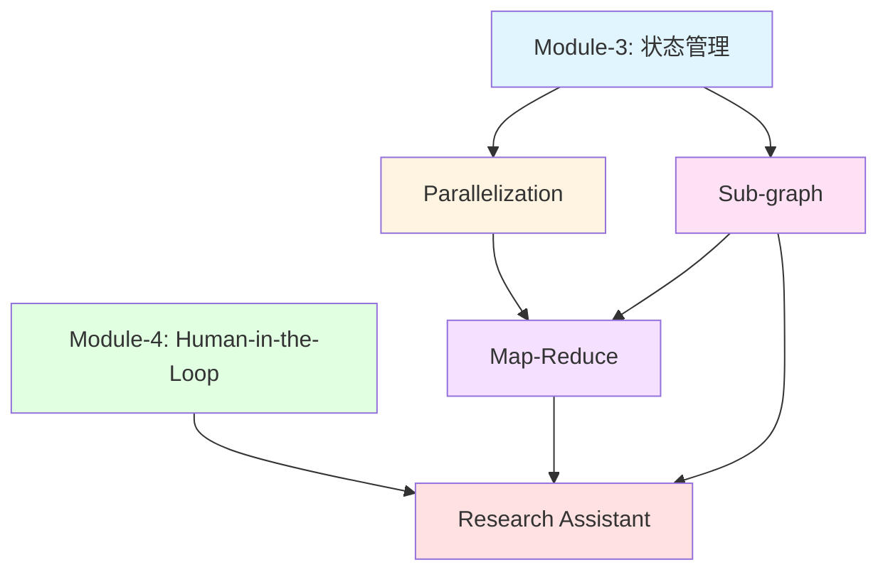

# Module-5 本章介绍：精通高级图模式与架构设计

> **来自图灵奖获得者的寄语**
>
> "软件工程的本质是管理复杂性。当系统变得复杂时，我们不是逃避复杂性，而是通过更好的抽象来驾驭它。在 LangGraph 中,你即将学习的高级模式——并行化、子图、Map-Reduce——正是这样的抽象工具。它们让你能够构建模块化、可扩展、高性能的 AI 系统。记住:真正的大师不是写出最复杂的代码,而是用最简洁的架构解决最复杂的问题。"
>
> — *启发自 Edsger W. Dijkstra 关于结构化编程的哲学*

---

## 📚 本章概览

本章将深入探讨 LangGraph 的高级图模式和架构设计原则。你将学会如何构建**企业级、可扩展、高性能**的 AI 系统,掌握从简单顺序执行到复杂并行处理的完整技能树。这些不仅是技术技巧,更是构建生产级 AI 应用的核心能力。

### 学习目标

通过本章学习,你将掌握:

1. **Parallelization(并行执行)** - Fan-out/Fan-in 模式、Reducer 机制、并发状态管理
2. **Sub-graph(子图)** - 模块化设计、状态隔离、输出模式控制
3. **Map-Reduce** - Send API 动态分发、大规模任务分解与聚合
4. **Research Assistant(综合案例)** - Human-in-the-Loop + 子图 + Map-Reduce 的完整集成

### 本章架构图

```
Module-5: 高级图模式完整体系
├─ 5.1 Parallelization (难度: ⭐⭐⭐)
│   ├─ Fan-out/Fan-in 模式
│   ├─ Reducer 机制 (operator.add)
│   ├─ 自定义 Reducer
│   └─ 并行路径同步
│
├─ 5.2 Sub-graph (难度: ⭐⭐⭐⭐)
│   ├─ 状态隔离 (state_schema)
│   ├─ 输出控制 (output_schema)
│   ├─ 子图编译与嵌套
│   └─ 模块化设计原则
│
├─ 5.3 Map-Reduce (难度: ⭐⭐⭐⭐⭐)
│   ├─ Send API 动态分发
│   ├─ Map 阶段 (并行处理)
│   ├─ Reduce 阶段 (结果聚合)
│   └─ 多层 Map-Reduce
│
└─ 5.4 Research Assistant (难度: ⭐⭐⭐⭐⭐)
    ├─ 多模块协同 (Human-in-the-Loop + Sub-graph + Map-Reduce)
    ├─ RAG 模式 (检索增强生成)
    ├─ 结构化输出 (Pydantic)
    └─ 生产级架构设计
```

### 知识依赖关系



---

## 🎯 核心概念预览

### 1. Parallelization: 性能的"倍增器"

**核心思想:** 让多个节点在同一时间步内并行执行,充分利用计算资源。

#### Fan-out/Fan-in 模式

```
         START
           |
        [Node A]
         /   \
        /     \
   [Node B] [Node C]  ← Fan-out (扇出)
        \     /
         \   /
        [Node D]       ← Fan-in (扇入)
           |
          END
```

**典型应用场景:**
```python
# 场景:并行检索多个数据源
START → prepare_query
         ├→ search_wikipedia → aggregate
         ├→ search_web       → aggregate
         └→ search_database  → aggregate
                                   ↓
                                  END
```

#### Reducer 机制 - 解决并行冲突

**问题:** 多个并行节点更新同一状态字段时会冲突

```python
# ❌ 错误:没有 Reducer
class State(TypedDict):
    results: list  # B 和 C 同时写入会报错

# ✅ 正确:使用 Reducer
from operator import add
from typing import Annotated

class State(TypedDict):
    results: Annotated[list, add]  # 自动合并更新
```

**Reducer 工作原理:**
```python
# B 节点返回
{"results": ["result_from_B"]}

# C 节点返回
{"results": ["result_from_C"]}

# operator.add 合并后
{"results": ["result_from_B", "result_from_C"]}
```

**常用 Reducer:**

| Reducer | 适用类型 | 作用 |
|---------|---------|------|
| `operator.add` | list | 列表拼接 |
| `add_messages` | list[BaseMessage] | 消息合并(去重、更新) |
| 自定义 | 任意 | 完全自定义合并逻辑 |

**自定义 Reducer 示例:**
```python
def merge_with_priority(left, right):
    """按优先级合并结果"""
    combined = (left if isinstance(left, list) else [left]) + \
               (right if isinstance(right, list) else [right])

    # 按优先级排序
    return sorted(combined, key=lambda x: x.get('priority', 0), reverse=True)

class State(TypedDict):
    results: Annotated[list, merge_with_priority]
```

---

### 2. Sub-graph: 模块化的"乐高积木"

**核心思想:** 将复杂图分解为独立的子图模块,每个子图有自己的状态空间和逻辑。

#### 为什么需要子图?

**没有子图的困境:**
```python
# 主图状态包含所有字段(混乱)
class State(TypedDict):
    # 主流程字段
    user_input: str
    final_result: str

    # 子任务 A 的中间变量
    task_a_temp1: str
    task_a_temp2: int

    # 子任务 B 的中间变量
    task_b_temp1: list
    task_b_temp2: dict

    # ... 越来越多的字段,难以维护
```

**使用子图的清晰架构:**
```python
# 主图状态(简洁)
class MainState(TypedDict):
    user_input: str
    task_a_result: str
    task_b_result: str
    final_result: str

# 子图 A 状态(独立)
class TaskAState(TypedDict):
    input: str
    temp1: str  # 只在子图内部使用
    temp2: int  # 不会泄漏到主图
    result: str

# 子图 B 状态(独立)
class TaskBState(TypedDict):
    input: str
    temp1: list  # 与 TaskA 的 temp1 完全隔离
    temp2: dict
    result: str
```

#### 状态隔离机制

**完整状态 vs 输出状态:**
```python
# 子图内部状态(完整)
class SubGraphState(TypedDict):
    input: str       # 输入
    temp1: str       # 中间变量
    temp2: int       # 中间变量
    result: str      # 输出

# 子图输出状态(只返回需要的)
class SubGraphOutput(TypedDict):
    result: str      # 只返回这个字段

# 构建子图
sub_graph = StateGraph(
    state_schema=SubGraphState,     # 内部使用完整状态
    output_schema=SubGraphOutput    # 只输出 result
)
```

**类比:** 子图就像一个函数
```python
# 函数有局部变量和返回值
def function(input_data):
    temp1 = process_step1(input_data)  # 局部变量
    temp2 = process_step2(temp1)       # 局部变量
    result = finalize(temp2)
    return result  # 只返回结果,不返回 temp1/temp2

# 子图也有内部状态和输出状态
# state_schema = 函数的所有局部变量
# output_schema = 函数的 return 语句
```

#### 子图嵌套示例

```python
# 定义子图
sub_builder = StateGraph(SubGraphState, output_schema=SubGraphOutput)
sub_builder.add_node("step1", step1_func)
sub_builder.add_node("step2", step2_func)
sub_builder.add_edge(START, "step1")
sub_builder.add_edge("step1", "step2")
sub_builder.add_edge("step2", END)
sub_graph = sub_builder.compile()

# 将子图作为节点添加到主图
main_builder = StateGraph(MainState)
main_builder.add_node("normal_node", normal_func)
main_builder.add_node("sub_task", sub_graph)  # ⭐ 子图也是节点
main_builder.add_edge(START, "normal_node")
main_builder.add_edge("normal_node", "sub_task")
main_builder.add_edge("sub_task", END)
```

---

### 3. Map-Reduce: 大规模任务的"分治策略"

**核心思想:** 将大任务分解为多个小任务并行处理,然后聚合结果。

#### 经典 Map-Reduce 流程

```
输入: 处理 100 个文档

Map 阶段 (并行):
文档1-20  → Worker 1 → 摘要1
文档21-40 → Worker 2 → 摘要2
文档41-60 → Worker 3 → 摘要3
文档61-80 → Worker 4 → 摘要4
文档81-100→ Worker 5 → 摘要5

Reduce 阶段 (聚合):
所有摘要 → 整合成最终报告
```

#### Send API - 动态任务分发 ⭐

**传统并行 vs Send API:**

**传统方式(静态,固定数量):**
```python
# 只能并行 3 个固定节点
builder.add_edge("input", "task1")
builder.add_edge("input", "task2")
builder.add_edge("input", "task3")
# 如果有 10 个任务怎么办?需要添加 10 条边?
```

**Send API(动态,灵活扩展):**
```python
from langgraph.types import Send

def dynamic_dispatch(state):
    tasks = state["tasks"]  # 可能是 3 个,也可能是 100 个

    # 自动为每个任务创建并行节点
    return [Send("process_task", {"task": t}) for t in tasks]

# 无论多少任务,都能自动并行处理
builder.add_conditional_edges("input", dynamic_dispatch, ["process_task"])
```

**Send API 的魔力:**
```python
Send("目标节点名", {"发送的状态数据"})
#    ^^^^^^^^^^  ^^^^^^^^^^^^^^^^^^^^
#    要执行的节点  传递给该节点的状态(可以是部分状态)

# 示例:生成笑话
subjects = ["animals", "technology", "sports"]

return [
    Send("generate_joke", {"subject": "animals"}),
    Send("generate_joke", {"subject": "technology"}),
    Send("generate_joke", {"subject": "sports"})
]
# 会创建 3 个并行的 generate_joke 节点实例
```

#### 完整 Map-Reduce 示例

```python
from langgraph.types import Send
import operator
from typing import Annotated

# 状态定义
class OverallState(TypedDict):
    topic: str                                  # 主题
    subtopics: list[str]                        # 子主题(Map 输入)
    results: Annotated[list, operator.add]      # 结果(Map 输出,需要 Reducer)
    final_summary: str                          # 最终摘要(Reduce 输出)

class SubtopicState(TypedDict):
    subtopic: str  # Map 节点只需要子主题

# Map 阶段:生成子主题
def generate_subtopics(state: OverallState):
    topic = state["topic"]
    # LLM 生成 5 个子主题
    subtopics = llm_generate_subtopics(topic)
    return {"subtopics": subtopics}

# 动态分发
def dispatch_to_map(state: OverallState):
    return [
        Send("process_subtopic", {"subtopic": st})
        for st in state["subtopics"]
    ]

# Map 阶段:并行处理每个子主题
def process_subtopic(state: SubtopicState):
    subtopic = state["subtopic"]
    result = llm_analyze(subtopic)
    return {"results": [result]}  # 注意是列表

# Reduce 阶段:聚合所有结果
def summarize_results(state: OverallState):
    all_results = "\n\n".join(state["results"])
    summary = llm_summarize(all_results)
    return {"final_summary": summary}

# 构建图
builder = StateGraph(OverallState)
builder.add_node("generate_subtopics", generate_subtopics)
builder.add_node("process_subtopic", process_subtopic)
builder.add_node("summarize_results", summarize_results)

builder.add_edge(START, "generate_subtopics")
builder.add_conditional_edges(
    "generate_subtopics",
    dispatch_to_map,
    ["process_subtopic"]
)
builder.add_edge("process_subtopic", "summarize_results")
builder.add_edge("summarize_results", END)

graph = builder.compile()
```

---

### 4. Research Assistant: 综合案例 - "交响乐团"

**核心思想:** 将所有高级模式组合成一个完整的生产级系统。

#### 系统架构

```
阶段 1: 生成分析师团队 (Human-in-the-Loop + 子图)
用户输入主题 → [create_analysts] → [human_feedback] ⇄ 用户审批
                                          ↓
阶段 2: 并行访谈 (Map-Reduce + Sub-graph)
                      ┌─→ [分析师1-访谈子图] → 章节1
                      ├─→ [分析师2-访谈子图] → 章节2
分析师列表 → Send API ┼─→ [分析师3-访谈子图] → 章节3
                      ├─→ [分析师4-访谈子图] → 章节4
                      └─→ [分析师5-访谈子图] → 章节5
                              ↓
阶段 3: 报告汇总 (Reduce)
所有章节 → [write_introduction]  ┐
        → [write_report]         ├→ [finalize_report] → 最终报告
        → [write_conclusion]     ┘
```

#### 访谈子图详解

每个访谈子图是一个独立的 RAG (检索增强生成) 流程:

```
访谈子图内部流程:
[generate_question] 分析师提问
    ↓
    ├→ [search_web]       ┐
    └→ [search_wikipedia] ┘ 并行检索
              ↓
    [generate_answer] 基于检索结果回答
              ↓
    判断: 继续提问 or 结束访谈?
    ├─ 继续 → 回到 generate_question (最多 N 轮)
    └─ 结束 → [save_interview] → [write_section] → 返回章节
```

#### 关键技术点

**1. 结构化输出 (Pydantic):**
```python
from pydantic import BaseModel

class Analyst(BaseModel):
    name: str
    role: str
    affiliation: str
    description: str

    @property
    def persona(self) -> str:
        return f"{self.name}, {self.role} at {self.affiliation}. {self.description}"

# LLM 返回符合这个结构的数据
structured_llm = llm.with_structured_output(Analyst)
analyst = structured_llm.invoke("Generate an AI expert")
```

**2. Human-in-the-Loop 循环:**
```python
def should_continue(state):
    # 如果用户提供了反馈,重新生成分析师
    if state.get("human_feedback"):
        return "create_analysts"
    else:
        return END

# 在 human_feedback 前中断
graph = builder.compile(
    interrupt_before=["human_feedback"],
    checkpointer=memory
)
```

**3. Send API 动态分发访谈:**
```python
def initiate_interviews(state):
    analysts = state["analysts"]
    topic = state["topic"]

    # 为每个分析师创建独立的访谈子图实例
    return [
        Send("conduct_interview", {
            "analyst": analyst,
            "messages": [HumanMessage(f"Tell me about {topic}")]
        })
        for analyst in analysts
    ]
```

**4. 状态隔离与聚合:**
```python
# 主图状态
class ResearchState(TypedDict):
    topic: str
    analysts: list[Analyst]
    sections: Annotated[list, operator.add]  # 收集所有章节
    final_report: str

# 访谈子图状态(完全隔离)
class InterviewState(MessagesState):
    analyst: Analyst
    context: Annotated[list, operator.add]  # 检索的文档
    interview: str
    sections: list  # 只有这个字段会返回主图

# 子图只返回 sections
interview_graph = StateGraph(
    InterviewState,
    output_schema=TypedDict("Output", {"sections": list})
)
```

---

## 🗺️ 学习路线图

### 初学者路径 (3-5 天)

**目标:** 掌握基础并行和子图模式

**Day 1-2: Parallelization**
- ✅ 理解 Fan-out/Fan-in 模式
- ✅ 掌握 `operator.add` Reducer
- ✅ 实现简单的并行检索
- 🎯 实战:构建并行查询多个 API 的系统

**Day 3-4: Sub-graph**
- ✅ 理解状态隔离的必要性
- ✅ 掌握 `state_schema` 和 `output_schema`
- ✅ 实现子图嵌套
- 🎯 实战:将复杂流程拆分为独立子图模块

**Day 5: 综合练习**
- 🎯 项目:构建一个支持并行和子图的问答系统
- 📝 复习:巩固 Reducer、子图编译等核心概念

---

### 进阶者路径 (4-6 天)

**目标:** 精通 Map-Reduce 和复杂模式组合

**Day 1-2: Map-Reduce 基础**
- ✅ 深入理解 Send API
- ✅ 实现动态任务分发
- ✅ 掌握 Map 和 Reduce 阶段设计
- 🎯 实战:构建批量文档摘要系统

**Day 3-4: 高级 Map-Reduce**
- ✅ 学习多层 Map-Reduce
- ✅ 掌握条件性分发
- ✅ 优化性能和资源使用
- 🎯 实战:实现可配置的数据处理管道

**Day 5-6: 模式组合**
- ✅ Sub-graph + Map-Reduce 集成
- ✅ Parallelization + Human-in-the-Loop
- 🎯 实战:构建复杂的多智能体系统

---

### 专家路径 (6-10 天)

**目标:** 构建生产级的企业应用

**Day 1-3: Research Assistant 深度学习**
- ✅ 分析完整架构设计
- ✅ 理解每个模块的职责
- ✅ 掌握 RAG 模式实现
- ✅ 学习结构化输出最佳实践
- 🎯 实战:复现 Research Assistant 系统

**Day 4-6: 架构优化**
- ✅ 性能优化:并行度控制、缓存策略
- ✅ 错误处理:子图失败恢复、重试机制
- ✅ 可观测性:日志、指标、追踪
- 🎯 实战:为系统添加完整的监控和容错

**Day 7-10: 大型综合项目**
- 🎯 项目选项:
  - 多智能体协作平台
  - 企业级知识管理系统
  - 自动化研究助手
  - 复杂工作流编排引擎

---

## 💡 学习建议

### 1. 从简单到复杂的渐进路径

**阶段 1:单一模式掌握**
```python
# 先单独掌握并行
graph_parallel = build_parallel_graph()

# 再单独掌握子图
graph_subgraph = build_graph_with_subgraph()

# 最后单独掌握 Map-Reduce
graph_mapreduce = build_mapreduce_graph()
```

**阶段 2:两两组合**
```python
# 并行 + 子图
graph = build_parallel_subgraph()

# Map-Reduce + 子图
graph = build_mapreduce_with_subgraph()
```

**阶段 3:完整集成**
```python
# 所有模式组合
graph = build_research_assistant()
```

---

### 2. 调试技巧

**可视化图结构:**
```python
from IPython.display import Image, display

# 生成图的 Mermaid 图表
display(Image(graph.get_graph().draw_mermaid_png()))
```

**追踪执行流程:**
```python
for step in graph.stream(input_data, config, stream_mode="debug"):
    print(f"Step: {step['step']}")
    print(f"Node: {step['node']}")
    print(f"State: {step['state']}")
    print("=" * 50)
```

**子图调试:**
```python
# 先单独测试子图
sub_graph_result = sub_graph.invoke(test_input)
print("Sub-graph output:", sub_graph_result)

# 再集成到主图测试
main_graph_result = main_graph.invoke(test_input)
```

---

### 3. 性能优化策略

**控制并行度:**
```python
import asyncio

# 限制最大并发数
async def controlled_send(tasks, max_concurrent=10):
    semaphore = asyncio.Semaphore(max_concurrent)

    async def limited_task(task):
        async with semaphore:
            return await process(task)

    return await asyncio.gather(*[limited_task(t) for t in tasks])
```

**缓存重复计算:**
```python
from functools import lru_cache

@lru_cache(maxsize=1000)
def expensive_operation(input_hash):
    return llm_call(input_hash)
```

**批量处理:**
```python
# 将小任务合并批处理
def batch_process(tasks, batch_size=10):
    for i in range(0, len(tasks), batch_size):
        batch = tasks[i:i+batch_size]
        yield llm_batch_invoke(batch)
```

---

### 4. 架构设计原则

**原则 1:单一职责**
```python
# ✅ 每个子图只做一件事
create_analysts_graph = ...  # 只负责生成分析师
conduct_interview_graph = ...  # 只负责执行访谈
write_report_graph = ...       # 只负责报告生成

# ❌ 避免大而全的子图
everything_graph = ...  # 包含所有逻辑
```

**原则 2:最小化状态共享**
```python
# ✅ 子图只接收必需的输入
class InterviewInput(TypedDict):
    analyst: Analyst  # 只需要分析师信息

# ❌ 传递整个主状态
class InterviewInput(TypedDict):
    analyst: Analyst
    all_analysts: list  # 不需要
    topic: str           # 不需要
    ...
```

**原则 3:明确的接口**
```python
# 使用 output_schema 明确子图的输出
interview_graph = StateGraph(
    InterviewState,
    output_schema=TypedDict("Output", {
        "sections": list  # 明确只返回章节
    })
)
```

---

## 📊 知识点速查表

### Parallelization

| 概念 | 说明 | 示例 |
|------|------|------|
| Fan-out | 一个节点扇出到多个节点 | `add_edge("A", "B"); add_edge("A", "C")` |
| Fan-in | 多个节点汇聚到一个节点 | `add_edge("B", "D"); add_edge("C", "D")` |
| Reducer | 合并并行更新 | `Annotated[list, operator.add]` |
| 自定义 Reducer | 自定义合并逻辑 | `def my_reducer(left, right): ...` |

### Sub-graph

| API | 作用 | 示例 |
|-----|------|------|
| `state_schema` | 子图内部状态 | `StateGraph(SubState)` |
| `output_schema` | 子图输出字段 | `StateGraph(SubState, output_schema=Output)` |
| `compile()` | 编译子图 | `sub_graph = builder.compile()` |
| 嵌套 | 子图作为节点 | `main_builder.add_node("sub", sub_graph)` |

### Map-Reduce

| API | 作用 | 示例 |
|-----|------|------|
| `Send` | 动态任务分发 | `Send("node", {"data": value})` |
| Map 阶段 | 并行处理 | 返回多个 `Send` 对象 |
| Reduce 阶段 | 结果聚合 | 使用 Reducer 收集所有结果 |

---

## 附录: 术语表

### 架构模式

- **Fan-out (扇出)**: 一个节点的输出分发到多个并行节点
- **Fan-in (扇入)**: 多个并行节点的输出汇聚到一个节点
- **Map-Reduce**: 将大任务分解为小任务并行处理,然后聚合结果
- **RAG (检索增强生成)**: 结合检索和生成的模式,先检索相关信息再生成回答

### 技术术语

- **Reducer**: 定义如何合并多个并行更新的函数
- **Send API**: LangGraph 的动态任务分发机制
- **Sub-graph (子图)**: 嵌入在主图中的独立图模块
- **State Schema**: 定义图的完整状态结构
- **Output Schema**: 定义子图输出的字段(输出状态的子集)
- **Structured Output**: 使用 Pydantic 模型确保 LLM 输出符合特定格式

### Python 相关

- **TypedDict**: Python 类型提示,定义字典结构
- **Annotated**: Python 类型注解,可附加元数据(如 Reducer)
- **Pydantic BaseModel**: 数据验证库,用于结构化数据定义
- **operator.add**: Python 内置模块,提供加法操作符函数

---

## 🎓 学习检查清单

完成本章学习后,请确认你能够:

**Parallelization:**
- [ ] 解释 Fan-out 和 Fan-in 的概念
- [ ] 使用 `operator.add` Reducer 处理并行更新
- [ ] 编写自定义 Reducer 函数
- [ ] 理解并行节点的同步机制

**Sub-graph:**
- [ ] 理解状态隔离的必要性和好处
- [ ] 区分 `state_schema` 和 `output_schema`
- [ ] 将子图作为节点嵌入主图
- [ ] 设计模块化的图架构

**Map-Reduce:**
- [ ] 使用 Send API 动态分发任务
- [ ] 实现完整的 Map-Reduce 流程
- [ ] 理解 Map 和 Reduce 阶段的职责
- [ ] 优化 Map-Reduce 性能

**Research Assistant:**
- [ ] 理解多模块协同的架构设计
- [ ] 实现 Human-in-the-Loop + Map-Reduce 组合
- [ ] 掌握 RAG 模式实现
- [ ] 使用 Pydantic 定义结构化输出

---

## 🚀 下一步

完成本章学习后,你将具备构建**企业级、可扩展、高性能**的 AI 系统的能力。建议继续学习:

- **Module-6**: 生产部署与监控(容错、日志、性能优化)
- **Module-7**: 大型综合项目实战

**推荐实践项目:**
1. **多智能体协作系统**(中级):多个 AI Agent 协同完成复杂任务
2. **企业知识管理平台**(高级):RAG + Map-Reduce 处理大规模文档
3. **自动化研究助手**(专家级):复现完整的 Research Assistant 系统

**进阶阅读:**
- [LangGraph 高级模式文档](https://langchain-ai.github.io/langgraph/how-tos/)
- [分布式系统设计模式](https://www.patterns.dev/)
- [MapReduce 论文 (Google)](https://research.google/pubs/pub62/)

---

**本章核心价值:** 从简单的顺序执行进化到复杂的并行、模块化、可扩展架构,让你的 AI 系统能够处理真实世界的复杂需求。掌握这些高级模式,你将不再是"代码工人",而是"架构师"!

🎯 **准备好了吗?** 让我们开始第一节课:**5.1 Parallelization(并行执行)** — 学习如何让你的系统性能翻倍!
