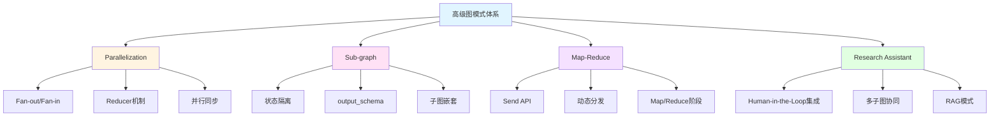

# Module-5 小结和复习：高级图模式精通指南

> **来自图灵奖获得者的总结寄语**
>
> "当你完成本章学习,你已经掌握了构建复杂系统的关键技能。记住:优秀的架构师不是通过增加复杂性来解决问题,而是通过正确的抽象来简化复杂性。你现在拥有的并行化、模块化、分治策略等工具,正是将复杂 AI 系统变得可管理、可扩展的核心武器。在未来的工作中,当面对看似无解的复杂需求时,回到这些基础模式,你会发现问题其实有着优雅的解决方案。"
>
> — *启发自 Tony Hoare 对软件工程本质的洞察*

---

## 📋 本章核心知识回顾

### 学习地图



### 四大核心技术速查表

| 技术 | 核心API | 主要用途 | 难度 |
|------|---------|---------|------|
| **Parallelization** | `Annotated[list, operator.add]` | 并行执行提升性能 | ⭐⭐⭐ |
| **Sub-graph** | `StateGraph(state, output_schema)` | 模块化设计 | ⭐⭐⭐⭐ |
| **Map-Reduce** | `Send("node", state)` | 大规模任务分解 | ⭐⭐⭐⭐⭐ |
| **Research Assistant** | 所有模式集成 | 生产级系统架构 | ⭐⭐⭐⭐⭐ |

---

## 🎯 复习题目列表

本章精心设计了 **10 道综合性问题**,涵盖所有核心知识点。建议按顺序完成,每道题预计耗时 20-40 分钟。

### 基础理解（问题 1-3）
1. Reducer 机制的工作原理是什么？为什么并行执行必须使用 Reducer？
2. Sub-graph 的 state_schema 和 output_schema 有什么区别？各自的作用是什么？
3. Send API 与传统的 add_edge 有什么本质区别？

### 实战应用（问题 4-7）
4. 如何实现一个支持并行检索多个数据源的问答系统？
5. 如何设计一个模块化的多步骤审批流程（使用子图）？
6. 如何使用 Map-Reduce 处理大规模文档批量摘要任务？
7. 实现一个简化版的 Research Assistant 系统

### 高级综合（问题 8-10）
8. 如何优化 Map-Reduce 的性能以支持数千个并发任务？
9. 子图嵌套的最佳实践是什么？如何避免常见陷阱？
10. 设计一个完整的企业级多智能体协作系统架构

---

## 📚 详细问答解析

### 问题 1: Reducer 机制的工作原理

<details>
<summary><b>展开查看完整解析</b></summary>

#### 核心问题

**为什么需要 Reducer？**

当多个并行节点试图同时更新状态的同一个字段时,LangGraph 需要知道如何合并这些更新。没有 Reducer,系统会抛出 `InvalidUpdateError`。

#### Reducer 工作机制

**基本原理:**
```python
# 并行节点 B 返回
update_b = {"results": ["result_from_B"]}

# 并行节点 C 返回
update_c = {"results": ["result_from_C"]}

# Reducer 函数被调用
def reducer(current_value, new_value):
    return current_value + new_value

# 最终状态
state["results"] = reducer(["result_from_B"], ["result_from_C"])
# 结果: ["result_from_B", "result_from_C"]
```

#### 完整示例：并行搜索

```python
import operator
from typing import Annotated
from typing_extensions import TypedDict
from langgraph.graph import StateGraph, START, END

# 状态定义
class SearchState(TypedDict):
    query: str
    results: Annotated[list, operator.add]  # ⭐ Reducer

# 节点函数
def search_wikipedia(state):
    query = state["query"]
    results = wikipedia_api.search(query)
    return {"results": [f"Wikipedia: {results}"]}

def search_web(state):
    query = state["query"]
    results = web_search_api.search(query)
    return {"results": [f"Web: {results}"]}

def search_database(state):
    query = state["query"]
    results = database.query(query)
    return {"results": [f"DB: {results}"]}

# 构建图
builder = StateGraph(SearchState)
builder.add_node("search_wikipedia", search_wikipedia)
builder.add_node("search_web", search_web)
builder.add_node("search_database", search_database)

# 并行执行
builder.add_edge(START, "search_wikipedia")
builder.add_edge(START, "search_web")
builder.add_edge(START, "search_database")
builder.add_edge("search_wikipedia", END)
builder.add_edge("search_web", END)
builder.add_edge("search_database", END)

graph = builder.compile()

# 执行
result = graph.invoke({"query": "LangGraph"})
print(result["results"])
# 输出: [
#   "Wikipedia: ...",
#   "Web: ...",
#   "DB: ..."
# ]
```

#### 常用 Reducer 类型

**1. operator.add - 列表拼接**
```python
from operator import add

class State(TypedDict):
    items: Annotated[list, add]

# [1, 2] + [3, 4] = [1, 2, 3, 4]
```

**2. add_messages - 消息合并**
```python
from langgraph.graph import add_messages

class State(TypedDict):
    messages: Annotated[list, add_messages]

# 特殊功能:
# - 相同 ID 的消息会被覆盖
# - RemoveMessage 会删除消息
# - 自动去重和排序
```

**3. 自定义 Reducer - 排序合并**
```python
def sorted_merge(left, right):
    """按优先级排序合并"""
    left = left if isinstance(left, list) else [left]
    right = right if isinstance(right, list) else [right]
    
    combined = left + right
    return sorted(combined, key=lambda x: x.get("priority", 0), reverse=True)

class State(TypedDict):
    tasks: Annotated[list, sorted_merge]
```

**4. 自定义 Reducer - 只保留最新 N 个**
```python
def keep_last_n(n=5):
    def reducer(left, right):
        left = left if isinstance(left, list) else [left]
        right = right if isinstance(right, list) else [right]
        combined = left + right
        return combined[-n:]  # 只保留最后 n 个
    return reducer

class State(TypedDict):
    history: Annotated[list, keep_last_n(10)]
```

**5. 自定义 Reducer - 去重**
```python
def unique_merge(left, right):
    """去重合并"""
    left = left if isinstance(left, list) else [left]
    right = right if isinstance(right, list) else [right]
    
    # 使用字典去重,保持顺序
    seen = {}
    for item in left + right:
        key = item.get("id", str(item))
        if key not in seen:
            seen[key] = item
    
    return list(seen.values())

class State(TypedDict):
    unique_results: Annotated[list, unique_merge]
```

#### 执行顺序问题

**问题:** Reducer 合并的顺序是否确定？

```python
# 节点 B 和 C 并行执行
# 哪个先完成？顺序不确定

# 如果需要确定顺序,使用自定义 Reducer
def ordered_merge(left, right):
    left = left if isinstance(left, list) else [left]
    right = right if isinstance(right, list) else [right]
    
    # 按时间戳或 ID 排序
    combined = left + right
    return sorted(combined, key=lambda x: x.get("timestamp"))
```

#### 最佳实践

**1. 总是使用 Reducer 处理并行更新**
```python
# ❌ 错误:没有 Reducer
class State(TypedDict):
    results: list  # 并行更新会失败

# ✅ 正确:使用 Reducer
class State(TypedDict):
    results: Annotated[list, operator.add]
```

**2. 选择合适的 Reducer**
```python
# 简单追加 → operator.add
# 消息管理 → add_messages
# 复杂逻辑 → 自定义 Reducer
```

**3. Reducer 应该是幂等的**
```python
# ✅ 幂等:多次调用结果相同
def idempotent_reducer(left, right):
    # 使用 ID 去重
    return list({item["id"]: item for item in left + right}.values())

# ❌ 非幂等:依赖外部状态
global_counter = 0
def non_idempotent_reducer(left, right):
    global global_counter
    global_counter += 1  # 副作用
    return left + right
```

</details>

---

### 问题 2: state_schema 和 output_schema 的区别

<details>
<summary><b>展开查看完整解析</b></summary>

#### 核心概念

**state_schema:** 子图内部使用的完整状态  
**output_schema:** 子图返回给主图的输出状态(通常是 state_schema 的子集)

#### 详细对比

| 维度 | state_schema | output_schema |
|------|--------------|---------------|
| **作用域** | 子图内部 | 子图与主图之间 |
| **字段数量** | 完整(包含所有中间变量) | 部分(只包含需要返回的) |
| **可见性** | 只在子图内可见 | 主图可以访问 |
| **必需性** | 必需 | 可选(默认返回所有字段) |

#### 为什么需要 output_schema？

**问题场景:**
```python
# 子图有很多中间变量
class SubGraphState(TypedDict):
    input: str
    temp1: str       # 中间变量
    temp2: int       # 中间变量
    temp3: list      # 中间变量
    cache: dict      # 中间变量
    debug_info: str  # 中间变量
    result: str      # 最终结果

# 如果没有 output_schema,所有字段都会返回主图
# 主图状态会被污染,充满不需要的字段
```

**解决方案:**
```python
# 定义输出状态
class SubGraphOutput(TypedDict):
    result: str  # 只返回这个

# 创建子图
sub_graph = StateGraph(
    state_schema=SubGraphState,    # 内部使用完整状态
    output_schema=SubGraphOutput   # 只返回 result
)
```

#### 完整示例:日志分析系统

```python
from typing_extensions import TypedDict
from typing import List
from langgraph.graph import StateGraph, START, END

# ============ 子图 1: 失败分析 ============

# 内部状态(完整)
class FailureAnalysisState(TypedDict):
    logs: List[dict]          # 输入
    failed_logs: List[dict]   # 中间:筛选出的失败日志
    error_patterns: dict      # 中间:错误模式统计
    temp_cache: dict          # 中间:临时缓存
    summary: str              # 输出:失败摘要

# 输出状态(只返回摘要)
class FailureAnalysisOutput(TypedDict):
    summary: str

# 节点函数
def filter_failures(state):
    failed = [log for log in state["logs"] if log.get("status") == "error"]
    return {"failed_logs": failed}

def analyze_patterns(state):
    patterns = {}
    for log in state["failed_logs"]:
        error_type = log.get("error_type", "unknown")
        patterns[error_type] = patterns.get(error_type, 0) + 1
    return {"error_patterns": patterns}

def generate_summary(state):
    patterns = state["error_patterns"]
    summary = f"Found {sum(patterns.values())} failures. "
    summary += f"Top issues: {list(patterns.keys())}"
    return {"summary": summary}

# 构建子图
fa_builder = StateGraph(
    state_schema=FailureAnalysisState,
    output_schema=FailureAnalysisOutput  # ⭐ 只返回 summary
)

fa_builder.add_node("filter_failures", filter_failures)
fa_builder.add_node("analyze_patterns", analyze_patterns)
fa_builder.add_node("generate_summary", generate_summary)

fa_builder.add_edge(START, "filter_failures")
fa_builder.add_edge("filter_failures", "analyze_patterns")
fa_builder.add_edge("analyze_patterns", "generate_summary")
fa_builder.add_edge("generate_summary", END)

failure_analysis_graph = fa_builder.compile()

# ============ 子图 2: 性能分析 ============

class PerformanceAnalysisState(TypedDict):
    logs: List[dict]
    slow_logs: List[dict]     # 中间
    latency_stats: dict       # 中间
    report: str               # 输出

class PerformanceAnalysisOutput(TypedDict):
    report: str

def filter_slow(state):
    slow = [log for log in state["logs"] if log.get("latency", 0) > 1000]
    return {"slow_logs": slow}

def calculate_stats(state):
    latencies = [log["latency"] for log in state["slow_logs"]]
    stats = {
        "avg": sum(latencies) / len(latencies) if latencies else 0,
        "max": max(latencies) if latencies else 0
    }
    return {"latency_stats": stats}

def generate_report(state):
    stats = state["latency_stats"]
    report = f"Avg latency: {stats['avg']}ms, Max: {stats['max']}ms"
    return {"report": report}

pa_builder = StateGraph(
    PerformanceAnalysisState,
    output_schema=PerformanceAnalysisOutput
)

pa_builder.add_node("filter_slow", filter_slow)
pa_builder.add_node("calculate_stats", calculate_stats)
pa_builder.add_node("generate_report", generate_report)

pa_builder.add_edge(START, "filter_slow")
pa_builder.add_edge("filter_slow", "calculate_stats")
pa_builder.add_edge("calculate_stats", "generate_report")
pa_builder.add_edge("generate_report", END)

performance_analysis_graph = pa_builder.compile()

# ============ 主图:整合两个子图 ============

from operator import add
from typing import Annotated

class MainState(TypedDict):
    raw_logs: List[dict]
    summary: str      # 来自失败分析子图
    report: str       # 来自性能分析子图
    final_output: str

def prepare_logs(state):
    # 准备日志数据
    return {"raw_logs": state["raw_logs"]}

def finalize(state):
    output = f"Failure Summary: {state['summary']}\n"
    output += f"Performance Report: {state['report']}"
    return {"final_output": output}

# 构建主图
main_builder = StateGraph(MainState)
main_builder.add_node("prepare", prepare_logs)
main_builder.add_node("failure_analysis", failure_analysis_graph)  # ⭐ 子图作为节点
main_builder.add_node("performance_analysis", performance_analysis_graph)
main_builder.add_node("finalize", finalize)

main_builder.add_edge(START, "prepare")
main_builder.add_edge("prepare", "failure_analysis")
main_builder.add_edge("prepare", "performance_analysis")
main_builder.add_edge("failure_analysis", "finalize")
main_builder.add_edge("performance_analysis", "finalize")
main_builder.add_edge("finalize", END)

main_graph = main_builder.compile()

# 执行
logs = [
    {"id": 1, "status": "error", "error_type": "timeout", "latency": 5000},
    {"id": 2, "status": "success", "latency": 200},
    {"id": 3, "status": "error", "error_type": "404", "latency": 1500}
]

result = main_graph.invoke({"raw_logs": logs})
print(result["final_output"])
```

#### 关键收益

**1. 状态隔离**
```python
# 子图的中间变量不会污染主图
# failed_logs, error_patterns, temp_cache 等都不会出现在主图状态中
```

**2. 清晰的接口**
```python
# 明确子图的输入和输出
# 就像函数签名一样清晰
def failure_analysis(logs: List) -> str:  # 输入 logs,输出 summary
    ...
```

**3. 易于测试**
```python
# 可以独立测试子图
sub_result = failure_analysis_graph.invoke({"logs": test_logs})
assert "summary" in sub_result
assert "failed_logs" not in sub_result  # 中间变量不会返回
```

#### 常见错误

**错误 1:忘记使用 output_schema**
```python
# ❌ 所有字段都会返回,污染主图
sub_graph = StateGraph(SubState)

# ✅ 明确指定输出
sub_graph = StateGraph(SubState, output_schema=Output)
```

**错误 2:output_schema 包含不存在的字段**
```python
# ❌ output_schema 中的字段必须在 state_schema 中存在
class State(TypedDict):
    input: str
    result: str

class Output(TypedDict):
    result: str
    extra_field: str  # ❌ State 中没有这个字段

# ✅ 只包含 State 中存在的字段
class Output(TypedDict):
    result: str
```

**错误 3:主图状态不包含子图输出字段**
```python
# 子图输出
class SubOutput(TypedDict):
    result: str

# ❌ 主图状态缺少 result 字段
class MainState(TypedDict):
    input: str
    # 缺少 result

# ✅ 主图状态包含子图的输出字段
class MainState(TypedDict):
    input: str
    result: str  # 接收子图的输出
```

</details>

---

### 问题 3: Send API 与传统 add_edge 的本质区别

<details>
<summary><b>展开查看完整解析</b></summary>

#### 核心区别

| 维度 | add_edge | Send API |
|------|----------|----------|
| **任务数量** | 静态固定 | 动态可变 |
| **决定时机** | 编译时 | 运行时 |
| **状态传递** | 完整状态 | 可自定义部分状态 |
| **并行度** | 固定 | 根据数据动态调整 |

#### 详细对比示例

**场景:处理多个子主题**

**方案 1:使用 add_edge (静态)**
```python
# ❌ 问题:必须预先知道有多少个子主题
builder.add_node("process_topic_1", process_func)
builder.add_node("process_topic_2", process_func)
builder.add_node("process_topic_3", process_func)

builder.add_edge("generate_topics", "process_topic_1")
builder.add_edge("generate_topics", "process_topic_2")
builder.add_edge("generate_topics", "process_topic_3")

# 如果实际有 5 个主题怎么办？
# 如果只有 2 个主题,第 3 个节点会浪费？
```

**方案 2:使用 Send API (动态)**
```python
from langgraph.types import Send

def dispatch_topics(state):
    topics = state["topics"]  # 可能是 2 个,也可能是 10 个
    
    # ✅ 自动为每个主题创建处理任务
    return [Send("process_topic", {"topic": t}) for t in topics]

builder.add_conditional_edges(
    "generate_topics",
    dispatch_topics,
    ["process_topic"]
)

# 无论有多少主题,都能自动处理
```

#### Send API 完整示例

```python
from langgraph.types import Send
from langgraph.graph import StateGraph, START, END
from typing_extensions import TypedDict
from typing import Annotated, List
import operator

# ============ 状态定义 ============

# 全局状态
class OverallState(TypedDict):
    topic: str
    subtopics: List[str]
    analyses: Annotated[List[str], operator.add]  # 收集所有分析结果
    final_report: str

# Map 节点的局部状态
class AnalysisState(TypedDict):
    subtopic: str

# ============ 节点函数 ============

def generate_subtopics(state: OverallState):
    """生成子主题"""
    topic = state["topic"]
    
    # 假设 LLM 返回 3-10 个子主题(数量不固定)
    subtopics = llm_generate_subtopics(topic)
    
    return {"subtopics": subtopics}

def dispatch_analyses(state: OverallState):
    """动态分发分析任务"""
    subtopics = state["subtopics"]
    
    # ⭐ 关键:为每个子主题创建 Send 任务
    return [
        Send("analyze_subtopic", {"subtopic": st})
        for st in subtopics
    ]

def analyze_subtopic(state: AnalysisState):
    """分析单个子主题"""
    subtopic = state["subtopic"]
    
    # 执行分析
    analysis = llm_analyze(subtopic)
    
    # 返回结果(会被 operator.add 合并到 analyses 列表)
    return {"analyses": [analysis]}

def write_report(state: OverallState):
    """汇总所有分析"""
    analyses = state["analyses"]
    
    # 整合成最终报告
    report = llm_summarize(analyses)
    
    return {"final_report": report}

# ============ 构建图 ============

builder = StateGraph(OverallState)

builder.add_node("generate_subtopics", generate_subtopics)
builder.add_node("analyze_subtopic", analyze_subtopic)
builder.add_node("write_report", write_report)

builder.add_edge(START, "generate_subtopics")

# ⭐ 使用 Send 动态分发
builder.add_conditional_edges(
    "generate_subtopics",
    dispatch_analyses,
    ["analyze_subtopic"]  # 目标节点
)

builder.add_edge("analyze_subtopic", "write_report")
builder.add_edge("write_report", END)

graph = builder.compile()

# ============ 执行 ============

result = graph.invoke({"topic": "AI Safety"})

# 流程:
# 1. generate_subtopics → 生成 5 个子主题
# 2. dispatch_analyses → 创建 5 个 Send 任务
# 3. analyze_subtopic × 5 → 并行分析 5 个子主题
# 4. write_report → 汇总 5 个分析结果
```

#### Send API 高级用法

**1. 条件性分发**
```python
def conditional_dispatch(state):
    tasks = state["tasks"]
    
    # 只处理高优先级任务
    return [
        Send("process_task", {"task": t})
        for t in tasks
        if t.get("priority") == "high"
    ]
```

**2. 分发到不同节点**
```python
def multi_target_dispatch(state):
    items = state["items"]
    sends = []
    
    for item in items:
        if item["type"] == "text":
            sends.append(Send("process_text", {"item": item}))
        elif item["type"] == "image":
            sends.append(Send("process_image", {"item": item}))
    
    return sends
```

**3. 传递额外上下文**
```python
def dispatch_with_context(state):
    subtopics = state["subtopics"]
    original_topic = state["topic"]
    
    return [
        Send("analyze", {
            "subtopic": st,
            "context": original_topic,  # 传递额外信息
            "timestamp": time.time()
        })
        for st in subtopics
    ]
```

**4. 控制并行度**
```python
def limited_dispatch(state, max_parallel=5):
    tasks = state["tasks"]
    
    # 只分发前 max_parallel 个任务
    return [
        Send("process", {"task": t})
        for t in tasks[:max_parallel]
    ]
```

#### 性能对比

**场景:处理 100 个文档**

**传统方式(顺序):**
```python
# 100 个文档顺序处理
for doc in documents:
    result = process(doc)  # 每个 2 秒
# 总时间: 200 秒
```

**使用 Send API(并行):**
```python
def dispatch_docs(state):
    return [Send("process", {"doc": d}) for d in state["documents"]]

# 100 个文档并行处理
# 总时间: ~2 秒 (假设有足够的计算资源)
```

#### 最佳实践

**1. 合理控制并行度**
```python
# ❌ 无限制:可能耗尽资源
return [Send("process", {"item": i}) for i in huge_list]

# ✅ 分批处理
def batched_dispatch(state, batch_size=10):
    items = state["items"]
    return [
        Send("process", {"item": i})
        for i in items[:batch_size]
    ]
```

**2. 传递最小必需状态**
```python
# ❌ 传递整个状态:浪费
Send("process", state)

# ✅ 只传递需要的字段
Send("process", {"item": specific_item, "context": minimal_context})
```

**3. 使用有意义的节点名**
```python
# ❌ 不清晰
Send("node_1", data)

# ✅ 清晰
Send("analyze_sentiment", data)
Send("translate_text", data)
```

</details>

---

