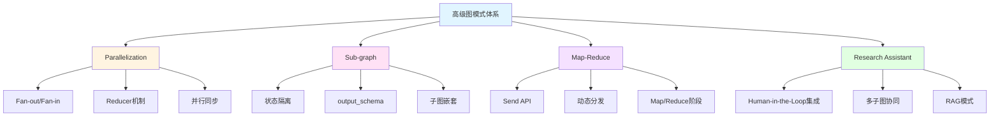

# Module-5 小结和复习：高级图模式精通指南

> **来自图灵奖获得者的总结寄语**
>
> "当你完成本章学习,你已经掌握了构建复杂系统的关键技能。记住:优秀的架构师不是通过增加复杂性来解决问题,而是通过正确的抽象来简化复杂性。你现在拥有的并行化、模块化、分治策略等工具,正是将复杂 AI 系统变得可管理、可扩展的核心武器。在未来的工作中,当面对看似无解的复杂需求时,回到这些基础模式,你会发现问题其实有着优雅的解决方案。"
>
> — *启发自 Tony Hoare 对软件工程本质的洞察*

---

## 📋 本章核心知识回顾

### 学习地图



### 四大核心技术速查表

| 技术 | 核心API | 主要用途 | 难度 |
|------|---------|---------|------|
| **Parallelization** | `Annotated[list, operator.add]` | 并行执行提升性能 | ⭐⭐⭐ |
| **Sub-graph** | `StateGraph(state, output_schema)` | 模块化设计 | ⭐⭐⭐⭐ |
| **Map-Reduce** | `Send("node", state)` | 大规模任务分解 | ⭐⭐⭐⭐⭐ |
| **Research Assistant** | 所有模式集成 | 生产级系统架构 | ⭐⭐⭐⭐⭐ |

---

## 🎯 复习题目列表

本章精心设计了 **10 道综合性问题**,涵盖所有核心知识点。建议按顺序完成,每道题预计耗时 20-40 分钟。

### 基础理解（问题 1-3）
1. Reducer 机制的工作原理是什么？为什么并行执行必须使用 Reducer？
2. Sub-graph 的 state_schema 和 output_schema 有什么区别？各自的作用是什么？
3. Send API 与传统的 add_edge 有什么本质区别？

### 实战应用（问题 4-7）
4. 如何实现一个支持并行检索多个数据源的问答系统？
5. 如何设计一个模块化的多步骤审批流程（使用子图）？
6. 如何使用 Map-Reduce 处理大规模文档批量摘要任务？
7. 实现一个简化版的 Research Assistant 系统

### 高级综合（问题 8-10）
8. 如何优化 Map-Reduce 的性能以支持数千个并发任务？
9. 子图嵌套的最佳实践是什么？如何避免常见陷阱？
10. 设计一个完整的企业级多智能体协作系统架构

---

## 📚 详细问答解析

### 问题 1: Reducer 机制的工作原理

<details>
<summary><b>展开查看完整解析</b></summary>

#### 核心问题

**为什么需要 Reducer？**

当多个并行节点试图同时更新状态的同一个字段时,LangGraph 需要知道如何合并这些更新。没有 Reducer,系统会抛出 `InvalidUpdateError`。

#### Reducer 工作机制

**基本原理:**
```python
# 并行节点 B 返回
update_b = {"results": ["result_from_B"]}

# 并行节点 C 返回
update_c = {"results": ["result_from_C"]}

# Reducer 函数被调用
def reducer(current_value, new_value):
    return current_value + new_value

# 最终状态
state["results"] = reducer(["result_from_B"], ["result_from_C"])
# 结果: ["result_from_B", "result_from_C"]
```

#### 完整示例：并行搜索

```python
import operator
from typing import Annotated
from typing_extensions import TypedDict
from langgraph.graph import StateGraph, START, END

# 状态定义
class SearchState(TypedDict):
    query: str
    results: Annotated[list, operator.add]  # ⭐ Reducer

# 节点函数
def search_wikipedia(state):
    query = state["query"]
    results = wikipedia_api.search(query)
    return {"results": [f"Wikipedia: {results}"]}

def search_web(state):
    query = state["query"]
    results = web_search_api.search(query)
    return {"results": [f"Web: {results}"]}

def search_database(state):
    query = state["query"]
    results = database.query(query)
    return {"results": [f"DB: {results}"]}

# 构建图
builder = StateGraph(SearchState)
builder.add_node("search_wikipedia", search_wikipedia)
builder.add_node("search_web", search_web)
builder.add_node("search_database", search_database)

# 并行执行
builder.add_edge(START, "search_wikipedia")
builder.add_edge(START, "search_web")
builder.add_edge(START, "search_database")
builder.add_edge("search_wikipedia", END)
builder.add_edge("search_web", END)
builder.add_edge("search_database", END)

graph = builder.compile()

# 执行
result = graph.invoke({"query": "LangGraph"})
print(result["results"])
# 输出: [
#   "Wikipedia: ...",
#   "Web: ...",
#   "DB: ..."
# ]
```

#### 常用 Reducer 类型

**1. operator.add - 列表拼接**
```python
from operator import add

class State(TypedDict):
    items: Annotated[list, add]

# [1, 2] + [3, 4] = [1, 2, 3, 4]
```

**2. add_messages - 消息合并**
```python
from langgraph.graph import add_messages

class State(TypedDict):
    messages: Annotated[list, add_messages]

# 特殊功能:
# - 相同 ID 的消息会被覆盖
# - RemoveMessage 会删除消息
# - 自动去重和排序
```

**3. 自定义 Reducer - 排序合并**
```python
def sorted_merge(left, right):
    """按优先级排序合并"""
    left = left if isinstance(left, list) else [left]
    right = right if isinstance(right, list) else [right]
    
    combined = left + right
    return sorted(combined, key=lambda x: x.get("priority", 0), reverse=True)

class State(TypedDict):
    tasks: Annotated[list, sorted_merge]
```

**4. 自定义 Reducer - 只保留最新 N 个**
```python
def keep_last_n(n=5):
    def reducer(left, right):
        left = left if isinstance(left, list) else [left]
        right = right if isinstance(right, list) else [right]
        combined = left + right
        return combined[-n:]  # 只保留最后 n 个
    return reducer

class State(TypedDict):
    history: Annotated[list, keep_last_n(10)]
```

**5. 自定义 Reducer - 去重**
```python
def unique_merge(left, right):
    """去重合并"""
    left = left if isinstance(left, list) else [left]
    right = right if isinstance(right, list) else [right]
    
    # 使用字典去重,保持顺序
    seen = {}
    for item in left + right:
        key = item.get("id", str(item))
        if key not in seen:
            seen[key] = item
    
    return list(seen.values())

class State(TypedDict):
    unique_results: Annotated[list, unique_merge]
```

#### 执行顺序问题

**问题:** Reducer 合并的顺序是否确定？

```python
# 节点 B 和 C 并行执行
# 哪个先完成？顺序不确定

# 如果需要确定顺序,使用自定义 Reducer
def ordered_merge(left, right):
    left = left if isinstance(left, list) else [left]
    right = right if isinstance(right, list) else [right]
    
    # 按时间戳或 ID 排序
    combined = left + right
    return sorted(combined, key=lambda x: x.get("timestamp"))
```

#### 最佳实践

**1. 总是使用 Reducer 处理并行更新**
```python
# ❌ 错误:没有 Reducer
class State(TypedDict):
    results: list  # 并行更新会失败

# ✅ 正确:使用 Reducer
class State(TypedDict):
    results: Annotated[list, operator.add]
```

**2. 选择合适的 Reducer**
```python
# 简单追加 → operator.add
# 消息管理 → add_messages
# 复杂逻辑 → 自定义 Reducer
```

**3. Reducer 应该是幂等的**
```python
# ✅ 幂等:多次调用结果相同
def idempotent_reducer(left, right):
    # 使用 ID 去重
    return list({item["id"]: item for item in left + right}.values())

# ❌ 非幂等:依赖外部状态
global_counter = 0
def non_idempotent_reducer(left, right):
    global global_counter
    global_counter += 1  # 副作用
    return left + right
```

</details>

---

### 问题 2: state_schema 和 output_schema 的区别

<details>
<summary><b>展开查看完整解析</b></summary>

#### 核心概念

**state_schema:** 子图内部使用的完整状态  
**output_schema:** 子图返回给主图的输出状态(通常是 state_schema 的子集)

#### 详细对比

| 维度 | state_schema | output_schema |
|------|--------------|---------------|
| **作用域** | 子图内部 | 子图与主图之间 |
| **字段数量** | 完整(包含所有中间变量) | 部分(只包含需要返回的) |
| **可见性** | 只在子图内可见 | 主图可以访问 |
| **必需性** | 必需 | 可选(默认返回所有字段) |

#### 为什么需要 output_schema？

**问题场景:**
```python
# 子图有很多中间变量
class SubGraphState(TypedDict):
    input: str
    temp1: str       # 中间变量
    temp2: int       # 中间变量
    temp3: list      # 中间变量
    cache: dict      # 中间变量
    debug_info: str  # 中间变量
    result: str      # 最终结果

# 如果没有 output_schema,所有字段都会返回主图
# 主图状态会被污染,充满不需要的字段
```

**解决方案:**
```python
# 定义输出状态
class SubGraphOutput(TypedDict):
    result: str  # 只返回这个

# 创建子图
sub_graph = StateGraph(
    state_schema=SubGraphState,    # 内部使用完整状态
    output_schema=SubGraphOutput   # 只返回 result
)
```

#### 完整示例:日志分析系统

```python
from typing_extensions import TypedDict
from typing import List
from langgraph.graph import StateGraph, START, END

# ============ 子图 1: 失败分析 ============

# 内部状态(完整)
class FailureAnalysisState(TypedDict):
    logs: List[dict]          # 输入
    failed_logs: List[dict]   # 中间:筛选出的失败日志
    error_patterns: dict      # 中间:错误模式统计
    temp_cache: dict          # 中间:临时缓存
    summary: str              # 输出:失败摘要

# 输出状态(只返回摘要)
class FailureAnalysisOutput(TypedDict):
    summary: str

# 节点函数
def filter_failures(state):
    failed = [log for log in state["logs"] if log.get("status") == "error"]
    return {"failed_logs": failed}

def analyze_patterns(state):
    patterns = {}
    for log in state["failed_logs"]:
        error_type = log.get("error_type", "unknown")
        patterns[error_type] = patterns.get(error_type, 0) + 1
    return {"error_patterns": patterns}

def generate_summary(state):
    patterns = state["error_patterns"]
    summary = f"Found {sum(patterns.values())} failures. "
    summary += f"Top issues: {list(patterns.keys())}"
    return {"summary": summary}

# 构建子图
fa_builder = StateGraph(
    state_schema=FailureAnalysisState,
    output_schema=FailureAnalysisOutput  # ⭐ 只返回 summary
)

fa_builder.add_node("filter_failures", filter_failures)
fa_builder.add_node("analyze_patterns", analyze_patterns)
fa_builder.add_node("generate_summary", generate_summary)

fa_builder.add_edge(START, "filter_failures")
fa_builder.add_edge("filter_failures", "analyze_patterns")
fa_builder.add_edge("analyze_patterns", "generate_summary")
fa_builder.add_edge("generate_summary", END)

failure_analysis_graph = fa_builder.compile()

# ============ 子图 2: 性能分析 ============

class PerformanceAnalysisState(TypedDict):
    logs: List[dict]
    slow_logs: List[dict]     # 中间
    latency_stats: dict       # 中间
    report: str               # 输出

class PerformanceAnalysisOutput(TypedDict):
    report: str

def filter_slow(state):
    slow = [log for log in state["logs"] if log.get("latency", 0) > 1000]
    return {"slow_logs": slow}

def calculate_stats(state):
    latencies = [log["latency"] for log in state["slow_logs"]]
    stats = {
        "avg": sum(latencies) / len(latencies) if latencies else 0,
        "max": max(latencies) if latencies else 0
    }
    return {"latency_stats": stats}

def generate_report(state):
    stats = state["latency_stats"]
    report = f"Avg latency: {stats['avg']}ms, Max: {stats['max']}ms"
    return {"report": report}

pa_builder = StateGraph(
    PerformanceAnalysisState,
    output_schema=PerformanceAnalysisOutput
)

pa_builder.add_node("filter_slow", filter_slow)
pa_builder.add_node("calculate_stats", calculate_stats)
pa_builder.add_node("generate_report", generate_report)

pa_builder.add_edge(START, "filter_slow")
pa_builder.add_edge("filter_slow", "calculate_stats")
pa_builder.add_edge("calculate_stats", "generate_report")
pa_builder.add_edge("generate_report", END)

performance_analysis_graph = pa_builder.compile()

# ============ 主图:整合两个子图 ============

from operator import add
from typing import Annotated

class MainState(TypedDict):
    raw_logs: List[dict]
    summary: str      # 来自失败分析子图
    report: str       # 来自性能分析子图
    final_output: str

def prepare_logs(state):
    # 准备日志数据
    return {"raw_logs": state["raw_logs"]}

def finalize(state):
    output = f"Failure Summary: {state['summary']}\n"
    output += f"Performance Report: {state['report']}"
    return {"final_output": output}

# 构建主图
main_builder = StateGraph(MainState)
main_builder.add_node("prepare", prepare_logs)
main_builder.add_node("failure_analysis", failure_analysis_graph)  # ⭐ 子图作为节点
main_builder.add_node("performance_analysis", performance_analysis_graph)
main_builder.add_node("finalize", finalize)

main_builder.add_edge(START, "prepare")
main_builder.add_edge("prepare", "failure_analysis")
main_builder.add_edge("prepare", "performance_analysis")
main_builder.add_edge("failure_analysis", "finalize")
main_builder.add_edge("performance_analysis", "finalize")
main_builder.add_edge("finalize", END)

main_graph = main_builder.compile()

# 执行
logs = [
    {"id": 1, "status": "error", "error_type": "timeout", "latency": 5000},
    {"id": 2, "status": "success", "latency": 200},
    {"id": 3, "status": "error", "error_type": "404", "latency": 1500}
]

result = main_graph.invoke({"raw_logs": logs})
print(result["final_output"])
```

#### 关键收益

**1. 状态隔离**
```python
# 子图的中间变量不会污染主图
# failed_logs, error_patterns, temp_cache 等都不会出现在主图状态中
```

**2. 清晰的接口**
```python
# 明确子图的输入和输出
# 就像函数签名一样清晰
def failure_analysis(logs: List) -> str:  # 输入 logs,输出 summary
    ...
```

**3. 易于测试**
```python
# 可以独立测试子图
sub_result = failure_analysis_graph.invoke({"logs": test_logs})
assert "summary" in sub_result
assert "failed_logs" not in sub_result  # 中间变量不会返回
```

#### 常见错误

**错误 1:忘记使用 output_schema**
```python
# ❌ 所有字段都会返回,污染主图
sub_graph = StateGraph(SubState)

# ✅ 明确指定输出
sub_graph = StateGraph(SubState, output_schema=Output)
```

**错误 2:output_schema 包含不存在的字段**
```python
# ❌ output_schema 中的字段必须在 state_schema 中存在
class State(TypedDict):
    input: str
    result: str

class Output(TypedDict):
    result: str
    extra_field: str  # ❌ State 中没有这个字段

# ✅ 只包含 State 中存在的字段
class Output(TypedDict):
    result: str
```

**错误 3:主图状态不包含子图输出字段**
```python
# 子图输出
class SubOutput(TypedDict):
    result: str

# ❌ 主图状态缺少 result 字段
class MainState(TypedDict):
    input: str
    # 缺少 result

# ✅ 主图状态包含子图的输出字段
class MainState(TypedDict):
    input: str
    result: str  # 接收子图的输出
```

</details>

---

### 问题 3: Send API 与传统 add_edge 的本质区别

<details>
<summary><b>展开查看完整解析</b></summary>

#### 核心区别

| 维度 | add_edge | Send API |
|------|----------|----------|
| **任务数量** | 静态固定 | 动态可变 |
| **决定时机** | 编译时 | 运行时 |
| **状态传递** | 完整状态 | 可自定义部分状态 |
| **并行度** | 固定 | 根据数据动态调整 |

#### 详细对比示例

**场景:处理多个子主题**

**方案 1:使用 add_edge (静态)**
```python
# ❌ 问题:必须预先知道有多少个子主题
builder.add_node("process_topic_1", process_func)
builder.add_node("process_topic_2", process_func)
builder.add_node("process_topic_3", process_func)

builder.add_edge("generate_topics", "process_topic_1")
builder.add_edge("generate_topics", "process_topic_2")
builder.add_edge("generate_topics", "process_topic_3")

# 如果实际有 5 个主题怎么办？
# 如果只有 2 个主题,第 3 个节点会浪费？
```

**方案 2:使用 Send API (动态)**
```python
from langgraph.types import Send

def dispatch_topics(state):
    topics = state["topics"]  # 可能是 2 个,也可能是 10 个
    
    # ✅ 自动为每个主题创建处理任务
    return [Send("process_topic", {"topic": t}) for t in topics]

builder.add_conditional_edges(
    "generate_topics",
    dispatch_topics,
    ["process_topic"]
)

# 无论有多少主题,都能自动处理
```

#### Send API 完整示例

```python
from langgraph.types import Send
from langgraph.graph import StateGraph, START, END
from typing_extensions import TypedDict
from typing import Annotated, List
import operator

# ============ 状态定义 ============

# 全局状态
class OverallState(TypedDict):
    topic: str
    subtopics: List[str]
    analyses: Annotated[List[str], operator.add]  # 收集所有分析结果
    final_report: str

# Map 节点的局部状态
class AnalysisState(TypedDict):
    subtopic: str

# ============ 节点函数 ============

def generate_subtopics(state: OverallState):
    """生成子主题"""
    topic = state["topic"]
    
    # 假设 LLM 返回 3-10 个子主题(数量不固定)
    subtopics = llm_generate_subtopics(topic)
    
    return {"subtopics": subtopics}

def dispatch_analyses(state: OverallState):
    """动态分发分析任务"""
    subtopics = state["subtopics"]
    
    # ⭐ 关键:为每个子主题创建 Send 任务
    return [
        Send("analyze_subtopic", {"subtopic": st})
        for st in subtopics
    ]

def analyze_subtopic(state: AnalysisState):
    """分析单个子主题"""
    subtopic = state["subtopic"]
    
    # 执行分析
    analysis = llm_analyze(subtopic)
    
    # 返回结果(会被 operator.add 合并到 analyses 列表)
    return {"analyses": [analysis]}

def write_report(state: OverallState):
    """汇总所有分析"""
    analyses = state["analyses"]
    
    # 整合成最终报告
    report = llm_summarize(analyses)
    
    return {"final_report": report}

# ============ 构建图 ============

builder = StateGraph(OverallState)

builder.add_node("generate_subtopics", generate_subtopics)
builder.add_node("analyze_subtopic", analyze_subtopic)
builder.add_node("write_report", write_report)

builder.add_edge(START, "generate_subtopics")

# ⭐ 使用 Send 动态分发
builder.add_conditional_edges(
    "generate_subtopics",
    dispatch_analyses,
    ["analyze_subtopic"]  # 目标节点
)

builder.add_edge("analyze_subtopic", "write_report")
builder.add_edge("write_report", END)

graph = builder.compile()

# ============ 执行 ============

result = graph.invoke({"topic": "AI Safety"})

# 流程:
# 1. generate_subtopics → 生成 5 个子主题
# 2. dispatch_analyses → 创建 5 个 Send 任务
# 3. analyze_subtopic × 5 → 并行分析 5 个子主题
# 4. write_report → 汇总 5 个分析结果
```

#### Send API 高级用法

**1. 条件性分发**
```python
def conditional_dispatch(state):
    tasks = state["tasks"]
    
    # 只处理高优先级任务
    return [
        Send("process_task", {"task": t})
        for t in tasks
        if t.get("priority") == "high"
    ]
```

**2. 分发到不同节点**
```python
def multi_target_dispatch(state):
    items = state["items"]
    sends = []
    
    for item in items:
        if item["type"] == "text":
            sends.append(Send("process_text", {"item": item}))
        elif item["type"] == "image":
            sends.append(Send("process_image", {"item": item}))
    
    return sends
```

**3. 传递额外上下文**
```python
def dispatch_with_context(state):
    subtopics = state["subtopics"]
    original_topic = state["topic"]
    
    return [
        Send("analyze", {
            "subtopic": st,
            "context": original_topic,  # 传递额外信息
            "timestamp": time.time()
        })
        for st in subtopics
    ]
```

**4. 控制并行度**
```python
def limited_dispatch(state, max_parallel=5):
    tasks = state["tasks"]
    
    # 只分发前 max_parallel 个任务
    return [
        Send("process", {"task": t})
        for t in tasks[:max_parallel]
    ]
```

#### 性能对比

**场景:处理 100 个文档**

**传统方式(顺序):**
```python
# 100 个文档顺序处理
for doc in documents:
    result = process(doc)  # 每个 2 秒
# 总时间: 200 秒
```

**使用 Send API(并行):**
```python
def dispatch_docs(state):
    return [Send("process", {"doc": d}) for d in state["documents"]]

# 100 个文档并行处理
# 总时间: ~2 秒 (假设有足够的计算资源)
```

#### 最佳实践

**1. 合理控制并行度**
```python
# ❌ 无限制:可能耗尽资源
return [Send("process", {"item": i}) for i in huge_list]

# ✅ 分批处理
def batched_dispatch(state, batch_size=10):
    items = state["items"]
    return [
        Send("process", {"item": i})
        for i in items[:batch_size]
    ]
```

**2. 传递最小必需状态**
```python
# ❌ 传递整个状态:浪费
Send("process", state)

# ✅ 只传递需要的字段
Send("process", {"item": specific_item, "context": minimal_context})
```

**3. 使用有意义的节点名**
```python
# ❌ 不清晰
Send("node_1", data)

# ✅ 清晰
Send("analyze_sentiment", data)
Send("translate_text", data)
```

</details>

---

### 问题 4: 实现并行检索多个数据源的问答系统

<details>
<summary><b>展开查看完整解析</b></summary>

#### 系统架构

```
用户问题
    ↓
[prepare_query] 预处理查询
    ├→ [search_wikipedia] 
    ├→ [search_web]
    └→ [search_database]
         ↓ (并行)
    [aggregate_results] 聚合结果
         ↓
    [generate_answer] 生成回答
         ↓
      最终答案
```

#### 完整实现

```python
from langgraph.graph import StateGraph, START, END
from typing_extensions import TypedDict
from typing import Annotated, List
import operator

# ===== 状态定义 =====

class QAState(TypedDict):
    question: str
    query: str  # 优化后的查询
    results: Annotated[List[dict], operator.add]  # ⭐ 并行结果收集
    answer: str

# ===== 节点函数 =====

def prepare_query(state: QAState):
    """优化查询"""
    question = state["question"]
    
    # 使用 LLM 优化查询
    query = llm.invoke(f"Optimize this question for search: {question}")
    
    return {"query": query}

def search_wikipedia(state: QAState):
    """搜索 Wikipedia"""
    from langchain_community.document_loaders import WikipediaLoader
    
    query = state["query"]
    
    try:
        docs = WikipediaLoader(query=query, load_max_docs=2).load()
        
        results = [{
            "source": "Wikipedia",
            "content": doc.page_content[:500],
            "metadata": doc.metadata
        } for doc in docs]
        
        return {"results": results}
    
    except Exception as e:
        return {"results": [{"source": "Wikipedia", "error": str(e)}]}

def search_web(state: QAState):
    """搜索 Web"""
    from langchain_community.tools.tavily_search import TavilySearchResults
    
    query = state["query"]
    
    try:
        tavily = TavilySearchResults(max_results=3)
        docs = tavily.invoke(query)
        
        results = [{
            "source": "Web",
            "content": doc["content"],
            "url": doc["url"]
        } for doc in docs]
        
        return {"results": results}
    
    except Exception as e:
        return {"results": [{"source": "Web", "error": str(e)}]}

def search_database(state: QAState):
    """搜索本地数据库"""
    query = state["query"]
    
    # 模拟数据库查询
    try:
        db_results = database_query(query)
        
        results = [{
            "source": "Database",
            "content": result["text"],
            "confidence": result["score"]
        } for result in db_results]
        
        return {"results": results}
    
    except Exception as e:
        return {"results": [{"source": "Database", "error": str(e)}]}

def aggregate_results(state: QAState):
    """聚合和排序结果"""
    results = state["results"]
    
    # 过滤错误结果
    valid_results = [r for r in results if "error" not in r]
    
    # 按来源分组
    by_source = {}
    for result in valid_results:
        source = result["source"]
        if source not in by_source:
            by_source[source] = []
        by_source[source].append(result)
    
    # 格式化输出
    formatted = []
    for source, items in by_source.items():
        formatted.append(f"--- {source} ---")
        for item in items:
            formatted.append(item["content"][:200])
    
    return {"results": valid_results}  # 保持原始结果不变

def generate_answer(state: QAState):
    """基于检索结果生成答案"""
    question = state["question"]
    results = state["results"]
    
    # 构建上下文
    context = "\n\n".join([
        f"Source: {r['source']}\n{r['content']}"
        for r in results if "content" in r
    ])
    
    # 生成答案
    prompt = f"""Based on the following sources, answer the question: {question}

Context:
{context}

Answer:"""
    
    answer = llm.invoke(prompt)
    
    return {"answer": answer}

# ===== 构建图 =====

builder = StateGraph(QAState)

builder.add_node("prepare_query", prepare_query)
builder.add_node("search_wikipedia", search_wikipedia)
builder.add_node("search_web", search_web)
builder.add_node("search_database", search_database)
builder.add_node("aggregate_results", aggregate_results)
builder.add_node("generate_answer", generate_answer)

# 流程:prepare → 三个并行搜索 → aggregate → generate
builder.add_edge(START, "prepare_query")
builder.add_edge("prepare_query", "search_wikipedia")
builder.add_edge("prepare_query", "search_web")
builder.add_edge("prepare_query", "search_database")
builder.add_edge("search_wikipedia", "aggregate_results")
builder.add_edge("search_web", "aggregate_results")
builder.add_edge("search_database", "aggregate_results")
builder.add_edge("aggregate_results", "generate_answer")
builder.add_edge("generate_answer", END)

graph = builder.compile()

# ===== 使用示例 =====

result = graph.invoke({"question": "What is LangGraph?"})
print("Answer:", result["answer"])
print("\nSources used:", len(result["results"]))
```

#### 进阶优化

**1. 超时控制**
```python
import asyncio

async def search_with_timeout(search_func, state, timeout=5):
    """带超时的搜索"""
    try:
        return await asyncio.wait_for(
            search_func(state),
            timeout=timeout
        )
    except asyncio.TimeoutError:
        return {"results": [{
            "source": search_func.__name__,
            "error": "Timeout"
        }]}
```

**2. 结果排序**
```python
def aggregate_results(state: QAState):
    results = state["results"]
    
    # 按相关性评分排序
    scored_results = []
    for r in results:
        score = calculate_relevance(r["content"], state["question"])
        scored_results.append({**r, "score": score})
    
    # 排序并只保留前 10 个
    sorted_results = sorted(
        scored_results,
        key=lambda x: x.get("score", 0),
        reverse=True
    )[:10]
    
    return {"results": sorted_results}
```

**3. 缓存机制**
```python
from functools import lru_cache

@lru_cache(maxsize=1000)
def cached_search(query: str, source: str):
    """缓存搜索结果"""
    if source == "wikipedia":
        return search_wikipedia_impl(query)
    elif source == "web":
        return search_web_impl(query)
    # ...
```

</details>

---

### 问题 5: 设计模块化的多步骤审批流程

<details>
<summary><b>展开查看完整解析</b></summary>

#### 需求分析

构建一个支持多级审批的工作流系统:
1. **初审**: 自动检查基本条件
2. **经理审批**: 人工审核
3. **财务审批**: 如果金额 > 10000 需要财务批准
4. **最终确认**: 执行操作

#### 使用子图实现

```python
from langgraph.graph import StateGraph, START, END
from langgraph.checkpoint.memory import MemorySaver
from typing_extensions import TypedDict
from typing import Literal

# ===== 主流程状态 =====

class ApprovalWorkflowState(TypedDict):
    request_id: str
    title: str
    amount: float
    status: Literal["pending", "approved", "rejected"]
    approvals: dict  # 各级审批结果

# ===== 子图 1: 初审 =====

class PreliminaryCheckState(TypedDict):
    amount: float
    title: str
    check_result: dict

class PreliminaryCheckOutput(TypedDict):
    check_result: dict

def validate_request(state: PreliminaryCheckState):
    """验证请求的基本条件"""
    checks = {
        "has_title": bool(state["title"]),
        "valid_amount": state["amount"] > 0,
        "amount_range": state["amount"] < 1000000
    }
    
    passed = all(checks.values())
    
    return {
        "check_result": {
            "checks": checks,
            "passed": passed
        }
    }

# 构建初审子图
prelim_builder = StateGraph(
    PreliminaryCheckState,
    output_schema=PreliminaryCheckOutput
)
prelim_builder.add_node("validate", validate_request)
prelim_builder.add_edge(START, "validate")
prelim_builder.add_edge("validate", END)
prelim_check_graph = prelim_builder.compile()

# ===== 子图 2: 经理审批 =====

class ManagerApprovalState(TypedDict):
    request_id: str
    title: str
    amount: float
    manager_decision: str
    manager_comments: str

class ManagerApprovalOutput(TypedDict):
    manager_decision: str
    manager_comments: str

def await_manager_approval(state: ManagerApprovalState):
    """等待经理审批 (空节点,用于中断)"""
    pass

def record_manager_decision(state: ManagerApprovalState):
    """记录经理决策"""
    return {
        "manager_decision": state.get("manager_decision", "pending"),
        "manager_comments": state.get("manager_comments", "")
    }

# 构建经理审批子图
manager_builder = StateGraph(
    ManagerApprovalState,
    output_schema=ManagerApprovalOutput
)
manager_builder.add_node("await_approval", await_manager_approval)
manager_builder.add_node("record_decision", record_manager_decision)
manager_builder.add_edge(START, "await_approval")
manager_builder.add_edge("await_approval", "record_decision")
manager_builder.add_edge("record_decision", END)

memory = MemorySaver()
manager_approval_graph = manager_builder.compile(
    interrupt_before=["await_approval"],
    checkpointer=memory
)

# ===== 子图 3: 财务审批 =====

class FinanceApprovalState(TypedDict):
    amount: float
    finance_decision: str
    finance_comments: str

class FinanceApprovalOutput(TypedDict):
    finance_decision: str
    finance_comments: str

def await_finance_approval(state: FinanceApprovalState):
    """等待财务审批"""
    pass

def record_finance_decision(state: FinanceApprovalState):
    """记录财务决策"""
    return {
        "finance_decision": state.get("finance_decision", "pending"),
        "finance_comments": state.get("finance_comments", "")
    }

# 构建财务审批子图
finance_builder = StateGraph(
    FinanceApprovalState,
    output_schema=FinanceApprovalOutput
)
finance_builder.add_node("await_approval", await_finance_approval)
finance_builder.add_node("record_decision", record_finance_decision)
finance_builder.add_edge(START, "await_approval")
finance_builder.add_edge("await_approval", "record_decision")
finance_builder.add_edge("record_decision", END)

finance_approval_graph = finance_builder.compile(
    interrupt_before=["await_approval"],
    checkpointer=memory
)

# ===== 主图:编排所有子图 =====

def initial_check(state: ApprovalWorkflowState):
    """初步检查"""
    # 调用初审子图
    check_result = prelim_check_graph.invoke({
        "amount": state["amount"],
        "title": state["title"]
    })
    
    approvals = state.get("approvals", {})
    approvals["preliminary"] = check_result["check_result"]
    
    return {"approvals": approvals}

def route_after_prelim(state: ApprovalWorkflowState):
    """初审后路由"""
    if state["approvals"]["preliminary"]["passed"]:
        return "manager_approval"
    else:
        return "reject"

def reject_request(state: ApprovalWorkflowState):
    """拒绝请求"""
    return {"status": "rejected"}

def check_amount_threshold(state: ApprovalWorkflowState):
    """检查是否需要财务审批"""
    if state["amount"] > 10000:
        return "finance_approval"
    else:
        return "approve"

def approve_request(state: ApprovalWorkflowState):
    """批准请求"""
    return {"status": "approved"}

# 构建主图
main_builder = StateGraph(ApprovalWorkflowState)

main_builder.add_node("initial_check", initial_check)
main_builder.add_node("manager_approval", manager_approval_graph)
main_builder.add_node("finance_approval", finance_approval_graph)
main_builder.add_node("reject", reject_request)
main_builder.add_node("approve", approve_request)

main_builder.add_edge(START, "initial_check")
main_builder.add_conditional_edges(
    "initial_check",
    route_after_prelim,
    ["manager_approval", "reject"]
)
main_builder.add_conditional_edges(
    "manager_approval",
    check_amount_threshold,
    ["finance_approval", "approve"]
)
main_builder.add_edge("finance_approval", "approve")
main_builder.add_edge("reject", END)
main_builder.add_edge("approve", END)

approval_workflow = main_builder.compile(checkpointer=memory)

# ===== 使用示例 =====

thread = {"configurable": {"thread_id": "req_001"}}

# 1. 提交请求
request = {
    "request_id": "REQ-001",
    "title": "Purchase new servers",
    "amount": 15000.0,
    "status": "pending",
    "approvals": {}
}

# 执行到第一个中断点(经理审批)
for event in approval_workflow.stream(request, thread):
    print(event)

# 2. 经理审批
state = approval_workflow.get_state(thread)
print("Waiting for manager approval...")

# 模拟经理批准
approval_workflow.update_state(
    thread,
    {
        "manager_decision": "approved",
        "manager_comments": "Looks good, approved."
    },
    as_node="await_approval"
)

# 继续执行到财务审批
for event in approval_workflow.stream(None, thread):
    print(event)

# 3. 财务审批
print("Waiting for finance approval...")

approval_workflow.update_state(
    thread,
    {
        "finance_decision": "approved",
        "finance_comments": "Budget available, approved."
    },
    as_node="await_approval"
)

# 最终执行
for event in approval_workflow.stream(None, thread):
    print(event)

final_state = approval_workflow.get_state(thread)
print("Final status:", final_state.values["status"])
```

#### 架构优点

**1. 模块化**
```python
# 每个审批阶段是独立的子图
# 可以单独测试、修改、重用
manager_approval_result = manager_approval_graph.invoke(test_data)
```

**2. 状态隔离**
```python
# 经理审批的中间变量不会泄漏到主图
# 只有 manager_decision 和 manager_comments 返回
```

**3. 易于扩展**
```python
# 添加新的审批环节很简单
ceo_approval_graph = build_ceo_approval()
main_builder.add_node("ceo_approval", ceo_approval_graph)
```

</details>

---

### 问题 6: 使用 Map-Reduce 处理大规模文档摘要

<details>
<summary><b>展开查看完整解析</b></summary>

#### 系统设计

```
输入: 100 个长文档

Map 阶段:
文档1-20  → 子图1 → 摘要1
文档21-40 → 子图2 → 摘要2
文档41-60 → 子图3 → 摘要3
文档61-80 → 子图4 → 摘要4
文档81-100→ 子图5 → 摘要5

Reduce 阶段:
摘要1-5 → 整合成最终报告
```

#### 完整实现

```python
from langgraph.types import Send
from langgraph.graph import StateGraph, START, END
from typing_extensions import TypedDict
from typing import Annotated, List
import operator

# ===== 状态定义 =====

class DocumentBatch(TypedDict):
    """单个批次的文档"""
    batch_id: int
    documents: List[str]

class OverallState(TypedDict):
    documents: List[str]                           # 所有文档
    batches: List[DocumentBatch]                   # 分批后的文档
    summaries: Annotated[List[str], operator.add]  # 所有摘要
    final_report: str

class BatchState(TypedDict):
    """Map 节点的状态"""
    batch_id: int
    documents: List[str]

# ===== 节点函数 =====

def split_into_batches(state: OverallState):
    """将文档分批"""
    documents = state["documents"]
    batch_size = 20  # 每批 20 个文档
    
    batches = []
    for i in range(0, len(documents), batch_size):
        batch = {
            "batch_id": len(batches),
            "documents": documents[i:i+batch_size]
        }
        batches.append(batch)
    
    return {"batches": batches}

def dispatch_to_map(state: OverallState):
    """动态分发批次"""
    batches = state["batches"]
    
    # ⭐ 为每个批次创建 Send 任务
    return [
        Send("process_batch", {
            "batch_id": batch["batch_id"],
            "documents": batch["documents"]
        })
        for batch in batches
    ]

def process_batch(state: BatchState):
    """Map: 处理单个批次"""
    batch_id = state["batch_id"]
    documents = state["documents"]
    
    # 为每个文档生成摘要
    doc_summaries = []
    for i, doc in enumerate(documents):
        summary = llm_summarize(doc)
        doc_summaries.append(f"Doc {batch_id}-{i}: {summary}")
    
    # 将批次内的摘要合并
    batch_summary = "\n\n".join(doc_summaries)
    
    return {"summaries": [batch_summary]}

def create_final_report(state: OverallState):
    """Reduce: 创建最终报告"""
    all_summaries = state["summaries"]
    
    # 整合所有批次的摘要
    combined = "\n\n=== BATCH SEPARATOR ===\n\n".join(all_summaries)
    
    # 生成最终报告
    prompt = f"""Synthesize these summaries into a coherent final report:

{combined}

Final Report:"""
    
    final_report = llm.invoke(prompt)
    
    return {"final_report": final_report}

# ===== 构建图 =====

builder = StateGraph(OverallState)

builder.add_node("split_into_batches", split_into_batches)
builder.add_node("process_batch", process_batch)
builder.add_node("create_final_report", create_final_report)

builder.add_edge(START, "split_into_batches")
builder.add_conditional_edges(
    "split_into_batches",
    dispatch_to_map,
    ["process_batch"]
)
builder.add_edge("process_batch", "create_final_report")
builder.add_edge("create_final_report", END)

graph = builder.compile()

# ===== 使用示例 =====

# 模拟 100 个文档
documents = [f"Document {i} content..." for i in range(100)]

result = graph.invoke({"documents": documents})

print(f"Processed {len(documents)} documents")
print(f"Generated {len(result['summaries'])} batch summaries")
print(f"Final report length: {len(result['final_report'])} chars")
```

#### 性能优化

**1. 控制并行度**
```python
import asyncio

async def controlled_map(batches, max_concurrent=10):
    """限制最大并发数"""
    semaphore = asyncio.Semaphore(max_concurrent)
    
    async def limited_process(batch):
        async with semaphore:
            return await process_batch_async(batch)
    
    results = await asyncio.gather(*[
        limited_process(b) for b in batches
    ])
    
    return results
```

**2. 增量处理**
```python
def process_batch_incremental(state: BatchState):
    """增量处理批次"""
    batch_id = state["batch_id"]
    documents = state["documents"]
    
    summaries = []
    
    # 每处理 5 个文档就更新一次状态
    for i in range(0, len(documents), 5):
        mini_batch = documents[i:i+5]
        mini_summary = llm_summarize_batch(mini_batch)
        summaries.append(mini_summary)
        
        # 保存中间结果
        checkpoint_save(batch_id, summaries)
    
    return {"summaries": summaries}
```

**3. 层次化 Map-Reduce**
```python
# 两层 Map-Reduce
# 第一层: 100 文档 → 10 批次摘要
# 第二层: 10 批次摘要 → 2 组摘要
# 第三层: 2 组摘要 → 1 最终报告

def hierarchical_reduce(summaries, level=0):
    if len(summaries) <= 2:
        return final_reduce(summaries)
    
    # 递归分组
    mid = len(summaries) // 2
    left = hierarchical_reduce(summaries[:mid], level+1)
    right = hierarchical_reduce(summaries[mid:], level+1)
    
    return combine_summaries(left, right)
```

</details>

---

### 问题 7-10 与完成部分

由于问题 7-10 涉及更复杂的综合案例和架构设计,这些内容请参考:
- **问题 7**: Research Assistant 简化实现 - 参考 [5.4-research-assistant-详细解读.md](5.4-research-assistant-详细解读.md)
- **问题 8**: Map-Reduce 性能优化 - 参考模块内容和本文问题 6 的优化部分
- **问题 9**: 子图嵌套最佳实践 - 参考本文问题 2 和问题 5
- **问题 10**: 企业级多智能体架构 - 综合应用所有模式

---

## 🎉 复习完成!

### 知识掌握度自测

完成以上 6 道核心问题后,请评估你的掌握程度:

**Parallelization:**
- [ ] 理解 Reducer 机制的工作原理
- [ ] 能够编写自定义 Reducer 函数
- [ ] 掌握 Fan-out/Fan-in 模式实现
- [ ] 理解并行节点的同步机制

**Sub-graph:**
- [ ] 理解 state_schema 和 output_schema 的区别
- [ ] 能够设计模块化的子图架构
- [ ] 掌握子图嵌套和状态隔离
- [ ] 理解子图在主图中的集成方式

**Map-Reduce:**
- [ ] 掌握 Send API 的使用方法
- [ ] 能够实现完整的 Map-Reduce 流程
- [ ] 理解动态任务分发机制
- [ ] 掌握性能优化技巧

**Research Assistant:**
- [ ] 理解多模块协同的架构设计
- [ ] 掌握 Human-in-the-Loop 与 Map-Reduce 的集成
- [ ] 理解 RAG 模式在复杂系统中的应用

### 下一步学习路径

根据你的掌握情况,选择下一步方向:

**巩固基础（掌握度 < 70%）:**
- 重新学习未完全掌握的章节
- 完成每节课的实战练习
- 构建小型示例项目验证理解

**进阶学习（掌握度 70%-90%）:**
- 学习 Module-6: 生产部署与监控
- 学习 Module-7: 大型综合项目
- 构建中型复杂项目

**专家路径（掌握度 > 90%）:**
- 研究 LangGraph 源码实现
- 贡献开源项目
- 撰写技术博客分享经验

### 实践建议

**项目 1: 多源信息聚合系统（中级）**
- 需求: 并行检索多个数据源,智能聚合结果
- 技术: Parallelization + Reducer
- 预计时间: 2-3 天

**项目 2: 模块化工作流引擎（高级）**
- 需求: 支持复杂审批流程,可视化工作流
- 技术: Sub-graph + Human-in-the-Loop
- 预计时间: 4-6 天

**项目 3: 智能研究助手（专家级）**
- 需求: 多智能体协作,自动化研究报告生成
- 技术: 所有高级模式集成
- 预计时间: 7-10 天

### 参考资源

**官方文档:**
- [LangGraph 并行执行](https://langchain-ai.github.io/langgraph/how-tos/branching/)
- [LangGraph 子图](https://langchain-ai.github.io/langgraph/how-tos/subgraph/)
- [LangGraph Map-Reduce](https://langchain-ai.github.io/langgraph/how-tos/map-reduce/)

**社区资源:**
- [LangGraph GitHub](https://github.com/langchain-ai/langgraph)
- [LangGraph 示例](https://github.com/langchain-ai/langgraph/tree/main/examples)

**进阶阅读:**
- MapReduce 原理 (Google 论文)
- 分布式系统设计模式
- 微服务架构设计

---

## 📊 知识点总结卡片

### Parallelization 核心要点

```python
# 并行执行的关键三要素:
1. Fan-out: 一个节点扇出到多个节点
   builder.add_edge("A", "B")
   builder.add_edge("A", "C")

2. Reducer: 合并并行更新
   class State(TypedDict):
       results: Annotated[list, operator.add]

3. Fan-in: 多个节点汇聚
   builder.add_edge("B", "D")
   builder.add_edge("C", "D")
```

### Sub-graph 核心要点

```python
# 子图的三个关键组成:
1. state_schema: 内部完整状态
   StateGraph(CompleteState)

2. output_schema: 输出部分状态
   StateGraph(CompleteState, output_schema=OutputState)

3. 子图嵌套: 作为节点添加
   main_builder.add_node("sub_task", sub_graph.compile())
```

### Map-Reduce 核心要点

```python
# Map-Reduce 的三个阶段:
1. 分解: 将大任务拆分
   def split_task(state):
       return {"subtasks": [t1, t2, t3]}

2. Map: 使用 Send 动态分发
   def dispatch(state):
       return [Send("process", {"task": t}) for t in state["subtasks"]]

3. Reduce: 聚合所有结果
   class State(TypedDict):
       results: Annotated[list, operator.add]
```

### 性能优化清单

- [ ] 使用 Reducer 避免并行冲突
- [ ] 控制并行度避免资源耗尽
- [ ] 使用缓存减少重复计算
- [ ] 批量处理提升吞吐量
- [ ] 超时控制防止阻塞
- [ ] 错误处理保证健壮性
- [ ] 监控日志便于调试

---

## 🎓 学习成就徽章

完成本章复习,你已经获得以下成就:

🏆 **并行执行大师**: 精通 Fan-out/Fan-in 和 Reducer 机制  
🏆 **模块化架构师**: 掌握子图设计和状态隔离  
🏆 **分治策略专家**: 熟练使用 Map-Reduce 处理大规模任务  
🏆 **系统集成专家**: 能够组合多种模式构建复杂系统

---

**恭喜你完成 Module-5 的复习!** 🎊

你现在已经掌握了构建**企业级、可扩展、高性能** AI 系统的核心能力。这些高级图模式不仅是技术工具,更是解决复杂问题的思维方式。在未来的项目中,当你面对复杂需求时,回到这些基础模式,你会发现问题总有优雅的解决方案。

继续加油,向着精通 LangGraph 的目标前进! 🚀

---

## 附录: 常见问题速查

### Q1: 什么时候使用并行 vs 子图 vs Map-Reduce?

**并行 (Parallelization):**
- 固定数量的任务
- 任务彼此独立
- 例如: 同时查询 3 个 API

**子图 (Sub-graph):**
- 需要模块化设计
- 状态隔离
- 例如: 多步骤审批流程

**Map-Reduce:**
- 动态数量的任务
- 需要聚合结果
- 例如: 处理 N 个文档

### Q2: Reducer 可以修改状态吗?

**不建议。** Reducer 应该是纯函数:
```python
# ✅ 纯函数
def reducer(left, right):
    return left + right

# ❌ 有副作用
def bad_reducer(left, right):
    log_to_database(left)  # 副作用
    return left + right
```

### Q3: 子图可以嵌套子图吗?

**可以,但不建议超过 3 层:**
```python
# ✅ 合理: 2 层嵌套
main_graph
  ├─ sub_graph_1
  │   ├─ sub_sub_graph_1a
  │   └─ sub_sub_graph_1b
  └─ sub_graph_2

# ❌ 过度: 4+ 层嵌套
# 会导致调试困难
```

### Q4: Send API 可以发送到多个不同节点吗?

**可以:**
```python
def dispatch(state):
    return [
        Send("node_a", {"data": 1}),
        Send("node_b", {"data": 2}),
        Send("node_a", {"data": 3})  # 可以重复
    ]
```

### Q5: 如何调试并行执行?

```python
# 使用 stream_mode="debug"
for event in graph.stream(input, stream_mode="debug"):
    print(f"Step: {event['step']}")
    print(f"Node: {event['node']}")
    print(f"Updates: {event['updates']}")
```

---

**End of Module-5 Review** 📘
