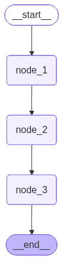
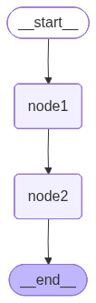
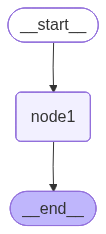
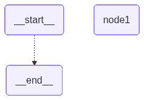
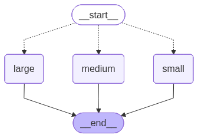

# LangGraph 基础案例：从概念到实践

在深入学习 LangGraph 之前，让我们先建立一个清晰的认知框架。本章将从 LangGraph 在 AI 生态中的定位讲起，然后通过四个由浅入深的案例，帮助你掌握构建智能应用的核心技能。

---

## LangGraph 在 AI 生态中的位置

如果你已经了解过 LangChain，可能会问：LangGraph 和 LangChain 是什么关系？

简单来说，它们是**同一团队打造的不同工具**，各有所长：

| 框架 | 核心定位 | 适用场景 |
|------|----------|----------|
| **LangChain** | 大模型应用开发的"瑞士军刀" | 快速原型、简单链式调用、RAG 应用 |
| **LangGraph** | 复杂工作流的"工业级引擎" | 多步骤流程、状态管理、人机协作 |

**类比理解**：
- LangChain 像是**乐高积木**——提供各种预制组件，快速拼装
- LangGraph 像是**建筑图纸**——精确控制每个环节，构建复杂系统

### 什么时候该用 LangGraph？

当你的应用需要以下能力时，LangGraph 是更好的选择：

1. **状态管理**：需要在多个步骤之间传递和累积信息
2. **流程控制**：根据条件动态决定执行路径
3. **循环迭代**：让 AI 可以反复思考、自我纠正
4. **人机协作**：在关键节点让人类介入决策
5. **可观测性**：需要精确追踪每一步的执行情况

### 理解 Agent：你的智能助手

在开始写代码之前，先理解一个核心概念——**Agent（智能体）**。

想象你招了一个新员工：
- 你告诉他公司的**规章制度**（系统提示词）
- 给他配备**办公工具**（Tools：搜索、计算、数据库等）
- 他会**自己思考**如何完成任务（LLM 推理）
- 遇到问题会**主动汇报**（Human-in-the-loop）

Agent 就是这样一个"数字员工"——它不只是执行固定脚本，而是能够**自主决策、使用工具、完成复杂任务**。

LangGraph 提供了构建这种智能 Agent 的完整框架：
- **State**：员工的"工作台"，存放当前任务的所有信息
- **Node**：员工的"工作步骤"，每个节点处理一个具体任务
- **Edge**：员工的"工作流程"，决定任务完成后下一步做什么

现在，让我们通过具体案例来学习这些概念。

---

# 基础案例1：咖啡馆流水线

在正式进入复杂的 LangGraph 案例之前，我们先通过一个简单有趣的例子来理解 LangGraph 的核心概念。这个案例模拟了一个「咖啡馆流水线」，帮助你理解 LangGraph 中**状态（State）**、**节点（Node）**和**边（Edge）**这三个核心概念。

## 案例概览

这个案例做的事情很简单：
- 用户输入一个咖啡名称（比如"拿铁"）
- 经过 3 个节点的加工处理
- 最终输出一句完整的话："拿铁咖啡馆的咖啡很香醇，欢迎下次光临"

整个流程就像一条流水线：**输入 → 加工 → 加工 → 加工 → 输出**

## Graph 架构图

下图展示了整个流程的结构：



可以看到：
- `__start__` 是起点（对应代码中的 `START`）
- `node_1`、`node_2`、`node_3` 是三个处理节点
- `__end__` 是终点（对应代码中的 `END`）
- 箭头表示数据流动的方向

---

## 知识点拆解

### 1. 导入必要的模块

```python
from typing import TypedDict
from langgraph.constants import END, START
from langgraph.graph import StateGraph
```

**解释：**

| 导入项 | 作用 |
|--------|------|
| `TypedDict` | Python 标准库，用于定义带类型提示的字典 |
| `START` | LangGraph 常量，表示图的起点 |
| `END` | LangGraph 常量，表示图的终点 |
| `StateGraph` | LangGraph 核心类，用于构建状态图 |

> **小白提示**：`TypedDict` 让我们可以明确告诉 Python："这个字典里有哪些 key，每个 key 对应什么类型的值"。这样代码更清晰，IDE 也能给你更好的提示。

---

### 2. 定义状态类型

在 LangGraph 中，**状态（State）** 是贯穿整个流程的数据容器。我们需要定义几种不同用途的状态：

#### 2.1 输入状态 (InputState)

```python
class InputState(TypedDict):
    user_input: str  # 用户输入的文本
```

**作用**：定义用户传入 Graph 的数据格式。

**类比**：就像快递单上的"寄件人信息"，告诉系统输入长什么样。

#### 2.2 输出状态 (OutputState)

```python
class OutputState(TypedDict):
    graph_output: str  # Graph 最终输出的结果
```

**作用**：定义 Graph 最终返回给用户的数据格式。

**类比**：就像快递单上的"收件人信息"，告诉系统最终要输出什么。

#### 2.3 整体状态 (OverallState)

```python
class OverallState(TypedDict):
    foo: str          # 中间处理的变量
    user_input: str   # 用户原始输入
    graph_output: str # 最终输出
```

**作用**：包含了整个流程中所有需要用到的数据字段。这是 LangGraph 的核心——**状态会在节点之间传递和更新**。

**类比**：就像工厂流水线上的"工作台"，每个工人（节点）都可以看到和修改工作台上的东西。

#### 2.4 私有状态 (PrivateState)

```python
class PrivateState(TypedDict):
    bar: str  # 仅某些节点使用的变量
```

**作用**：存储中间处理结果，但不会暴露在最终输出中。

**类比**：就像流水线上的临时便签纸，只在特定工序使用，最后不会交给客户。

---

### 3. 定义处理节点

节点是 LangGraph 中的"工人"，负责处理数据。每个节点都是一个函数：

#### 节点 1：生成店名

```python
def node_1(state: InputState) -> OverallState:
    return {
        "foo": state["user_input"] + "咖啡馆"
    }
```

**做了什么**：
- 输入：`"拿铁"`
- 输出：`{"foo": "拿铁咖啡馆"}`

**Python 知识点**：
- 函数参数 `state: InputState` 表示接收一个 InputState 类型的参数
- `-> OverallState` 表示函数返回一个 OverallState 类型的值
- `state["user_input"]` 是从字典中取值

#### 节点 2：添加描述

```python
def node_2(state: OverallState) -> PrivateState:
    return {
        "bar": state["foo"] + "的咖啡很香醇"
    }
```

**做了什么**：
- 输入：`{"foo": "拿铁咖啡馆"}`
- 输出：`{"bar": "拿铁咖啡馆的咖啡很香醇"}`

#### 节点 3：完成处理

```python
def node_3(state: PrivateState) -> OutputState:
    return {
        "graph_output": state["bar"] + "，欢迎下次光临"
    }
```

**做了什么**：
- 输入：`{"bar": "拿铁咖啡馆的咖啡很香醇"}`
- 输出：`{"graph_output": "拿铁咖啡馆的咖啡很香醇，欢迎下次光临"}`

---

### 4. 构建 StateGraph

现在我们有了所有的"零件"，接下来要把它们组装起来：

```python
builder = StateGraph(
    OverallState,        # 整体状态类型
    input=InputState,    # 输入类型
    output=OutputState   # 输出类型
)
```

**解释**：
- `StateGraph` 是构建器，我们用它来搭建流程图
- `OverallState` 是主状态，所有节点共享
- `input=InputState` 告诉 Graph 接受什么格式的输入
- `output=OutputState` 告诉 Graph 返回什么格式的输出

> **注意**：LangGraph V0.5 之后，`input` 和 `output` 参数被重命名为 `input_schema` 和 `output_schema`。

---

### 5. 添加节点

```python
builder.add_node("node_1", node_1)  # 添加节点1
builder.add_node("node_2", node_2)  # 添加节点2
builder.add_node("node_3", node_3)  # 添加节点3
```

**解释**：
- 第一个参数是节点的**名称**（字符串，用于后续连接）
- 第二个参数是节点的**处理函数**

**类比**：就像给流水线上的每个工位起名字，方便后续安排工作顺序。

---

### 6. 添加边（连接节点）

```python
builder.add_edge(START, "node_1")    # 起点 → node_1
builder.add_edge("node_1", "node_2") # node_1 → node_2
builder.add_edge("node_2", "node_3") # node_2 → node_3
builder.add_edge("node_3", END)      # node_3 → 终点
```

**解释**：
- `add_edge(A, B)` 表示从 A 节点连接到 B 节点
- `START` 和 `END` 是特殊的常量，表示图的起点和终点
- 边决定了节点的**执行顺序**

**类比**：就像在流水线上安排传送带，决定产品从哪个工位流向下一个工位。

---

### 7. 编译并运行

```python
# 编译 Graph
graph = builder.compile()

# 运行 Graph
result = graph.invoke({"user_input": "拿铁"})
print(result)
```

**输出结果**：
```python
{'graph_output': '拿铁咖啡馆的咖啡很香醇，欢迎下次光临'}
```

**解释**：
- `compile()` 将构建器转换为可执行的 Graph
- `invoke()` 是调用 Graph 的方法，传入输入数据，返回输出结果

---

## 数据流转过程

让我们跟踪一下数据是如何在整个流程中流转的：

```
输入: {"user_input": "拿铁"}
    ↓
[node_1] 处理后状态: {"foo": "拿铁咖啡馆", "user_input": "拿铁"}
    ↓
[node_2] 处理后状态: {"foo": "拿铁咖啡馆", "bar": "拿铁咖啡馆的咖啡很香醇", ...}
    ↓
[node_3] 处理后状态: {..., "graph_output": "拿铁咖啡馆的咖啡很香醇，欢迎下次光临"}
    ↓
输出: {"graph_output": "拿铁咖啡馆的咖啡很香醇，欢迎下次光临"}
```

注意：
- 每个节点只返回它**修改或新增**的字段
- LangGraph 会自动将返回值**合并**到整体状态中
- 最终输出只包含 `OutputState` 中定义的字段

---

## 核心概念总结

| 概念 | 说明 | 类比 |
|------|------|------|
| **State（状态）** | 在节点之间传递的数据容器 | 咖啡馆的工作台 |
| **Node（节点）** | 处理数据的函数 | 咖啡馆的咖啡师 |
| **Edge（边）** | 连接节点，决定执行顺序 | 制作流程的传递 |
| **StateGraph** | 用于构建和组织整个流程 | 咖啡制作的配方 |
| **compile()** | 将设计图转换为可运行的流程 | 咖啡馆开始营业 |
| **invoke()** | 执行整个流程 | 点单后制作咖啡 |

---

## 完整代码

以下是案例一的完整代码，方便你复制运行：

```python
from typing import TypedDict
from langgraph.constants import END, START
from langgraph.graph import StateGraph


# ==================== 定义状态类型 ====================

class InputState(TypedDict):
    user_input: str  # 用户输入的文本


class OutputState(TypedDict):
    graph_output: str  # Graph 最终输出的结果


class OverallState(TypedDict):
    foo: str          # 中间处理的变量
    user_input: str   # 用户原始输入
    graph_output: str # 最终输出


class PrivateState(TypedDict):
    bar: str  # 仅某些节点使用的变量


# ==================== 定义处理节点 ====================

def node_1(state: InputState) -> OverallState:
    """节点1：生成店名"""
    return {
        "foo": state["user_input"] + "咖啡馆"
    }


def node_2(state: OverallState) -> PrivateState:
    """节点2：添加描述"""
    return {
        "bar": state["foo"] + "的咖啡很香醇"
    }


def node_3(state: PrivateState) -> OutputState:
    """节点3：完成处理"""
    return {
        "graph_output": state["bar"] + "，欢迎下次光临"
    }


# ==================== 构建 StateGraph ====================

builder = StateGraph(
    OverallState,        # 整体状态类型
    input=InputState,    # 输入类型
    output=OutputState   # 输出类型
)

# 添加节点
builder.add_node("node_1", node_1)
builder.add_node("node_2", node_2)
builder.add_node("node_3", node_3)

# 添加边（连接节点）
builder.add_edge(START, "node_1")
builder.add_edge("node_1", "node_2")
builder.add_edge("node_2", "node_3")
builder.add_edge("node_3", END)


# ==================== 编译并运行 ====================

graph = builder.compile()

result = graph.invoke({"user_input": "拿铁"})
print(result)
# 输出: {'graph_output': '拿铁咖啡馆的咖啡很香醇，欢迎下次光临'}
```

---

## 思考题

1. 如果我们想在 node_2 和 node_3 之间插入一个新节点，需要修改哪些代码？
2. 如果想让 Graph 同时输出 `foo` 和 `graph_output`，应该怎么修改 `OutputState`？
3. 为什么需要区分 InputState、OutputState、OverallState 和 PrivateState？直接用一个大的 State 不行吗？

---

## 下一步

理解了这个基础案例后，你就掌握了 LangGraph 最核心的概念。接下来的案例会在此基础上，引入更多高级特性：
- **条件边（Conditional Edge）**：根据条件选择不同的执行路径
- **循环（Loop）**：让 Agent 可以反复思考和行动
- **人机协作（Human-in-the-loop）**：让人类参与决策过程
---

# 基础案例2：消息累加器

在案例一中，我们学习了 LangGraph 的基础概念：State、Node 和 Edge。现在我们来学习一个更高级的特性——**状态合并策略（Reducer）**。

## 案例概览

这个案例演示了 LangGraph 中一个非常重要的概念：**不同字段可以有不同的更新策略**。

- 有些字段每次更新会**覆盖**原值（普通模式）
- 有些字段每次更新会**追加**到列表（累加模式）

就像一个聊天记录：
- 消息是**不断追加**的（不会覆盖之前的聊天记录）
- 而在线状态是**直接覆盖**的（只需要知道当前状态）

## Graph 架构图



这个图比案例一更简单：只有两个节点 `node1` 和 `node2`，按顺序执行。

---

## 核心概念：Annotated 和 Reducer

### 什么是 Reducer？

在 LangGraph 中，**Reducer** 是一种规则，告诉系统**如何合并新旧状态**。

```python
from typing import Annotated
from operator import add
from langgraph.graph.message import add_messages
```

| 导入项 | 作用 |
|--------|------|
| `Annotated` | Python 类型注解，用于给字段附加额外信息 |
| `add` | Python 内置函数，用于列表拼接 |
| `add_messages` | LangGraph 专用，智能合并消息列表 |

---

## 知识点拆解

### 1. 定义带 Reducer 的 State

```python
from langchain_core.messages import AnyMessage, AIMessage
from langgraph.graph import StateGraph
from langgraph.graph.message import add_messages
from typing import Annotated, TypedDict
from operator import add

class State(TypedDict):
    # 消息列表：使用 add_messages 作为 reducer
    messages: Annotated[list[AnyMessage], add_messages]

    # 字符串列表：使用 add 作为 reducer
    list_field: Annotated[list[str], add]

    # 普通字段：没有 reducer，直接覆盖
    another_field: int
```

**解释**：

| 字段 | 类型 | Reducer | 更新行为 |
|------|------|---------|----------|
| `messages` | `list[AnyMessage]` | `add_messages` | 智能追加消息 |
| `list_field` | `list[str]` | `add` | 简单列表拼接 |
| `another_field` | `int` | 无 | 直接覆盖 |

> **小白提示**：`Annotated[类型, reducer]` 的格式就像给字段贴一个"处理标签"。当 LangGraph 更新这个字段时，会按照标签上的规则来处理。

---

### 2. add vs add_messages 的区别

#### `add`（简单拼接）

```python
# 原值: ['x', 'y', 'z']
# 新值: ['m']
# 结果: ['x', 'y', 'z', 'm']
```

`add` 就是 Python 的 `+` 操作符，简单粗暴地把两个列表接在一起。

#### `add_messages`（智能合并）

`add_messages` 是 LangGraph 专门为消息设计的，它有更智能的行为：
- 自动给每条消息分配唯一 ID
- 如果新消息的 ID 和旧消息相同，会**更新**而不是追加
- 支持各种消息类型（HumanMessage、AIMessage 等）

---

### 3. 定义节点

```python
def node1(state: State):
    """
    node1:
    - 创建一条 AI 消息 "你好"
    - list_field 追加 ['m']
    - another_field 设为 10
    """
    new_message = AIMessage("你好")
    return {
        "messages": [new_message],
        "list_field": ['m'],
        "another_field": 10
    }


def node2(state: State):
    """
    node2:
    - 创建一条 AI 消息 "欢迎学习 LangGraph"
    - list_field 追加 ['n']
    - another_field 设为 20（会覆盖 node1 的值）
    """
    new_message = AIMessage("欢迎学习 LangGraph")
    return {
        "messages": [new_message],
        "list_field": ['n'],
        "another_field": 20
    }
```

**关键点**：
- 节点只需返回**要更新的字段**
- LangGraph 会根据每个字段的 Reducer 自动决定如何合并

---

### 4. 构建 Graph（链式写法）

```python
graph = (
    StateGraph(State)
        .add_node("node1", node1)
        .add_node("node2", node2)
        .set_entry_point("node1")
        .add_edge("node1", "node2")
        .compile()
)
```

**解释**：

这是一种**链式调用**的写法，等价于：

```python
builder = StateGraph(State)
builder.add_node("node1", node1)
builder.add_node("node2", node2)
builder.set_entry_point("node1")  # 等价于 add_edge(START, "node1")
builder.add_edge("node1", "node2")
graph = builder.compile()
```

> **小白提示**：链式调用让代码更紧凑，但可读性见仁见智。两种写法效果完全一样。

---

### 5. 运行 Graph

```python
input_message = {"role": "user", "content": "开始学习"}

result = graph.invoke({
    "messages": [input_message],
    "list_field": ['x', 'y', 'z']
})

print(result)
```

**输出结果**：

```python
{
    'messages': [
        HumanMessage(content='开始学习', id='7c4962f7-...'),
        AIMessage(content='你好', id='18244cc5-...'),
        AIMessage(content='欢迎学习 LangGraph', id='ecb626fd-...')
    ],
    'list_field': ['x', 'y', 'z', 'm', 'n'],
    'another_field': 20
}
```

---

## 数据流转过程

让我们详细跟踪每个字段的变化：

```
初始输入:
  messages: [HumanMessage("开始学习")]
  list_field: ['x', 'y', 'z']
  another_field: (未设置)
    ↓
[node1] 返回: {messages: [AIMessage("你好")], list_field: ['m'], another_field: 10}
    ↓
合并后状态:
  messages: [HumanMessage("开始学习"), AIMessage("你好")]  ← 追加了一条
  list_field: ['x', 'y', 'z', 'm']                         ← 追加了 'm'
  another_field: 10                                         ← 设置为 10
    ↓
[node2] 返回: {messages: [AIMessage("欢迎学习 LangGraph")], list_field: ['n'], another_field: 20}
    ↓
最终状态:
  messages: [HumanMessage, AIMessage, AIMessage]  ← 又追加了一条
  list_field: ['x', 'y', 'z', 'm', 'n']           ← 追加了 'n'
  another_field: 20                                ← 被覆盖为 20
```

**观察要点**：
- `messages` 和 `list_field` 是**累加**的
- `another_field` 是**覆盖**的（最终值是 node2 设置的 20，而不是 node1 的 10）

---

## Reducer 对比表

| 更新方式 | 使用场景 | 示例 |
|----------|----------|------|
| **无 Reducer（覆盖）** | 状态值、计数器、配置 | `another_field: int` |
| **add（简单追加）** | 日志、标签列表 | `list_field: Annotated[list[str], add]` |
| **add_messages（智能追加）** | 聊天记录 | `messages: Annotated[list[AnyMessage], add_messages]` |

---

## 思考题

1. 如果我们想让 `another_field` 也变成累加模式（每次加 1），应该怎么写 Reducer？
2. `add_messages` 在什么情况下会**更新**消息而不是追加？
3. 如果 node2 不返回 `another_field`，最终的 `another_field` 值会是多少？

---

## 案例二完整代码

```python
from langchain_core.messages import AnyMessage, AIMessage
from langgraph.graph import StateGraph
from langgraph.graph.message import add_messages
from typing import Annotated, TypedDict
from operator import add


# ============================================
# 1. 定义 State（整体状态结构）
# ============================================
class State(TypedDict):
    # messages 字段：存放消息列表
    messages: Annotated[list[AnyMessage], add_messages]

    # list_field：一个字符串列表
    list_field: Annotated[list[str], add]

    # 普通字段，不参与合并
    another_field: int


# ============================================
# 2. 定义节点 node1
# ============================================
def node1(state: State):
    """
    node1:
    - 创建新的 AIMessage("你好")
    - list_field 追加 ['m']
    - another_field = 10
    """
    new_message = AIMessage("你好")
    return {
        "messages": [new_message],
        "list_field": ['m'],
        "another_field": 10
    }


# ============================================
# 3. 定义节点 node2
# ============================================
def node2(state: State):
    """
    node2:
    - 创建新的 AIMessage("欢迎学习 LangGraph")
    - list_field 追加 ['n']
    - another_field = 20（此字段直接覆盖前面的）
    """
    new_message = AIMessage("欢迎学习 LangGraph")
    return {
        "messages": [new_message],
        "list_field": ['n'],
        "another_field": 20
    }


# ============================================
# 4. 构建状态图（StateGraph）
# ============================================
graph = (
    StateGraph(State)
        .add_node("node1", node1)
        .add_node("node2", node2)
        .set_entry_point("node1")
        .add_edge("node1", "node2")
        .compile()
)


# ============================================
# 5. 调用 Graph
# ============================================
input_message = {"role": "user", "content": "开始学习"}

result = graph.invoke({
    "messages": [input_message],
    "list_field": ['x', 'y', 'z']
})

print(result)

# ================================
# 打印 result 内各个字段的内容
# ================================
print("\n===== State 字段逐项打印 =====")
print("messages:")
for msg in result["messages"]:
    print("  -", msg)

print("list_field:", result["list_field"])
print("another_field:", result["another_field"])


# 可视化图结构
from IPython.display import Image, display
display(Image(graph.get_graph(xray=True).draw_mermaid_png()))
```

---

## 下一步

现在你已经掌握了：
- ✅ State、Node、Edge 基础概念
- ✅ Reducer 和状态合并策略

接下来的案例会介绍更高级的特性，比如条件分支和循环！

---

# 基础案例3：Config 配置与节点缓存

在前两个案例中，我们学习了 State 和 Reducer。现在来学习两个新概念：**Config（配置）** 和 **节点缓存（Cache）**。

## 案例概览

这个案例演示了：
1. **ConfigSchema**：如何通过 config 向节点传递额外参数
2. **CachePolicy**：如何缓存节点的执行结果，避免重复计算

**实际应用场景**：
- 用户身份信息（user_id）通过 config 传入
- 相同输入在一定时间内（TTL）直接返回缓存结果，提高性能

## Graph 架构图



这是一个最简单的单节点图：`START → node1 → END`

---

## 核心概念：Config 和 Cache

### 什么是 Config？

**Config** 是在调用 Graph 时传入的**配置参数**，和 State 不同：
- **State**：会在节点之间传递和修改
- **Config**：只读配置，节点可以读取但不会修改

```python
# 调用时传入 config
graph.invoke(
    {"score": 50},                                  # State（输入数据）
    config={"configurable": {"user_id": "u_001"}}  # Config（配置参数）
)
```

### 什么是 Cache？

**Cache（缓存）** 可以存储节点的执行结果。当相同的输入再次出现时，直接返回缓存结果，无需重新计算。

**TTL（Time To Live）**：缓存的有效时间，超过后自动失效。

---

## 知识点拆解

### 1. 定义 State 和 ConfigSchema

```python
from typing import TypedDict
import time

from langchain_core.runnables import RunnableConfig
from langgraph.constants import START, END
from langgraph.graph import StateGraph
from langgraph.types import CachePolicy
from langgraph.cache.memory import InMemoryCache


class State(TypedDict):
    score: int       # 用于递增的分数
    user_id: str     # 记录用户 ID


class ConfigSchema(TypedDict):
    user_id: str     # 从 config 中读取的用户 ID
```

**解释**：
- `State` 是运行时的状态数据
- `ConfigSchema` 定义了 `config["configurable"]` 中可以包含的字段

> **注意**：LangGraph V1.0 之后，`config_schema` 被重命名为 `context_schema`。

---

### 2. 定义带 Config 参数的节点

```python
def node_1(state: State, config: RunnableConfig):
    """
    节点 1：
    - 让 score 加 10
    - 从 config 中读取 user_id 并写入 State
    """
    # 模拟耗时操作
    time.sleep(1)

    # 从 config["configurable"] 中读取 user_id
    user_id = config["configurable"]["user_id"]

    return {
        "score": state["score"] + 10,
        "user_id": user_id
    }
```

**关键点**：
- 节点函数可以接收第二个参数 `config: RunnableConfig`
- 通过 `config["configurable"]["字段名"]` 读取配置

**Python 知识点**：
- `RunnableConfig` 是 LangChain 的类型，LangGraph 会自动包装传入的 config

---

### 3. 构建带缓存的 Graph

```python
# 创建 StateGraph，绑定 ConfigSchema
builder = StateGraph(State, config_schema=ConfigSchema)

# 添加节点，设置缓存策略：TTL=5秒
builder.add_node("node1", node_1, cache_policy=CachePolicy(ttl=5))

# 添加边
builder.add_edge(START, "node1")
builder.add_edge("node1", END)

# 编译时启用内存缓存
graph = builder.compile(cache=InMemoryCache())
```

**解释**：

| 参数 | 作用 |
|------|------|
| `config_schema=ConfigSchema` | 告诉 Graph 接受哪些配置参数 |
| `cache_policy=CachePolicy(ttl=5)` | 节点缓存策略，5秒内有效 |
| `cache=InMemoryCache()` | 使用内存缓存存储结果 |

---

### 4. 运行 Graph 并观察缓存效果

```python
# 第一次调用（不命中缓存，会执行 sleep）
print(graph.invoke({"score": 50}, config={"configurable": {"user_id": "u_001"}}))
# 输出: {'score': 60, 'user_id': 'u_001'}

# 第二次调用（命中缓存，立即返回）
print(graph.invoke({"score": 50}, config={"configurable": {"user_id": "u_001"}}))
# 输出: {'score': 60, 'user_id': 'u_001'}
```

**缓存命中条件**（必须同时满足）：
1. 输入 State 完全相同
2. `config["configurable"]` 完全相同
3. 在 TTL 时间内

---

## 缓存机制图解

```
第一次调用: {"score": 50}, user_id="u_001"
    ↓
[node1] 执行（sleep 1秒）→ 返回 {"score": 60, "user_id": "u_001"}
    ↓
结果存入缓存（有效期 5 秒）

第二次调用（5秒内）: {"score": 50}, user_id="u_001"
    ↓
缓存命中！直接返回 {"score": 60, "user_id": "u_001"}
    ↓
（跳过 node1 执行）
```

---

## Config vs State 对比

| 特性 | State | Config |
|------|-------|--------|
| **传递方式** | `invoke(state)` | `invoke(state, config={...})` |
| **可修改性** | 节点可以修改 | 只读 |
| **用途** | 业务数据 | 配置参数（用户ID、环境变量等） |
| **缓存影响** | 作为缓存 key 的一部分 | 作为缓存 key 的一部分 |

---

---

## 扩展：Node 重试机制（RetryPolicy）

除了缓存，LangGraph 还支持为节点配置**重试策略**。当节点执行失败时（比如网络超时、API 限流），可以自动重试。

### 为什么需要重试？

在实际应用中，LLM API 调用可能因为多种原因失败：
- 网络波动导致连接超时
- API 服务临时过载返回 429 错误
- 外部服务短暂不可用

如果每次失败都让整个流程崩溃，用户体验会很差。重试机制可以优雅地处理这些临时故障。

### 配置 RetryPolicy

```python
from langgraph.types import RetryPolicy

# 添加节点时设置重试策略
builder.add_node(
    "api_caller",
    call_external_api,
    retry=RetryPolicy(
        max_attempts=3,        # 最多重试 3 次
        initial_interval=1.0,  # 首次重试间隔 1 秒
        backoff_factor=2.0,    # 间隔倍增因子
        max_interval=10.0,     # 最大间隔 10 秒
        jitter=True            # 添加随机抖动，避免雪崩
    )
)
```

### 重试参数详解

| 参数 | 说明 | 示例值 |
|------|------|--------|
| `max_attempts` | 总尝试次数（含首次） | 3 |
| `initial_interval` | 首次重试前等待时间（秒） | 1.0 |
| `backoff_factor` | 间隔倍增因子 | 2.0 |
| `max_interval` | 重试间隔上限（秒） | 10.0 |
| `jitter` | 是否添加随机抖动 | True |

### 重试时间线示例

假设配置 `max_attempts=4, initial_interval=1.0, backoff_factor=2.0`：

```
第 1 次尝试 → 失败
  等待 1 秒
第 2 次尝试 → 失败
  等待 2 秒（1 × 2）
第 3 次尝试 → 失败
  等待 4 秒（2 × 2）
第 4 次尝试 → 成功或最终失败
```

### 缓存 + 重试 组合使用

```python
from langgraph.types import CachePolicy, RetryPolicy

builder.add_node(
    "smart_node",
    process_data,
    cache_policy=CachePolicy(ttl=300),  # 缓存 5 分钟
    retry=RetryPolicy(max_attempts=3)   # 失败时重试
)
```

**执行逻辑**：
1. 先检查缓存，命中则直接返回
2. 缓存未命中，执行节点函数
3. 如果执行失败，按策略重试
4. 成功后结果存入缓存

---

## 思考题

1. 如果第二次调用时 `user_id` 不同，会命中缓存吗？
2. 如果想禁用某个节点的缓存，应该怎么做？
3. 除了 `InMemoryCache`，LangGraph 还支持哪些缓存方式？
4. RetryPolicy 的 `jitter` 参数有什么作用？为什么要添加随机抖动？

---

## 案例三完整代码

```python
from typing import TypedDict
import time

from langchain_core.runnables import RunnableConfig
from langgraph.constants import START, END
from langgraph.graph import StateGraph
from langgraph.types import CachePolicy
from langgraph.cache.memory import InMemoryCache


# ============================================
# 1. 定义 State（流程运行的"状态"）
# ============================================
class State(TypedDict):
    score: int
    user_id: str


# ============================================
# 2. 定义 ConfigSchema（传入 Graph 的可配置参数）
# ============================================
class ConfigSchema(TypedDict):
    user_id: str


# ============================================
# 3. 定义节点函数 node1
# ============================================
def node_1(state: State, config: RunnableConfig):
    # 模拟节点执行耗时
    time.sleep(1)

    # 从 config["configurable"] 中读取 user_id
    user_id = config["configurable"]["user_id"]

    # 返回增量状态
    return {
        "score": state["score"] + 10,
        "user_id": user_id
    }


# ============================================
# 4. 创建 StateGraph，并绑定 State 与 ConfigSchema
# ============================================
builder = StateGraph(State, config_schema=ConfigSchema)

# 注册节点 node1，并设置缓存策略（TTL=5秒）
builder.add_node("node1", node_1, cache_policy=CachePolicy(ttl=5))

# 添加边
builder.add_edge(START, "node1")
builder.add_edge("node1", END)


# ============================================
# 5. 编译图，并启用 InMemoryCache
# ============================================
graph = builder.compile(cache=InMemoryCache())


# ============================================
# 6. 执行图
# ============================================
# 第一次执行（不命中缓存）
print(graph.invoke({"score": 50}, config={"configurable": {"user_id": "u_001"}}))

# 第二次执行（在 TTL 内，命中缓存）
print(graph.invoke({"score": 50}, config={"configurable": {"user_id": "u_001"}}))


# 可视化图结构
from IPython.display import Image, display
display(Image(graph.get_graph(xray=True).draw_mermaid_png()))
```

---

# 基础案例4：条件边与路由

前面的案例都是**线性流程**（节点按固定顺序执行）。现在我们来学习 LangGraph 最强大的特性之一：**条件边（Conditional Edge）**。

## 案例概览

条件边让 Graph 可以**根据状态动态选择执行路径**：
- 如果条件 A 满足 → 走路径 A
- 如果条件 B 满足 → 走路径 B
- ...

就像交通十字路口：根据目的地选择不同的方向。

## Graph 架构图

### 简单条件边



虚线表示**条件边**：根据条件决定是否执行。

### 多分支条件边



从 `START` 出发，根据条件选择不同的节点（small/medium/large）。

---

## 核心概念：条件边

### 什么是条件边？

**条件边**使用一个**路由函数（routing function）** 来决定下一步走哪个节点。

```python
def routing_func(state: State) -> str:
    if state["count"] > 6:
        return "node1"   # 走 node1
    else:
        return END       # 结束流程
```

路由函数的规则：
- 输入：当前 State
- 输出：下一个节点的**名称**（字符串）

---

## 知识点拆解

### 1. 简单条件边示例

```python
from langchain_core.runnables import RunnableConfig
from langgraph.constants import START, END
from langgraph.graph import StateGraph
from typing import TypedDict


class State(TypedDict):
    count: int


def node_1(state: State, config: RunnableConfig):
    return {"count": state["count"] + 5}


# 路由函数：决定流程走向
def routing_func(state: State) -> str:
    if state["count"] > 6:
        return "node1"   # 继续执行 node1
    else:
        return END       # 结束流程


# 构建 Graph
builder = StateGraph(State)
builder.add_node("node1", node_1)

# 添加固定边：node1 → END
builder.add_edge("node1", END)

# 添加条件边：START → (根据条件) → node1 或 END
builder.add_conditional_edges(
    START,          # 起点
    routing_func    # 路由函数
)

graph = builder.compile()
# 可视化
from IPython.display import Image, display
display(Image(graph.get_graph(xray=True).draw_mermaid_png()))
```

**解释**：

| 方法 | 作用 |
|------|------|
| `add_edge(A, B)` | 固定边：A 执行完后一定走 B |
| `add_conditional_edges(A, func)` | 条件边：A 执行完后，由 func 决定下一步 |

---

### 2. 运行示例

```python
# count=4，4 <= 6，直接结束
print(graph.invoke({"count": 4}))
# 输出: {'count': 4}

# count=8，8 > 6，执行 node1
print(graph.invoke({"count": 8}))
# 输出: {'count': 13}
```

**执行流程**：

```
输入: {"count": 4}
    ↓
routing_func(4) → 4 <= 6 → 返回 END
    ↓
流程结束，输出: {"count": 4}

输入: {"count": 8}
    ↓
routing_func(8) → 8 > 6 → 返回 "node1"
    ↓
执行 node1 → {"count": 13}
    ↓
node1 → END（固定边）
    ↓
流程结束，输出: {"count": 13}
```

---

### 3. 多分支条件边

当路由函数有多个可能的返回值时，需要使用 **mapping 参数**告诉 Graph 所有可能的路径：

```python
def node_low(state: State, config: RunnableConfig):
    return {"value": state["value"] + 5}

def node_mid(state: State, config: RunnableConfig):
    return {"value": state["value"] + 10}

def node_high(state: State, config: RunnableConfig):
    return {"value": state["value"] + 20}


def routing_func(state: State) -> str:
    v = state["value"]
    if v <= 8:
        return "low"
    elif v <= 15:
        return "mid"
    else:
        return "high"


# 构建 Graph
builder = StateGraph(State)
builder.add_node("low", node_low)
builder.add_node("mid", node_mid)
builder.add_node("high", node_high)

# 每个节点都指向 END
builder.add_edge("low", END)
builder.add_edge("mid", END)
builder.add_edge("high", END)

# 条件边：使用 mapping 参数声明所有可能的路径
builder.add_conditional_edges(
    START,
    routing_func,
    {
        "low": "low",    # 返回值 "low" → 节点 "low"
        "mid": "mid",    # 返回值 "mid" → 节点 "mid"
        "high": "high"   # 返回值 "high" → 节点 "high"
    }
)

graph = builder.compile()
# 可视化
from IPython.display import Image, display
display(Image(graph.get_graph(xray=True).draw_mermaid_png()))
```

**mapping 参数的作用**：
- 告诉可视化工具有哪些可能的路径
- 映射路由函数的返回值到实际节点名称

---

### 4. 运行多分支示例

```python
graph.invoke({"value": 6})
# routing_func(6) → 6 <= 8 → "low"
# 执行 node_low → {"value": 11}
```

---

## 条件边 vs 固定边

| 特性 | 固定边 (add_edge) | 条件边 (add_conditional_edges) |
|------|------------------|-------------------------------|
| **执行路径** | 固定 | 动态决定 |
| **决策依据** | 无 | 路由函数返回值 |
| **可视化** | 实线 | 虚线 |
| **使用场景** | 线性流程 | 分支/循环/动态路由 |

---

## 思考题

1. 如何用条件边实现一个**循环**？（提示：让路由函数返回当前节点名称）
2. 如果路由函数返回了一个不存在的节点名称，会发生什么？
3. 条件边可以用在除了 START 以外的其他节点吗？

---

## 案例四完整代码

### 简单条件边

```python
from langchain_core.runnables import RunnableConfig
from langgraph.constants import START, END
from langgraph.graph import StateGraph
from typing import TypedDict


class State(TypedDict):
    count: int


def node_1(state: State, config: RunnableConfig):
    return {"count": state["count"] + 5}


def routing_func(state: State) -> str:
    if state["count"] > 6:
        return "node1"
    else:
        return END


builder = StateGraph(State)
builder.add_node("node1", node_1)
builder.add_edge("node1", END)
builder.add_conditional_edges(START, routing_func)

graph = builder.compile()

# 测试
print(graph.invoke({"count": 4}))  # {'count': 4}
print(graph.invoke({"count": 8}))  # {'count': 13}

# 可视化
from IPython.display import Image, display
display(Image(graph.get_graph(xray=True).draw_mermaid_png()))
```

### 多分支条件边

```python
from typing import TypedDict
from langchain_core.runnables import RunnableConfig
from langgraph.constants import START, END
from langgraph.graph import StateGraph


class State(TypedDict):
    value: int


def node_low(state: State, config: RunnableConfig):
    return {"value": state["value"] + 5}

def node_mid(state: State, config: RunnableConfig):
    return {"value": state["value"] + 10}

def node_high(state: State, config: RunnableConfig):
    return {"value": state["value"] + 20}


def routing_func(state: State) -> str:
    v = state["value"]
    if v <= 8:
        return "low"
    elif v <= 15:
        return "mid"
    else:
        return "high"


builder = StateGraph(State)
builder.add_node("low", node_low)
builder.add_node("mid", node_mid)
builder.add_node("high", node_high)

builder.add_edge("low", END)
builder.add_edge("mid", END)
builder.add_edge("high", END)

builder.add_conditional_edges(
    START,
    routing_func,
    {
        "low": "low",
        "mid": "mid",
        "high": "high"
    }
)

graph = builder.compile()

# 测试
print(graph.invoke({"value": 6}))  # {'value': 11}

# 可视化
from IPython.display import Image, display
display(Image(graph.get_graph(xray=False).draw_mermaid_png()))
```

---

## 本章总结

通过这四个基础案例，你已经掌握了 LangGraph 的核心概念：

| 案例 | 核心概念 |
|------|----------|
| 案例1 | State、Node、Edge 基础 |
| 案例2 | Reducer 状态合并策略 |
| 案例3 | Config 配置、Cache 缓存 |
| 案例4 | 条件边、路由函数 |

这些是构建复杂 AI Agent 的基础。接下来的案例会展示如何将这些概念组合起来，构建真正有用的应用！

---

## 常见问题：为什么条件边在图中不显示？

### 问题描述

你可能会遇到这样的情况：代码本身没有报错，`builder.add_edge("node1", END)` 和 `add_conditional_edges(START, routing_func)` 都能正常运行，但在可视化图中却看到三个孤立的节点，没有任何连线。


### 问题原因

**当你没有给 `add_conditional_edges` 提供完整的分支映射时，LangGraph 会将这条条件边视为"不完整"，因此不会在图中绘制出来。**

问题代码：

```python
builder.add_conditional_edges(START, routing_func)
```

这种写法虽然能运行，但没有告诉 LangGraph 路由函数可能返回哪些值、这些值分别对应哪个节点。

### 解决方案

**必须在 `add_conditional_edges` 中提供第三个参数——完整的路径映射（mapping）**：

```python
builder.add_conditional_edges(
    START,
    routing_func,
    {
        "node1": "node1",
        END: END
    }
)
```

映射字典的格式是 `{路由函数返回值: 目标节点名称}`，需要包含路由函数所有可能的返回值。

### 完整示例

```python
from langchain_core.runnables import RunnableConfig
from langgraph.constants import START, END
from langgraph.graph import StateGraph
from typing import TypedDict

class State(TypedDict):
    count: int

def node_1(state: State, config: RunnableConfig):
    return {"count": state["count"] + 5}

def routing_func(state: State) -> str:
    if state["count"] > 6:
        return "node1"
    else:
        return END

builder = StateGraph(State)
builder.add_node("node1", node_1)

builder.add_edge("node1", END)

# ✅ 正确写法：提供完整的映射
builder.add_conditional_edges(
    START,
    routing_func,
    {
        "node1": "node1",
        END: END
    }
)

graph = builder.compile()

print(graph.invoke({"count": 4}))  # {'count': 4}
print(graph.invoke({"count": 8}))  # {'count': 13}

# 可视化 - 现在可以正确显示条件边了
from IPython.display import Image, display
display(Image(graph.get_graph(xray=True).draw_mermaid_png()))
```

### 图结构示意

添加完整映射后，可视化图会显示：

```
   START
     |
 （条件判断）
   /     \
node1    END
   |
  END
```

虚线表示条件边，实线表示固定边。

### 总结

> **`add_conditional_edges` 必须同时提供所有可能分支的完整映射，否则 LangGraph 会省略这条条件边，导致图中显示孤立节点。**

只要补上 mapping 参数，图就会正常显示所有边。
