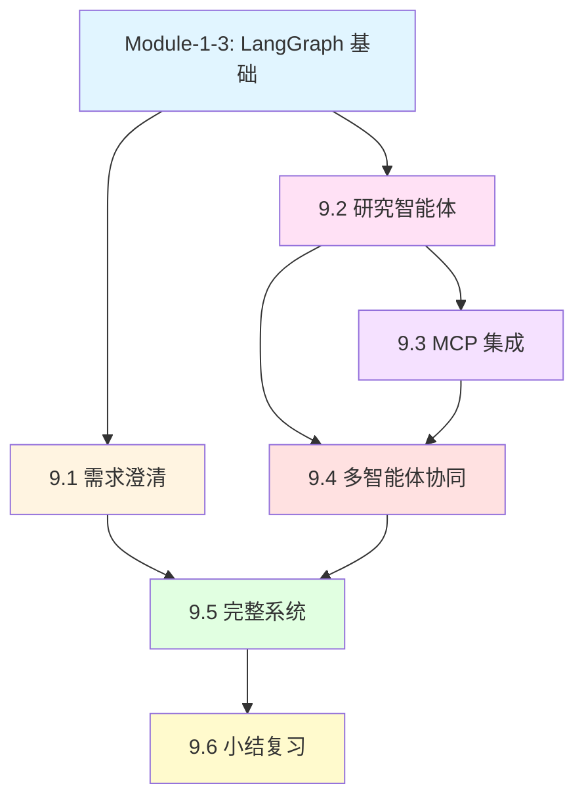

# Module-9 本章介绍：构建 Deep Research 深度研究系统

> **来自图灵奖获得者的寄语**
>
> "真正强大的 AI 系统不是简单地回答问题，而是能够像人类研究员一样，系统性地探索、分析、综合信息。Deep Research 代表了 AI Agent 的新范式——不再是单次查询响应，而是持续迭代、深度挖掘、多角度验证的研究过程。在 LangGraph 中，你将学会如何构建这样的系统：AI 能够澄清需求、规划研究、并行探索、压缩知识，最终生成高质量的研究报告。"
>
> — *启发自 Judea Pearl 对系统性推理的强调*

---

## 📚 本章概览

**Deep Research（深度研究系统）** 是 LangGraph 最复杂、最强大的应用场景之一。本章将带你从零开始构建一个完整的多智能体研究系统，该系统能够：

- 🎯 **智能澄清用户需求** - 自动识别模糊请求并提出针对性问题
- 📋 **生成结构化研究简报** - 将对话转化为详细的研究规划
- 🔍 **并行深度研究** - 多个智能体协同探索不同子主题
- 📊 **上下文工程优化** - 高效压缩和管理海量研究信息
- 📝 **生成专业研究报告** - 综合所有发现，输出结构化报告

### 学习目标

通过本章学习，你将掌握：

1. **用户需求澄清与研究规划** - 使用 Structured Output 和 Command 控制流实现智能对话
2. **研究智能体基础** - 构建能自主搜索、反思、决策的研究 Agent
3. **MCP 集成与工具扩展** - 理解 Model Context Protocol 并集成外部工具
4. **多智能体协同研究** - 使用 Supervisor 模式实现并行研究和上下文隔离
5. **完整系统集成** - 将所有组件整合为端到端的研究系统

### 本章架构图

```
Module-9: Deep Research 完整体系
├─ 9.1 用户需求澄清与研究规划 (难度: ⭐⭐⭐)
│   ├─ 用户意图澄清 (ClarifyWithUser)
│   ├─ 研究简报生成 (ResearchQuestion)
│   ├─ Command 控制流
│   └─ Structured Output Schema
│
├─ 9.2 研究智能体基础 (难度: ⭐⭐⭐⭐)
│   ├─ Agent 工具调用循环
│   ├─ Tavily Search API
│   ├─ think_tool 反思机制
│   ├─ 研究压缩 (Context Engineering)
│   └─ Prompt Engineering for Agents
│
├─ 9.3 MCP 集成与工具扩展 (难度: ⭐⭐⭐⭐)
│   ├─ Model Context Protocol 原理
│   ├─ MCP 客户端-服务器架构
│   ├─ stdio vs HTTP transport
│   ├─ 异步工具执行
│   └─ Filesystem MCP Server 示例
│
├─ 9.4 多智能体协同研究 (难度: ⭐⭐⭐⭐⭐)
│   ├─ Supervisor-Worker 模式
│   ├─ 上下文隔离 (Context Isolation)
│   ├─ 任务分解与并行化
│   ├─ asyncio.gather 并行执行
│   └─ 研究结果聚合
│
├─ 9.5 完整系统集成 (难度: ⭐⭐⭐⭐⭐)
│   ├─ 端到端流程设计
│   ├─ 子图集成
│   ├─ 递归限制配置
│   ├─ 最终报告生成
│   └─ 生产部署考虑
│
└─ 9.6 小结和复习
    ├─ 核心概念回顾
    ├─ Context Engineering 最佳实践
    ├─ 性能优化技巧
    └─ 常见问题解答
```

### 知识依赖关系



---

## 🎯 核心概念预览

### 1. 为什么需要 Deep Research 系统？

**传统 LLM 的局限性：**

```python
# ❌ 传统单次查询 - 信息浅薄、缺乏验证
response = llm.invoke("What are the best coffee shops in SF?")
# 输出: 基于训练数据的通用回答，可能过时或不准确
```

**Deep Research 的优势：**

```python
# ✅ Deep Research - 多轮迭代、深度验证
1. 澄清需求: "您关注的是咖啡质量、氛围还是性价比？"
2. 规划研究: "我将从专业评测、用户评价、认证机构三个角度研究"
3. 并行搜索:
   - Agent A: 搜索 "SF specialty coffee certifications"
   - Agent B: 搜索 "Coffee Review SF ratings 2024"
   - Agent C: 搜索 "Yelp SF coffee quality reviews"
4. 综合分析: 交叉验证多个来源，识别共识与差异
5. 生成报告: 结构化输出，包含证据链和来源引用
```

---

### 2. Deep Research 系统的五大组件

#### 组件 1：用户需求澄清 (Scoping)

**核心思想：** 避免基于模糊需求进行研究，主动澄清用户意图。

**实现机制：**
```python
from langgraph.types import Command

def clarify_with_user(state):
    """使用 Structured Output 判断是否需要澄清"""
    response = model.with_structured_output(ClarifyWithUser).invoke(...)

    if response.need_clarification:
        # 返回问题给用户
        return Command(goto=END, update={"messages": [AIMessage(response.question)]})
    else:
        # 继续到研究简报生成
        return Command(goto="write_research_brief", update={...})
```

**关键技术：**
- **Structured Output** - 确保 LLM 输出符合预定义 schema
- **Command 对象** - 灵活控制图的执行流程
- **对话历史管理** - 避免重复提问

---

#### 组件 2：研究智能体 (Research Agent)

**核心思想：** Agent 自主进行多轮搜索，每轮反思结果并决定下一步。

**工具调用循环：**
```
用户需求 → LLM 决策 → 搜索工具 → think_tool 反思 → LLM 决策 → ...
                ↓
         足够信息？ → 生成最终答案
```

**Prompt Engineering 关键：**

```python
"""
<Hard Limits>
- Simple queries: 2-3 search calls maximum
- Complex queries: Up to 5 search calls maximum
- Always stop: After 5 searches if you cannot find answers
</Hard Limits>

<Show Your Thinking>
After each search, use think_tool to analyze:
- What key information did I find?
- What's missing?
- Do I have enough to answer comprehensively?
- Should I search more or provide my answer?
</Show Your Thinking>
"""
```

**防止常见问题：**
- ❌ **Spin-out 问题** - Agent 无限循环搜索相似内容
- ✅ **解决方案** - 硬性限制工具调用次数 + think_tool 强制反思

---

#### 组件 3：上下文工程 (Context Engineering)

**核心思想：** 在两个关键位置进行信息压缩，避免上下文爆炸。

**压缩位置 1：网页内容摘要**
```python
def summarize_webpage_content(webpage_content: str) -> str:
    """
    将原始网页内容（可能包含导航、广告、样板文本）
    压缩为结构化摘要 + 关键引用
    """
    summary = model.with_structured_output(Summary).invoke([
        HumanMessage(content=f"Summarize: {webpage_content}")
    ])

    return f"""
    <summary>{summary.summary}</summary>
    <key_excerpts>{summary.key_excerpts}</key_excerpts>
    """
```

**压缩位置 2：研究结果压缩**
```python
def compress_research(state: ResearcherState) -> dict:
    """
    将多轮工具调用的完整历史压缩为核心发现
    保留原始笔记供详细分析
    """
    system_message = compress_research_system_prompt
    messages = [SystemMessage(system_message)] + state["researcher_messages"]

    compressed = compress_model.invoke(messages)

    return {
        "compressed_research": compressed.content,  # 用于后续处理
        "raw_notes": ["\n".join(原始笔记)]           # 用于最终报告
    }
```

**关键注意事项：**
- ⚠️ **压缩风险** - 可能丢失重要信息
- ✅ **缓解策略** - 在 Human Message 中重申原始研究主题
- ✅ **输出 Token 限制** - 设置 `max_tokens=32000` 避免截断

---

#### 组件 4：多智能体协同 (Multi-Agent Supervisor)

**核心思想：** 对于复杂请求，使用 Supervisor 分解任务并并行研究。

**何时使用多智能体？**

| 场景类型 | 示例 | 策略 |
|---------|------|------|
| **简单事实查询** | "SF 最佳咖啡店列表" | 单一 Agent |
| **对比分析** | "OpenAI vs Anthropic vs Google AI 安全方法对比" | 3个并行 Agent |
| **多维度研究** | "分析特斯拉的技术、市场、财务状况" | 3个并行 Agent |

**Supervisor 决策流程：**
```python
def supervisor(state: SupervisorState):
    """
    Supervisor 分析研究简报，决定：
    1. 是否需要分解为子任务？
    2. 需要多少个并行 Agent？
    3. 每个 Agent 的具体任务是什么？
    """
    response = supervisor_model_with_tools.invoke([
        SystemMessage(content=lead_researcher_prompt),
        HumanMessage(content=state["research_brief"])
    ])

    # 如果 LLM 调用了 ConductResearch 工具
    if response.tool_calls:
        # 并行启动多个研究 Agent
        return Command(goto="supervisor_tools", update={...})
```

**并行执行：**
```python
# 使用 asyncio.gather 并行执行多个研究任务
research_results = await asyncio.gather(*[
    researcher_agent.ainvoke({
        "researcher_messages": [HumanMessage(topic)]
    })
    for topic in research_topics
])
```

**上下文隔离的好处：**
- ✅ **避免上下文冲突** - 每个 Agent 有独立的消息历史
- ✅ **提高质量** - 专注单一主题，深度而非广度
- ✅ **加速研究** - 并行执行，总时间 = max(各 Agent 时间)

---

#### 组件 5：MCP 集成 (Model Context Protocol)

**核心思想：** 使用标准协议访问外部工具和数据源。

**MCP vs 自定义工具：**

| 特性 | 自定义工具 | MCP 工具 |
|------|-----------|---------|
| 实现方式 | 手动定义 Python 函数 | 连接到 MCP server |
| 工具发现 | 静态绑定 | 动态查询 server |
| 执行方式 | 同步/异步 | 必须异步 |
| 适用场景 | 简单、固定的工具 | 复杂、可扩展的工具生态 |

**MCP 架构：**
```
Client (LangGraph Agent)
    ↓ (查询可用工具)
MCP Server (e.g., Filesystem Server)
    ↓ (返回工具列表)
Client 绑定工具到 LLM
    ↓ (LLM 调用工具)
Client 转发请求到 Server
    ↓ (via stdio or HTTP)
Server 执行操作
    ↓ (返回结果)
Client 接收结果
```

**两种 Transport 模式：**

**stdio Transport（本地服务器）：**
```python
mcp_config = {
    "filesystem": {
        "command": "npx",
        "args": ["-y", "@modelcontextprotocol/server-filesystem", "/path/to/docs"],
        "transport": "stdio"  # 通过 stdin/stdout 通信
    }
}
```

**HTTP Transport（远程服务器）：**
```python
mcp_config = {
    "remote_api": {
        "url": "https://mcp.example.com/sse",
        "transport": "http",  # 通过 HTTP 请求通信
        "headers": {"Authorization": "Bearer token"}
    }
}
```

---

### 3. 完整系统流程

```
用户输入: "Compare Gemini vs OpenAI Deep Research"
    ↓
┌─────────────────────────────────────────────────┐
│ 1. Clarify with User                            │
│    LLM: "需要澄清吗？"                            │
│    → "OpenAI Deep Research 是指什么产品？"        │
│    用户: "指 Deep Research 功能"                  │
│    LLM: "足够了，开始研究"                        │
└─────────────────────────────────────────────────┘
    ↓
┌─────────────────────────────────────────────────┐
│ 2. Write Research Brief                         │
│    "对比 Gemini 和 OpenAI Deep Research 产品，   │
│     重点关注功能、性能、使用体验..."              │
└─────────────────────────────────────────────────┘
    ↓
┌─────────────────────────────────────────────────┐
│ 3. Supervisor Decides                            │
│    分析: "这是对比任务，需要2个并行 Agent"        │
│    → Agent A: 研究 Gemini Deep Research         │
│    → Agent B: 研究 OpenAI Deep Research         │
└─────────────────────────────────────────────────┘
    ↓
┌──────────────────┬──────────────────┐
│ Agent A          │ Agent B          │
│ ─────────        │ ─────────        │
│ Search 1:        │ Search 1:        │
│ "Gemini Deep..." │ "OpenAI Deep..." │
│ think_tool       │ think_tool       │
│ Search 2:        │ Search 2:        │
│ "Gemini docs"    │ "OpenAI docs"    │
│ think_tool       │ think_tool       │
│ "足够了"          │ "足够了"          │
│ ↓ compress       │ ↓ compress       │
└──────────────────┴──────────────────┘
    ↓
┌─────────────────────────────────────────────────┐
│ 4. Aggregate Results                             │
│    合并两个 Agent 的研究发现                      │
└─────────────────────────────────────────────────┘
    ↓
┌─────────────────────────────────────────────────┐
│ 5. Generate Final Report                        │
│    基于所有研究笔记生成结构化报告                  │
│    包含: 对比表格、优劣分析、使用建议...          │
└─────────────────────────────────────────────────┘
```

---

## 🗺️ 学习路线图

### 初学者路径（5-7 天）

**目标：** 理解 Deep Research 的核心概念，能够构建简单的研究系统

**Day 1-2: 需求澄清与规划**
- ✅ 理解 Structured Output 的作用
- ✅ 掌握 Command 对象控制流
- ✅ 实现用户意图澄清逻辑
- 🎯 实战：构建能识别模糊需求的聊天机器人

**Day 3-4: 研究智能体基础**
- ✅ 理解 Agent 工具调用循环
- ✅ 集成 Tavily Search API
- ✅ 实现 think_tool 反思机制
- ✅ 学习基本的 Prompt Engineering
- 🎯 实战：构建能搜索并总结的研究 Agent

**Day 5-6: 上下文工程**
- ✅ 学习网页内容摘要
- ✅ 实现研究结果压缩
- ✅ 理解 token 管理策略
- 🎯 实战：优化 Agent 的内存使用

**Day 7: 综合练习**
- 🎯 项目：构建端到端的简单研究系统（单 Agent）
- 📝 复习：Scoping + Research + Compression

---

### 进阶者路径（7-10 天）

**目标：** 掌握多智能体协同和 MCP 集成

**Day 1-2: MCP 基础**
- ✅ 理解 MCP 协议原理
- ✅ 学习客户端-服务器架构
- ✅ 掌握 stdio vs HTTP transport
- ✅ 实现异步工具执行
- 🎯 实战：集成 Filesystem MCP Server

**Day 3-5: 多智能体协同**
- ✅ 理解 Supervisor-Worker 模式
- ✅ 学习任务分解策略
- ✅ 实现并行研究执行（asyncio.gather）
- ✅ 掌握上下文隔离技术
- 🎯 实战：构建能并行研究多主题的系统

**Day 6-8: Prompt Engineering 进阶**
- ✅ 学习防止 spin-out 的技巧
- ✅ 掌握并行化决策启发式
- ✅ 优化工具调用预算
- ✅ 实现高质量的反思机制
- 🎯 实战：调优 Agent 的决策质量

**Day 9-10: 系统集成**
- ✅ 端到端流程设计
- ✅ 子图集成技术
- ✅ 递归限制配置
- 🎯 项目：构建完整的 Deep Research 系统

---

### 专家路径（10-15 天）

**目标：** 构建生产级的 Deep Research 系统

**Day 1-3: 评估驱动开发**
- ✅ 设计 Scoping 质量评估器
- ✅ 实现 Agent 终止决策评估
- ✅ 构建 Supervisor 并行化评估
- ✅ 使用 LLM-as-judge 技术
- 🎯 实战：建立完整的评估 pipeline

**Day 4-6: 性能优化**
- ✅ 优化压缩模型选择（GPT-4.1 vs Claude）
- ✅ 实现智能缓存策略
- ✅ 调优并发参数
- ✅ 减少 token 使用成本
- 🎯 实战：将系统成本降低 50%

**Day 7-9: 生产部署**
- ✅ 使用 LangGraph Studio 本地调试
- ✅ 配置 LangGraph Platform 部署
- ✅ 实现持久化 Checkpointer
- ✅ 设置监控和日志
- 🎯 实战：部署到生产环境

**Day 10-12: 高级功能**
- ✅ 实现自定义 MCP server
- ✅ 添加多数据源支持
- ✅ 集成专业领域工具
- ✅ 实现报告格式定制
- 🎯 实战：为特定领域定制研究系统

**Day 13-15: 综合项目**
- 🎯 大型项目：构建企业级 Deep Research 平台
  - 支持多租户隔离
  - 实现研究历史管理
  - 提供 Web UI 和 API
  - 集成付费搜索 API
  - 具备生产级性能和可靠性

---

## 💡 学习建议

### 1. 动手实践为主

**❌ 不推荐：** 只阅读代码和文档

**✅ 推荐：** 边学边实现，逐步构建完整系统

```python
# 第1天: 实现最简单的澄清逻辑
def clarify(user_input):
    if "咖啡" in user_input and "最好" in user_input:
        return "您关注的是咖啡质量、氛围还是价格？"
    return None

# 第3天: 升级为 LLM 驱动
def clarify_with_llm(user_input):
    response = llm.with_structured_output(ClarifyWithUser).invoke(...)
    return response.question if response.need_clarification else None

# 第5天: 集成到完整流程
def full_scoping_workflow(state):
    # 完整的 clarify + brief generation
    ...
```

---

### 2. 理解设计决策

每个技术选择都有其原因，思考"为什么"比"怎么做"更重要：

**为什么使用 think_tool？**
- ❓ 问题：Agent 容易陷入无限搜索循环
- ✅ 解决：强制 Agent 在每次搜索后反思，避免盲目重复

**为什么需要上下文压缩？**
- ❓ 问题：多轮搜索后 token 数爆炸（可能超过 100k）
- ✅ 解决：分两次压缩（网页级 + 研究级），保持上下文在可控范围

**为什么使用多智能体？**
- ❓ 问题：单 Agent 处理多主题时上下文冲突
- ✅ 解决：每个 Agent 专注单一主题，上下文隔离

---

### 3. 从失败中学习

Deep Research 系统常见的失败模式：

**失败模式 1：过早终止**
```
User: "Compare A vs B vs C"
Agent:
  Search 1: "A overview"
  think_tool: "找到了 A 的信息"
  → 生成报告 ❌ (缺少 B 和 C)
```

**解决方案：**
- 在 Prompt 中明确：对比任务需要覆盖所有对象
- 使用 Supervisor 强制为每个对象分配 Agent

**失败模式 2：Spin-out（无限循环）**
```
Agent:
  Search 1: "best coffee SF"
  Search 2: "top coffee shops SF"
  Search 3: "SF coffee recommendations"
  ... (20+ 次类似搜索)
```

**解决方案：**
- Hard Limits: 最多 5 次搜索
- think_tool 检查：最近两次搜索结果是否重复

**失败模式 3：压缩丢失关键信息**
```
原始搜索结果: "Blue Bottle Coffee 获得 94/100 Coffee Review 评分"
压缩后: "Blue Bottle 是知名咖啡店" ❌ (丢失了评分信息)
```

**解决方案：**
- 在压缩 Prompt 中强调保留所有数值、评分、排名
- 保留原始笔记（raw_notes）供最终报告参考

---

### 4. 使用评估驱动改进

**建立评估循环：**

```python
# 1. 定义成功标准
success_criteria = [
    "研究简报包含了用户提到的所有关键词",
    "研究简报没有假设用户未明确的偏好",
    "Agent 在3-5次搜索内找到答案",
    "Supervisor 正确识别了对比任务并分配了2个 Agent"
]

# 2. 实现自动评估
def evaluate_scoping(brief, user_messages):
    # 使用 LLM-as-judge
    evaluator_response = evaluator_llm.invoke([
        HumanMessage(f"评估这个研究简报是否满足标准...")
    ])
    return evaluator_response.score

# 3. 迭代改进
for iteration in range(10):
    result = run_system(test_input)
    score = evaluate_scoping(result["brief"], test_input)

    if score < 0.8:
        adjust_prompts()  # 根据失败案例调整 Prompt
```

---

## 🎯 本章亮点

### 1. 完整的端到端系统

本章不仅教你构建独立组件，更重要的是教你如何整合：
- 📋 **Scoping** → 📚 **Research** → 🤝 **Multi-Agent** → 📝 **Report**
- 每个组件可独立使用，也可无缝集成

### 2. 生产级最佳实践

所有技术都来自 LangChain 实际构建 Deep Research 的经验：
- ✅ Context Engineering 策略来自真实性能瓶颈
- ✅ Prompt Engineering 规则来自数千次测试
- ✅ 多智能体架构来自对比实验验证

### 3. 评估驱动开发

不仅教你"怎么做"，更教你"如何验证做得好"：
- 📊 Scoping 质量评估
- 📊 Agent 决策质量评估
- 📊 Supervisor 并行化决策评估

### 4. 灵活的扩展性

系统设计允许轻松扩展：
- 🔧 替换搜索工具（Tavily → Google Search → 自定义爬虫）
- 🔧 添加新的 MCP Server（文件系统 → 数据库 → API）
- 🔧 定制报告格式（Markdown → PDF → HTML）

---

## 📊 核心技术速查表

### Scoping（需求澄清）

| API/概念 | 说明 | 示例 |
|---------|------|------|
| `ClarifyWithUser` | Structured Output Schema | `need_clarification: bool, question: str` |
| `ResearchQuestion` | 研究简报 Schema | `research_brief: str` |
| `Command` | 控制流对象 | `Command(goto="next_node", update={...})` |
| `get_buffer_string` | 消息历史格式化 | 将 Messages 转为字符串 |

### Research Agent

| API/概念 | 说明 | 示例 |
|---------|------|------|
| `tavily_search` | Web 搜索工具 | `@tool def tavily_search(query: str)` |
| `think_tool` | 反思工具 | `@tool def think_tool(reflection: str)` |
| `compress_research` | 研究压缩节点 | 压缩多轮搜索结果 |
| Tool Call Budget | 工具调用限制 | 最多 5 次搜索 |

### MCP Integration

| API/概念 | 说明 | 示例 |
|---------|------|------|
| `MultiServerMCPClient` | MCP 客户端 | 管理多个 MCP server |
| `stdio` transport | 本地通信 | 通过 stdin/stdout |
| `http` transport | 远程通信 | 通过 HTTP 请求 |
| `client.get_tools()` | 动态获取工具 | `await client.get_tools()` |

### Multi-Agent Supervisor

| API/概念 | 说明 | 示例 |
|---------|------|------|
| `ConductResearch` | 研究委托工具 | `@tool class ConductResearch` |
| `asyncio.gather` | 并行执行 | 同时运行多个 Agent |
| Context Isolation | 上下文隔离 | 每个 Agent 独立消息历史 |
| `max_concurrent_researchers` | 并发限制 | 最多 3 个并行 Agent |

---

## 附录：术语表

### Deep Research 相关

- **Deep Research（深度研究）**: 多轮迭代、多角度验证的 AI 研究系统
- **Scoping（需求澄清）**: 通过对话明确用户真实需求的过程
- **Research Brief（研究简报）**: 结构化的研究规划文档
- **Context Engineering（上下文工程）**: 通过压缩和管理优化上下文窗口的技术

### Agent 相关

- **Spin-out Problem**: Agent 陷入无限重复搜索的问题
- **think_tool**: 强制 Agent 反思当前状态的工具
- **Tool Call Budget**: 限制 Agent 工具调用次数的机制
- **Research Compression**: 将多轮搜索结果压缩为核心发现

### Multi-Agent 相关

- **Supervisor Pattern**: 一个协调者管理多个执行者的架构
- **Context Isolation**: 每个 Agent 维护独立上下文的设计
- **Parallel Research**: 多个 Agent 同时探索不同子主题
- **Context Clash**: 单一上下文中多主题信息冲突的问题

### MCP 相关

- **MCP (Model Context Protocol)**: 访问外部工具的标准协议
- **stdio Transport**: 通过标准输入输出通信的方式
- **HTTP Transport**: 通过 HTTP 请求通信的方式
- **MCP Server**: 提供工具的服务进程

### Evaluation 相关

- **LLM-as-judge**: 使用 LLM 评估其他 LLM 输出质量的技术
- **Success Criteria**: 定义任务成功的具体标准
- **Evaluation Loop**: 运行→评估→改进的循环

---

## 🎓 学习检查清单

完成本章学习后，请确认你能够：

**需求澄清与规划：**
- [ ] 使用 Structured Output 实现用户意图澄清
- [ ] 使用 Command 对象控制图的执行流程
- [ ] 将对话历史转化为结构化研究简报
- [ ] 设计 LLM-as-judge 评估器

**研究智能体：**
- [ ] 集成 Tavily Search API
- [ ] 实现 think_tool 反思机制
- [ ] 编写防止 spin-out 的 Prompt
- [ ] 实现研究结果压缩

**MCP 集成：**
- [ ] 理解 MCP 客户端-服务器架构
- [ ] 配置 stdio 和 HTTP transport
- [ ] 使用异步方式执行 MCP 工具
- [ ] 集成 Filesystem MCP Server

**多智能体协同：**
- [ ] 实现 Supervisor-Worker 模式
- [ ] 使用 asyncio.gather 并行执行
- [ ] 设计任务分解启发式规则
- [ ] 实现上下文隔离

**完整系统：**
- [ ] 集成所有组件为端到端系统
- [ ] 配置递归限制和性能参数
- [ ] 生成结构化研究报告
- [ ] 使用 LangGraph Studio 调试

---

## 🚀 下一步

完成本章学习后，你将具备构建**生产级 Deep Research 系统**的能力。建议继续：

- **实战项目**：为特定领域（如医疗、法律、金融）定制研究系统
- **性能优化**：实验不同模型组合，优化成本和速度
- **功能扩展**：集成更多数据源（数据库、API、文档库）

**推荐实践项目：**
1. **学术文献研究系统**：集成 arXiv、PubMed API
2. **市场调研平台**：整合财务数据、新闻、社交媒体
3. **法律案例分析工具**：搜索判例、法规、学术评论

**进阶阅读：**
- [LangChain Deep Research Blog](https://blog.langchain.com/open-deep-research/)
- [Anthropic Multi-Agent System](https://www.anthropic.com/engineering/built-multi-agent-research-system)
- [Context Engineering for Agents](https://blog.langchain.com/context-engineering-for-agents/)
- [Model Context Protocol Spec](https://modelcontextprotocol.io/specification/)

---

**本章核心价值：** 将 LLM 从"问答机器"升级为"研究助手"，实现从单次查询到系统性探索的范式转变。掌握 Deep Research，你将能够构建真正智能、可靠、可扩展的 AI 研究系统！

🎯 **准备好了吗？** 让我们开始第一节课：**9.1 用户需求澄清与研究规划** — 学习如何让 AI 主动澄清模糊需求，避免基于错误假设进行研究！
